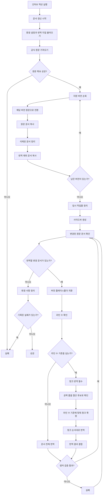

# 문서 갱신 흐름

이 워크플로우는 GitHub Actions에서만 실행되는 문서 갱신 흐름입니다. 원문 문서를 가져오고, 지원 버전별 문서를 갱신한 뒤, 변경된 문서만 번역하고 검증합니다. 모든 단계가 정상적으로 끝나면 변경 사항을 커밋할 수 있는 상태로 정리합니다.

## 단계별 책임

1. **문서 갱신 시작**: GitHub Actions에서 문서 갱신 작업을 시작합니다.
2. **원문 확보**: 공식 문서 원문을 가져옵니다.
3. **버전별 동기화**: 지원하는 각 버전의 원문 문서를 현재 저장소 구조에 맞춰 갱신합니다.
4. **삭제 문서 정리**: 원문에서 사라진 문서는 번역본까지 함께 제거합니다.
5. **번역 제외 처리**: 번역하지 않을 문서는 원문 그대로 반영합니다.
6. **사이드바 생성**: 최신 원문 목차를 기준으로 탐색 메뉴를 다시 만듭니다.
7. **변경 감지**: 새로 추가되었거나 수정된 원문 문서만 번역 대상으로 고릅니다.
8. **버전 플레이스홀더 치환**: 변경 문서의 버전 플레이스홀더를 해당 문서 버전으로 바꿉니다.
9. **라인 수 확인**: 변경 문서의 라인 수를 확인해 한 번에 번역할지, 청크로 나누어 번역할지 결정합니다.
10. **청크 번역 필수 처리**: 라인 수 기준을 넘는 문서는 반드시 청크 번역 대상으로 처리합니다.
11. **청크 경계 선정**: 공백 줄을 절단 후보로 삼되, 확정 기준은 라인 수로 둡니다. 코드 블록은 중간에 끊지 않습니다.
12. **청크 번역**: 확정된 청크를 원문 순서대로 번역합니다.
13. **번역 결과 결합**: 나뉘어 번역된 결과를 원래 문서 순서대로 합칩니다.
14. **앵커 검증**: 번역된 문서에서 내부 앵커가 유지되는지 확인합니다.
15. **변경 사항 정리**: 갱신된 문서와 탐색 구조를 커밋 가능한 상태로 정리합니다.
16. **반영**: 실패가 없고 변경 사항이 있으면 저장소에 반영합니다.

## 실패 처리

- 원문을 가져오지 못하면 즉시 실패로 종료합니다.
- 특정 버전 동기화에 실패하면 실패를 기록하고 나머지 버전을 계속 처리합니다.
- 특정 문서 번역, 청크 번역, 검증에 실패하면 해당 문서를 기록하고 나머지 문서를 계속 처리합니다.
- 변경 사항 정리 단계에서 문제가 생기면 실패로 종료합니다.

이 정책은 일부 문서만 갱신된 상태를 성공으로 오해하지 않도록 하기 위한 것입니다.
