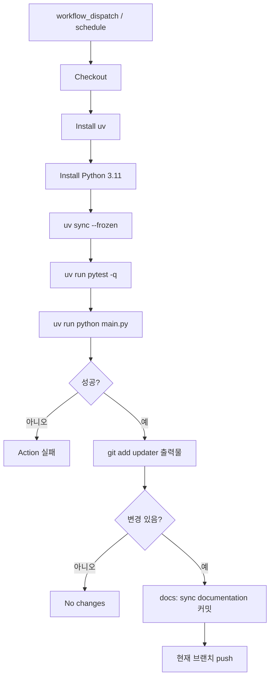

# 문서 번역 워크플로우

이 문서는 Laravel 한글 문서 사이트의 번역 파이프라인을 정의한다. upstream
문서를 가져와 한국어로 번역하고 검증한 뒤 저장소에 반영하는 흐름이다.

## 자동화 영역 (.github/docs-updater)

`.github/docs-updater` 는 GitHub Actions에서 실행되는 번역 자동화
파이프라인이다. 모든 Python 도구는 같은 디렉터리 안에 있다.

### 모듈 구성

- `main.py` : 단일 진입점. `update-docs.yml` 이 호출한다.
- `markdown_link_utils.py` : Markdown 링크 추출/정규화 유틸.
- `structure_validator.py` : 번역본/원문의 anchor·heading·내부 링크 구조 비교.
- `find_link_context.py`, `find_missing_links.py` : 디버깅 CLI.

### 입력과 출력

입력:

- upstream repository: `https://github.com/laravel/docs.git`
- 대상 브랜치: `master`, `13.x`, `12.x`, `11.x`, `10.x`, `9.x`, `8.x`
- 번역 프롬프트: `.github/docs-updater/prompt.md`
- 환경 변수: `TRANSLATION_PROVIDER`, `TRANSLATION_MODEL`, `TRANSLATION_DELAY`,
  `OPENAI_API_KEY`, `AZURE_OPENAI_API_KEY`, `AZURE_OPENAI_ENDPOINT`,
  `AZURE_OPENAI_API_VERSION`, `TRANSLATION_CLI_COMMAND`, `TRANSLATION_CLI_TIMEOUT`
  (각 변수의 기본값과 예시는 `.github/docs-updater/.env.example` 참고)

출력:

- `.github/docs-updater/source/version-{version}/*.md` (원문 캐시)
- `versioned_docs/version-{version}/*.md` (번역본)
- `versioned_sidebars/version-{version}-sidebars.json`

번역 제외 파일: `license.md`, `readme.md`, `documentation.md`.

## update-docs 워크플로우



`main.py` 단계:

1. **환경 변수 사전 검증** (`validate_environment()`). provider 종류별 필수
   환경 변수가 모두 설정됐는지 확인한다. 실패 시 즉시 종료한다.
2. `.env` / `prompt.md` 로드.
3. upstream clone.
4. 브랜치별 동기화: 원문 캐시 갱신, upstream 삭제 반영, 번역 제외 파일 렌더링.
5. 사이드바 생성: `documentation.md` 기반. master 의 API Documentation 링크는
   `latest_stable` 버전을 가리키도록 처리.
6. 변경 문서 번역: git status 변경분 + 번역본 누락분. 청크 분할, 재시도, 다른
   버전 번역 재사용 시도.
7. 번역 구조 검증: `structure_validator.validate_structure()` 호출.
   anchor-missing/extra, heading-count/level, internal-link-target,
   translation-missing 6 카테고리 검사. 실패 시 exit 1 로 이어진다.
8. `stage_outputs()` : `git add .github/docs-updater/source/`,
   `versioned_docs/`, `versioned_sidebars/`.

## 실패 처리

### 재시도 정책

예외를 3종으로 분류해 각기 다른 정책을 적용한다.

| 분류 | 예외 종류 | 처리 |
|------|-----------|------|
| Transient | `RateLimitError`, `APITimeoutError`, `APIConnectionError`, `InternalServerError`, `TimeoutError`, `TransientCliError` | 지수 백오프 재시도 |
| Validation | `AnchorValidationError`, 기타 LLM 출력 검증 실패 | 지수 백오프 재시도 (LLM stochastic 성질로 회복 가능) |
| Fatal | `AuthenticationError`, `PermissionDeniedError`, `BadRequestError`, `ValueError`, `FatalCliError` | 즉시 raise. 워크플로 중단 |

재시도는 두 레벨에서 적용한다.

- **청크 단위 재시도**: 한 청크 실패 시 그 청크만 재시도한다. 이미 번역된
  다른 청크의 결과는 보존한다. 기본 3회.
- **파일 단위 재시도**: 청크 재시도가 모두 실패한 경우 파일 전체를
  재시도한다. 기본 2회.

백오프는 5초·15초·45초로 3배수 증가한다 (`TRANSLATION_MAX_ATTEMPTS`,
`TRANSLATION_CHUNK_MAX_ATTEMPTS` 환경 변수로 조정 가능).

OpenAI SDK 자체 재시도 (`max_retries`) 는 0으로 설정해 중복 재시도를
방지한다. `TRANSLATION_REQUEST_TIMEOUT` 으로 단일 호출의 타임아웃을 별도
지정한다.

## 청크 분할

긴 문서는 LLM 입력/출력 한계 안에서 처리하기 위해 여러 청크로 나누어
번역한다. 청크 경계는 의미 단위를 보존하도록 우선순위를 따른다.

### 코드 블록 정규화

Markdown 은 코드 블록을 두 가지 문법으로 표현할 수 있다.

- **펜스 코드 블록** (`` ``` ``, `~~~`): 시작·종료 마커로 감싼다.
- **들여쓰기 코드 블록** (4칸 들여쓰기): 각 줄을 4칸 공백으로 들여쓴다.

같은 의미의 두 표기가 원문에 섞여 있으면 청크 분할의 보호 영역 판정,
LLM 의 코드 인식, byte-exact 검증의 비교 기준이 일관되지 않을 수 있다.
이를 방지하기 위해 청크 분할 이전에 모든 들여쓰기 코드 블록을 펜스 코드
블록으로 변환한다.

정규화 규칙:

- 연속된 4칸 들여쓰기 줄 묶음을 `` ``` `` 펜스로 감싼다.
- 펜스의 시작/종료 마커는 `` ``` `` 로 통일하며, 언어 힌트는 추론하지
  않고 비워둔다.
- 원본에 이미 펜스 코드 블록인 경우는 변경하지 않는다.
- 코드 블록 내부의 추가 들여쓰기는 그대로 보존한다 (마커 역할의 4칸만
  제거).

이 정규화는 원문 캐시 동기화 직후, 청크 분할 이전에 수행한다. 원문
캐시는 upstream 형태를 그대로 유지하고, 정규화 결과는 번역 파이프라인
입력에만 적용한다. 따라서 LLM 에 전달되는 청크와 `versioned_docs/` 에
저장되는 번역본은 모두 펜스 코드 블록 형태로 일관된다.

### 분할 우선순위

`split_markdown_chunks` 는 라인 수가 임계값에 도달했을 때 다음 순서로
경계 후보를 선택한다.

1. **Heading 직전** — `#`, `##`, ... 헤딩 시작 직전. 의미 단위 보존.
2. **Anchor+heading 쌍 보호** — `<a name="..."></a>` 와 직후 heading 은
   분리하지 않는다. 쌍으로 다음 청크에 함께 들어간다.
3. **빈 줄** — 위 두 후보가 없을 때 빈 줄에서 분할.
4. **일반 텍스트 강제 분할** — 위 후보가 청크 종료 한계까지 나타나지 않고
   현재 위치가 보호 영역 밖이면 임의 위치에서 분할한다. 보호 영역
   안에서는 강제 분할하지 않는다.

### 청크 크기 기준

| 항목 | 값 | 환경 변수 |
|------|------|-----------|
| 기본 청크 크기 | 400 줄 | `MAX_CHUNK_LINES` |
| Heading 경계 soft min | 300 줄 (75%) | — |
| 일반 텍스트 강제 분할 한계 | 480 줄 | — |

`일반 텍스트 강제 분할 한계` 는 보호 영역 밖에서만 적용된다. 보호 영역
안에서는 청크가 이 한계를 초과해도 강제 분할하지 않는다.

라인 수만으로는 토큰 수를 정확히 반영하지 못한다. 매우 긴 코드 블록이나
한 줄짜리 긴 문장이 들어간 청크는 토큰 한계를 초과할 수 있어, 동적
재분할이 이를 보완한다 (아래 "동적 재분할" 참고).

### 보호 영역

청크 경계는 다음 영역의 중간을 **절대** 끊지 않는다. 이 규칙은 청크 크기
임계값보다 우선한다.

- **펜스 코드 블록** (`` ``` ``, `~~~`): 시작부터 종료까지 한 청크에 유지.
- **마크다운 표** (`| ... |`): 헤더 행부터 표 끝까지 한 청크에 유지.
- **Anchor + heading 쌍**: `<a name="..."></a>` 다음 줄의 heading 과
  떨어뜨리지 않는다.

보호 영역이 길어 청크가 `MAX_CHUNK_LINES` 또는 강제 분할 한계를 초과해도
강제 분할하지 않는다. 결과적으로 청크가 토큰 한계를 초과해 LLM 호출이
실패할 수 있는데, 이 경우 아래 "동적 재분할" 메커니즘이 회복을 담당한다.

### 청크 경계 후처리

보호 영역의 `Anchor + heading 쌍` 규칙은 anchor 와 heading 이 직접
인접한 경우만 보호한다. 그러나 실제 문서에서는 `<a name="...">` 와
heading 사이에 빈 줄이 한 줄 이상 들어가는 패턴이 일반적이며, 이 빈 줄이
빈 줄 분할 후보 (우선순위 3번) 에 걸려 anchor 와 heading 이 서로 다른
청크로 분리될 수 있다.

문제 패턴:

    <a name="introduction"></a>
                                          ← 이 빈 줄에서 분할될 수 있음
    ## Introduction

빈 줄이 두 줄 이상이면 각 빈 줄마다 분할 후보가 되므로 anchor 가 청크 N
끝, heading 이 청크 N+1 시작으로 갈라지는 모든 변형을 같은 규칙으로
다룬다.

후처리 규칙:

청크 분할이 끝난 뒤 인접한 청크 경계를 검사한다.

- 청크 N 의 마지막 비공백 줄이 `<a name="...">` 이고
- 청크 N+1 의 첫 비공백 줄이 heading (`#`, `##`, `###`, ...) 인 경우

이때 청크 N 의 anchor 와 anchor 이후로 청크 N 끝까지 이어지는 모든 빈
줄을 통째로 떼어내 청크 N+1 의 시작으로 옮긴다 (옮길 빈 줄이 없는 경우
anchor 만 옮긴다). 청크 N+1 시작에 빈 줄이 있다면 그대로 두며, 결과적
으로 원문의 anchor ↔ heading 사이 빈 줄 개수가 그대로 보존된다.

이 후처리는 LLM 호출과 청크 단위 검증 이전에 수행한다.

### 청크 단위 검증

각 청크 LLM 번역 직후 다음을 검증한다. 실패는 Validation 분류로 분류돼
지수 백오프 재시도된다.

- **Anchor 보존**: 원문 청크의 `<a name="..."></a>` 가 번역본에 동일하게
  존재한다. 누락·추가·이동 모두 실패.
- **코드 블록 보존**: 펜스 코드 블록의 내용이 byte-exact 로 동일.
- **인라인 코드 보존**: `` `code` `` 안 내용이 byte-exact 로 동일.
- **URL 보존**: 마크다운 링크의 URL, autolink, reference link 정의의 URL
  이 동일.

파일 단위 합본 시점에 한 번 더 종합 검증을 수행한다 (anchor 참조 해소,
heading 개수·레벨, 내부 링크 대상 등).

## 로컬 검증 명령

```bash
cd .github/docs-updater
uv run pytest -q
uv run python main.py                         # 번역 파이프라인 실행
uv run python structure_validator.py          # 번역 구조 검증 (단독 실행)
```

로컬 실행 시 `TRANSLATION_PROVIDER=cli` 와 `TRANSLATION_CLI_COMMAND` 를
사용하면 API 키 없이 로컬 CLI 로 번역 동작을 점검할 수 있다.

## 변경 범위 원칙

- 번역 관련 변경은 `.github/docs-updater` 와
  `.github/workflows/update-docs.yml` 에 한정한다.
- 원격 push 는 `update-docs.yml` 의 자동 commit 외에는 사용자가 명시적으로
  요청한 경우에만 수행한다.
