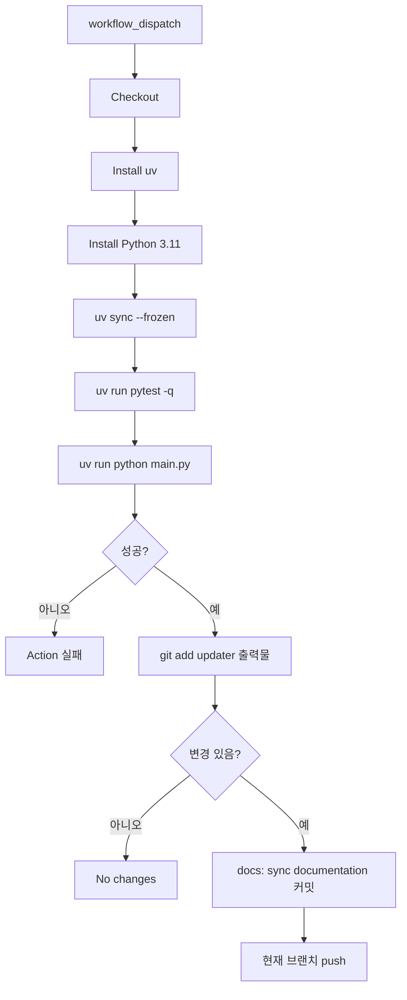
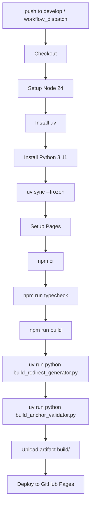

# 문서 갱신 워크플로우

이 문서는 Laravel 한글 문서 사이트의 자동화 흐름을 정의한다. 두 책임 영역이
명확히 분리되어 있으며, 두 영역은 서로의 도구를 호출하지 않는다.

## 책임 분리 (가장 중요)

| 영역 | 위치 | 언어 | 호출자 | 책임 |
|------|------|------|--------|------|
| **사이트** (Docusaurus) | repo root, `src/`, `static/`, `docusaurus.config.ts`, `e2e/`, `package.json` | Node | npm scripts, Playwright | 메인페이지(홈)와 번역된 docs를 정적 사이트로 빌드. 로컬 개발은 `npm run start` (dev 서버), 운영 호스팅은 GitHub Pages 가 책임. |
| **자동화** (GitHub Actions) | `.github/docs-updater/`, `.github/workflows/` | Python (uv) | `update-docs.yml`, `deploy.yml` | upstream 문서 동기화, 한국어 번역, 사이드바 생성, 번역 구조 검증, 빌드 산출물 anchor 검증, 미버전 경로 redirect HTML 생성. |

원칙:

- **사이트 → 자동화 호출 금지.** `package.json` 의 어떤 npm script 도 Python을
  실행하지 않는다. `playwright.config.ts` 의 `webServer` 도 Python을 호출하지
  않는다. Docusaurus 가 자동화 산출물(versioned_docs, versioned_sidebars)을
  입력으로 읽기만 한다.
- **자동화 → 사이트 호출 금지.** Python 도구는 `npm` 이나 `tsc` 를 직접
  실행하지 않는다. Node 빌드는 `deploy.yml` 의 별도 단계에서만 실행된다.
- **워크플로우만 두 영역을 합친다.** `deploy.yml` 이 Node 빌드와 Python
  검증/redirect 생성을 한 job 안에서 순서대로 실행한다.
- **로컬 검증도 같은 분리를 따른다.** `npm run build`, `npm run serve`,
  `npx playwright test` 는 사이트 영역만 다룬다. 번역/구조 검증/anchor
  검증은 `.github/docs-updater` 안에서 `uv run` 으로 실행한다.

테스트로 강제: `tests/test_project_boundaries.py` 가 `package.json` script 안에
`.github/` 또는 `python` 호출이 없는지 검사한다.

## 사이트 영역

목표: 이미 만들어진 `versioned_docs/`와 `versioned_sidebars/`를 입력으로 받아
정적 사이트를 빌드해 GitHub Pages 로 호스팅한다. 메인페이지(홈)와 컴포넌트만
사이트 코드의 책임이다.

구성:

- `docusaurus.config.ts` : Docusaurus 설정. `headTags` inline script 가
  `/docs/<unversioned>` 를 latest stable 로 client-side redirect 한다.
- `src/` : 홈 컴포넌트, 테마 swizzle, remark 플러그인 (anchor-mapping 포함).
- `static/` : 정적 자산.
- `e2e/` : Playwright e2e. Docusaurus 개발 서버(`npm run start`) 위에서 동작한다. 정적 빌드 산출물 검증이 필요한 경우는 사이트 e2e 가 아니라 `deploy.yml` 의 Python 단계에서 처리한다.
- `package.json` :
  - `docusaurus` : Docusaurus CLI passthrough
  - `start` : `docusaurus start` (로컬 개발 + e2e webServer)
  - `build` : `docusaurus build` (배포 단계에서 호출)
  - `serve` : `node scripts/serve-build.mjs` (빌드 산출물 로컬 확인.
    `13.x` 처럼 점이 포함된 버전 디렉터리도 HTTP 200으로 확인하기 위한
    사이트 전용 정적 서버)
  - `serve:docusaurus` : `docusaurus serve` (Docusaurus 기본 serve 확인)
  - `clear`, `swizzle`, `write-translations`, `write-heading-ids` : Docusaurus
    공식 CLI 보조 명령
  - `typecheck` : `tsc` (배포 단계에서 호출)
  - `test:e2e`, `test:e2e:ui`, `prepare`
  - prestart/prebuild/postbuild, validate-anchors, sync-versions
    등 빌드 가공·검증 script 는 두지 않는다. 모두 자동화 영역의 책임이다.

사이트 도구 안에 두지 않는 것:

- 빌드 산출물 anchor 검증.
- 번역 구조 검증.
- 미버전 경로 redirect HTML 생성.
- 사이드바 sync (사이드바는 자동화가 만들어 둔다).

## 자동화 영역 (.github/docs-updater)

`.github/docs-updater` 는 사이트 런타임 코드가 아니라 GitHub Actions에서
실행되는 자동화 파이프라인이다. 모든 Python 도구는 같은 디렉터리 안에 있다.

### 모듈 구성

번역 파이프라인:

- `main.py` : 단일 진입점. `update-docs.yml` 이 호출한다.
- `markdown_link_utils.py` : Markdown 링크 추출/정규화 유틸.
- `structure_validator.py` : 번역본/원문의 anchor·heading·내부 링크 구조 비교.
- `find_link_context.py`, `find_missing_links.py` : 디버깅 CLI.

빌드 산출물 처리 (deploy 단계에서만 호출):

- `build_redirect_generator.py` : `build/docs/<slug>/index.html` 에 latest
  stable 로 보내는 redirect HTML을 생성. GitHub Pages가 정적 파일만 응답하므로
  `/docs/<slug>` 직접 접근에도 즉시 redirect 가 동작하도록 한다.
- `build_anchor_validator.py` : `versioned_docs/` 의 markdown anchor 가
  `build/` HTML 의 id 와 매칭되는지 검사.

### 입력과 출력

입력:

- upstream repository: `https://github.com/laravel/docs.git`
- 대상 브랜치: `master`, `13.x`, `12.x`, `11.x`, `10.x`, `9.x`, `8.x`
- 번역 프롬프트: `.github/docs-updater/prompt.md`
- 환경 변수: `TRANSLATION_PROVIDER`, `TRANSLATION_MODEL`, `TRANSLATION_DELAY`,
  `OPENAI_API_KEY`, `AZURE_OPENAI_API_KEY`, `AZURE_OPENAI_ENDPOINT`,
  `AZURE_OPENAI_API_VERSION`, `TRANSLATION_CLI_COMMAND`, `TRANSLATION_CLI_TIMEOUT`

출력:

- `.github/docs-updater/source/version-{version}/*.md` (원문 캐시)
- `versioned_docs/version-{version}/*.md` (번역본)
- `versioned_sidebars/version-{version}-sidebars.json`

번역 제외 파일: `license.md`, `readme.md`, `documentation.md`.

## update-docs 워크플로우



`main.py` 단계:

1. `.env` / `prompt.md` 로드.
2. upstream clone.
3. 브랜치별 동기화: 원문 캐시 갱신, upstream 삭제 반영, 번역 제외 파일 렌더링.
4. 사이드바 생성: `documentation.md` 기반. master 의 API Documentation 링크는
   `latest_stable` 버전을 가리키도록 처리.
5. 변경 문서 번역: git status 변경분 + 번역본 누락분. 청크 분할, RateLimit
   재시도, 다른 버전 번역 재사용 시도.
6. 번역 구조 검증: `structure_validator.validate_structure()` 호출.
   anchor-missing/extra, heading-count/level, internal-link-target,
   translation-missing 6 카테고리 검사. 실패 시 exit 1 로 이어진다.
7. `stage_outputs()` : `git add .github/docs-updater/source/`,
   `versioned_docs/`, `versioned_sidebars/`.

워크플로우 자체에서는 Node 단계가 없다. 빌드/타입검사/anchor 검증은 deploy 가
담당한다.

## deploy 워크플로우



원칙:

- Node 단계는 typecheck 와 build 만 본다.
- Python 단계는 build 산출물에 redirect HTML 을 추가하고 anchor 매칭을
  검증한다.
- 어느 단계든 실패하면 deploy 자체가 멈춘다.

## 로컬 검증 명령

사이트 영역:

```bash
npm run start       # 로컬 개발 + e2e webServer
npm run typecheck
npm run build       # 배포 단계용 정적 빌드 (로컬에서는 거의 호출하지 않는다)
npx playwright test
```

자동화 영역:

```bash
cd .github/docs-updater
uv run pytest -q
uv run python structure_validator.py        # 번역 구조 검증 (단독 실행)
uv run python build_redirect_generator.py   # build/ 에 redirect HTML 생성
uv run python build_anchor_validator.py     # build/ 산출물 anchor 검증
```

자동화 도구를 로컬에서 돌릴 때는 사이트가 먼저 빌드되어 있어야 한다 (`npm run
build`). 자동화는 사이트 도구를 호출하지 않으므로 두 명령을 사용자가 순서대로
실행한다.

## 실패 정책

즉시 실패 (이후 단계 실행 안 함):

- upstream clone 실패
- 환경 변수 누락으로 번역 provider 생성 불가
- CLI provider 명령이 없거나 실패함

기록 후 계속 처리, 마지막에 exit 1:

- 특정 버전 checkout/동기화 실패
- 특정 문서 번역 실패
- 특정 문서 anchor 검증 실패
- RateLimit 재시도 실패
- 사이드바 생성 실패
- 산출물 staging 실패
- 번역 구조 검증 실패

## 변경 범위 원칙

- 자동화 변경은 `.github/docs-updater` 와 `.github/workflows/update-docs.yml`,
  `.github/workflows/deploy.yml` 의 Python 스텝에 한정한다.
- 사이트 변경은 repo root 와 `src/`, `static/`, `e2e/`,
  `docusaurus.config.ts`, `package.json`, `playwright.config.ts` 에 한정한다.
- 두 영역의 경계가 흐려지면 `tests/test_project_boundaries.py` 가 실패한다.
  실패가 보이면 책임 영역을 다시 검토한다.
- 원격 push 는 `update-docs.yml` 의 자동 commit 외에는 사용자가 명시적으로
  요청한 경우에만 수행한다.
