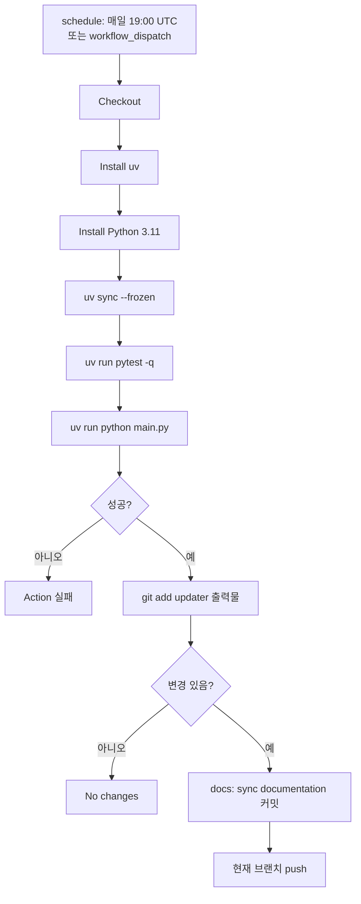
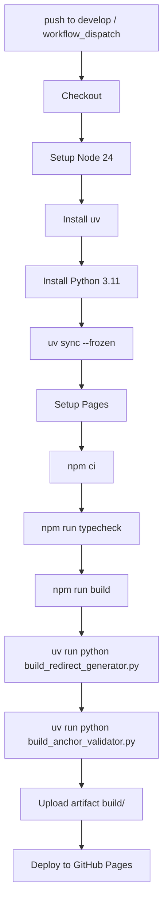

# 문서 갱신 워크플로우

이 문서는 Laravel 한글 문서 사이트의 자동화 흐름을 정의한다. 두 책임 영역이
명확히 분리되어 있으며, 두 영역은 서로의 도구를 호출하지 않는다.

> **문서 상태**: 이 문서는 자동화 워크플로우의 *목표(To-Be) 정책*을 정의한다.
> 책임 분리·사이트 영역·deploy 워크플로우는 현행과 일치하지만, **번역
> 파이프라인의 청킹·검증·재시도 정책과 일부 환경 변수는 후속 PR 로 구현
> 예정**이다. 현재 코드/CI 와 다른 항목:
>
> - 자동 실행 스케줄: 현재 `update-docs.yml` 에서 `schedule` 주석 처리됨
> - `TRANSLATION_DELAY` 기본값: 현재 코드 `10`, 문서 `0`
> - 청크 분할 알고리즘: 현재 빈 줄/overflow 기반, 문서는 heading 직전 우선 +
>   anchor+heading 쌍 보호
> - `prompt2.md`: 현재 디렉터리에 잔존, 문서는 단일 운영(`prompt.md`만)
> - 신설 환경 변수 `TRANSLATION_REQUEST_TIMEOUT`, `TRANSLATION_SDK_RETRIES`,
>   `TRANSLATION_MAX_ATTEMPTS`, `TRANSLATION_CHUNK_MAX_ATTEMPTS`: 코드 미반영
> - 자동 검증 (코드 블록/URL 변형 감지), 청크 단위 진단 로그: 코드 미반영
> - 예외 클래스 `CodeBlockValidationError`, `LinkValidationError`: 코드 미반영

## 책임 분리 (가장 중요)

| 영역 | 위치 | 언어 | 호출자 | 책임 |
|------|------|------|--------|------|
| **사이트** (Docusaurus) | repo root, `src/`, `static/`, `docusaurus.config.ts`, `e2e/`, `package.json` | Node | npm scripts, Playwright | 메인페이지(홈)와 번역된 docs를 정적 사이트로 빌드. 로컬 개발은 `npm run start` (dev 서버), 운영 호스팅은 GitHub Pages 가 책임. |
| **자동화** (GitHub Actions) | `.github/docs-updater/`, `.github/workflows/` | Python (uv) | `update-docs.yml`, `deploy.yml` | upstream 문서 동기화, 한국어 번역, 사이드바 생성, 번역 구조 검증, 빌드 산출물 anchor 검증, 미버전 경로 redirect HTML 생성. |

원칙:

- **사이트 → 자동화 호출 금지.** `package.json` 의 어떤 npm script 도 Python을
  실행하지 않는다. `playwright.config.ts` 의 `webServer` 도 Python을 호출하지
  않는다. Docusaurus 가 자동화 산출물(versioned_docs, versioned_sidebars)을
  입력으로 읽기만 한다.
- **자동화 → 사이트 호출 금지.** Python 도구는 `npm` 이나 `tsc` 를 직접
  실행하지 않는다. Node 빌드는 `deploy.yml` 의 별도 단계에서만 실행된다.
- **워크플로우만 두 영역을 합친다.** `deploy.yml` 이 Node 빌드와 Python
  검증/redirect 생성을 한 job 안에서 순서대로 실행한다.
- **로컬 검증도 같은 분리를 따른다.** `npm run build`, `npm run serve`,
  `npx playwright test` 는 사이트 영역만 다룬다. 번역/구조 검증/anchor
  검증은 `.github/docs-updater` 안에서 `uv run` 으로 실행한다.

테스트로 강제: `tests/test_project_boundaries.py` 가 `package.json` script 안에
`.github/` 또는 `python` 호출이 없는지 검사한다.

## 사이트 영역

목표: 이미 만들어진 `versioned_docs/`와 `versioned_sidebars/`를 입력으로 받아
정적 사이트를 빌드해 GitHub Pages 로 호스팅한다. 메인페이지(홈)와 컴포넌트만
사이트 코드의 책임이다.

구성:

- `docusaurus.config.ts` : Docusaurus 설정. `headTags` inline script 가
  `/docs/<unversioned>` 를 latest stable 로 client-side redirect 한다.
- `src/` : 홈 컴포넌트, 테마 swizzle, remark 플러그인 (anchor-mapping 포함).
- `static/` : 정적 자산.
- `e2e/` : Playwright e2e. Docusaurus 개발 서버(`npm run start`) 위에서 동작한다. 정적 빌드 산출물 검증이 필요한 경우는 사이트 e2e 가 아니라 `deploy.yml` 의 Python 단계에서 처리한다.
- `package.json` :
  - `docusaurus` : Docusaurus CLI passthrough
  - `start` : `docusaurus start` (로컬 개발 + e2e webServer)
  - `build` : `docusaurus build` (배포 단계에서 호출)
  - `serve` : `node scripts/serve-build.mjs` (빌드 산출물 로컬 확인.
    `13.x` 처럼 점이 포함된 버전 디렉터리도 HTTP 200으로 확인하기 위한
    사이트 전용 정적 서버)
  - `serve:docusaurus` : `docusaurus serve` (Docusaurus 기본 serve 확인)
  - `clear`, `swizzle`, `write-translations`, `write-heading-ids` : Docusaurus
    공식 CLI 보조 명령
  - `typecheck` : `tsc` (배포 단계에서 호출)
  - `test:e2e`, `test:e2e:ui`, `prepare`
  - prestart/prebuild/postbuild, validate-anchors, sync-versions
    등 빌드 가공·검증 script 는 두지 않는다. 모두 자동화 영역의 책임이다.

사이트 도구 안에 두지 않는 것:

- 빌드 산출물 anchor 검증.
- 번역 구조 검증.
- 미버전 경로 redirect HTML 생성.
- 사이드바 sync (사이드바는 자동화가 만들어 둔다).

## 자동화 영역 (.github/docs-updater)

`.github/docs-updater` 는 사이트 런타임 코드가 아니라 GitHub Actions에서
실행되는 자동화 파이프라인이다. 모든 Python 도구는 같은 디렉터리 안에 있다.

### 모듈 구성

번역 파이프라인:

- `main.py` : 단일 진입점. `update-docs.yml` 이 호출한다.
- `prompt.md` : 시스템 프롬프트. 모든 청크 호출에 적용된다. 자세한 규칙은
  "번역 검증 → 시스템 프롬프트" 참고. 별도 변형(예: `prompt2.md`)을 같은
  디렉터리에 두지 않는다.
- `markdown_link_utils.py` : Markdown 링크 추출/정규화 유틸.
- `structure_validator.py` : 번역본/원문의 anchor·heading·내부 링크 구조 비교.
- `find_link_context.py`, `find_missing_links.py` : 디버깅 CLI.

빌드 산출물 처리 (deploy 단계에서만 호출):

- `build_redirect_generator.py` : `build/docs/<slug>/index.html` 에 latest
  stable 로 보내는 redirect HTML을 생성. GitHub Pages가 정적 파일만 응답하므로
  `/docs/<slug>` 직접 접근에도 즉시 redirect 가 동작하도록 한다.
- `build_anchor_validator.py` : `versioned_docs/` 의 markdown anchor 가
  `build/` HTML 의 id 와 매칭되는지 검사.

### 입력과 출력

입력:

- upstream repository: `https://github.com/laravel/docs.git`
- 대상 브랜치: `master`, `13.x`, `12.x`, `11.x`, `10.x`, `9.x`, `8.x`
- 번역 프롬프트: `.github/docs-updater/prompt.md`
- 환경 변수 (아래 표)

출력:

- `.github/docs-updater/source/version-{version}/*.md` (원문 캐시)
- `versioned_docs/version-{version}/*.md` (번역본)
- `versioned_sidebars/version-{version}-sidebars.json`

번역 제외 파일: `license.md`, `readme.md`, `documentation.md`.

### 환경 변수

| 변수 | 의미 | 기본값 |
|---|---|---|
| `TRANSLATION_PROVIDER` | `openai` / `azure` / `cli` | `openai` |
| `TRANSLATION_MODEL` | 번역 모델 | `gpt-5` |
| `OPENAI_API_KEY` | OpenAI 키 (provider=openai 일 때 필수) | — |
| `AZURE_OPENAI_API_KEY` | Azure OpenAI 키 (provider=azure 일 때 필수) | — |
| `AZURE_OPENAI_ENDPOINT` | Azure 엔드포인트 (provider=azure) | — |
| `AZURE_OPENAI_API_VERSION` | Azure API 버전 | `2025-05-01-preview` |
| `TRANSLATION_CLI_COMMAND` | CLI provider 실행 명령 (provider=cli) | — |
| `TRANSLATION_CLI_TIMEOUT` | CLI 한 호출 timeout (초) | `1800` |
| `TRANSLATION_REQUEST_TIMEOUT` | OpenAI 요청 timeout (초) | `120` |
| `TRANSLATION_SDK_RETRIES` | OpenAI SDK 내장 재시도 | `0` |
| `TRANSLATION_MAX_ATTEMPTS` | 파일 단위 재시도 횟수 | `3` |
| `TRANSLATION_CHUNK_MAX_ATTEMPTS` | 청크 단위 재시도 횟수 | `2` |
| `TRANSLATION_DELAY` | 파일 사이 sleep (초) | `0` |

## update-docs 워크플로우

트리거: 매일 19:00 UTC (한국 04:00) 자동 실행 + 수동 (`workflow_dispatch`).
자동 실행은 `update-docs.yml` 의 `schedule.cron: '0 19 * * *'` 으로 활성화한다.
자동 실행이 비활성화된 동안에는 upstream 변경이 사이트에 반영되지 않으므로,
스케줄을 끄고 운영하지 않는다.



`main.py` 단계:

1. `.env` / `prompt.md` 로드.
2. upstream clone.
3. 브랜치별 동기화: 원문 캐시 갱신, upstream 삭제 반영, 번역 제외 파일 렌더링.
4. 사이드바 생성: `documentation.md` 기반. master 의 API Documentation 링크는
   `latest_stable` 버전을 가리키도록 처리.
5. 변경 문서 번역: git status 변경분 + 번역본 누락분. 청크 분할 (아래
   "청킹 정책" 참고), 청크별 LLM 호출, 청크별 자동 검증 (아래 "번역 검증" 참고),
   재시도 정책 적용 (아래 "실패 정책 → 재시도 정책" 참고), 다른 버전 번역
   재사용 시도.
6. 번역 구조 검증: `structure_validator.validate_structure()` 호출.
   anchor-missing/extra, heading-count/level, internal-link-target,
   translation-missing 6 카테고리 검사. 실패 시 exit 1 로 이어진다.
7. `stage_outputs()` : `git add .github/docs-updater/source/`,
   `versioned_docs/`, `versioned_sidebars/`.

워크플로우 자체에서는 Node 단계가 없다. 빌드/타입검사/anchor 검증은 deploy 가
담당한다.

## 청킹 정책

긴 문서는 한 번에 LLM 에 보내기 어렵다 (토큰 한도, 출력 절단, 품질 저하).
번역 단계는 본문을 여러 청크로 나누어 차례로 호출하고 결과를 이어 붙인다.

### 청크 크기

- `MAX_CHUNK_LINES = 400` 줄을 기본 목표로 한다.
- overflow 한도: 480줄 (`max_lines + max(10, max_lines // 5)`). 어떤 경계도
  찾지 못해 480줄을 초과하면 강제로 자른다.

### 경계 우선순위

문서를 줄 단위로 순회하며, 다음 조건 중 가장 먼저 충족되는 지점에서 자른다.

1. **heading 직전** — 다음 줄이 ATX heading (`^#{1,6} `) 이고 현재 청크가
   `soft_min` (= `MAX_CHUNK_LINES * 3 / 4` = 300줄) 이상이면 헤딩 직전을 경계로.
   섹션 시작이 다음 청크의 첫 줄이 되도록 한다.
2. **anchor + heading 쌍 보호** — 빈 줄 경계 후보가 나와도, 그 다음 비빈 줄이
   `<a name="...">` 정의이고 그 뒤에 heading 이 따라오면 자르지 않는다.
   라라벨 docs 의 표준 패턴 `<a name>` + `## Heading` 은 항상 같은 청크에 둔다.
3. **빈 줄** — 현재 청크가 400줄 이상이고 빈 줄을 만나면 자른다.
4. **overflow** — 480줄 초과 시 강제로 자른다.

코드 펜스 (```` ``` ````, `~~~`) 안에서는 어떤 경계도 적용하지 않는다.

### 오버랩

**미도입**. 각 청크는 독립적이며, 청크 사이에 중복 텍스트가 없다.

근거: 경계 우선순위가 의미 단위 (heading/anchor) 를 보존하면 LLM 은 청크의
시작과 끝을 자연스럽게 인식한다. 오버랩은 토큰 비용을 7~10% 증가시키는 반면,
의미 단위 보존이 잘 동작하면 ROI 가 낮다.

번역 검증의 청크 단위 진단 로그(아래)에서 anchor·heading·코드·URL 손실이 여전히
빈번하게 잡히면 재검토한다.

## 번역 검증

번역 품질을 보장하기 위해 두 단계의 안전망을 둔다. (1) **시스템 프롬프트** 가
번역 시점에 LLM 의 변형을 막고, (2) **자동 검증** 이 사후에 변형을 잡아낸다.
LLM 은 확률적이라 프롬프트만으로는 변형을 100% 막지 못하므로 자동 검증이 필수다.

### 시스템 프롬프트 (`prompt.md`)

`.github/docs-updater/prompt.md` 가 시스템 프롬프트로 모든 청크에 적용된다.

핵심 규칙:

- 코드 블록·인라인 코드의 모든 문자(주석, 식별자, 문자열 리터럴)를 그대로 보존
- 마크다운 링크의 URL `(URL)` 부분 전체를 원문 그대로 — 슬러그·anchor·쿼리 포함
- `<a name="..."></a>` 태그를 정확히 동일한 위치에 보존. 추가·삭제·이동·이름 변경 금지
- HTML/JSX 태그명·속성 키는 보존. 사용자에게 노출되는 속성값 (`alt`, `title`,
  `placeholder`, `aria-label`, `aria-description`) 만 번역
- admonition 마커 (`> [!NOTE]`, `> [!WARNING]` 등) 와 템플릿 placeholder
  (`{{version}}`) 보존
- 어투: '~합니다' 체로 일관되게
- H1·H2 는 `한국어 (영문 원제)` 형식으로 영문 병기, H3 이하는 한국어만
- 한국 라라벨 커뮤니티 관용 표기를 우선하되, Laravel 코어/공식 패키지·런타임·
  데이터베이스·서드파티 서비스·약어는 영문 그대로

상세 규칙·용어집은 `prompt.md` 본문 참고.

### 자동 검증 항목

| 검증 | 대상 | 시점 | 분류 |
|---|---|---|---|
| anchor 정의 일치 | `<a name="...">` 태그 | 청크 단위 | 번역 검증 실패 (재시도 대상) |
| anchor 참조 일치 | `[text](#anchor)` | 청크 단위 | 번역 검증 실패 |
| 코드 블록 보존 | ```` ``` ```` / `~~~` 펜스 개수와 내용 | 청크 단위 | 번역 검증 실패 |
| 인라인 코드 보존 | `` `code` `` 토큰 개수와 내용 | 청크 단위 | 번역 검증 실패 |
| URL 보존 | 마크다운 링크의 URL 부분 | 청크 단위 | 번역 검증 실패 |
| heading 개수·레벨 | `^#{1,6}` | 파일·전역 | warn (`structure_validator`) |
| 내부 링크 타깃 카운트 | `/docs/...`, `#fragment` | 파일·전역 | warn |

청크 단위 검증이 1차 안전망, 파일·전역 검증 (`structure_validator`) 이 2차.

### 청크 단위 진단 로그

청크별 검증을 수행한 뒤, 손실이 발생한 청크에 대해서만 진단 로그를 출력한다.

- `[경고] 청크 N anchor 누락: [...]`
- `[경고] 청크 N anchor 추가: [...]`
- `[경고] 청크 N heading 수 불일치: in=X out=Y`
- `[경고] 청크 N 코드 블록 변형: in=X out=Y`
- `[경고] 청크 N URL 변형: [...]`

이 로그는 어느 청크가 재시도까지 갔는지, 결국 어느 청크에서 무엇이 깨졌는지
추적하는 단서다. "실패 정책 → 청크 단위 회복" 과 함께 동작한다.

### 검증 실패 시 동작

- **청크 단위 검증 실패**: 그 청크의 번역 결과를 폐기하고 청크 단위 재시도
  (`TRANSLATION_CHUNK_MAX_ATTEMPTS` 회). LLM 의 stochastic 성질로 재시도가
  통과할 수 있다. 모두 실패하면 파일 단위 재시도가 한 번 더 잡고, 그래도
  실패하면 `failed_files` 에 기록 후 다음 파일.
- **파일·전역 warn**: 워크플로우 자체는 진행하되 `structure_validator` 가
  보고서로 남기고 마지막에 `exit 1`. 운영자가 보고서를 보고 후속 조치.

### 시스템 프롬프트 변경 정책

`prompt.md` 변경은 모든 번역에 영향을 준다. 변경 시 다음 절차를 따른다.

1. 표본 문서 (예: `cache.md`, `eloquent.md`, `releases.md`) 를 codex CLI provider 로
   dry-run
2. 결과를 직전 버전과 비교. anchor·코드·링크 변형이 늘지 않았는지, 어투·용어가
   기준대로인지 확인
3. 표본이 통과한 후에만 워크플로우에 적용

## 실패 정책

### 예외 분류

번역 호출에서 발생하는 예외를 세 종류로 분류한다.

**일시적 오류 (transient)** — 자동 재시도 대상 (네트워크·서비스 오류)

- `openai.RateLimitError` (429)
- `openai.APITimeoutError`
- `openai.APIConnectionError`
- `openai.InternalServerError` (5xx)
- `socket.timeout`, `TimeoutError`
- CLI provider 의 transient stderr 패턴 (`rate limit`, `timeout`,
  `502`/`503`/`504`, `connection`)

**번역 검증 실패** — 자동 재시도 대상 (LLM 출력의 변형 감지)

- `AnchorValidationError` (anchor 정의·참조 불일치)
- `CodeBlockValidationError` (코드 블록·인라인 코드 변형)
- `LinkValidationError` (URL 변형)
- 같은 입력에도 LLM 출력이 달라질 수 있어 청크 단위 재시도로 회복 가능

**영속적 오류 (fatal)** — 재시도 무의미. 즉시 raise

- `openai.AuthenticationError`
- `openai.PermissionDeniedError`
- `openai.BadRequestError`
- `ValueError` (필수 환경변수 누락 등)
- CLI provider 의 알 수 없는 stderr

### 재시도 정책

- **파일 단위**: `TRANSLATION_MAX_ATTEMPTS` 회 (기본 `3`). 지수 백오프 5초 → 15초.
- **청크 단위**: `TRANSLATION_CHUNK_MAX_ATTEMPTS` 회 (기본 `2`). 백오프 5초.
- **OpenAI SDK 자체 재시도** (`TRANSLATION_SDK_RETRIES`) 는 기본 `0` 으로
  비활성화. 우리 재시도 로직과 중복되어 호출이 폭증하지 않게.
- 청크 단위 재시도가 1차 안전망, 파일 단위 재시도가 2차. 영속적 오류면 모든
  재시도를 건너뛰고 즉시 종료한다.

### 청크 단위 회복

긴 문서는 N개 청크로 나누어 LLM 에 호출한다. 한 청크 실패가 그 파일의 앞 청크
LLM 호출 결과를 폐기하지 않도록, **실패 청크만 재시도**한다. 모든 재시도 후에도
실패하면 그 파일을 `failed_files` 에 기록하고 다음 파일로 넘어간다.

### 즉시 실패 (이후 단계 실행 안 함)

- upstream clone 실패
- 영속적 오류로 분류된 예외가 raise 됨 (예: 인증 실패, 환경 변수 누락,
  CLI provider 명령 미설정)

### 기록 후 계속 처리, 마지막에 exit 1

- 특정 버전 checkout/동기화 실패
- 특정 문서 번역이 모든 재시도 후에도 실패 (transient 또는 검증 실패)
- 사이드바 생성 실패
- 산출물 staging 실패
- 번역 구조 검증 실패 (`structure_validator`)

## deploy 워크플로우



원칙:

- Node 단계는 typecheck 와 build 만 본다.
- Python 단계는 build 산출물에 redirect HTML 을 추가하고 anchor 매칭을
  검증한다.
- 어느 단계든 실패하면 deploy 자체가 멈춘다.

## 로컬 검증 명령

사이트 영역:

```bash
npm run start       # 로컬 개발 + e2e webServer
npm run typecheck
npm run build       # 배포 단계용 정적 빌드 (로컬에서는 거의 호출하지 않는다)
npx playwright test
```

자동화 영역:

```bash
cd .github/docs-updater
uv run pytest -q
uv run python structure_validator.py        # 번역 구조 검증 (단독 실행)
uv run python build_redirect_generator.py   # build/ 에 redirect HTML 생성
uv run python build_anchor_validator.py     # build/ 산출물 anchor 검증
```

자동화 도구를 로컬에서 돌릴 때는 사이트가 먼저 빌드되어 있어야 한다 (`npm run
build`). 자동화는 사이트 도구를 호출하지 않으므로 두 명령을 사용자가 순서대로
실행한다.

## 변경 범위 원칙

- 자동화 변경은 `.github/docs-updater` 와 `.github/workflows/update-docs.yml`,
  `.github/workflows/deploy.yml` 의 Python 스텝에 한정한다.
- 사이트 변경은 repo root 와 `src/`, `static/`, `e2e/`,
  `docusaurus.config.ts`, `package.json`, `playwright.config.ts` 에 한정한다.
- 두 영역의 경계가 흐려지면 `tests/test_project_boundaries.py` 가 실패한다.
  실패가 보이면 책임 영역을 다시 검토한다.
- 원격 push 는 `update-docs.yml` 의 자동 commit 외에는 사용자가 명시적으로
  요청한 경우에만 수행한다.
