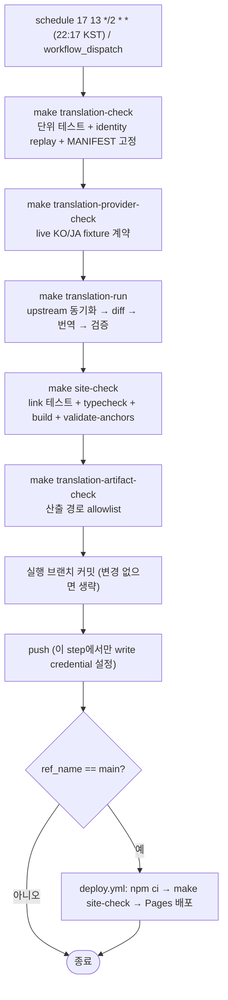
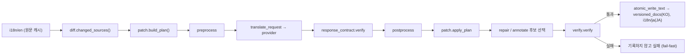

# 프로젝트 개요 리뷰 (2026-07-30)

## 1. 리뷰 대상과 범위

- 저장소: `laravel-docs`
- 브랜치 / 커밋: `refactor/sync-docs` / `d0a29b70d7d8421511ab64081ec43ed2daeb1077`
- 작업 트리 상태(확인됨): tracked 변경 0건, untracked 3건
  - `.docs/review/translation-sync-current-head-readiness-review-2026-07-29.md`
  - `.docs/review/translation-sync-review-2026-07-29.md`
  - `translation-sync/.coverage`
- 목적: 코드 수정이나 기능 구현이 아니라 **현재 상태의 객관적 분석과 문서화**
- 이번 리뷰에서 기존 코드·문서는 변경하지 않았다. 산출물은 `docs/review/2026-07-30-*.md` 6개 신규 파일뿐이다.

### 1.1 분석한 주요 디렉터리와 파일

| 영역 | 확인한 대상 |
|---|---|
| 진입점·메타데이터 | `README.md`, `package.json`, `Makefile`, `translation-sync/pyproject.toml`, `versions.json`, `.nvmrc`, `tsconfig.json` |
| 사이트 | `docusaurus.config.ts`, `sidebars.ts`, `src/**`(theme, remark, components, pages, css, utils), `static/**`, `i18n/**` |
| 문서 산출물 | `versioned_docs/version-*`(KO), `i18n/ja/...`(JA), `i18n/en/...`(EN 원문 캐시), `versioned_sidebars/*.json` |
| 번역 파이프라인 | `translation-sync/main.py`, `replay.py`, `provider_check.py`, `validate_generated_changes.py`, `annotate_cli.py`, `sync/**`, `prompt.md`, `prompt_jp.md` |
| 테스트 | `translation-sync/tests/*.py`(16개 파일), `e2e/*.spec.ts`(7개), `translation-sync/scripts/markdown-link-utils.test.mjs` |
| 자동화·운영 | `.github/workflows/*.yml`(4개), `Dockerfile`, `Dockerfile.translate`, `Dockerfile.playwright`, `docker-compose.yml`, `.husky/**`, `.github/dependabot.yml` |
| 문서 체계 | `translation-sync/docs/00~08`, `.github/docs/**`, `.husky/docs/**`, `e2e/TEST_LIST_*.md`, `.docs/**`, `SECURITY.md`, `CODE_OF_CONDUCT.md`, `AGENTS.md` |
| 스크립트 | `translation-sync/scripts/*.mjs`(10개) |

분석 제외: `node_modules/`, `build/`, `.docusaurus/`, `__pycache__/`, `.ruff_cache/`, `.git/`. 단 `Dockerfile*`·`package-lock.json`·`uv.lock`처럼 구성에 영향을 주는 설정은 확인했다.

## 2. 프로젝트 한 줄 설명

Laravel 공식 영어 문서를 원문 캐시로 두고, 변경분만 LLM으로 번역해 한국어·일본어 문서 사이트(`laravel.chanhyung.kim`)를 자동으로 갱신·배포하는 단일 저장소 시스템이다.

## 3. 프로젝트가 해결하려는 문제

확인된 사실:

- Laravel 공식 문서는 계속 변경되지만 커뮤니티 번역은 수작업으로 따라가기 어렵다. 이 저장소는 `i18n/en`에 원문을 byte 단위로 캐시하고(`translation-sync/sync/source/upstream.py`), git diff로 **변경된 블록만** 번역 대상으로 뽑아(`sync/source/diff.py`, `sync/translation/patch.py`) 번역 비용과 회귀 위험을 줄인다.
- 번역본은 영어 원문을 HTML 주석으로 병기하고 본문만 번역하는 형식이다(`versioned_docs/version-13.x/installation.md` 실물 확인). heading·링크 label·사이드바 label·앵커는 의도적으로 영어를 유지한다(`translation-sync/prompt.md`, `translation-sync/docs/05-additional-work.md` §3).
- 7개 버전(`master`, `13.x`~`8.x`)을 동시에 유지한다(`versions.json`).

## 4. 주요 사용자

| 사용자 | 근거 | 확실성 |
|---|---|---|
| 한국어·일본어로 Laravel 문서를 읽는 개발자 | `docusaurus.config.ts`의 `LOCALES = ['ko','ja']`, locale 드롭다운, Algolia `contextualSearch`, gtag/GTM 계측 | 추론 (공개 독자 전제는 코드로 확인, 사용자 정의 문서는 부재) |
| 저장소 운영자(사실상 1인) | `package.json` author `kimchanhyung98`, `LICENSE`, `CODE_OF_CONDUCT.md` 연락처 | 추론 |
| 자동화 에이전트/CI | `.github/workflows/sync-translation.yml`, `.docs/system-prompt.md`, `.claude/**`, `.codex/**` | 확인됨 |

문서에 사용자 정의가 명시된 곳은 없다. `README.md`는 대상 독자를 서술하지 않는다.

## 5. 핵심 기능

1. upstream 원문 동기화와 SHA 고정 (`sync/source/upstream.py`, `TRANSLATION_UPSTREAM_MANIFEST`)
2. 변경 감지와 번역 소유 단위 계획 (`sync/source/diff.py`, `sync/translation/patch.py`)
3. LLM 번역 (`sync/translation/translate.py`: `openai` / `azure` / `cli`(Codex) / `identity`(replay 전용))
4. 전처리·후처리 (`sync/preprocessing/preprocess.py`, `sync/postprocessing/postprocess.py`, `repair.py`)
5. 2단 구조 검증 (`sync/verification/response_contract.py` → 적용 → `sync/verification/verify.py`)
6. 사이드바 재생성 (`sync/sidebar/generator.py`, 기준은 각 버전 `documentation.md`)
7. 산출 경로 게이트 (`validate_generated_changes.py`의 allowlist)
8. Docusaurus 다국어·다버전 사이트 렌더링과 GitHub Pages 배포 (`docusaurus.config.ts`, `.github/workflows/deploy.yml`)

## 6. 주요 기술 구성

| 구분 | 값 | 선언 위치 |
|---|---|---|
| 사이트 | Docusaurus 3.10, React 19, TypeScript 6 | `package.json` |
| Node | `>=26 <27` | `package.json` engines, `.nvmrc`, Dockerfile, 두 workflow |
| 번역 자동화 | Python `>=3.14`, `uv` 0.11.32 고정, 의존성은 `openai>=1.0` 단일 | `translation-sync/pyproject.toml`, `uv.lock`, `Dockerfile.translate`, workflow |
| 브라우저 테스트 | Playwright 1.61.1 (chromium 단일) | `package.json`, `Dockerfile.playwright`, `playwright.config.ts` |
| 배포 | GitHub Pages (`laravel.chanhyung.kim`) | `docusaurus.config.ts`, `deploy.yml`, `CNAME` |
| 데이터베이스·스토리지 | **없음** (정적 사이트 + git 저장소가 유일한 상태) | 저장소 전수 확인 |

## 7. 전체 실행 흐름

문서 단위 상세 흐름:

## 8. 주요 모듈과 역할

| 모듈 | 역할 | 규모 |
|---|---|---|
| `translation-sync/main.py` | 오케스트레이션, 출력 경로 검증, 유지보수 CLI 모드 | 952행 |
| `sync/source/upstream.py` | upstream clone·캐시 적재·manifest | 301행 |
| `sync/source/diff.py` | git status/diff → `SourceChange` | 209행 |
| `sync/translation/patch.py` | 변경 계획 수립·적용·사후 검증 | **4,059행 (최대 모듈)** |
| `sync/translation/translate.py` | provider 어댑터 4종, 재시도, 비밀 마스킹 | 546행 |
| `sync/verification/response_contract.py` | 신규 응답 구조 계약 | **2,427행** |
| `sync/verification/verify.py` | 최종 문서 검증 | 1,158행 |
| `sync/postprocessing/postprocess.py`, `repair.py` | 형식 최종화, 보존 markup 복구 | 504 + 507행 |
| `sync/sidebar/generator.py` | 사이드바 JSON 재생성 | 476행 |
| `sync/common/files.py` | 모든 쓰기의 단일 통로(fsync + `os.replace`) | 103행 |
| `src/remark/*.ts`(7개) | Laravel 원문 관행을 Docusaurus로 변환 | 각 1.3~2.9KB |
| `src/theme/*`, `src/components/Homepage/*` | 커스텀 navbar/footer/404, 홈페이지 섹션 | - |

## 9. 외부 시스템과 의존성

- `github.com/laravel/docs` (원문, `sync/source/upstream.py`의 상수)
- OpenAI Responses API / Azure OpenAI Chat Completions / 로컬 Codex CLI
- GitHub Actions, GitHub Pages
- Algolia DocSearch, Google Analytics(gtag), Google Tag Manager
- 데이터베이스·오브젝트 스토리지·백엔드 런타임은 존재하지 않는다(확인됨).

## 10. 현재 프로젝트 상태

이번 리뷰에서 직접 실행한 검증 결과다.

| 검증 | 결과 |
|---|---|
| `uv sync --locked --python 3.14` | 성공 (16 packages) |
| `PYTHONPATH=. python -m unittest discover -s tests` | **771 tests OK** |
| `npm ci` | 성공 (1282 packages) |
| `npm run typecheck -- --pretty false` | 성공 |
| `npm run test:markdown-links` | 성공 (1 pass / 0 fail) |
| `npm run build` | 성공 (KO/JA 빌드 + redirect 101개) |
| `npm run validate-anchors` | **실패 — 46,626개 중 JA 15개 `id not found`** |
| `npm run test:e2e` (빌드 산출물 재사용) | **98 passed** |
| `make translation-check` | 성공 (단위 테스트 + identity replay) |
| `main.py --check-annotations --version master` | **실패 — 11건** |
| `main.py --check-annotations --version 13.x` | **실패 — 12건** |
| `make translation-artifact-check` | 실패 — 로컬 untracked 3건 때문 (코드 결함 아님) |

요약: **사이트 산출물은 생성되고 브라우저 동작도 정상이지만, 공식 배포 게이트(`make site-check`)는 JA 앵커 15건 때문에 현재 실패 상태다.** 번역 corpus 자기검사(`--check-annotations`)도 실패 상태이며 어떤 게이트에도 연결되어 있지 않다.

또한 같은 커밋을 대상으로 이번 세션에서 직접 재현한 코드 결함이 있다(상세는 03·05 문서).

- `postprocess.normalize_stale_link_targets`가 링크 label의 inline code를 공백으로 지운다.
- `sync/common/markdown.py`의 `_HTML_TAG_RE`가 초선형 backtracking을 보인다(n=800에서 906ms).
- `reference_definitions`가 특정 Unicode 줄바꿈 문자에서 `ValueError`로 중단된다.
- `validate_generated_changes.verified_unchanged_locales`가 production과 다른 baseline을 사용한다.

## 11. 전체 평가 요약

| 항목 | 평가 | 근거 요약 |
|---|---|---|
| 목적 대비 구조 적합성 | 대체로 적절 | 파이프라인 단계와 모듈이 1:1 대응, 원자적 쓰기·fail-closed 검증이 실제 구현됨 |
| 문서 신뢰성 | 부분적으로 부적절 | `translation-sync/docs`는 성숙하나 README·E2E 목록·SECURITY는 구현과 충돌 |
| 코드 구조 | 부분적으로 부적절 | `patch.py` 4,059행 비대화, 검증 모듈 간 private 침투·중복, 재현된 데이터 손상 결함 존재 |
| 테스트 | 부분적으로 부적절 | 단위 테스트 품질은 높으나 PR 게이트 부재, E2E 85개 정의가 CI 미연결 |
| 운영 | 부분적으로 부적절 | 게이트 순서는 우수하나 timeout·롤백·알림·PR 검증 부재 |
| 보안 | 대체로 적절 | 비밀 최소 주입·redaction·경로 allowlist는 견고. 단 에이전트 런타임 권한이 과도 |
| 신규 개발자 이해 가능성 | 부분적으로 부적절 | README가 Docker 실행·JA·CI 범위를 잘못 또는 미기술 |

## 12. 분석하지 못한 영역과 이유

1. **GitHub 저장소 설정**: branch protection, required checks, `github-pages` environment 보호 규칙. 저장소 파일로 확인 불가.
2. **실제 Secrets 등록 여부와 값**: 정책상 비밀 값을 열람·출력하지 않았다. 운영이 `openai`인지 `azure`인지는 미확인.
3. **live 번역 실행**: `make translation-run`은 문서를 실제로 수정하므로 실행하지 않았다. `make translation-provider-check`도 이번 회차에서는 외부 유료 API 호출을 피하려 실행하지 않았다.
4. **`patch.py`·`response_contract.py` 전수 정확성**: 각각 4,059행·2,427행으로 핵심 경로와 계약만 확인했고 개별 매칭 헬퍼의 정확성은 미검증.
5. **Algolia 인덱스 설정**: 저장소 외부 리소스.
6. **번역 본문의 언어 품질**: 자동 생성 산출물이며 이번 리뷰 범위(구조·목적 적합성)에서 제외.
7. **JA 앵커 15건의 개별 수정 방향**: 원인(문서 데이터에 alias 부재)은 확인했으나 각 문서의 올바른 대상 앵커 확정은 별도 작업이다.
