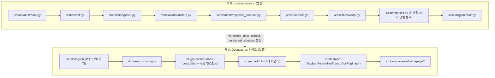
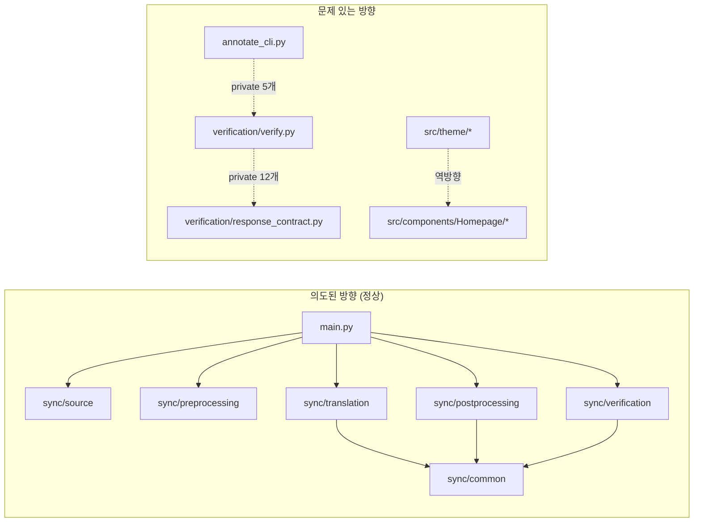

# 코드와 아키텍처 리뷰 (2026-07-30)

대상 커밋: `d0a29b7` (`refactor/sync-docs`)

평가 기준은 일반 관례가 아니라 이 프로젝트의 목적, 즉 **"KO/JA 문서를 upstream과 정확히 일치시켜 유지한다"** 이다.

## 1. 현재 아키텍처 개요

두 축이 하나의 저장소에 있다.

## 2. 주요 실행 흐름

1. **생성 흐름:** `main.py` → config → prompt → upstream 적재 → diff → (A: 전체 번역 / M: `build_plan`→`plan_state`→블록 번역→`apply_plan`→repair→verify / D: 출력 삭제) → 사이드바 → 산출 경로 게이트
2. **발행 흐름:** `prebuild`(`sync-versioned-links.mjs`) → `docusaurus build`(KO, JA) → `postbuild`(`create-latest-doc-redirects.mjs`) → `validate-anchors.mjs`

## 3. 모듈 및 계층별 책임

| 계층 | 모듈 | 책임 | 규모 |
|---|---|---|---|
| 입력 | `sync/source/upstream.py`, `diff.py` | 외부 git 입수, 변경 감지 | 301 / 209행 |
| 안정화 | `sync/preprocessing/preprocess.py` | placeholder, style 제거, 코드 fence화 | 421행 |
| 계획·적용 | `sync/translation/patch.py` | 변경 계획, 상태 판별, 적용, 사후 검증 | **4,059행** |
| 외부 경계 | `sync/translation/translate.py` | provider 4종, 재시도, 비밀 마스킹 | 546행 |
| 최종화 | `sync/postprocessing/postprocess.py`, `repair.py` | 형식 최종화, 보존 markup 복구 | 504 / 507행 |
| 검증 | `sync/verification/response_contract.py`, `verify.py` | 응답 계약, 최종 문서 검증 | **2,427** / 1,158행 |
| 납품 | `sync/sidebar/generator.py`, `common/files.py` | 사이드바 JSON, 원자적 쓰기 | 476 / 103행 |
| 게이트 | `validate_generated_changes.py` | 산출 경로 allowlist | 314행 |

## 4. 구조적 장점

모두 코드에서 확인됨.

1. **모든 쓰기가 단일 통로로 수렴한다.** `sync/common/files.py`의 `atomic_write_text/bytes`가 mode 보존 → `flush` → `fsync` → `os.replace` → 부모 디렉터리 `fsync` 순서를 강제한다. 이 프로젝트의 최대 위험(문서 파일 손상)에 정확히 대응하는 가장 깊은 모듈이다.
2. **fail-closed가 기본이다.** `patch.apply_plan`은 적용 후 anchor 순서, code 상태, 주석 순서를 재검증하고 불일치 시 `PatchError`를 던진다. front matter나 source 주석 변경은 전체 문서 동기화로 승격한다.
3. **검증이 2단으로 분리되어 있다.** 신규 provider 응답(`response_contract`)과 최종 문서(`verify`)의 계약이 다르다는 판단은 정확하다. 과거 형식 차이가 있는 legacy 문서에 신규 응답 계약을 소급하지 않는다.
4. **멱등성 장치가 실재한다.** `plan_state`가 SOURCE/TARGET/UNGUARDED를 판별해 이미 반영된 블록을 건드리지 않고, `replay.py`가 동일 입력 2회 실행 후 fingerprint를 비교한다. 이번 리뷰의 `make translation-check` 실행에서 이 수렴 검사가 통과함을 확인했다.
5. **외부 CLI 경계가 좁다.** `translate.py`의 `_cli_environment()`가 allowlist만 상속하고 `CODEX_HOME/.env` 존재 시 실행을 거부한다. Codex는 저장소 밖 임시 디렉터리에서 read-only sandbox로 실행되며 19종 기능이 비활성화된다.
6. **remark 어댑터 계층이 단일 책임으로 분리되어 있다.** 7개 플러그인이 각각 Laravel 원문 관행(`<a name>`, `{{version}}`, GFM alert, Pandoc `{.class}`) 하나씩을 담당하고, 왜 필요한지가 주석으로 근거화되어 있다.

## 5. 구조적 문제

### [Critical] 링크 label의 inline code가 후처리에서 지워진다

- 관련 경로: `translation-sync/sync/postprocessing/postprocess.py` — `normalize_stale_link_targets`
- 확인 내용: 이번 세션에서 직접 재현했다.
  - 입력: `See [`Str::of`](/docs/{{version}}/helpers#fluent-strings).`
  - 출력: `See [         ](/docs/{{version}}/strings#fluent-strings).`
- 문제점: 함수가 링크를 masked buffer에서 탐지한 뒤 **masked label을 그대로 출력에 사용한다.** inline code를 공백으로 치환한 문자열이 최종 문서에 기록된다.
- 프로젝트 목적과의 관계: 목적의 핵심은 "문서를 정확히 유지"인데, 이 결함은 문서를 조용히 손상시킨다. 게다가 `main.py:_expected_source()`가 검증 기준을 만들 때 **같은 `postprocess`를 적용**하므로 `verify`가 이 손상을 잡지 못한다.
- 예상 영향: 현재 저장소에도 해당 형태 링크가 존재하며(`i18n/en`·`i18n/ja`·`versioned_docs`의 10.x `requests.md`), 다음 sync에서 visible link text가 지워질 수 있다.
- 권장 조치: 링크 탐지는 masked text로 하되 label·title은 **원본 문자열에서 slice**한다.
- 수정 난이도: 보통
- 확실성: 확인됨 (재현)

### [High] 산출 검증 게이트가 production과 다른 baseline을 쓴다

- 관련 경로:
  - `translation-sync/validate_generated_changes.py` — `verified_unchanged_locales`
  - `translation-sync/main.py` — `_expected_source`
- 확인 내용: production 경로는 `preprocess` → `postprocess`를 적용한 원문을 검증 기준으로 삼는다(`main.py:535-539`). 그러나 산출 게이트는 raw EN 캐시를 그대로 `verify.verify(..., source=...)`에 넣는다.
- 문제점: 같은 문서에 대해 두 게이트가 서로 다른 기준을 적용한다.
- 프로젝트 목적과의 관계: 코드 블록만 바뀐 upstream 변경처럼 **KO/JA가 정당하게 변경되지 않는 경우**를 게이트가 "미검증 unchanged"로 오인할 수 있다. `sync-translation.yml`은 이 게이트를 commit 이전에 실행하므로 정상 sync가 반복 실패하고 EN 캐시도 커밋되지 않는다.
- 권장 조치: `validate_generated_changes.py`가 `main.py:_expected_source()`와 동일한 전처리·후처리 baseline을 공유하도록 통일한다.
- 수정 난이도: 보통
- 확실성: 확인됨

### [High] 최종 검증이 문장 단위 영어 잔존을 통과시킨다

- 관련 경로: `sync/verification/verify.py`(`_has_untranslated_source_prose`), `sync/verification/response_contract.py`(`contains_untranslated_source_phrase`)
- 확인 내용: 재현했다. 원문 3문장 중 가운데 문장만 영어로 남긴 입력에 대해 `response_contract.verify` → `[]`, `verify.verify` → `[]`.
- 문제점: 현재 검사는 문단 전체가 원문과 거의 같은 경우만 잡는다. 문단 내부의 미번역 문장은 통과한다.
- 프로젝트 목적과의 관계: "본문을 번역한다"는 핵심 계약이 부분적으로 미검증이다. 실제로 `--check-annotations`가 `ko search.md`에서 `untranslated source text`를 보고하는데, 이는 이미 산출물에 미번역 본문이 존재함을 뜻한다.
- 권장 조치: 문장/절 단위 span으로 충분히 긴 unchanged 구간을 거부한다. 블록 짝짓기는 위치가 아니라 annotation anchor를 기준으로 한다.
- 수정 난이도: 높음
- 확실성: 확인됨 (재현)

### [High] Markdown 파서에 초선형 backtracking이 있다

- 관련 경로: `sync/common/markdown.py` — `_HTML_TAG_RE`
- 확인 내용: 공백 run 길이를 늘리며 `html_tags()` 실행 시간을 측정했다.

  | 입력 길이 | 소요 |
  |---|---|
  | 100 | 2.21ms |
  | 200 | 21.71ms |
  | 400 | 116.78ms |
  | 800 | 906.02ms |

- 문제점: 길이 2배마다 시간이 약 8배 증가한다(cubic 경향). 이 파서는 **신뢰할 수 없는 입력**(provider 응답, upstream 문서)을 검증하는 경로에 있다.
- 예상 영향: 악의적이지 않은 malformed HTML 한 줄로도 검증 단계가 장기 정지할 수 있다. workflow에 `timeout-minutes`가 없어 최대 6시간까지 점유될 수 있다.
- 권장 조치: attribute chunk의 공백 소비를 모호하지 않게 바꾼다(예: `[^\s<>"']` 기반).
- 수정 난이도: 낮음
- 확실성: 확인됨 (측정)

### [High] 특정 Unicode 줄바꿈 문자에서 파서가 예외로 중단된다

- 관련 경로: `sync/common/markdown.py` — `reference_definitions`, `_masked_reference_source`
- 확인 내용: `U+000B`, `U+000C`, `U+0085`, `U+2028`, `U+2029` 각각에 대해 `ValueError: zip() argument 2 is shorter than argument 1`을 재현했다.
- 문제점: masking이 `\r`, `\n`만 보존하고 다른 break 문자를 공백으로 바꿔 raw/masked의 `splitlines()` 줄 수가 달라지고 `zip(..., strict=True)`가 깨진다.
- 프로젝트 목적과의 관계: provider 응답을 "거부"해야 할 상황에서 파이프라인 자체가 크래시한다. 오류 분류가 불가능해진다.
- 권장 조치: masking이 줄 구조를 보존하도록 수정하거나, 줄 수 불일치를 명시적 검증 실패로 변환한다.
- 수정 난이도: 낮음
- 확실성: 확인됨 (재현)

### [High] `patch.py`가 4,059행으로 비대하며 계속 커진다

- 관련 경로: `sync/translation/patch.py`
- 확인 내용: 4,059행, 함수 약 200개, `BlockChange` 필드 30개 이상. 분류·매칭·적용·사후검증이 한 모듈에 응집한다. `sync/common/markdown.py`(1,694행)의 헬퍼 약 25개에 의존한다.
- 문제점: 새 upstream 편집 형태가 나타날 때마다 케이스별 헬퍼가 추가되는 구조다(표 행 처리, named section 처리 등). 변경 영향 범위를 사람이 예측하기 어렵다.
- 프로젝트 목적과의 관계: 이 모듈이 문서 손상 위험의 중심이다. 실제로 이 리뷰에서 확인한 데이터 손상 경로가 이 계열에 집중된다.
- 권장 조치: 대규모 재설계가 아니라 경계 분리를 권한다. (a) 계획 수립(`build_plan` + `BlockChange` 분류), (b) 매칭/적용, (c) 사후 검증 세 파일로 분리하고 공용 헬퍼는 `common/markdown.py`에 남긴다.
- 수정 난이도: 높음
- 확실성: 확인됨

### [High] 검증 모듈이 서로의 private 함수에 직접 의존한다

- 관련 경로:
  - `sync/verification/verify.py:40-53` — `response_contract`의 underscore 함수 12개를 직접 import
  - `annotate_cli.py:115-134` — `verify`의 private 함수 5개 사용
- 문제점: 두 검증 모듈이 사실상 한 구현을 공유하면서 이름만 다른 계층으로 존재한다. `response_contract` 내부 리팩터링이 `verify`와 CLI를 동시에 깬다.
- 권장 조치: 공유 로직을 `sync/verification/common.py`(또는 `common/markdown.py`)로 승격해 공개 인터페이스로 만든다.
- 수정 난이도: 보통
- 확실성: 확인됨

### [Medium] 동일 규칙이 두 모듈에 이중 관리된다

- 관련 경로:
  - `postprocess.py`의 `_STALE_LINK_REPLACEMENTS` vs `verify.py`의 `_STALE_LINK_TARGETS` — 내용이 이미 미묘하게 다르다(`verify`만 `##date-casting` 단독 엔트리 보유)
  - `_strip_code_blocks` / `_normalized_fenced_code_blocks`가 `verify.py`와 `response_contract.py`에 각각 존재
  - `_split_line_ending`이 `main.py`와 `repair.py`에 중복
- 문제점: 한쪽만 수정하면 후처리가 정규화한 링크를 검증이 다르게 판정한다.
- 권장 조치: stale link 테이블을 단일 모듈로 통합하고 양쪽이 참조한다.
- 수정 난이도: 낮음
- 확실성: 확인됨

### [Medium] 로케일 추가가 6개 이상 파일에 하드코딩되어 있다

- 관련 경로: `main.py`(`_ko_output`/`_ja_output`/`_delete_outputs`/`_load_prompts`/번역 루프), `validate_generated_changes.py`(4개 테이블), `provider_check.py`, `docusaurus.config.ts`, `create-latest-doc-redirects.mjs`(`['', 'ja']`), `validate-anchors.mjs`(`DOCS_ROOTS`)
- 문제점: 로케일 registry가 없다. 새 로케일은 최소 6개 파일 10곳 이상을 동시에 수정해야 한다.
- 프로젝트 목적과의 관계: 현재 목적(KO/JA)에는 충분하다. 다만 확장 시 병목이며, 이미 JA 관련 누락(README·`localeConfigs.en` 사장 설정)이 발생했다.
- 권장 조치: 지금 당장 추상화할 필요는 없다. 로케일 추가가 실제 계획에 들어올 때 registry를 도입한다.
- 수정 난이도: 보통
- 확실성: 확인됨

### [Medium] theme 계층이 page 계층을 역방향 참조한다

- 관련 경로: `src/theme/Navbar/Content/index.tsx:13`, `src/theme/Footer/index.tsx:5` → `@site/src/components/Homepage/*`
- 확인 내용: 정상 방향은 page → theme → utils인데 반대로 참조한다. 결과는 세 가지다.
  1. `NavbarDropdowns`(45.7KB)와 `homepage.css`(71KB)가 **정적 import**되어 문서 페이지 공통 청크에 포함된다(렌더는 홈에서만).
  2. `Footer/index.tsx`가 `FooterSection`을 직접 반환하므로 swizzle된 `src/theme/Footer/{Layout,Links,LinkItem,Logo,Copyright}` 5개가 죽은 코드가 된다.
  3. `themeConfig.footer.links`/`copyright` 설정이 무효화되어, 푸터를 수정하려는 사람이 잘못된 지점을 고친다.
- 프로젝트 목적과의 관계: 문서 열람이 주 사용 시나리오인데 홈페이지 전용 자산 비용이 문서 페이지에 전가된다.
- 권장 조치: `NavbarDropdowns`·`FooterSection`을 `React.lazy` 또는 동적 import로 분리하고, 사용하지 않는 swizzle 산출물을 제거한다.
- 수정 난이도: 보통
- 확실성: 확인됨 (import 체인). 실제 청크 분리 결과는 [INFERENCE]

### [Medium] "미버전 → 최신버전" 리다이렉트가 3중 구현이다

- 관련 경로:
  1. `docusaurus.config.ts:23-45,57-66` — 모든 페이지에서 실행되는 inline blocking 스크립트
  2. `translation-sync/scripts/create-latest-doc-redirects.mjs` — postbuild 정적 HTML
  3. `src/theme/NotFound/index.tsx` — `useEffect`
- 문제점: 세 구현이 locale prefix·trailing slash·버전 판정 규칙을 각자 갖는다. `trailingSlash: true`인데 ①은 슬래시 없는 경로로 이동시킨다.
- 권장 조치: 판정 규칙을 한 모듈로 추출해 세 지점이 공유한다.
- 수정 난이도: 보통
- 확실성: 확인됨

### [Medium] 파생 규칙이 5곳에 복제되어 있다

- 관련 경로: "master 제외 첫 항목이 최신 안정판" 규칙이 `docusaurus.config.ts:18`, `src/utils/docs.ts:4`, `e2e/utils/docs-version.ts:4`, `create-latest-doc-redirects.mjs:7`, `sync-versioned-links.mjs:10`에 각각 존재
- 문제점: 데이터 출처(`versions.json`)는 단일인데 파생 규칙이 분산되어 있다.
- 권장 조치: `src/utils/docs.ts`를 단일 출처로 삼고 스크립트가 이를 참조하도록 정리한다. 현재 규모에서는 Low로 두어도 무리는 없다.
- 수정 난이도: 낮음
- 확실성: 확인됨

### [Medium] `` 정규화 실패가 후속 검증을 무력화한다

- 관련 경로: `postprocess.py`(`img_self_closing`), `verify.py`(`img_self_closing(body) != body` 비교)
- 확인 내용: `` 다음에 정상 ``가 오는 입력에서 정규화가 변화 없음(False)을 반환하고 `verify` 결과가 `[]`였다.
- 문제점: 첫 malformed 태그에서 스캐너가 멈추고 문서 전체를 그대로 반환한다. `verify`가 "정규화 전후 동일"을 무결성 신호로 쓰기 때문에 이후 malformed 태그도 검출되지 않는다.
- 권장 조치: 정규화 실패를 명시적 issue로 승격한다.
- 수정 난이도: 낮음
- 확실성: 확인됨 (재현)

### [Medium] CLI 재시도 분류가 문서 본문에 오염된다

- 관련 경로: `sync/translation/translate.py` — `_is_retryable`, `_CLI_RETRYABLE_STATUS_RE`
- 문제점: stdout/stderr 전체를 정규식으로 검사한다. Codex는 프롬프트와 입력 문서를 stderr에 에코하므로, 번역 대상 문서에 `timeout`·`rate limit` 같은 단어가 있으면 **영구 오류가 재시도 가능으로 오분류**된다.
- 예상 영향: 기본 재시도 지연이 300초 고정이라 영구 실패에 최대 수십 분이 낭비된다. `timeout-minutes`가 없어 job이 장기 점유될 수 있다.
- 권장 조치: 에코된 입력 이후의 provider 오류 라인만 분류 대상으로 삼고, `stdout`은 판단에서 제외한다.
- 수정 난이도: 보통
- 확실성: 확인됨 (코드), 실제 Codex 에코 형태는 이전 세션 실행에서 확인

### [Low] 기타

- `sync/__init__.py:28-37`이 import 시점에 `sys.modules`에 13개 alias를 주입한다. 동작하지만 정적 분석과 순환 import 진단을 어렵게 한다.
- `diff.py:96-99`의 porcelain 파서가 rename 표기(`R old -> new`)를 오파싱할 수 있다. 현재 적재 방식에서는 rename이 발생하지 않아 잠재 수준이다.
- `sync/translation/patch.py`가 `DiffLine`을 unevaluated annotation에서 참조하지만 import하지 않는다. `from __future__ import annotations` 때문에 **런타임 오류는 아니다.** 타입 도구 관점의 결함이다.
- 죽은 코드: `sidebars.ts`, `docs/index.md`, `src/components/{Hero,CodeExamples,Features}`, `src/theme/Root.tsx`의 `TRANSLATION_IN_PROGRESS_LOCALES=['en']`(en 미발행), `src/theme/prism-include-languages.ts`의 `languages.blade`(remark가 먼저 소거).
- 기능 플래그로 도달 불가한 정적 자산 약 1.4MB(`SHOW_CAROUSEL=false`, `SHOW_DISABLED_NAV=false`).

## 6. 의존성 방향

`sync/common/files.py`가 가장 깊고 안정적인 모듈이며, 순환 import는 발견되지 않았다.

## 7. 도메인과 인프라의 분리 상태

**평가: 대체로 적절**

- 외부 인프라(git, LLM API, CLI subprocess, 파일시스템)가 각각 `source/upstream.py`, `translation/translate.py`, `common/files.py` 뒤에 격리되어 있다. 도메인 로직(diff 계획, 검증 계약)은 순수 함수에 가깝다.
- `preprocess.py`, `postprocess.py`, `patch.py`는 파일시스템을 직접 만지지 않는다. 이는 771개 단위 테스트가 가능한 이유다.
- 다만 `main.py`가 오케스트레이션과 출력 경로 검증, 보정 후보 선택을 함께 맡아 952행에 이른다. 현재 규모에서는 허용 범위다.

## 8. 코드 일관성

| 항목 | 평가 | 근거 |
|---|---|---|
| 오류 처리 | 대체로 적절 | `ConfigError`(exit 2), `IncompleteTranslation`, `PatchError`, `RepairError`로 계층별 분리. `verify()`는 issue 라벨 목록을 반환하고 CLI가 종료 코드로 변환 |
| 쓰기 방식 | 적절 | 모든 쓰기가 `atomic_write_*` 경유 |
| 설정 접근 | 적절 | `sync/runtime/config.py`가 유일한 env 진입점, `os.environ`만 사용 |
| 로깅 | 부분적으로 부적절 | 전부 `print`. 구조화 로그·재시도 횟수·latency 기록 없음 |
| 추상화 수준 | 부분적으로 부적절 | `common/files.py`(103행)와 `patch.py`(4,059행)의 깊이 차이가 극단적 |
| 정적 분석 | 부분적으로 부적절 | Python 측에 lint·type·coverage 게이트가 **없다**(§10 참조). TS는 `typecheck`가 있으나 `strict` 미설정 |

## 9. 주요 기술 부채

1. `patch.py` / `response_contract.py` 비대화 (4,059 + 2,427행)
2. 검증 모듈 간 private 침투와 로직 중복
3. 로케일 지식의 산발 하드코딩
4. 리다이렉트 3중 구현과 파생 규칙 5중 복제
5. theme → page 역방향 의존과 죽은 swizzle 산출물
6. 관측성 부재(구조화 로그·telemetry 없음)

## 10. Python 정적 분석 게이트 부재 (구조적 공백)

- 관련 경로: `translation-sync/pyproject.toml`(`[project]`와 `[tool.uv]`만 존재), `Makefile`, `.github/workflows/*`
- 확인 내용: 저장소에 ruff/flake8/mypy 설정 파일이 없고(`ruff.toml`·`.ruff.toml`·`setup.cfg`·`.flake8`·`.pre-commit-config.yaml` 모두 부재), Makefile target과 workflow에도 Python lint·type·coverage 참조가 **0건**이다.
- 문제점: TS에는 `npm run typecheck`, 사이트에는 `validate-anchors`가 있는데 Python 측에는 대응 게이트가 없다. 비대칭이다.
- 참고: 참고용으로 `uvx ruff check .`를 실행하면 다수 위반이 보고되지만, **프로젝트가 채택한 룰셋이 아니므로 이를 "코드 결함 N건"으로 취급하지 않는다.** 유효한 발견은 개별 위반 수가 아니라 게이트 부재 자체다. 다만 그중 `patch.py`의 `DiffLine` 미import는 룰셋과 무관한 실제 타입 결함이다.
- 권장 조치: 규칙을 최소로 고정한 ruff 설정을 추가하고 `make check`에 편입한다. 전면 도입보다 신규 코드 기준 적용이 현실적이다.
- 수정 난이도: 낮음
- 확실성: 확인됨

## 11. 확장 시 예상되는 병목

| 확장 시나리오 | 병목 | 근거 |
|---|---|---|
| 새 로케일 추가 | 6개 파일 10곳 이상 동시 수정 | §5 로케일 하드코딩 |
| 새 upstream 편집 형태 | `patch.py` 전체가 영향 범위 | §5 patch 비대화 |
| 새 버전 추가 | 비교적 안전 (`versions.json` 단일 출처) — 단 파생 규칙 5곳이 일관되게 동작해야 함 | §5 파생 규칙 복제 |
| 문서 수 증가 | 완전 순차 처리 + 300초 고정 재시도 | `translate.py`, `main.py` 루프 |
| 비앵커 링크 검증 추가 | `validate-anchors.mjs`가 `#` 없는 링크를 건너뛴다. `find-missing-links.mjs`는 어디에도 연결되지 않음 | 스크립트 확인 |

## 12. 프로젝트 목적에 대한 코드 적합성

**평가: 대체로 적절**

- 핵심 기능(증분 번역, 구조 보존, 원문 추적)이 코드의 중심을 차지한다. 목적과 무관한 코드가 과도하게 섞여 있지 않다.
- 문서가 핵심이라고 말한 것(단계 순서, 재시도 상한, 산출 경로, no-transaction 한계)이 코드와 일치한다. 특히 `translation-sync/docs/00` §1.2가 run 단위 rollback이 없다는 한계를 **정직하게 명시**한 점은 신뢰도를 높인다.
- 감점 요인은 목적을 보증해야 하는 지점의 결함이다. 후처리가 문서를 손상시킬 수 있고, 검증이 문장 단위 미번역을 통과시키며, 파서가 정지·크래시할 수 있다.

## 13. 종합 평가

| 관점 | 평가 |
|---|---|
| 목적 적합성 | 대체로 적절 |
| 현재 규모 적합성 | 대체로 적절 (과도한 추상화 없음. 단 `patch.py`는 규모를 넘어섰다) |
| 유지보수 가능성 | 부분적으로 부적절 (비대 모듈 + private 침투 + 중복 테이블) |
| 확장 가능성 | 부분적으로 부적절 (로케일·편집 형태 확장 시 병목) |
| 안정성 | 부분적으로 부적절 (재현된 손상·정지·크래시 경로 존재) |
| 테스트 가능성 | 적절 (순수 함수 중심 설계로 771개 테스트 성립) |

**결론:** 아키텍처의 골격과 방향은 이 프로젝트 목적에 맞다. 문제는 설계 방향이 아니라 (a) 데이터 무결성 경로의 구체적 결함과 (b) 최대 모듈의 비대화다. 대규모 재설계는 권장하지 않는다.
