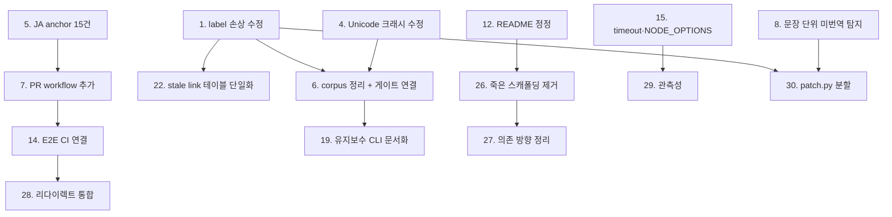

# 우선순위와 개선 로드맵 (2026-07-30)

대상 커밋: `d0a29b7` (`refactor/sync-docs`)

## 1. 전체 결론

이 프로젝트는 **설계 방향이 목적에 맞고 골격도 견고하다.** 파이프라인 단계가 문서와 1:1로 대응하고, 모든 쓰기가 원자적 통로로 수렴하며, 검증이 "번역 품질"이 아니라 "구조 보존"이라는 자동 판정 가능한 목표를 겨냥한다. 771개 단위 테스트, TypeScript 검사, 사이트 빌드, 98개 브라우저 E2E가 이번 리뷰에서 모두 통과했다.

문제는 아키텍처가 아니라 **목적을 보증해야 하는 지점의 구체적 결함과 게이트 배치**다. 세 가지로 요약된다.

1. **문서 무결성 경로에 재현된 결함이 있다.** 후처리가 링크 label의 inline code를 지우고, 검증이 문장 단위 미번역을 통과시키며, 파서가 특정 입력에서 정지하거나 크래시한다.
2. **정상 상태의 정의가 현재 충족되지 않는다.** `make site-check`가 JA 앵커 15건으로 실패하고, `--check-annotations`가 master 11건·13.x 12건으로 실패한다. 후자는 어떤 게이트에도 연결되어 있지 않다.
3. **검증이 사람 경로에 없다.** PR에서 실행되는 테스트가 0건이고, 잘 만들어진 E2E 98개가 CI에 연결되어 있지 않다. 회귀가 배포 시점에야 드러난다.

## 2. 가장 먼저 해결해야 할 문제

**`postprocess.normalize_stale_link_targets`의 링크 label 손상.** 이유는 세 가지다.

- 이 프로젝트의 존재 이유(문서를 정확히 유지)를 직접 훼손한다.
- `main.py:_expected_source()`가 같은 `postprocess`를 검증 기준에 적용하므로 **기존 검증이 이 손상을 잡지 못한다.**
- 이미 해당 형태의 링크가 저장소에 존재하므로, 다음 sync에서 실제 손상이 발생할 수 있다.

## 3. 유지해야 할 현재의 장점

수정 과정에서 훼손하지 말아야 할 것들이다.

1. **`sync/common/files.py`의 단일 쓰기 통로** — mode 보존 → fsync → `os.replace` → 부모 fsync. 우회 경로를 만들지 않는다.
2. **fail-closed 기본 정책** — 모호한 매칭, 계획 불일치, front matter 변경은 실패시킨다. "일단 쓰고 나중에 고친다"로 바꾸지 않는다.
3. **2단 검증 분리** — 신규 응답 계약과 최종 문서 검증을 분리한 판단은 정확하다. legacy 문서에 신규 계약을 소급하지 않는 것도 유지한다.
4. **credential 분리** — `persist-credentials: false` + push step 전용 자격증명 + provider 비밀 2개 step 한정 주입.
5. **산출 경로 allowlist** — 커밋 직전 fail-closed 게이트.
6. **문서의 정직한 한계 서술** — `translation-sync/docs/00` §1.2가 run 단위 rollback 부재를 명시한 점. 이런 서술은 늘리는 것이 맞다.
7. **identity replay 수렴 검사** — 같은 입력 2회 실행 후 fingerprint 비교.

## 4. 우선순위 표

| 순서 | 우선순위 | 개선 항목 | 근거 | 예상 효과 | 난이도 | 선행 작업 |
|---:|---|---|---|---|---|---|
| 1 | Critical | `normalize_stale_link_targets`가 label·title을 원본에서 slice하도록 수정 | 재현: `` [`Str::of`] `` → `[         ]`. `_expected_source`가 같은 후처리를 쓰므로 검증도 무력 | 문서 손상 경로 제거 | 보통 | 없음 |
| 2 | High | `validate_generated_changes`가 `_expected_source()` baseline을 공유 | production은 preprocess+postprocess 기준, 게이트는 raw EN 기준 | 정상 sync의 반복 실패 제거 | 보통 | 없음 |
| 3 | High | `_HTML_TAG_RE` backtracking 수정 | 측정: n=800에서 906ms, 8배/2배 증가 | 검증 단계 정지 위험 제거 | 낮음 | 없음 |
| 4 | High | `reference_definitions`의 Unicode 줄바꿈 크래시 수정 | `U+000B/000C/0085/2028/2029`에서 `ValueError` 재현 | 크래시 → 명시적 거부로 전환 | 낮음 | 없음 |
| 5 | High | JA alias anchor 15건 보정 | `validate-anchors` 실패 → `make site-check` 실패 → 배포·sync 동시 차단 | 배포 게이트 복구 | 보통 | 없음 |
| 6 | High | `--check-annotations` corpus 23건 정리 후 게이트 연결 | master 11 + 13.x 12 실패. 문서·Makefile·workflow 미연결 | 방치된 검사를 실효화 | 높음 | 1, 4 |
| 7 | High | PR workflow 추가 (`site-check` + `translation-check`) | PR에서 실행되는 테스트 0건 | 회귀를 배포 전으로 이동 | 낮음 | 5 (통과 상태 확보) |
| 8 | High | 문장 단위 미번역 탐지 강화 | 문단 내 영어 문장 잔존이 두 검증 모두 통과(재현) | 핵심 계약 미검증 해소 | 높음 | 없음 |
| 9 | High | `SECURITY.md` 실제 내용 작성 | 템플릿 지시문 잔존, 보고 주소 없음. API 키·write 토큰 취급 저장소 | 취약점 보고 채널 확보 | 낮음 | 없음 |
| 10 | High | `make claude`의 원격 fetch 고정(SHA + 체크섬) | 서드파티 `main`을 검증 없이 `AGENTS.md`에 append, `make dev`에 포함 | 지시문 무결성 확보 | 낮음 | 없음 |
| 11 | Medium | `e2e/TEST_LIST_*.md` 삭제 또는 재생성 | 78 vs 20, 33 vs 30. 문서가 "있다"고 한 UI를 코드는 "없어야 한다"고 단언 | 기여자 오작업 방지 | 낮음 | 없음 |
| 12 | Medium | README 정정(Docker 절, JA, 명령표, 기여 링크, `translation-sync/.env`) | Docker 안내가 동작하지 않음. JA 완전 누락 | 진입점 신뢰 회복 | 낮음 | 없음 |
| 13 | Medium | `docs/review/` → `.docs/review/` 경로 정정(문서 3개) | 에이전트가 계약 입력을 못 찾음 | 자동화 계약 복구 | 낮음 | 없음 |
| 14 | Medium | E2E를 CI에 연결 | 98개 테스트가 실행 주체 없음 | 렌더링 회귀 자동 방어 | 보통 | 7 |
| 15 | Medium | workflow `timeout-minutes` 추가, `deploy.yml`에 `NODE_OPTIONS` 통일 | timeout 0건, 배포 경로만 heap 미설정 | job 장기 점유·조건 불일치 제거 | 낮음 | 없음 |
| 16 | Medium | `.gitignore`에 `.coverage`, `.ruff_cache/`, `.review/` 추가 | 로컬 `artifact-check` 상시 실패 | 로컬 게이트 사용 가능화 | 낮음 | 없음 |
| 17 | Medium | CLI 재시도 분류를 provider 오류 라인으로 축소 | stderr에 문서 본문이 에코되어 오분류 가능 | 영구 실패의 장기 재시도 방지 | 보통 | 없음 |
| 18 | Medium | `img_self_closing` bail-out을 명시적 issue로 승격 | malformed 태그 이후 검증 무력화(재현) | 검증 신뢰도 회복 | 낮음 | 없음 |
| 19 | Medium | 유지보수 CLI 표를 `05-additional-work.md`에 추가 | 3종 모두 문서 0건 | 운영 절차 정의 | 낮음 | 6 |
| 20 | Medium | Python lint 게이트 최소 도입 + `make check` 편입 | Python 측 정적 분석 게이트 부재(TS와 비대칭) | 신규 코드 품질 하한 | 낮음 | 없음 |
| 21 | Medium | 검증 모듈 간 private 의존 해소(공유 모듈로 승격) | `verify.py`가 `response_contract` private 12개 import | 리팩터링 안전성 | 보통 | 없음 |
| 22 | Medium | stale link 테이블 단일화 | `postprocess`와 `verify`가 이중 관리, 내용이 이미 다름 | 판정 불일치 제거 | 낮음 | 1 |
| 23 | Medium | Dependabot에 uv·docker 추가, 컨테이너 digest 고정 | 커버리지 공백 | 공급망 관리 | 낮음 | 없음 |
| 24 | Medium | 롤백 workflow 추가, `deploy.yml`의 `cancel-in-progress: false` | 롤백 경로 없음, 배포 누락 위험 | 복구 수단 확보 | 낮음 | 없음 |
| 25 | Medium | 에이전트 승인 모드 재검토 | `bypassPermissions` + `approval_policy = "never"` | 권한 표면 축소 | 보통 | 없음 |
| 26 | Low | 죽은 스캐polding 제거(`sidebars.ts`, `docs/index.md`, 미사용 컴포넌트, 도달 불가 자산 1.4MB) | 참조 0건 확인 | 저장소·번들 축소 | 낮음 | 12 |
| 27 | Low | theme → page 역방향 의존 정리, 홈 자산 동적 import | 문서 페이지에 홈 자산 전가 | 문서 열람 성능 | 보통 | 26 |
| 28 | Low | 리다이렉트 3중 구현의 판정 규칙 통합 | 규칙이 3곳에 분산, trailing slash 불일치 | 변경 비용 감소 | 보통 | 14 |
| 29 | Low | 구조화 로그·실패 알림 도입 | print 기반, 알림 0건 | 실패 탐지 시간 단축 | 보통 | 15 |
| 30 | Low | `patch.py` 경계 분리(계획/적용/검증 3분할) | 4,059행, 함수 200개 | 변경 영향 예측 가능 | 높음 | 1~8 완료 후 |

## 5. 즉시 수정 항목

1~5번. 모두 근거가 재현되었고 선행 작업이 없으며, 문서 손상·게이트 차단이라는 즉각적 영향을 갖는다.

## 6. 단기 개선 항목

6~13번. corpus 정리, PR 게이트, 보안 문서, 구현과 충돌하는 문서 제거. 대부분 저비용이고 신뢰도를 크게 올린다.

## 7. 중기 구조 개선 항목

14~25번. E2E CI 연결, timeout·롤백, 재시도 분류, 검증 모듈 경계 정리, lint 도입, 공급망·권한 정리.

## 8. 장기 방향 검토 항목

26~30번. 죽은 코드 제거, 의존 방향 정리, 리다이렉트 통합, 관측성, `patch.py` 분할.

`patch.py` 분할은 **가장 마지막**에 두었다. 이유는 이 모듈이 현재 데이터 무결성의 중심이므로, 결함 수정과 검증 강화가 끝난 뒤에 손대야 회귀를 감지할 수 있기 때문이다.

## 9. 보류하거나 하지 않아도 되는 항목

| 항목 | 이유 |
|---|---|
| 대규모 아키텍처 재설계 | 현재 구조가 목적에 맞다. 문제는 국소적 결함과 게이트 배치다 |
| 로케일 registry 추상화 | 새 로케일 추가가 실제 계획에 없다. KO/JA 2개에는 현재 방식이 충분하다 |
| `CONTRIBUTING.md` 신설 | README 섹션으로 충분하고 중복 원천이 된다 |
| `CHANGELOG.md` 신설 | 릴리스 개념이 없다 |
| 별도 ADR·아키텍처 문서 | `translation-sync/docs`가 이미 담당한다 |
| `.docs/review/INDEX.md` | 유지비가 이득을 초과한다. 최신 리뷰 상단 3줄 표기로 대체 |
| Playwright 멀티 브라우저 확대 | chromium 단일도 현재 목적에 충분하다. CI 연결이 먼저다 |
| 번역 결과 캐시 도입 | 현재 diff 기반 증분으로 비용이 이미 제한된다 |
| `translation-sync`를 별도 저장소로 분리 | 사이트 경로에 강결합되어 있고 분리 이득이 없다 |

## 10. 작업 간 선행 관계

핵심 제약은 두 개다.

- **5 → 7**: PR workflow가 `site-check`를 포함하려면 그 게이트가 먼저 통과 상태여야 한다. 실패하는 게이트를 required로 만들면 모든 PR이 막힌다.
- **1, 8 → 30**: 검증이 강화된 뒤에 `patch.py`를 분할해야 회귀를 감지할 수 있다.

## 11. 예상 효과

| 단계 | 완료 후 상태 |
|---|---|
| 1단계 (1~10) | 문서 손상·크래시·정지 경로 제거. `make site-check`와 `--check-annotations` 통과. PR에서 회귀 감지. 보안 보고 채널 확보 |
| 2단계 (11~25) | 문서가 구현과 일치. E2E가 자동 방어. timeout·롤백·알림으로 장애 대응 가능. 검증 모듈 경계 정리 |
| 3단계 (26~30) | 죽은 코드 제거, 문서 페이지 성능 개선, 관측성 확보, `patch.py` 변경 비용 감소 |

## 12. 로드맵

### 1단계: 신뢰성 확보

목표는 "정상 상태의 정의를 실제로 충족시키는 것"이다.

- 데이터 정합성: 1(label 손상), 2(baseline 불일치), 22(테이블 단일화)
- 실행 안정성: 3(backtracking), 4(Unicode 크래시), 18(img bail-out), 17(재시도 분류)
- 게이트 복구: 5(JA anchor), 6(corpus + 게이트 연결), 7(PR workflow)
- 검증 강화: 8(문장 단위 미번역)
- 문서·코드 중대 불일치: 11(E2E 목록), 12(README), 13(경로), 9(SECURITY)
- 보안: 10(원격 fetch 고정), 16(`.gitignore`)

### 2단계: 구조 정리

- 책임 분리: 21(검증 private 의존 해소)
- 중복 제거: 22 완료 확인, 26(죽은 스캐폴딩)
- 의존성 정리: 23(Dependabot·digest), 27(theme → page 역방향)
- 문서 구조: 19(유지보수 CLI 표), 기여자 문서 링크 정리
- 테스트 기반: 14(E2E CI 연결), 20(Python lint)
- 운영: 15(timeout·NODE_OPTIONS), 24(롤백), 25(에이전트 권한)

### 3단계: 확장 준비

- 관측성: 29(구조화 로그·실패 알림)
- 확장성: 28(리다이렉트 규칙 통합), 30(`patch.py` 경계 분리)
- 필요해질 때만: 로케일 registry, 비앵커 링크 게이트(`find-missing-links.mjs` 연결)

이 로드맵은 현재 규모에 맞지 않는 대규모 재설계를 포함하지 않는다. 30개 항목 중 난이도 "높음"은 3개(6, 8, 30)뿐이고, 나머지는 국소 수정이다.

## 13. 최종 권장 방향

**지금 필요한 것은 새 기능이 아니라 "게이트를 다시 초록으로 만들고, 그 게이트를 사람 경로에 붙이는 일"이다.**

- 이 프로젝트는 검증 장치를 이미 충분히 갖췄다. 문제는 그중 두 개(`site-check`의 anchor, `--check-annotations`)가 실패 상태로 방치되어 판별력을 잃었고, 잘 만든 E2E는 아무도 실행하지 않는다는 점이다.
- 따라서 투자 대비 효과가 가장 큰 순서는 (1) 재현된 데이터 손상 결함 수정 → (2) 실패 중인 게이트 복구 → (3) 그 게이트를 PR에 연결이다.
- 구조 리팩터링(특히 `patch.py`)은 그 다음이다. 지금 손대면 무엇이 깨졌는지 확인할 수단이 부족하다.
