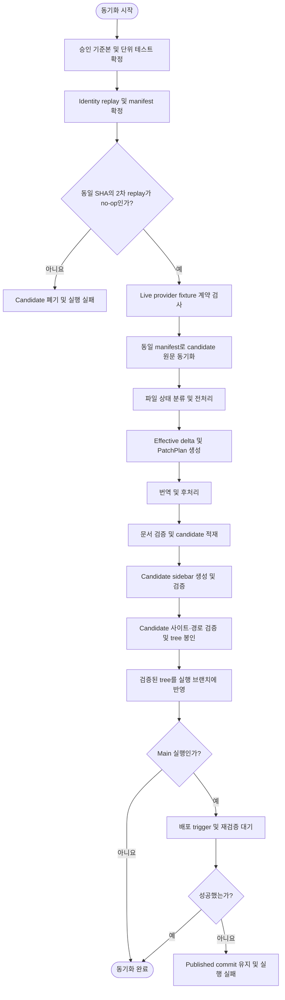

# 번역 동기화 워크플로우 총괄 설계

## 요약

실행 시작 시 승인 기준본 고정 및 동일한 upstream manifest 기반 replay·live provider 계약 확인.
이후 모든 산출물을 격리된 candidate snapshot에서 생성·검증.
실행 브랜치 반영 대상은 검증된 candidate tree와 정확히 같은 tree로 한정.

## 흐름도



그림에서 생략한 모든 단계의 실패 경로는 candidate 폐기와 실행 실패로 수렴.
후속 단계 진행 금지.

## 1. 목적

번역 동기화 워크플로우의 전체 단계 순서, 실패 시 회귀 경로, git 반영 조건에 대한 규범적 정의.

## 2. 범위

이 문서의 소유 범위는 다음 항목으로 한정.

- 동기화 단계의 실행 순서와 의존 관계
- 실패 시 회귀 단계의 결정 규칙
- 산출물의 git 반영 조건

단계별 세부 설계의 소유 문서는 각 단계 문서.

| 순서 | 단계 | 기준 문서 |
|---:|------|----------|
| 0 | 승인 기준본 고정·원문 동기화·파일 상태 분류 | 이 문서의 실행 상태 모델 |
| 1 | 전처리 | [01-preprocessing.md](01-preprocessing.md) |
| 2 | effective delta·변경 계획·번역 | [02-translation.md](02-translation.md) |
| 3 | 후처리 | [03-postprocessing.md](03-postprocessing.md) |
| 4 | 문서 검증 | [04-verification.md](04-verification.md) |
| 5 | 사이드바 갱신·검증 | [06-sidebar-sync.md](06-sidebar-sync.md) |
| 6 | 사이트·산출 경로 검증 | [05-additional-work.md](05-additional-work.md) |
| 7 | git 반영 | [05-additional-work.md](05-additional-work.md) |

오류 분류와 복구 정책의 소유 문서는 [08-error-cases.md](08-error-cases.md).

## 3. 입력

| 항목 | 설명 |
|------|------|
| upstream 원문 저장소 | 버전별 영어 Markdown 원문 |
| upstream manifest | 버전별 commit SHA를 기록한 JSON |
| 기존 locale 문서 | 한국어·일본어 번역 문서 |
| 승인 기준본 | clean publication checkout의 실행 시작 `HEAD` tree와 원격 branch ref |
| `versions.json` | 처리 대상 버전 목록 |
| `documentation.md` | 버전별 사이드바 기준 원문 |
| 번역 프롬프트 | locale별 번역 지침 |
| workflow 설정 | shell 문자열이 아닌 `unit_test_command` argv 배열, provider request budget과 양의 정수 `workflow_timeout_seconds` |
| stale-link registry | version-controlled `translation-sync/stale-links.json` |
| VERSION / DOC selector | 선택적 처리 범위를 canonical 상대 경로와 version 값으로 정규화한 selector |

## 4. 출력

| 항목 | 설명 |
|------|------|
| 갱신된 영어 원문 캐시 | manifest SHA 기준으로 동기화된 원문 |
| 갱신된 locale 문서 | 변경 diff가 반영된 한국어·일본어 문서 |
| 갱신된 사이드바 JSON | `documentation.md` 기준으로 재생성된 sidebar |
| 검증된 candidate tree | 모든 검증을 통과한 파일 집합과 tree 식별자 |
| 실행 브랜치 커밋 | 모든 검증을 통과한 변경분 |
| 배포 결과 | `main` 실행의 trigger와 배포 측 재검증 결과 |

## 5. 불변 조건

1. 정해진 단계 순서 준수 필수. 순서 생략 또는 역행 금지.
2. 한 target의 실패는 현재 단계의 실패로 처리. 실패 단계의 후속 단계 실행 금지.
3. candidate snapshot과 active worktree의 분리 필수. 최종 publication 전 실행 브랜치의 파일·index·HEAD 변경 금지.
4. 이전 영어 원문은 승인 기준본에서만 읽기 허용. 현재 raw 영어 원문은 manifest SHA로 동기화한 candidate에서만 읽기 허용.
5. 같은 워크플로우 실행의 replay와 live 실행에는 동일한 upstream manifest SHA 및 정규화된 VERSION / DOC selector 사용 필수.
6. 검증된 candidate tree와 다른 tree의 commit 또는 push 금지.
7. 실패한 candidate의 publication 금지. 원인 수정 후 새 승인 기준본 고정 및 전체 워크플로우 재실행 필수.
8. publication 가능한 live 실행은 시작 시 tracked worktree·index와 `HEAD`의 일치 및 동기화 소유 경로 내 non-ignored untracked 파일의 부재 필수. dirty worktree 검증은 격리 replay에만 허용.
9. entrypoint 시작부터 배포 trigger 결과까지의 wall-clock은 `workflow_timeout_seconds` 이내로 제한. 각 subprocess를 남은 전체 예산보다 긴 timeout으로 시작하는 행위 금지.

## 6. 단계 순서

```text
승인 기준본·단위 테스트 확정 → identity replay·upstream SHA manifest 확정 → 같은 SHA의 2차 replay(새 프로세스 수렴 확인) → live provider fixture 계약 검사 → 동일 manifest로 candidate 원문 동기화 → 파일 상태 분류 → 이전·현재 원문 전처리 → effective delta·변경 계획 생성 → 소유 단위 번역·후처리 → locale 문서 검증 및 candidate 적재 → candidate sidebar 생성·검증 → candidate 사이트·산출 경로 검증 → candidate tree 봉인 → 실행 브랜치 반영 → main이면 배포 trigger·재검증 결과 대기
```

`단위 테스트 확정`은 workflow 설정의 `unit_test_command` argv를 shell interpolation 없이 승인 기준본에서 분기한 격리 checkout의 저장소 root에서 실행하여 종료 코드 `0` 및 실행 전후 tracked source fingerprint 일치를 확인하는 절차.
명령 부재·빈 argv·source 변경 시 설정 오류로 실패.
명령 비정상 종료 시 검증 오류로 실패.

`candidate sync core`는 고정 manifest 원문 동기화부터 파일 상태 분류, 전처리, 계획·번역·후처리, 문서·sidebar·사이트·산출 경로 검증과 tree 봉인까지의 공통 내부 실행.
외부 orchestration의 승인 기준본·단위 테스트 확정, identity replay 호출, live fixture, 원격 publication과 배포 trigger는 범위에서 제외.
Replay와 live는 provider profile만 달리하여 동일 core 호출 필수.

전체 workflow deadline은 entrypoint 진입 시 단조 시계로 계산.
deadline 경과 후 새 단계·provider 호출·publication 시작 금지.
실행 중 subprocess에는 남은 시간 기준 강제 timeout 설정 필수.
publication 뒤 deadline 초과 시 이미 공개된 commit은 되돌리지 않고 실패 보고서만 기록.

### 6.1 실행 상태 모델

| 상태 | 의미 |
|------|------|
| 승인 기준본 | candidate sync core의 clean 시작 `HEAD`와 tree. Live는 원격 실행 branch ref도 포함하고, replay는 원격 ref를 적용하지 않음 |
| 이전 영어 원문 | 승인 기준본의 영어 원문 캐시 byte. delta의 old side |
| 현재 raw 영어 원문 | manifest commit에서 읽어 candidate에 저장할 upstream byte. delta의 new side이자 publication 대상 |
| 정규화된 영어 작업 사본 | 이전·현재 raw 원문에 전처리를 적용한 임시 비교 입력. publication 대상이 아님 |
| 영어 verification view | 현재 raw 원문에 결정적 source-side 후처리를 적용한 최종 구조 검증 기준. pipeline annotation과 locale 번역문은 포함하지 않음 |
| expected annotation map | 현재 정규화 영어 작업 사본에서 구조 주소별 canonical pipeline annotation을 파생한 검증 기준 |
| candidate snapshot | 승인 기준본에서 분기하여 원문·locale·sidebar 변경을 누적하는 격리 snapshot |
| verified tree | 문서·sidebar·사이트·산출 경로 검증을 모두 통과하여 식별자가 봉인된 candidate tree |
| published tree | verified tree와 동일함이 확인된 실행 브랜치 commit tree |

`기록` 또는 `적재`는 candidate snapshot 갱신을 의미.
실행 브랜치와 원격 저장소 변경은 `publication` 또는 `반영`에서만 허용.

### 6.2 원문 동기화와 파일 상태

manifest 기준 현재 원문과 승인 기준본의 영어 원문 캐시를 경로별로 비교하여 다음과 같이 처리.

| 상태 | 처리 |
|------|------|
| 추가 (`A`) | 이전 원문과 locale 파일의 부재 필수. 현재 원문 전체를 create 계획으로 번역하여 KO·JA 문서 생성. |
| 수정 (`M`) | 승인 기준본의 이전 원문과 기존 KO·JA 문서 모두 존재 필수. 이전·현재 원문으로 effective delta 계산. |
| 삭제 (`D`) | 승인 기준본의 영어·KO·JA 파일 모두 존재 필수. provider 호출 없이 candidate에서 세 파일 삭제. |
| rename | 삭제와 추가의 조합으로 처리. 추가 경로에서는 전체 문서 번역 수행 필수 및 기존 locale 번역의 추정 재사용 금지. |

원문 정규화 결과로 effective delta가 비어 있어도 현재 raw 영어 원문의 갱신은 candidate에 유지.
이 경우 locale byte 변경 여부와 관계없이 영어 verification view와 expected annotation map 기준의 전체 문서 검증 통과 필수.

### 6.3 Candidate publication

1. 각 locale 문서의 candidate snapshot 적재는 문서 검증 통과 후에만 허용.
2. sidebar는 모든 대상 버전의 candidate 산출 검증 완료 후 candidate snapshot에 일괄 1회 적재.
3. 완성된 candidate snapshot을 [전체 운영 및 산출 검증 단계](05-additional-work.md)에 전달.
4. 해당 단계에서 verified tree 식별자와 publication 성공을 함께 반환한 경우에만 원격 반영 완료로 판정.
5. 검증 또는 publication 실패 결과를 받은 candidate의 원격 branch 반영 금지.

## 7. 회귀 규칙

실패 시 자동 회귀 루프 수행 금지.
아래 표는 원인 수정 및 재검증을 담당하는 소유 단계를 표시.
candidate publication 금지 및 수정 후 새 실행은 승인 기준본 고정 단계부터 재시작 필수.

| 실패 발생 단계 | 실패 원인 | 수정·재검증 소유 단계 |
|---------------|-----------|----------------------|
| 검증 | 전처리 누락 | 전처리 |
| 검증 | 구조 손상 응답·번역 누락 | 번역 |
| 검증 | 후처리 형식 오류 | 후처리 |
| 검증 | 사이드바 항목 누락·라벨 불일치·locale sidebar JSON 잔존 | 사이드바 갱신 |
| 최종 산출 | 산출 기준 미달 | 검증 |
| 배포 | trigger 또는 배포 측 재검증 실패 | 전체 운영 및 산출 검증 |
| publication 후 운영 검토 | published 문서의 의미 오류·누락 등 콘텐츠 결함 | 전체 운영 및 산출 검증의 publication 후 콘텐츠 복구 |

회귀 원칙:

- 동일 실행 내 재시도는 provider transport와 response feedback에만 허용.
- 그 밖의 publication 전 실패 시 candidate 반영 없이 실행 종료.
- 배포 단계 실패 시 published commit 유지 및 해당 commit을 새 승인 기준본으로 삼은 no-change 전체 실행에서 배포 경로 재수행.
- published tree 자체에 콘텐츠 결함이 있으면 같은 commit의 배포 재시도 금지. [05-additional-work.md](05-additional-work.md)의 publication 후 콘텐츠 복구 절차에 따라 검증된 revert commit 우선 publication.
- 원인 수정 후 전체 워크플로우 신규 실행 필수. 고정 입력과 다른 실행의 중간 산출물 혼합 금지.

### 7.1 provider 재시도 경계

동일 블록의 provider 응답 평가는 최초 요청을 포함하여 최대 2회까지 허용.
각 평가의 transport 호출은 일시 오류에 한해 최대 3회까지 허용.
블록당 물리 provider 호출 상한은 6회.

## 8. git 반영 조건

git publication 규칙의 유일한 소유 위치는 [05-additional-work.md](05-additional-work.md)의 `git 반영 세부 규칙`.
총괄 단계는 해당 문서가 반환한 verified tree 식별자와 publication 결과만 소비하며 별도 반영 규칙은 정의 대상에서 제외.

## 9. 수용 기준

- 모든 단계의 정의된 순서 준수를 확인할 수 있어야 함.
- 실패 시 정확한 회귀 대상 단계를 식별할 수 있어야 함.
- [05-additional-work.md](05-additional-work.md)의 publication 수용 기준을 만족하지 않는 원격 branch 갱신 금지.
- replay 결과의 manifest digest·정규화 selector와 후속 live core 입력의 일치 필수.
- 추가·수정·삭제·rename의 입력 전제와 candidate 산출 상태를 경로별로 판정할 수 있어야 함.
- 승인 기준본, verified candidate tree, publication commit tree의 식별자를 대조할 수 있어야 함.
- 모든 단계와 배포 결과가 하나의 `workflow_timeout_seconds` deadline을 공유해야 함.
- `main` 실행은 배포 trigger와 배포 측 재검증 결과가 모두 성공한 경우에만 완료로 판정.
