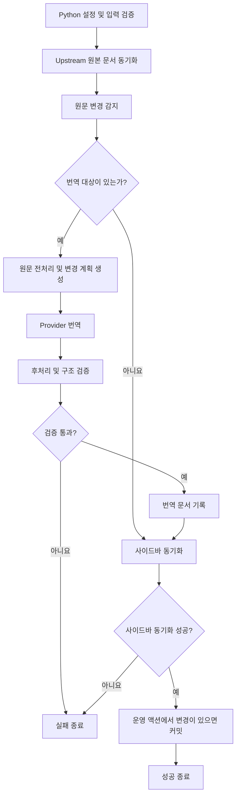

# 번역 동기화 워크플로우 총괄 설계

## 요약

이 워크플로우가 하는 일은 세 가지뿐이다.

1. upstream 저장소에서 원본 문서를 가져와 영어 원문 캐시를 동기화한다.
2. 변경된 문서를 Python과 번역 provider로 번역하고 검증된 결과를 작업 트리에 기록한다.
3. 운영 액션에 한해, 기록된 문서를 실행 branch에 커밋한다.

Python 진입점은 커밋하지 않는다. 커밋은 액션의 마지막 단계가 수행하며, Python 실행이 실패하면 그 단계는 실행되지 않는다.
PR 생성, 사이트 빌드, Node 설치와 배포는 이 워크플로우의 책임이 아니다.

## 흐름도



## 1. 범위

### 포함

- 버전·문서 선택자 검증
- upstream 원문 조회와 영어 원문 캐시 갱신
- 추가·수정·삭제 문서 감지
- Markdown 전처리, 변경 계획, provider 요청
- 번역 응답 후처리와 구조 검증
- KO·JA 문서 및 공통 사이드바 갱신
- 단계별 오류 코드와 종료 코드 반환
- 운영 액션에서 갱신된 문서를 실행 branch에 커밋

### 제외

- Node 또는 npm 준비와 실행
- Docusaurus 테스트·타입 검사·사이트 빌드
- PR 생성과 병합
- Pages 또는 다른 환경으로의 배포
- 별도 candidate, replay, publication 오케스트레이션
- 번역 결과 업로드를 위한 Actions artifact 생성

제외 항목은 필요한 경우 각각의 독립된 저장소 작업에서 수행한다. 유일한 후속 연계는 운영 GitHub Actions의 번역 워크플로우 완료 이벤트를 배포 워크플로우가 구독하는 경로다. 배포 워크플로우는 번역 실행이 성공했고 대상 branch가 `main`일 때만 배포한다. 이 연계 외에는 번역 워크플로우가 사이트 테스트·빌드·배포 또는 다른 작업을 직접 실행하거나 호출·대기·제어하지 않는다.

## 2. 입력과 출력

| 구분 | 내용 |
|---|---|
| 운영 Actions 필수 입력 | `OPENAI_API_KEY` |
| 범위 선택 입력 | `--version VERSION`, `--doc PATH`. 로컬 실행과 `workflow_dispatch` 테스트에서 처리 범위를 제한할 때만 사용 |
| upstream 입력 | `versions.json`의 지원 버전·순서와 코드에 정의된 upstream 저장소. 각 버전 branch는 실행 시 고정 commit으로 해석 |
| 출력 | 갱신된 영어 원문, KO·JA 번역 문서, 공통 사이드바. 운영 액션은 이 변경을 실행 branch에 커밋 |

`--doc`은 `--version`과 함께 사용한다. 선택자를 생략하면 지원하는 모든 버전을 검사한다. 선택자는 upstream·문서 번역 범위만 제한하며, 공통 sidebar 동기화는 지원하는 모든 버전을 검사한다.

### 2.1 실행 환경

실행 환경은 세 가지이며, 각 환경의 provider는 다음으로 고정한다.

| 환경 | 실행 | provider |
|---|---|---|
| 호스트 로컬 | `main.py` 직접 실행, `make translation-run` | OpenAI API 또는 OpenAI CLI |
| 호스트 로컬 + Docker | `make translate` | OpenAI API |
| GitHub Actions | 예약 실행, `workflow_dispatch` | OpenAI API |

호스트 로컬 실행은 `TRANSLATION_PROVIDER`로 둘 중 하나를 선택한다. Docker 이미지에는 CLI를 설치하지 않는다.

## 3. 실행 순서

### 3.1 원문 동기화

1. 설정과 선택자를 검증한다.
2. 대상 버전의 upstream ref를 조회한다.
3. 원본 Markdown을 영어 원문 캐시에 반영한다.
4. 이전 캐시와 현재 원문을 비교해 추가(`A`)·수정(`M`)·삭제(`D`)를 결정한다.
5. 번역 제외 문서는 영어 원문만 동기화한다.

### 3.2 번역

1. 변경된 일반 문서를 KO·JA 순서로 처리한다.
2. 이전·현재 원문에 같은 전처리 규칙을 적용한다.
3. 변경 계획을 만들고 필요한 블록만 provider에 요청한다.
4. 응답 계약을 검사하고, 유효한 응답만 후처리한다.
5. 원문 대비 Markdown 구조를 검증한다.
6. 검증을 통과한 문서를 기록한다.
7. 모든 문서 처리 뒤 공통 사이드바를 동기화한다.

한 문서가 실패하면 이후 대상을 계속 처리하지 않고 실패를 반환한다. 이미 성공적으로 기록한 앞선 대상은 작업 트리에 남을 수 있으므로, 호출자는 종료 코드를 확인해야 한다.

## 4. 불변 조건

1. 원문 동기화가 성공하기 전에는 번역을 시작하지 않는다.
2. 변경되지 않은 문서는 provider에 보내지 않는다.
3. 코드 블록, 링크, 인라인 코드, 제목, 목록, 표와 source-authored 주석의 구조를 보존한다.
4. provider 응답은 response contract와 문서 검증을 통과해야만 기록한다.
5. 삭제된 일반 문서는 영어·KO·JA에서 함께 제거한다.
6. 번역 제외 문서는 KO·JA를 새로 생성하거나 수정하지 않는다.
7. Python 진입점은 현재 프로젝트 저장소의 `HEAD`, index, branch, remote를 변경하지 않는다. upstream 원문 조회와 fetch만 수행한다. 실행 branch 갱신은 운영 액션의 커밋 단계에서만 일어나고, 배포 상태는 어느 쪽도 변경하지 않는다.
8. 번역 워크플로우는 Node 실행 환경에 의존하지 않는다.

## 5. 실행 진입점

모든 실행은 `translation-sync/main.py`의 단일 파이프라인을 사용한다. 운영 Actions와 호스트 로컬 직접 실행은 Python 진입점을 호출하고, Makefile과 Docker는 같은 호출을 단순히 감싼다. 별도의 Makefile·Docker 동기화 로직은 없다.

```bash
uv run --directory translation-sync --locked --python 3.14 python main.py
```

필터 예시는 다음과 같다.

```bash
uv run --directory translation-sync --locked --python 3.14 \
  python main.py --version 13.x --doc collections.md
```

운영 액션은 branch ref 검증, checkout, uv/Python 준비, Python 단위 테스트, 위 명령 실행, 변경 문서 커밋으로 끝난다.

예약 실행은 운영 동기화에 사용한다. `workflow_dispatch`는 같은 Actions 경로를 수동으로 시험하는 트리거이며, 선택 입력은 시험 범위를 제한할 뿐 실행 단계나 provider를 바꾸지 않는다. 두 트리거 모두 OpenAI API를 사용한다.

호스트 로컬 실행에서는 `make translation-run`이 위 Python 명령에 선택자를 전달한다. `make translate`는 Docker 안에서 같은 Python 진입점을 실행해 번역 결과를 현재 작업 트리에 기록하는 로컬 테스트 명령이다. 두 Make target은 별도 오케스트레이션 단계를 추가하지 않는다.

## 6. 단계 문서

| 단계 | 문서 |
|---|---|
| 전처리 | [01-preprocessing.md](01-preprocessing.md) |
| 번역 및 응답 계약 | [02-translation.md](02-translation.md) |
| 후처리 | [03-postprocessing.md](03-postprocessing.md) |
| 문서 검증 | [04-verification.md](04-verification.md) |
| 실행 경계 | [05-additional-work.md](05-additional-work.md) |
| 사이드바 동기화 | [06-sidebar-sync.md](06-sidebar-sync.md) |
| 로컬 실행 | [07-local-replay.md](07-local-replay.md) |
| 오류와 종료 코드 | [08-error-cases.md](08-error-cases.md) |

## 7. 수용 기준

- 액션, 호스트 로컬 명령과 Docker 테스트가 같은 Python 진입점을 사용한다.
- 운영 Actions의 provider는 OpenAI API로 고정하고, 호스트 로컬 실행에서만 환경 변수로 OpenAI API 또는 OpenAI CLI를 선택한다.
- Makefile target은 Python 또는 Docker 실행과 선택자 전달만 담당하며 별도 동기화 단계를 만들지 않는다.
- 액션에 Node setup, npm 명령, PR 생성, 배포 단계가 없다.
- 액션의 Git 자격 증명은 커밋 단계에만 주입한다. checkout은 자격 증명을 남기지 않는다.
- 액션은 branch ref로만 실행한다.
- 원문 변경이 없으면 provider를 호출하지 않고 사이드바를 동기화한 뒤 그 결과를 반환한다. 작업 트리에 변경이 없으면 커밋하지 않는다.
- 원문 변경이 있으면 대상 번역과 검증, 문서·사이드바 기록, 액션의 커밋까지만 수행한다.
- 테스트 또는 실행이 실패하면 호출자가 그 실패를 보존한다. 정확한 `0`·`1`·`2` 구분은 [진입점 종료 코드 계약](08-error-cases.md#7-진입점-종료-코드-계약)을 따른다.
