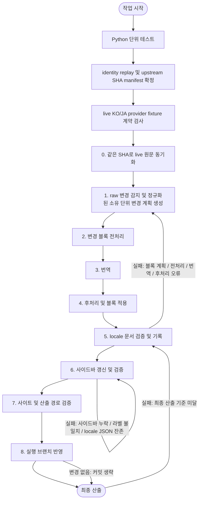

# 번역 동기화 작업 흐름 요약

이 문서는 `translation-sync` 디렉터리의 원문 동기화, 변경 계획, 번역, 검증, 실행 브랜치 반영 순서를 요약한다.

아래 Mermaid 다이어그램은 단계별 작업 흐름과 실패 시 되돌아갈 단계를 나타낸다.



---

## 1. 기준 작업 순서

번역 동기화 작업은 다음 순서로 진행한다.

```text
Python 단위 테스트 -> identity replay/upstream SHA manifest 확정 -> live KO/JA provider fixture 계약 검사 -> 같은 SHA로 live 원문 동기화 -> raw 변경 감지 -> 정규화된 PatchPlan -> 변경 소유 단위 전처리/번역/후처리 -> locale 문서 검증/기록 -> 사이드바 갱신/검증 -> 사이트/산출 경로 검증 -> 실행 브랜치 반영
```

각 단계는 독립 문서로 분리되어 있으며, 단계별 문서의 책임은 다음과 같다.

| 순서 | 단계      | 기준 문서                                          | 보조 문서                    | 핵심 책임                                                |
|---:|---------|------------------------------------------------|--------------------------|------------------------------------------------------|
|  0 | 원문/변경 계획 | [02-translation.md](02-translation.md)       | [07-local-replay.md](07-local-replay.md) | 실행 중 사용할 upstream SHA를 확정하고 raw `SourceChange`를 정규화된 번역 소유 단위 변경 계획으로 만든다. |
|  1 | 전처리     | [01-preprocessing.md](01-preprocessing.md)   | -                        | 번역 전에 코드, base64 이미지, 스타일 클래스를 안정화한다.                |
|  2 | 번역      | [02-translation.md](02-translation.md)       | [prompt.md](../prompt.md) | diff가 선택한 번역 소유 단위만 대상 locale 문서에 반영한다.                  |
|  3 | 후처리     | [03-postprocessing.md](03-postprocessing.md) | -                        | 번역 완료 블록의 Markdown/HTML 형식과 플레이스홀더를 최종화한다.           |
|  4 | 문서 검증   | [04-verification.md](04-verification.md)     | -                        | 블록 적용 후 링크, 앵커, 코드, 원문 주석 등 자동 판정 가능한 구조를 검증한다. |
|  5 | 사이드바 갱신 | [06-sidebar-sync.md](06-sidebar-sync.md)     | -                        | `documentation.md`를 기준으로 버전별 sidebar JSON을 갱신하고 자체 정합성을 검증한다. |
|  6 | 최종 산출 검증 | [05-additional-work.md](05-additional-work.md) | -                   | 사이트 빌드·KO/JA inline Markdown fragment target과 허용된 번역 산출 경로만 변경됐는지 확인한다. |
|  7 | git 반영  | [05-additional-work.md](05-additional-work.md) | -                      | 검증을 통과한 변경분을 실행 브랜치에 커밋한다. 변경이 없으면 커밋하지 않는다. |

[08-error-cases.md](08-error-cases.md)는 리팩터링 전에 수집한 실패 사례를 보존한 역사 기록이며 현재 운영 사양이 아니다.

### 1.1 실패 시 회귀 단계

검증과 최종 산출 단계에서 기준을 만족하지 못하면, 실패 원인에 따라 다음 단계로 되돌아간다.

여기서 "되돌아간다"는 workflow 내부에서 자동으로 이전 단계를 반복한다는 뜻이 아니다. 실패 원인을 수정한 뒤 해당 단계부터 workflow를 다시 실행하는 운영 절차를 뜻한다. 단, provider 응답 계약 위반은 완료 응답을 최초 포함 최대 2회 검사한다. 각 완료 응답을 얻는 transport 호출은 일시 오류에 한해 최대 3회 시도하므로, 두 경계가 모두 소진되면 물리 provider 호출은 블록당 최대 6회다.

| 실패 발생 단계 | 실패 원인                       | 되돌아갈 단계 |
|----------|-----------------------------|---------|
| 검증       | 전처리 누락                      | 전처리     |
| 검증 또는 품질 확인 | 구조가 손상된 응답 / 번역 누락 / 의미 불일치 | 번역      |
| 검증       | 후처리 형식 오류                   | 후처리     |
| 검증       | 사이드바 항목 누락 / 라벨 불일치 / locale sidebar JSON 잔존 | 사이드바 갱신 |
| 최종 산출    | 최종 산출 기준 미달                 | 검증      |

회귀 원칙:

- 회귀한 단계에서 원인을 해소한 뒤, 후속 단계를 다시 순서대로 진행한다.
- 번역으로 되돌아간 경우, 해당 chunk를 재처리한 뒤 후처리와 검증을 다시 실행한다.
- 회귀 중에는 원인과 무관한 단계의 산출물을 임의로 변경하지 않는다.

### 1.2 git 반영 기준

- 문서·사이드바·사이트·산출 경로 검증이 모두 통과할 때만 커밋하고, 실패하면 어떤 변경도 커밋하지 않는다.
- 반영할 변경분이 없으면 빈 커밋을 만들지 않고 종료한다.
- 변경분은 workflow를 실행한 브랜치에 커밋한다. `main` 실행 결과만 배포를 트리거한다. 세부 기준은 [05-additional-work.md](05-additional-work.md)의 git 반영 기준을 따른다.
- 영어 원문 캐시, locale 문서와 sidebar 파일은 같은 디렉터리의 임시 파일을 flush·`fsync`한 뒤 `os.replace`로 공개하고 부모 디렉터리도 `fsync`한다. 기존 mode를 보존하고 기존 hardlink inode를 직접 truncate하지 않지만, 삭제 산출물과 여러 파일을 하나로 묶는 transaction은 아니다.
- 관리 경로의 lexical·resolve·symlink 검사는 publication 전에 수행하는 pathname 검사다. 같은 저장소 경로를 다른 로컬 프로세스가 동시에 symlink로 교체하지 않는 단일 writer 환경을 전제로 하며, root directory descriptor에 고정한 mutation 경계는 현재 없다.
- 로컬 live 실행은 target별 파일을 즉시 기록하므로 뒤 target이 실패해도 앞서 기록한 worktree 변경을 자동 rollback하지 않는다. workflow는 실패 시 commit/push를 생략하지만 run 단위 rollback을 제공하지는 않는다.

---

## 2. 프로젝트 기술 기준

현재 작업 기준은 다음과 같다.

| 구분             | 기준                      | 적용 방식                                                              |
|----------------|-------------------------|--------------------------------------------------------------------|
| 번역 자동화 실행 환경   | Python 3.14             | 번역 자동화 스크립트와 Docker 실행 환경을 Python 3.14 기준으로 맞춘다.                   |
| Python 의존성 관리자 | `uv`                    | 고정한 uv 버전과 `uv sync --locked`로 lockfile 최신성을 확인한 뒤 실행한다. |
| 번역 실행 명령       | `make translation-run` | Action과 로컬에서 같은 Python/lockfile 조건으로 live provider를 실행한다.                  |
| 운영 번역 provider | `openai` 또는 `azure`     | API 키, endpoint, API version, 모델명과 reasoning effort를 환경 변수로 주입한다.                    |
| 로컬 번역 provider | `cli`                   | 비번역 도구와 web search를 끄고 환경 변수를 allowlist로 제한한 Codex prompt mode의 final-message 파일만 읽는다. |
| live 응답 검사 | `make translation-provider-check` | 고정 fixture로 순수 Markdown, 목표 언어, 구조 verifier 계약을 확인한다. |
| 로컬 번역 preflight | `make translation-check` | Python 단위 테스트 뒤 격리 replay를 실행한다.                                          |
| 로컬 구조 replay | `identity`               | `make translation-replay`가 격리 환경에서만 설정하며 소유 단위 적용, 검증, 새 프로세스 수렴을 확인한다. |
| 로컬 전체 검증 | `make preflight`           | 번역 preflight와 배포용 `site-check`를 모두 실행한다.                                  |

### 2.1 Python 버전

번역 자동화에 사용할 Python 버전은 `3.14`다.

적용 기준:

- Python 실행 환경은 `3.14`로 고정한다.
- Docker 기반 번역 실행 환경도 Python 3.14 계열 이미지로 맞춘다.
- `uv`가 생성하는 가상환경도 Python 3.14를 사용해야 한다.
- Python 3.14 환경이 준비되지 않으면 번역 자동화 실행 전에 실행 환경부터 맞춘다.

### 2.2 번역 실행 방식

로컬에서 실제 번역 결과를 점검할 때는 CLI provider 방식을 사용한다.

```dotenv
TRANSLATION_PROVIDER=cli
TRANSLATION_CLI_COMMAND="codex exec"
TRANSLATION_MODEL=gpt-5.6-luna
TRANSLATION_REASONING_EFFORT=medium
TRANSLATION_CLI_TIMEOUT=1800
```

위 `dotenv` 블록은 필요한 값을 나타낸다. shell에서 직접 실행할 때는 각 값을 `export`하거나 같은 값을 실제 process environment에 로드해야 하며, 동기화 명령이 저장소의 `.env`를 자동으로 읽지는 않는다.

운영 provider는 다음 중 하나를 사용한다.

```dotenv
TRANSLATION_PROVIDER=openai
TRANSLATION_MODEL=gpt-5.6-luna
TRANSLATION_REASONING_EFFORT=medium
OPENAI_API_KEY=...
```

```dotenv
TRANSLATION_PROVIDER=azure
TRANSLATION_MODEL=<Azure deployment name>
TRANSLATION_REASONING_EFFORT=medium
AZURE_OPENAI_API_KEY=...
AZURE_OPENAI_API_VERSION=your_deployment_api_version
AZURE_OPENAI_ENDPOINT=https://your-endpoint.openai.azure.com/
```

OpenAI adapter는 reasoning 모델에 권장되는 Responses API를 사용하고 `store=false`, `status=completed`, `output_text` 계약을 적용한다. Azure adapter는 배포 API 호환성을 위해 Chat Completions를 사용하되 `finish_reason=stop`인 응답만 Markdown 문자열로 정규화한다. CLI adapter는 저장소 밖 임시 디렉터리에서 사용자 설정, execpolicy rules와 `AGENTS.md`를 제외한 Codex prompt mode를 실행한다. browser, computer, image generation, plugin, app, shell, subagent, web search 기능을 끄고, Codex child에는 인증·런타임·proxy/CA allowlist 환경 변수만 전달하며, 모델이 실행하는 subprocess 환경 상속은 `none`으로 설정한다. 일반 stdout이 아니라 `--output-last-message` 파일만 결과로 사용한다. 현재 검증된 CLI 플래그 호환 기준은 `codex-cli 0.145.0`다. API와 CLI는 모델·reasoning을 같게 맞춰도 서로 다른 요청 표면이므로 문구·token·latency가 같다고 가정하지 않고 각각 live 계약을 확인한다. 세 adapter 모두 호출자에게는 완료된 번역 Markdown 문자열만 반환한다.

live provider를 사용하기 전에 문서를 수정하지 않는 fixture 검사를 실행한다. 동기화 workflow도 본 번역 전에 KO/JA를 모두 이 게이트로 확인한다.

```bash
make translation-provider-check
make translation-provider-check LOCALE=ja
```

API 키 없이 Action의 번역 사전 검증을 실행할 때는 identity provider를 직접 설정하지 않고 공통 preflight 명령을 사용한다.

```bash
make translation-check
make translation-check VERSION=13.x DOC=collections.md
```

`VERSION`과 `DOC`은 독립적인 selector다. `VERSION`만 지정하면 해당 버전의 모든 문서를, `DOC`만 지정하면 모든 지원 버전의 같은 basename을, 둘 다 지정하면 그 한 쌍을 대상으로 한다. `DOC`는 upstream 존재 assertion이 아니다. upstream에 없는 파일은 기존 영어 캐시에 있으면 삭제 변경으로 처리될 수 있고, 캐시에도 없으면 no-op으로 끝날 수 있으므로 필터 실행은 로그와 실제 변경 대상을 함께 확인해야 한다. 문서 필터는 sidebar 항목까지 좁히지 않는다. sidebar sync 대상으로 선택된 버전은 cached `documentation.md` 전체로 sidebar를 재생성하고 locale sidebar override를 제거한다.

`translation-check`는 Python 단위 테스트와 `translation-replay`를 순서대로 실행한다. replay는 upstream commit manifest를 만들고 같은 manifest로 두 번째 새 프로세스 실행까지 수행한다. GitHub Actions는 명시적인 `MANIFEST` 경로를 preflight와 live 실행에 함께 전달하므로 두 단계의 원문 SHA가 같다. 기본 로컬 `translation-check`와 나중의 별도 `translation-run`은 manifest를 자동 공유하지 않으므로 같은 SHA가 필요하면 두 명령에 동일한 `MANIFEST` 경로를 명시해야 한다. 자세한 범위와 제한은 [07-local-replay.md](07-local-replay.md)를 따른다.

### 2.3 문서 검증 방식

검증은 번역 문서 산출물에서 자동 판정 가능한 구조 보존 여부를 확인하는 단계다. 번역 의미와 문체는 live provider 결과의 별도 품질 범위다.

확인 기준:

- 정규화된 PatchPlan이 선택한 번역 소유 단위가 한국어와 일본어 문서의 확정된 위치에 반영되었는지 확인한다.
- 링크, 앵커, 인라인 코드, 코드 블록, 이미지 경로가 원문 기준으로 보존되었는지 확인한다.
- 문서 제목, heading, 링크 label, 사이드바 label, 앵커는 번역하지 않고 최신 영어 원문 기준으로 보존되었는지 확인한다.
- `documentation.md`의 문서 순서와 label이 `versioned_sidebars/*.json`에 반영되고, locale별 sidebar JSON이 남아 있지 않은지 확인한다.
- 전처리에서 보호한 항목과 후처리에서 복원한 항목이 최종 문서에 정상 반영되었는지 확인한다.
- 구현된 Markdown 구조와 HTML ``/`<a name>` 규칙이 깨지지 않았는지 확인한다.
- provider 실패나 자동 검증 issue가 있으면 해당 locale 문서를 기록하지 않고 실행을 실패시킨다.
- replay의 pinned source 두 번째 새 프로세스 실행이 첫 번째 결과를 변경하면 process 수렴 실패로 처리한다.

### 2.4 API / provider 예외 처리 기준

OpenAI / Azure OpenAI / CLI provider 관련 예외는 단계별 책임에 맞춰 처리한다.

| 상황                         | 발생 단계 | 재시도 여부 | 대기 시간 | 최대 시도 | 후속 조치 |
|----------------------------|---------|--------:|---------|------:|---------|
| provider 허용값 / 필수 env 오류   | 설정 확인 | 아니오     | 없음      | 0회    | 문서 전처리 전에 중단한다. |
| CLI 명령/모델/인증 등 비일시 오류 | 번역 | 아니오 | 없음 | 1회 | stderr 진단과 함께 target을 실패 처리한다. |
| API 완료 상태가 아닌 부분 응답 | 번역 | 아니오 | 없음 | 1회 | 부분 Markdown을 기록하지 않고 target을 실패 처리한다. |
| replay 밖의 identity 선택        | 설정 확인 | 아니오     | 없음      | 0회    | 설정 확인 오류로 중단한다. |
| 번역 provider 응답 없음          | 번역     | 예       | 5분      | 3회    | 3회 실패 시 해당 locale target을 실패 처리하고 기록하지 않는다. |
| 번역 요청 timeout              | 번역     | 예       | 5분      | 3회    | 동일 입력과 동일 provider 설정으로 재요청한다. |
| 번역 요청 네트워크 / 429 / 5xx 오류 | 번역     | 예       | 5분      | 3회    | 동일 입력과 동일 provider 설정으로 재요청한다. |
| 완료 응답의 구조 verifier issue | 검증 | 일부 | 없음 | 완료 응답 2회(최초 포함) | 지원되는 issue는 feedback과 함께 한 번 새 완료 응답을 요청하고, 최종 실패 시 기록하지 않는다. 각 요청의 transport 재시도는 별도로 최대 3회다. |

공통 원칙:

1. 재시도 중에는 원문 diff, 전처리 결과, 플레이스홀더 매핑, 기존 locale 문서를 변경하지 않는다.
2. 실패한 chunk를 추정 번역으로 채우지 않는다.
3. 전처리 설정 확인 오류는 번역 단계로 넘기지 않고 중단한다.
4. 번역 단계에서 최대 재시도 후에도 응답이 없으면 해당 locale target을 실패 처리한다.
5. provider 호출이 완료되지 않으면 후처리를 실행하지 않는다.
6. `verify()`는 issue label 목록을 반환하고, 전체 CLI가 이를 종료 코드로 변환한다.
