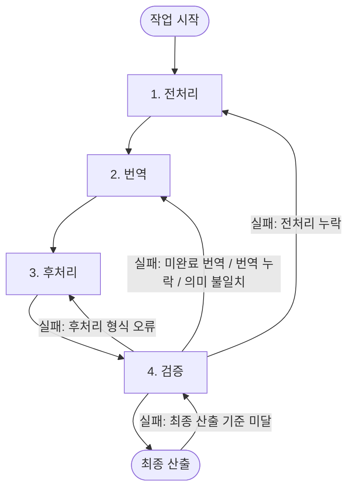

# 번역 동기화 작업 흐름 요약

이 문서는 `translation-sync` 디렉터리의 단계별 작업 문서를 전처리, 번역, 후처리, 검증 순서로 요약한다.

아래 Mermaid 다이어그램은 단계별 작업 흐름과 실패 시 되돌아갈 단계를 나타낸다.



---

## 1. 기준 작업 순서

번역 동기화 작업은 다음 순서로 진행한다.

```text
전처리 -> 번역 -> 후처리 -> 검증 -> 최종 산출
```

각 단계는 독립 문서로 분리되어 있으며, 단계별 문서의 책임은 다음과 같다.

| 순서 | 단계  | 기준 문서                                          | 보조 문서                    | 핵심 책임                                        |
|---:|-----|------------------------------------------------|--------------------------|----------------------------------------------|
|  1 | 전처리 | [01-preprocessing.md](01-preprocessing.md)   | -                        | 번역 전에 코드, base64 이미지, 스타일 클래스를 안정화한다.        |
|  2 | 번역  | [02-translation.md](02-translation.md)       | [prompt.md](../prompt.md) | 영어 diff의 변경분만 기존 한국어 문서에 반영한다.               |
|  3 | 후처리 | [03-postprocessing.md](03-postprocessing.md) | -                        | 번역 완료 문서의 Markdown/HTML 형식과 플레이스홀더를 최종화한다.   |
|  4 | 검증  | [04-verification.md](04-verification.md)     | -                        | diff 반영, 링크, 앵커, 코드, 이미지, Markdown 구조를 검증한다. |

### 1.1 실패 시 회귀 단계

검증과 최종 산출 단계에서 기준을 만족하지 못하면, 실패 원인에 따라 다음 단계로 되돌아간다.

| 실패 발생 단계 | 실패 원인                       | 되돌아갈 단계 |
|----------|-----------------------------|---------|
| 검증       | 전처리 누락                      | 전처리     |
| 검증       | 미완료 번역 / 번역 누락 / 의미 불일치     | 번역      |
| 검증       | 후처리 형식 오류                   | 후처리     |
| 최종 산출    | 최종 산출 기준 미달                 | 검증      |

회귀 원칙:

- 회귀한 단계에서 원인을 해소한 뒤, 후속 단계를 다시 순서대로 진행한다.
- 번역으로 되돌아간 경우, 해당 chunk를 재처리한 뒤 후처리와 검증을 다시 실행한다.
- 회귀 중에는 원인과 무관한 단계의 산출물을 임의로 변경하지 않는다.

---

## 2. 프로젝트 기술 기준

현재 작업 기준은 다음과 같다.

| 구분             | 기준                      | 적용 방식                                                              |
|----------------|-------------------------|--------------------------------------------------------------------|
| 번역 자동화 실행 환경   | Python 3.14             | 번역 자동화 스크립트와 Docker 실행 환경을 Python 3.14 기준으로 맞춘다.                   |
| Python 의존성 관리자 | `uv`                    | `uv sync --frozen` 후 실행한다.                                         |
| 번역 실행 명령       | `uv run python main.py` | 자동화 구현체가 있는 위치에서 실행한다.                                             |
| 운영 번역 provider | `openai` 또는 `azure`     | API 키, endpoint, API version, 모델명을 환경 변수로 주입한다.                    |
| 로컬 점검 provider | `cli`                   | `TRANSLATION_CLI_COMMAND`가 표준 입력을 받아 번역 Markdown만 표준 출력으로 반환해야 한다. |

### 2.1 Python 버전

번역 자동화에 사용할 Python 버전은 `3.14`다.

적용 기준:

- Python 실행 환경은 `3.14`로 고정한다.
- Docker 기반 번역 실행 환경도 Python 3.14 계열 이미지로 맞춘다.
- `uv`가 생성하는 가상환경도 Python 3.14를 사용해야 한다.
- Python 3.14 환경이 준비되지 않으면 번역 자동화 실행 전에 실행 환경부터 맞춘다.

### 2.2 번역 실행 방식

로컬에서 API 키 없이 번역 스크립트를 점검할 때는 CLI provider 방식을 사용한다.

```dotenv
TRANSLATION_PROVIDER=cli
TRANSLATION_CLI_COMMAND="codex exec --sandbox read-only --skip-git-repo-check -"
TRANSLATION_CLI_TIMEOUT=1800
```

운영 provider는 다음 중 하나를 사용한다.

```dotenv
TRANSLATION_PROVIDER=openai
TRANSLATION_MODEL=gpt-5
OPENAI_API_KEY=...
```

```dotenv
TRANSLATION_PROVIDER=azure
TRANSLATION_MODEL=gpt-5
AZURE_OPENAI_API_KEY=...
AZURE_OPENAI_API_VERSION=2025-05-01-preview
AZURE_OPENAI_ENDPOINT=https://your-endpoint.openai.azure.com/
```

### 2.3 문서 검증 방식

검증은 번역 문서 산출물의 정확성과 구조 보존 여부를 확인하는 단계다.

확인 기준:

- 영어 diff의 추가, 수정, 삭제 사항이 한국어 문서에 누락 없이 반영되었는지 확인한다.
- 링크, 앵커, 인라인 코드, 코드 블록, 이미지 경로가 원문 기준으로 보존되었는지 확인한다.
- 전처리에서 보호한 항목과 후처리에서 복원한 항목이 최종 문서에 정상 반영되었는지 확인한다.
- Markdown/HTML 구조가 깨지지 않았는지 확인한다.
- 미완료 번역, provider 실패 상태, 자동 판정 실패 항목이 남아 있으면 최종 산출로 넘기지 않는다.

### 2.4 API / provider 예외 처리 기준

OpenAI / Azure OpenAI / CLI provider 관련 예외는 단계별 책임에 맞춰 처리한다.

| 상황                         | 발생 단계 | 재시도 여부 | 대기 시간 | 최대 시도 | 후속 조치 |
|----------------------------|---------|--------:|---------|------:|---------|
| env 누락 또는 env 값 오류        | 전처리    | 아니오     | 없음      | 0회    | 설정 확인 오류로 중단한다. |
| provider 설정 조합 오류          | 전처리    | 아니오     | 없음      | 0회    | 설정 확인 오류로 중단한다. |
| 번역 provider 응답 없음          | 번역     | 예       | 5분      | 3회    | 3회 실패 시 해당 chunk를 미완료 상태로 둔다. |
| 번역 요청 timeout              | 번역     | 예       | 5분      | 3회    | 동일 입력과 동일 provider 설정으로 재요청한다. |
| 번역 요청 네트워크 오류             | 번역     | 예       | 5분      | 3회    | 동일 입력과 동일 provider 설정으로 재요청한다. |
| 후처리 중 provider 실패 상태 발견   | 후처리    | 아니오     | 없음      | 0회    | provider 문제를 수정하지 않고 후처리 가능한 형식 정제만 수행한다. |
| 검증 중 API 실패 / 미완료 번역 발견 | 검증     | 아니오     | 없음      | 0회    | 검증을 중단하고 `failure`를 반환한다. |

공통 원칙:

1. 재시도 중에는 원문 diff, 전처리 결과, 플레이스홀더 매핑, 기존 한국어 문서를 변경하지 않는다.
2. 실패한 chunk를 추정 번역으로 채우지 않는다.
3. 전처리 설정 확인 오류는 번역 단계로 넘기지 않고 중단한다.
4. 번역 단계에서 최대 재시도 후에도 응답이 없으면 해당 chunk를 미완료 상태로 둔다.
5. 후처리는 provider 실패 상태를 해결하지 않고 문서 형식 정제만 수행한다.
6. 검증 단계의 마지막 결과는 `success` 또는 `failure`만 반환한다.
