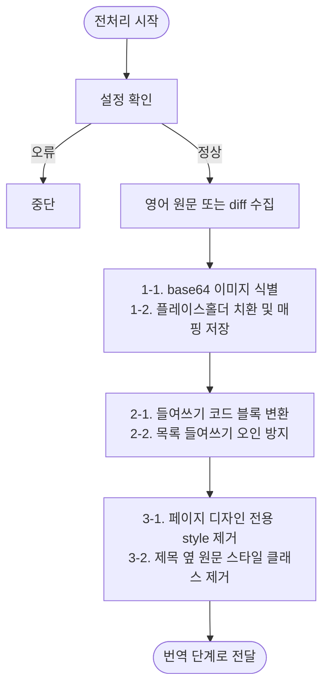

# 번역 전 전처리 계획

## 단계 흐름



---

## 1. 작업 목적

영어 기술 문서 변경분을 한국어로 번역하기 전에, 번역 대상에서 제외해야 하는 데이터와 Markdown 구조를 안정화한다.

전처리의 목표는 다음과 같다.

- base64 이미지를 번역 대상에서 제외한다.
- 들여쓰기 기반 코드 블록을 fenced code block으로 변환해 코드가 번역되지 않게 한다.
- 목록의 들여쓰기를 코드 블록으로 잘못 변환하지 않는다.
- 최종 문서에 불필요한 페이지 디자인 전용 `<style>` 태그 및 코드를 제거한다.
- 제목 옆 원문 스타일 클래스를 제거한다.
- 설정 확인 단계에서 필수 env 존재 여부, env 값 형식, provider 설정 조합을 확인한다.

---

## 2. 입력 자료

### 2.1 번역 대상 영어 문서 또는 diff

변경된 영어 원문을 파악하기 위한 자료다.

참고 항목:

- 추가된 문장
- 수정된 문장
- 삭제된 문장
- 코드 블록, 링크, 이미지, HTML 태그 등 구조 보존 요소

### 2.2 기존 한국어 문서

전처리 후 번역 결과를 기존 문서에 반영할 때 기준으로 삼는다.

참고 항목:

- 기존 용어
- 문체
- 노트/경고문 형식
- 코드 블록 처리 방식
- 링크 처리 방식
- 이미지 처리 방식
- 제목 구조

### 2.3 플레이스홀더 매핑 저장 위치

base64 이미지를 치환할 때 원본 값과 플레이스홀더의 매핑을 별도로 보관한다.

예:

```md
| Placeholder | Original |
|---|---|
| `__BASE64_IMAGE_001__` | `data:image/png;base64,...` |
| `__BASE64_IMAGE_002__` | `data:image/svg+xml;base64,...` |
```

---

## 3. 전처리 원칙

1. 문서의 의미를 바꾸지 않는다.
2. 번역 대상이 아닌 base64 이미지 데이터는 제거하지 않고 플레이스홀더로 치환한 뒤 후처리에서 복원한다.
3. 코드 블록 내부의 코드는 번역하지 않는다.
4. 코드 블록 내부의 주석도 원문 영어를 유지한다.
5. 인라인 코드는 원문과 동일하게 유지한다.
6. 링크 URL과 앵커는 변경하지 않는다.
7. 최종 문서에 불필요한 페이지 디자인 전용 스타일 코드는 제거한다.
8. 코드 예제 안의 `<style>`은 문서 내용으로 보고 유지한다.
9. 설정 확인은 env 누락, env 값 오류, provider 설정 조합 오류를 한 단계에서 확인한다.
10. 설정 확인 오류는 재시도하지 않고 전처리를 중단한다.
11. 전처리는 실제 번역 provider 호출 실패를 복구하지 않는다.

---

## 4. 전처리 순서

전처리는 다음 순서로 진행한다.

```text
1. 설정 확인
2. base64 이미지 식별 및 플레이스홀더 치환/매핑 저장
3. 들여쓰기 기반 코드 블록 변환 및 목록 들여쓰기 오인 방지
4. 페이지 디자인 전용 <style> 태그 및 제목 옆 스타일 클래스 제거
```

권장 순서:

- 설정 확인은 실제 문서 chunk 번역 전에 수행한다.
- base64 이미지 치환과 들여쓰기 기반 코드 블록 변환은 번역 전에 수행한다.
- 들여쓰기 코드 블록은 페이지 디자인 전용 `<style>` 태그 및 코드 제거보다 먼저 백틱 코드 블록으로 변환한다.
- 이렇게 하면 코드 예제 안의 `<style>`이 제거 대상이 되는 것을 피할 수 있다.
- 최종 문서에 필요한 base64 이미지는 제거하지 않고 치환/복원한다.
- 최종 문서에 불필요한 페이지 디자인 전용 코드는 제거한다.

---

## 5. base64 이미지 플레이스홀더 치환

AI 토큰 사용량을 줄이고, base64 이미지 데이터가 번역 대상에 포함되지 않도록 플레이스홀더로 치환한다.

이 항목은 최종 문서에 필요한 데이터를 삭제하는 작업이 아니다. 번역 전에 임시로 치환하고, 번역 후 원본 그대로 복원한다.

### 5.1 대상

다음과 같은 형태의 base64 이미지 데이터:

```html

```

또는 Markdown 이미지 안에 포함된 base64 데이터:

```md

```

### 5.2 처리 방식

대상 데이터 전체를 플레이스홀더로 치환한다.

예:

```md

```

치환 후:

```md

```

HTML 이미지인 경우:

```html

```

### 5.3 플레이스홀더 매핑

치환 시 반드시 원본과 플레이스홀더의 매핑을 별도로 보관한다.

```md
| Placeholder | Original |
|---|---|
| `__BASE64_IMAGE_001__` | `data:image/png;base64,...` |
| `__BASE64_IMAGE_002__` | `data:image/svg+xml;base64,...` |
```

### 5.4 복원용 데이터

후처리 단계에서 원본 데이터를 복원할 수 있도록 다음 데이터를 유지한다.

- 모든 플레이스홀더 목록
- 각 플레이스홀더의 원본 값
- 플레이스홀더가 삽입된 문서 위치
- Markdown 이미지 문법 또는 HTML 태그 형태
- 복원 시 유지해야 하는 주변 속성

---

## 6. 들여쓰기 기반 코드 블록을 백틱 코드 블록으로 변환

원문에서 들여쓰기로 작성된 코드 블록은 Markdown fenced code block 형식으로 변환한다.

### 6.1 변환 예시

변환 전:

```md
다음 명령어를 실행합니다.

    npm install
    npm run build
```

변환 후:

````md
다음 명령어를 실행합니다.

```bash
npm install
npm run build
```
````

### 6.2 언어 지정

가능하면 코드 종류에 따라 언어를 지정한다.

| 코드 유형      | 코드 블록 언어 |
|------------|----------|
| Shell 명령어  | `bash`   |
| JavaScript | `js`     |
| TypeScript | `ts`     |
| JSON       | `json`   |
| HTML       | `html`   |
| CSS        | `css`    |
| Python     | `python` |
| YAML       | `yaml`   |
| XML        | `xml`    |
| 알 수 없음     | 생략       |

언어를 확신할 수 없으면 언어 태그를 생략한다.

````md
```
unknown code
```
````

### 6.3 코드 블록 판별 기준

다음 조건을 만족하는 경우에만 코드 블록으로 변환한다.

- 4칸 이상 들여쓰기된 연속된 줄이다.
- 목록 항목의 하위 설명이 아니다.
- 코드 또는 명령어 패턴을 포함한다.
- 앞뒤 문맥상 예제 코드, 명령어, 설정값, 출력값이다.

예:

```md
다음은 설정 예시입니다.

    {
      "enabled": true,
      "timeout": 3000
    }
```

변환 후:

````md
다음은 설정 예시입니다.

```json
{
  "enabled": true,
  "timeout": 3000
}
```
````

---

## 7. 목록의 들여쓰기를 코드 블록으로 오인하지 않기

목록 내부의 들여쓰기 문장은 코드 블록으로 변환하지 않는다.

### 7.1 코드 블록으로 변환하면 안 되는 예

```md
- 첫 번째 항목
    - 하위 항목입니다.
    - 또 다른 하위 항목입니다.

1. 설정을 엽니다.
    1. 알림 메뉴를 선택합니다.
    2. 저장을 클릭합니다.
```

위 예시는 목록 구조이므로 코드 블록으로 감싸지 않는다.

### 7.2 코드 블록으로 판단하지 않는 경우

- `-`, `*`, `+`, `1.` 등 목록 marker 아래의 들여쓰기 문장
- 목록 항목의 설명 문단
- 인용문 안의 들여쓰기
- 표 정렬을 위한 공백
- 단순 줄바꿈 정렬
- 한국어 설명문이 들여쓰기된 경우

예:

```md
- 옵션을 설정합니다.
  이 옵션은 기본적으로 활성화되어 있습니다.
```

위 예시는 목록 항목의 설명 문단이므로 코드 블록으로 변환하지 않는다.

---

## 8. 페이지 디자인 전용 `<style>` 태그 및 코드 제거

최종 문서에 불필요한 페이지 디자인 전용 `<style>` 태그와 CSS 코드는 제거한다.

### 8.1 제거 대상

```html

<style>
    .collection-method {
        color: red;
    }
</style>
```

또는 페이지 디자인 전용 스타일 코드:

```html

<style type="text/css">
    ...
</style>
```

### 8.2 처리 원칙

- `<style>` 시작 태그부터 `</style>` 종료 태그까지 제거한다.
- 페이지 디자인 전용 CSS만 제거한다.
- 코드 예제 안에 포함된 CSS 샘플은 제거하지 않는다.
- fenced code block 안의 `<style>` 예시는 문서 내용으로 보고 유지한다.

### 8.3 제거 예시

제거 전:

```html

<style>
    .page-title {
        margin-top: 20px;
    }
</style>

# Getting Started
```

제거 후:

```md
# Getting Started
```

### 8.4 유지해야 하는 예시

다음처럼 코드 블록 안에 있는 `<style>`은 제거하지 않는다.

````md
```html
<style>
  body {
    color: black;
  }
</style>
```
````

---

## 9. 제목 옆 원문 스타일 클래스 제거

제목 뒤에 붙은 원문 스타일 클래스는 번역 전에 제거한다.

### 9.1 대상

```md
### `after()` {.collection-method}
```

### 9.2 결과

```md
### `after()`
```

### 9.3 추가 예시

변환 전:

```md
## Methods {.section-title}

### `before()` {.collection-method}

#### Parameters {.params}
```

변환 후:

```md
## Methods

### `before()`

#### Parameters
```

### 9.4 처리 규칙

- Markdown 제목 줄에서만 처리한다.
- 제목 텍스트는 변경하지 않는다.
- 인라인 코드, 링크, 앵커는 유지한다.
- `{.class-name}` 형식의 스타일 클래스만 제거한다.
- `` 같은 HTML 속성의 `class`는 제거하지 않는다.

### 9.5 처리 대상 패턴

```md
# Title {.class}

## Title {.class-name}

### `method()` {.collection-method}

#### Title {.a .b}
```

### 9.6 처리 제외

일반 본문에서 의미가 있는 중괄호 표현은 제거하지 않는다.

```md
Use `{ key: value }` to define an object.
```

---

## 10. 예외 케이스

전처리는 실제 문서 chunk를 번역하지 않는다. 머메이드의 설정 확인 단계에서 오류가 발견되면 전처리를 중단하고, provider 무응답이나 timeout은 번역 단계의 예외로 다룬다.

### 설정 확인 오류

다음 상태는 설정 확인 오류로 본다.

- 필수 env 값이 없음
- env 값 형식이 잘못됨
- `TRANSLATION_PROVIDER`와 provider별 필수 값 조합이 맞지 않음
- 모델명, endpoint, API version, CLI 명령 형식이 비어 있거나 허용 형식이 아님

처리 기준:

1. 재시도하지 않는다.
2. 전처리를 중단한다.
3. 원문 diff, 전처리 대상 문서, 플레이스홀더 매핑을 변경하지 않는다.

### 플레이스홀더 매핑 누락

base64 이미지를 플레이스홀더로 치환했지만 매핑을 만들 수 없는 경우, 원본 값을 임의로 재생성하지 않는다.

처리 기준:

1. 매핑을 만들 수 없으면 해당 base64 이미지를 치환하지 않는다.
2. 이미 치환한 뒤 원본 값을 찾을 수 없으면 원본 문서 기준으로 해당 위치를 복구한다.
3. 복구할 수 없는 경우에는 원문 구조를 더 바꾸지 않는다.

### 들여쓰기 코드 블록 판단이 애매한 경우

목록 들여쓰기와 코드 블록을 구분하기 어려운 경우 임의로 구조를 바꾸지 않는다.

처리 기준:

1. 원문 구조를 유지한다.
2. 코드 블록으로 확정할 수 있는 경우에만 fenced code block으로 변환한다.
3. 확정할 수 없는 들여쓰기 영역은 전처리하지 않는다.

### 페이지 디자인 전용 코드와 예시 코드가 구분되지 않는 경우

`<style>` 태그나 스타일 클래스가 문서 예시인지 페이지 디자인 전용 코드인지 명확하지 않으면 삭제하지 않는다.

처리 기준:

1. 원문 코드를 유지한다.
2. 페이지 디자인 전용 코드로 확정할 수 있는 경우에만 제거한다.
3. 예시 코드 여부가 불명확하면 전처리하지 않는다.
