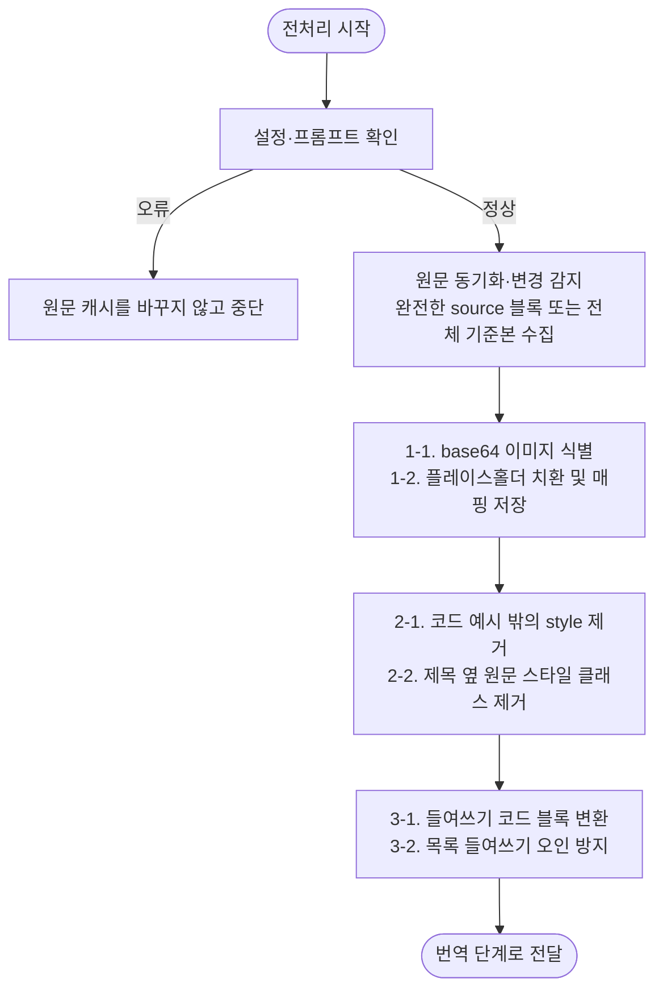

# 번역 전 전처리 계획

## 단계 흐름



---

## 1. 작업 목적

영어 기술 문서 변경분을 한국어·일본어로 번역하기 전에, 번역 대상에서 제외해야 하는 데이터와 Markdown 구조를 안정화한다.

전처리의 목표는 다음과 같다.

- base64 이미지를 번역 대상에서 제외한다.
- 들여쓰기 기반 코드 블록을 fenced code block으로 변환해 코드가 번역되지 않게 한다.
- 목록의 들여쓰기를 코드 블록으로 잘못 변환하지 않는다.
- 최종 문서에 불필요한 페이지 디자인 전용 `<style>` 태그 및 코드를 제거한다.
- 제목 옆 원문 스타일 클래스를 제거한다.
- 설정 확인 단계에서 허용 provider와 provider별 필수 env의 비어 있지 않은 값을 확인한다.

---

## 2. 입력 자료

### 2.1 번역 대상 source와 전체 기준본

raw Git 변경을 감지한 `SourceChange.hunks`와, PatchPlan 상태 서명·최종 검증에 사용할 전체 영어 문서가 입력이다. `PatchPlan`을 만들 때는 이전·현재 원문 작업 사본에 전처리와 후처리를 적용한 뒤 diff를 다시 계산하므로 `BlockChange.old_lines` / `new_lines`와 provider에 보여 주는 diff는 정규화된 effective delta다. 예를 들어 heading class만 바뀌어 두 작업 사본이 같은 결과가 되면 해당 raw delta는 번역 계획에서 사라진다.

전처리는 두 경로에 같은 규칙으로 적용한다.

- provider 입력과 블록 검증에 사용하는 완전한 `new_source`
- 복원한 이전 원문과 현재 원문 전체 문서. 두 문서는 후처리와 placeholder 복원까지 거쳐 PatchPlan의 old/new annotation 서명이 된다.

참고 항목:

- 추가된 문장
- 수정된 문장
- 삭제된 문장
- 코드 블록, 링크, 이미지, HTML 태그 등 구조 보존 요소

### 2.2 기존 locale 문서

전처리 후 번역 결과를 기존 한국어·일본어 문서에 반영할 때 기준으로 삼는다.

참고 항목:

- 기존 용어
- 문체
- 노트/경고문 형식
- 코드 블록 처리 방식
- 링크 처리 방식
- 이미지 처리 방식
- 제목 구조

### 2.3 플레이스홀더 매핑 저장 위치

base64 이미지를 치환할 때 원본 값과 플레이스홀더의 매핑을 별도로 보관한다.

예:

```md
| Placeholder | Original |
|---|---|
| `__BASE64_IMAGE_001__` | `data:image/png;base64,...` |
| `__BASE64_IMAGE_002__` | `data:image/svg+xml;base64,...` |
```

---

## 3. 전처리 원칙

1. 문서의 의미를 바꾸지 않는다.
2. 번역 대상이 아닌 base64 이미지 데이터는 제거하지 않고 플레이스홀더로 치환한 뒤 후처리에서 복원한다.
3. 코드 블록 내부의 코드는 번역하지 않는다.
4. 코드 블록 내부의 주석도 원문 영어를 유지한다.
5. 인라인 코드는 원문과 동일하게 유지한다.
6. 링크 URL과 앵커는 변경하지 않는다.
7. 최종 문서에 불필요한 페이지 디자인 전용 스타일 코드는 제거한다.
8. 코드 예제 안의 `<style>`은 문서 내용으로 보고 유지한다.
9. 설정 확인은 허용 provider, provider별 필수 env 누락, identity replay 제한을 확인한다.
10. 설정 확인 오류는 재시도하지 않고 전처리를 중단한다.
11. 전처리는 실제 번역 provider 호출 실패를 복구하지 않는다.

---

## 4. 전처리 순서

전처리는 다음 순서로 진행한다.

```text
1. provider 설정과 locale별 프롬프트 확인
2. 영어 원문 동기화, raw 변경 감지, 정규화된 PatchPlan과 완전한 source 블록/전체 기준본 구성
3. base64 이미지 식별 및 플레이스홀더 치환/매핑 저장
4. 기존 fenced/inline/들여쓰기 코드 예시를 제외한 페이지 디자인 전용 `<style>` 태그 및 제목 옆 스타일 클래스 제거
5. 들여쓰기 기반 코드 블록 변환 및 목록 들여쓰기 오인 방지
```

권장 순서:

- 설정과 프롬프트 확인은 원문 캐시를 갱신하기 전에 수행한다.
- raw Git diff는 최초 변경 선택 근거로 사용한다. PatchPlan의 block delta는 완전한 이전·현재 기준본을 같은 규칙으로 정규화한 뒤 다시 계산한다.
- base64 이미지 치환과 들여쓰기 기반 코드 블록 변환은 번역 전에 수행한다.
- 페이지 디자인용 `<style>` 안의 들여쓴 CSS를 코드 블록으로 오인하지 않도록 style 제거를 들여쓰기 변환보다 먼저 수행한다.
- 기존 fenced code, 임의 너비 backtick의 한 줄·여러 줄 inline code span, 4칸 또는 탭으로 들여쓴 `<style>` 예시는 제거 대상에서 제외한다.
- 최종 문서에 필요한 base64 이미지는 제거하지 않고 치환/복원한다.
- 최종 문서에 불필요한 페이지 디자인 전용 코드는 제거한다.

---

## 5. base64 이미지 플레이스홀더 치환

AI 토큰 사용량을 줄이고, base64 이미지 데이터가 번역 대상에 포함되지 않도록 플레이스홀더로 치환한다.

이 항목은 최종 문서에 필요한 데이터를 삭제하는 작업이 아니다. 번역 전에 임시로 치환하고, 번역 후 원본 그대로 복원한다.

### 5.1 대상

다음과 같은 형태의 base64 이미지 데이터다. media type parameter, Markdown angle-bracket destination, 따옴표 없는 HTML `src`, 입력 EOF에서 끝나는 data URL도 같은 방식으로 처리한다.

```html

```

또는 Markdown 이미지 안에 포함된 base64 데이터:

```md

```

### 5.2 처리 방식

대상 데이터 전체를 플레이스홀더로 치환한다.

예:

```md

```

치환 후:

```md

```

HTML 이미지인 경우:

```html

```

### 5.3 플레이스홀더 매핑

치환 시 반드시 원본과 플레이스홀더의 매핑을 별도로 보관한다.

```md
| Placeholder | Original |
|---|---|
| `__BASE64_IMAGE_001__` | `data:image/png;base64,...` |
| `__BASE64_IMAGE_002__` | `data:image/svg+xml;base64,...` |
```

### 5.4 복원용 데이터

후처리 단계에서 원본 데이터를 복원할 수 있도록 플레이스홀더와 원본 값의 매핑을 유지한다. 삽입 위치와 주변 Markdown/HTML 문법은 별도 메타데이터가 아니라 전처리된 문서 본문에 그대로 남는다.

`__BASE64_IMAGE_<number>__` namespace는 파이프라인 예약어다. 원문에 같은 문자열이 이미 있으면 새 placeholder는 그 번호를 건너뛰어 원문을 잘못 복원하지 않는다. fenced code 밖에 남은 literal 예약어는 최종 verifier에서 명시적으로 실패하며, fence 안의 예제 literal은 잔존 패턴 검사 대상이 아니다.

---

## 6. 들여쓰기 기반 코드 블록을 백틱 코드 블록으로 변환

원문에서 들여쓰기로 작성된 코드 블록은 Markdown fenced code block 형식으로 변환한다.

### 6.1 변환 예시

변환 전:

```md
다음 명령어를 실행합니다.

    npm install
    npm run build
```

변환 후:

````md
다음 명령어를 실행합니다.

```
npm install
npm run build
```
````

### 6.2 언어 지정

기존 fenced code block의 언어 태그는 그대로 유지한다. 들여쓰기 블록을 새 fence로 변환할 때는 내용만으로 언어를 추론하지 않고 언어 태그를 생략한다.

````md
```
unknown code
```
````

### 6.3 코드 블록 판별 기준

다음 조건을 만족하는 경우에만 코드 블록으로 변환한다.

- 4칸 이상 들여쓰기된 연속된 줄이다.
- 목록 항목의 하위 설명이 아니다.
- 구현이 인식하는 코드 또는 명령어 패턴을 포함한다.
- 내용만으로 코드임을 확정하지 못하는 prose 모양의 들여쓰기 영역은 원문 그대로 둔다.

예:

```md
다음은 설정 예시입니다.

    {
      "enabled": true,
      "timeout": 3000
    }
```

변환 후:

````md
다음은 설정 예시입니다.

```
{
  "enabled": true,
  "timeout": 3000
}
```
````

---

## 7. 목록의 들여쓰기를 코드 블록으로 오인하지 않기

목록 내부의 들여쓰기 문장은 코드 블록으로 변환하지 않는다.

### 7.1 코드 블록으로 변환하면 안 되는 예

```md
- 첫 번째 항목
    - 하위 항목입니다.
    - 또 다른 하위 항목입니다.

1. 설정을 엽니다.
    1. 알림 메뉴를 선택합니다.
    2. 저장을 클릭합니다.
```

위 예시는 목록 구조이므로 코드 블록으로 감싸지 않는다.

### 7.2 코드 블록으로 판단하지 않는 경우

- `-`, `*`, `+`, `1.`, `1)` 등 목록 marker 아래의 들여쓰기 문장
- 목록 항목의 설명 문단
- 인용문 안의 들여쓰기
- 표 정렬을 위한 공백
- 단순 줄바꿈 정렬
- 한국어 설명문이 들여쓰기된 경우

예:

```md
- 옵션을 설정합니다.
  이 옵션은 기본적으로 활성화되어 있습니다.
```

위 예시는 목록 항목의 설명 문단이므로 코드 블록으로 변환하지 않는다.

---

## 8. 페이지 디자인 전용 `<style>` 태그 및 코드 제거

최종 문서에 불필요한 페이지 디자인 전용 `<style>` 태그와 CSS 코드는 제거한다.

### 8.1 제거 대상

```html

<style>
    .collection-method {
        color: red;
    }
</style>
```

또는 페이지 디자인 전용 스타일 코드:

```html

<style type="text/css">
    ...
</style>
```

### 8.2 처리 원칙

- `<style>` 시작 태그부터 `</style>` 종료 태그까지 제거한다.
- 대응하는 `</style>`이 없으면 해당 지점부터 EOF를 삭제하지 않고 입력을 그대로 보존한다.
- 페이지 디자인 전용 CSS만 제거한다.
- 코드 예제 안에 포함된 CSS 샘플은 제거하지 않는다.
- fenced code block과 한 줄·여러 줄 inline code span 안의 `<style>` 예시는 문서 내용으로 보고 유지한다.

### 8.3 제거 예시

제거 전:

```html

<style>
    .page-title {
        margin-top: 20px;
    }
</style>

# Getting Started
```

제거 후:

```md
# Getting Started
```

### 8.4 유지해야 하는 예시

다음처럼 코드 블록 안에 있는 `<style>`은 제거하지 않는다.

````md
```html
<style>
  body {
    color: black;
  }
</style>
```
````

---

## 9. 제목 옆 원문 스타일 클래스 제거

제목 뒤에 붙은 원문 스타일 클래스는 번역 전에 제거한다.

### 9.1 대상

```md
### `after()` {.collection-method}
```

### 9.2 결과

```md
### `after()`
```

### 9.3 추가 예시

변환 전:

```md
## Methods {.section-title}

### `before()` {.collection-method}

#### Parameters {.params}
```

변환 후:

```md
## Methods

### `before()`

#### Parameters
```

### 9.4 처리 규칙

- 최대 3칸 들여쓴 Markdown 제목 줄에서만 처리한다. 4칸 이상 들여쓴 code와 HTML comment 내부는 변경하지 않는다.
- 제목 텍스트는 변경하지 않는다.
- 인라인 코드, 링크, 앵커는 유지한다.
- `{.class-name}` 형식의 스타일 클래스만 제거한다.
- `{#stable-id}`는 그대로 유지하고, `{.old #stable-id}`처럼 class와 ID가 함께 있으면 class만 제거해 `{#stable-id}`를 남긴다.
- `` 같은 HTML 속성의 `class`는 제거하지 않는다.

### 9.5 처리 대상 패턴

```md
# Title {.class}

## Title {.class-name}

### `method()` {.collection-method}

#### Title {.a .b}
```

### 9.6 처리 제외

일반 본문에서 의미가 있는 중괄호 표현은 제거하지 않는다.

```md
Use `{ key: value }` to define an object.
```

---

## 10. 예외 케이스

전처리는 실제 문서 chunk를 번역하지 않는다. 설정 또는 프롬프트 오류는 원문 동기화와 diff 수집 전에 중단하고, provider 무응답이나 timeout은 번역 단계의 예외로 다룬다.

### 설정 확인 오류

다음 상태는 설정 확인 오류로 본다.

- 필수 env 값이 없음
- `TRANSLATION_PROVIDER`가 `openai`, `azure`, `cli`, replay 전용 `identity` 중 하나가 아님
- 선택한 provider의 필수 env 값이 없거나 공백임
- `TRANSLATION_REPLAY=1`이 아닌 실행에서 `identity`를 선택함
- `TRANSLATION_RETRY_DELAY`가 0 이상의 정수가 아니거나 `TRANSLATION_CLI_TIMEOUT`이 0보다 큰 정수가 아님

endpoint URL, 모델명, reasoning effort, API version, CLI 명령 문자열의 상세 형식은 설정 로더가 검증하지 않는다. 해당 값의 유효성은 provider 호출 결과로 확인한다. 숫자 runtime option 형식 오류는 `ConfigError`로 즉시 중단한다.

처리 기준:

1. 재시도하지 않는다.
2. 전처리를 중단한다.
3. 원문 diff, 전처리 대상 문서, 플레이스홀더 매핑을 변경하지 않는다.

### 플레이스홀더 매핑 누락

base64 이미지를 플레이스홀더로 치환했지만 매핑을 만들 수 없는 경우, 원본 값을 임의로 재생성하지 않는다.

처리 기준:

1. 매핑을 만들 수 없으면 해당 base64 이미지를 치환하지 않는다.
2. 치환과 mapping 기록은 한 연산에서 함께 수행한다.
3. 후처리에 잘못된 mapping이 전달되어 이미 치환한 placeholder를 복원하지 못하면 임의로 원본을 재생성하지 않는다. placeholder를 남기고 최종 verifier가 target 기록을 거부한다.

### 들여쓰기 코드 블록 판단이 애매한 경우

목록 들여쓰기와 코드 블록을 구분하기 어려운 경우 임의로 구조를 바꾸지 않는다.

처리 기준:

1. 원문 구조를 유지한다.
2. 코드 블록으로 확정할 수 있는 경우에만 fenced code block으로 변환한다.
3. 확정할 수 없는 들여쓰기 영역은 전처리하지 않는다.

### 페이지 디자인 전용 코드와 예시 코드의 구분

fenced code, 임의 너비 backtick의 한 줄·여러 줄 inline code span, 4칸 또는 탭 들여쓰기 코드 영역의 `<style>`은 예시로 보고 유지한다. 그 밖의 완전한 `<style>...</style>` 블록은 페이지 디자인 코드로 보고 제거한다. 대응 종료 태그가 없는 `<style>`은 삭제하지 않는다. HTML comment 안의 제목 class는 닫는 delimiter가 없더라도 제거하지 않는다. 다만 HTML comment와 raw `<code>` 안의 `<style>`까지 코드 예시로 판별하는 것은 현재 parser 범위가 아니므로 그런 예시는 fenced code를 사용한다.
