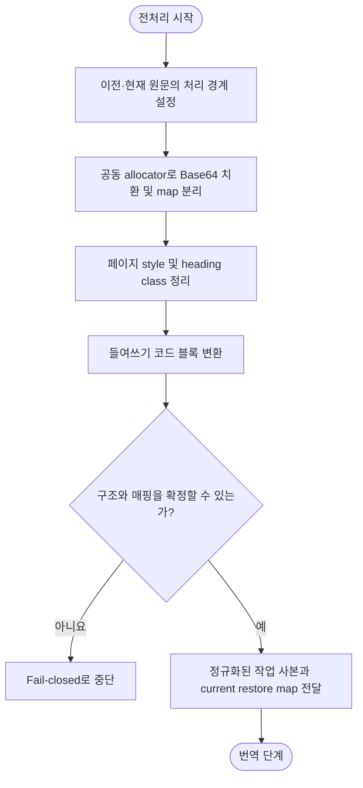

# 전처리 단계 설계

## 요약

승인 기준본의 이전 영어 원문과 candidate의 현재 raw 영어 원문에 같은 규칙을 적용한다. base64 데이터는 두 입력을 함께 보는 결정적 allocator로 치환하여, 같은 데이터는 같은 token을 사용하고 다른 데이터는 반드시 다른 token을 사용한다.

## 흐름도



## 1. 목적

영어 원문 문서의 변경분을 번역 단계에 전달하기 전에, 번역 대상에서 제외해야 하는 데이터를 보호하고 Markdown 구조를 정규화한다. 전처리는 문서의 의미를 바꾸지 않으며, 번역 품질과 구조 안정성을 위해 입력을 준비하는 단계다.

---

## 2. 범위

전처리 단계가 소유하는 책임은 다음 세 가지로 한정한다.

| 책임 | 설명 |
|------|------|
| 보호 | base64 이미지 데이터를 placeholder로 치환하여 번역 대상에서 격리한다 |
| 정규화 | 들여쓰기 기반 코드 블록을 fenced code block으로 변환하고, 페이지 디자인 전용 `<style>` 및 제목 스타일 클래스를 제거한다 |
| placeholder | 치환한 원본 값의 매핑을 생성·유지하여 후처리 복원을 보장한다 |

번역 provider 호출, 번역 결과 형식 정제, placeholder 복원은 이 단계의 책임이 아니다. 각각 [번역 단계](./02-translation.md)와 [후처리 단계](./03-postprocessing.md)를 참조한다.

---

## 3. 입력

| 입력 | 설명 |
|------|------|
| 현재 raw 영어 원문 전체 문서 | manifest commit에서 읽은 new side |
| 이전 영어 원문 전체 문서 | 승인 기준본에서 읽은 비교 기준본. 추가 문서는 빈 입력 |

설정 검증, upstream 동기화, raw 변경 감지는 전처리의 입력을 준비하는 선행 단계이며 전처리 자체의 책임이 아니다.

---

## 4. 출력

| 출력 | 설명 |
|------|------|
| 정규화된 현재 원문 작업 사본 | placeholder 치환과 구조 정규화가 완료된 문서 |
| 정규화된 이전 원문 작업 사본 | 현재 원문과 동일한 규칙으로 정규화한 이전 문서 |
| 이전 placeholder map | 이전 작업 사본에 사용한 placeholder와 원본 data URI의 대응표. diff 계산에만 사용 |
| 현재 restore map | 현재 작업 사본에 사용한 placeholder와 원본 data URI의 대응표. 후처리에 전달 |

두 작업 사본은 번역 단계에서 effective delta를 계산하는 기준이 된다. 정규화 결과가 동일한 raw 변경은 번역 계획에 포함해서는 안 된다.

---

## 5. 불변조건

1. 문서의 의미를 바꾸지 않는다.
2. fenced code block, 한 줄·여러 줄 inline code span 내부의 텍스트는 변경하지 않는다.
3. 링크 URL과 앵커는 변경하지 않는다.
4. 인라인 코드는 원문과 동일하게 유지한다.
5. `__BASE64_IMAGE_<N>__` namespace는 파이프라인 예약어다. 두 입력 중 하나에 동일 문자열이 이미 존재하면 해당 번호를 건너뛴다.
6. fenced code 밖에 남은 literal 예약어는 후처리에서 `POSTPROCESS_RESIDUE`로 차단하고 [문서 검증 단계](./04-verification.md)에서도 방어적으로 실패해야 한다. fence 안의 예제 literal은 잔존 패턴 검사 대상이 아니다.
7. 대응하는 `</style>`이 없는 `<style>`은 삭제하지 않고 입력을 그대로 보존한다.
8. `{#stable-id}`는 보존한다. `{.class #id}` 형태에서는 class만 제거하고 `{#id}`를 남긴다.
9. HTML `` 등 HTML 속성의 `class`는 제거하지 않는다.
10. 4칸 이상 들여쓰기가 목록 항목의 하위 구조인 경우 코드 블록으로 변환하지 않는다.
11. 내용만으로 코드임을 확정하지 못하는 prose 모양의 들여쓰기 영역은 원문 그대로 둔다.
12. 이전·현재 원문에서 byte가 같은 data URI는 같은 placeholder를 사용하고, byte가 다른 data URI는 다른 placeholder를 사용해야 한다.
13. placeholder 할당은 두 입력의 고유 data URI 집합을 기준으로 결정적이어야 하며 입력 순서나 process 재실행에 따라 달라져서는 안 된다.

---

## 6. 처리 순서

전처리는 반드시 아래 순서를 따른다.

```text
1. 이전·현재 raw 영어 원문에 동일한 전처리 경계를 설정
2. 이전·현재 원문에서 보호 대상 base64 data URI 집합 수집
3. 두 입력의 합집합에 대해 결정적 placeholder 할당
   - byte가 같은 값은 같은 token, 다른 값은 다른 token 사용
   - 고유 data URI의 SHA-256 digest를 byte 순으로 정렬하고 가장 작은 사용 가능 번호부터 할당
   - 서로 다른 값의 digest가 충돌하면 임의 순서를 정하지 않고 실패
   - 예약 literal과 충돌하는 번호는 두 입력 모두를 기준으로 건너뜀
4. 각 원문 치환과 해당 map 기록을 하나의 연산으로 수행
   - 이전 map은 effective delta 계산까지만 유지
   - 현재 restore map만 후처리에 전달
5. 페이지 디자인 전용 <style> 제거 및 제목 스타일 클래스 제거
   - fenced code, inline code span, 들여쓰기 코드 예시는 제외
6. 들여쓰기 기반 코드 블록을 fenced code block으로 변환
   - 목록 하위 구조, 인용문, 표 정렬 공백은 제외
7. 이전·현재 작업 사본, 이전 map, 현재 restore map 확정
```

style 제거는 들여쓰기 변환보다 먼저 수행하여 `<style>` 내부의 들여쓴 CSS를 코드 블록으로 오인하지 않게 해야 한다.

---

## 7. 실패 정책

전처리는 **fail-closed** 원칙을 따른다.

| 실패 유형 | 처리 |
|-----------|------|
| base64 이미지의 원본 값과 placeholder를 일대일로 매핑할 수 없음 | 입력을 번역 단계로 넘기지 않고 실패 처리 |
| 같은 data URI에 다른 token 또는 다른 data URI에 같은 token이 할당됨 | 입력을 번역 단계로 넘기지 않고 실패 처리 |
| 들여쓰기 블록의 코드·목록 판별 불가 | 원문 구조를 유지하고 변환하지 않음 |
| 보호 영역 경계를 확정할 수 없음 | 해당 영역을 변경하지 않으며, 구조 보존을 증명할 수 없으면 실패 처리 |

전처리 실패 시 불완전한 작업 사본, 이전 map 또는 현재 restore map을 후속 단계에 전달해서는 안 된다.

---

## 8. 수용 기준

전처리 출력이 다음 조건을 모두 만족해야 번역 단계로 전달한다.

1. 정규화된 두 작업 사본(이전·현재)에 동일한 전처리 규칙이 적용되었다.
2. fenced code 밖에 raw base64 data URI가 남아 있지 않다.
3. fenced code 밖에 페이지 디자인 전용 `<style>...</style>` 블록이 남아 있지 않다.
4. heading 줄에 `{.class-name}` 패턴이 남아 있지 않다 (`{#id}`는 허용).
5. 두 작업 사본의 모든 placeholder에 대해 각 입력의 원본 값 매핑이 존재한다.
6. 목록 구조의 들여쓰기가 코드 블록으로 잘못 변환되지 않았다.
7. placeholder namespace 충돌이 없다 (두 원문 중 하나에 동일 문자열이 있으면 번호를 건너뜀).
8. byte가 같은 data URI는 두 작업 사본에서 같은 placeholder이며, byte가 다른 data URI는 다른 placeholder다.
9. 후처리에는 현재 작업 사본의 restore map만 전달된다.
