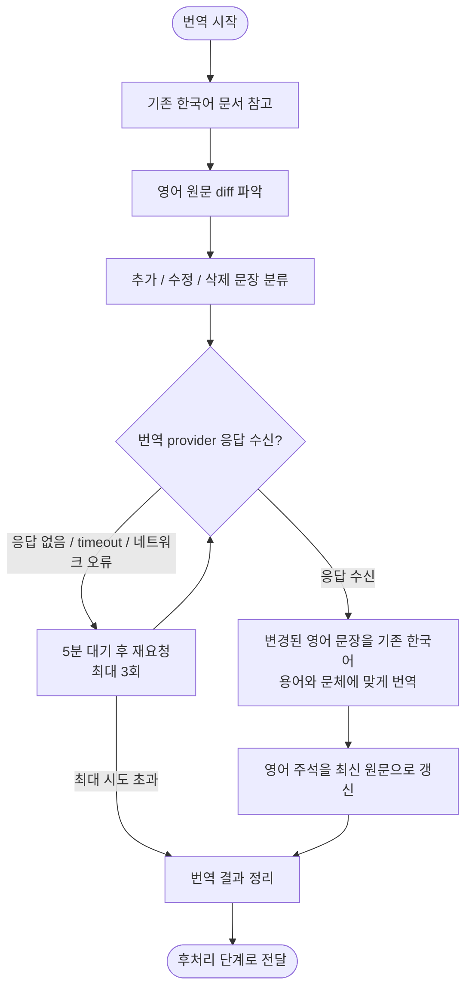

# 한국어 기술 문서 업데이트 번역 작업 계획

## 단계 흐름



---

## 1. 작업 목적

업데이트된 영어 기술 문서의 변경 사항을 기존 한국어 문서에 반영한다.

작업 원칙은 다음과 같다.

- 주변 문맥은 기존 한국어 문서에서 참고한다.
- 번역은 영어 diff에 포함된 업데이트 부분만 수행한다.
- 변경되지 않은 기존 한국어 문장은 원칙적으로 수정하지 않는다.
- 기존 한국어 문서의 구조인 `영어 주석 + 한국어 번역` 형식을 유지한다.

---

## 2. 입력 자료

### 2.1 기존 한국어 문서

기존 한국어 문서는 다음 형식을 따른다.

```md
<!-- Original English sentence. -->
기존 한국어 번역문입니다.
```

이 문서는 다음 용도로 사용한다.

* 변경 위치 주변부 참고
* 기존 번역 용어 참고
* 문체와 어미 스타일 참고
* 앞뒤 문장과의 연결성 참고
* 기존 영어 원문 주석 참고

업데이트되지 않은 영어 주변부는 이미 이 문서의 주석 안에 있으므로, 별도의 업데이트된 영어 주변부는 제공하지 않는다.

---

### 2.2 영어 원문 diff

영어 diff는 실제로 변경된 부분을 식별하기 위한 자료다.

가능하면 다음 형태로 제공한다.

```diff
- Previous English sentence.
+ Updated English sentence.
```

또는 추가/삭제가 명확히 보이는 unified diff 형식으로 제공한다.

```diff
@@ Section title @@

- The API returns a list of active users.
+ The API returns a paginated list of active users.
```

영어 diff는 다음 용도로 사용한다.

* 추가된 문장 식별
* 삭제된 문장 식별
* 수정된 문장 식별
* 최신 영어 문장 식별
* 기존 한국어 문서의 영어 주석 갱신

---

## 3. 작업 범위

### 3.1 번역 대상

번역 대상은 영어 diff에서 변경된 부분으로 제한한다.

다음 항목만 번역하거나 수정한다.

* 새로 추가된 영어 문장
* 수정된 영어 문장
* 수정된 목록 항목
* 수정된 표 셀 또는 표 행
* 수정된 제목
* 수정된 경고문, 안내문, 설명문
* 삭제된 영어 문장에 대응하는 기존 한국어 문장

---

### 3.2 주변부 참고 대상

주변부는 번역하지 않고 참고만 한다.

기존 한국어 문서에서 다음 범위를 참고한다.

* 변경 문장의 앞뒤 문장
* 같은 문단 전체
* 같은 목록의 앞뒤 항목
* 같은 표의 헤더와 관련 행
* 같은 섹션의 제목
* 코드 블록 전후 설명
* Note, Warning, Tip 등 안내 블록 전체

---

### 3.3 수정하지 않는 대상

다음은 원칙적으로 수정하지 않는다.

* diff에 포함되지 않은 기존 한국어 번역
* 변경되지 않은 영어 주석
* 기존 승인된 표현
* 단순 문체 개선 목적의 주변 문장
* 코드, 명령어, API 이름, 파라미터명, 파일명, 경로, URL

변경된 문장과 직접 연결되어 의미가 어색해지는 경우에도 diff에 포함되지 않은 주변 문장은 번역 단계에서 수정하지 않는다.

---

## 4. 기본 작업 원칙

### 4.1 번역은 변경된 부분만 한다

영어 diff에 포함된 변경 사항만 번역한다.

단어 하나만 바뀌었더라도 한국어는 문장 전체 단위로 자연스럽게 갱신한다.

예:

```diff
- The API returns a list of active users.
+ The API returns a paginated list of active users.
```

수정 전:

```md
<!-- The API returns a list of active users. -->
API는 활성 사용자 목록을 반환합니다.
```

수정 후:

```md
<!-- The API returns a paginated list of active users. -->
API는 페이지가 매겨진 활성 사용자 목록을 반환합니다.
```

---

### 4.2 영어 주석은 최신 문장으로 갱신한다

수정된 영어 문장이 있는 경우, 기존 한국어 문서의 영어 주석을 최신 영어 문장으로 교체한다.

수정 전:

```md
<!-- The API returns a list of active users. -->
API는 활성 사용자 목록을 반환합니다.
```

수정 후:

```md
<!-- The API returns a paginated list of active users. -->
API는 페이지가 매겨진 활성 사용자 목록을 반환합니다.
```

---

### 4.3 기존 한국어 스타일을 유지한다

기존 한국어 문서의 표현 방식을 우선한다.

참고할 항목:

* 문장 종결 방식
  예: `합니다`, `할 수 있습니다`, `하세요`
* 용어 번역
  예: `workspace`를 `워크스페이스`로 쓰는지, `작업 공간`으로 쓰는지
* API 설명 방식
* 목록 항목의 병렬 구조
* 제목 번역 스타일
* UI 문구 처리 방식

---

### 4.4 코드와 기술 식별자는 번역하지 않는다

다음은 번역하지 않는다.

* API 이름
* 함수명
* 클래스명
* 파라미터명
* 필드명
* 파일명
* 디렉터리 경로
* 명령어
* 코드 블록
* 환경 변수
* URL
* 제품 고유명사

예:

```md
`user_id`, `access_token`, `GET /users`, `config.yaml`은 번역하지 않는다.
```

---

## 5. 변경 유형별 처리 방식

| 변경 유형    | 처리 방식                                 |
|----------|---------------------------------------|
| 문장 추가    | 해당 위치에 영어 주석과 한국어 번역을 추가한다.           |
| 문장 삭제    | 기존 영어 주석과 한국어 번역을 삭제하거나 삭제 대상으로 표시한다. |
| 문장 수정    | 영어 주석을 최신 문장으로 교체하고, 한국어 번역을 수정한다.    |
| 단어 수정    | 해당 문장 전체를 기준으로 한국어 번역을 갱신한다.          |
| 제목 수정    | 제목 전체를 최신 의미에 맞게 수정한다.                |
| 목록 항목 수정 | 해당 목록 항목만 수정하되, 주변 항목과 어미를 맞춘다.       |
| 표 내용 수정  | 변경된 셀 또는 행만 수정하되, 표 헤더와 용어를 참고한다.     |
| 코드 수정    | 코드 자체는 번역하지 않고, 코드 설명문이 바뀐 경우에만 번역한다. |
| 링크 수정    | 링크 텍스트가 바뀐 경우 텍스트만 번역하고 URL은 유지한다.    |

---

## 6. 작업 절차

### Step 1. 기존 한국어 문서 참고

기존 한국어 문서에서 변경 위치 주변의 용어, 문체, 어미, 문장 연결 방식을 확인한다.

참고 목적:

* 앞뒤 문장과 자연스럽게 이어지도록 문맥 참고
* 기존 용어와 일치하도록 용어 참고
* 목록이나 표의 병렬 구조 참고
* 동일 개념의 기존 번역 방식 참고

---

### Step 2. 영어 원문 diff 파악

영어 diff에서 변경 사항을 분류한다.

분류 기준:

* 추가
* 삭제
* 수정
* 이동
* 용어 변경
* 구조 변경

---

### Step 3. 추가 / 수정 / 삭제 문장 분류

diff의 기존 영어 문장과 최신 영어 문장을 기준으로 기존 한국어 문서에서 대응 위치를 찾고, 변경 유형을 확정한다.

찾을 때는 영어 주석을 기준으로 매칭한다.

예:

```md
<!-- The API returns a list of active users. -->
API는 활성 사용자 목록을 반환합니다.
```

---

### Step 4. 번역 provider 응답 수신 확인

번역 요청은 전처리에서 provider 설정 확인이 끝났다는 전제하에 보낸다.

응답이 없거나 timeout, 네트워크 오류가 발생하면 5분 대기 후 동일 입력과 동일 provider 설정으로 최대 3회 재요청한다.

---

### Step 5. 변경된 영어 문장을 기존 한국어 용어와 문체에 맞게 번역

영어 diff의 최신 문장을 기준으로 한국어 번역을 갱신한다.

원칙:

* 변경된 문장만 수정한다.
* 변경되지 않은 주변 문장은 그대로 둔다.
* 불필요한 문체 개선은 하지 않는다.
* 기존 문서의 어미와 표현을 따른다.

---

### Step 6. 영어 주석을 최신 원문으로 갱신

수정된 문장의 영어 주석을 최신 영어 문장으로 교체한다.

추가된 문장은 새 영어 주석과 한국어 번역을 함께 추가한다.

삭제된 문장은 삭제 대상으로 표시하거나 제거한다.

---

### Step 7. 번역 결과 정리

변경된 영어 diff에 대응하는 번역 결과와, 재시도 초과로 미완료 상태가 된 chunk를 함께 정리한다.

정리 대상:

* 교체, 추가, 삭제한 번역 블록
* 최신 영어 주석
* 기존 한국어 문서에 반영될 한국어 번역문
* 최대 재시도 후에도 응답이 없어 미완료 상태로 남은 chunk와 실패 사유

---

## 7. 출력 형식

작업 결과는 다음 형식으로 정리한다.

---

### 7.1 교체할 블록

기존 블록을 새 블록으로 교체해야 하는 경우 사용한다.

```md
[교체 전]

<!-- The API returns a list of active users. -->
API는 활성 사용자 목록을 반환합니다.

[교체 후]

<!-- The API returns a paginated list of active users. -->
API는 페이지가 매겨진 활성 사용자 목록을 반환합니다.
```

---

### 7.2 추가할 블록

새 문장이 추가된 경우 사용한다.

```md
[추가 위치]
`<!-- Existing English sentence before insertion. -->` 아래

[추가할 블록]

<!-- You can use the cursor parameter to retrieve the next page. -->
`cursor` 매개변수를 사용하여 다음 페이지를 가져올 수 있습니다.
```

---

### 7.3 삭제할 블록

영어 원문에서 삭제된 문장이 있는 경우 사용한다.

```md
[삭제할 블록]

<!-- This endpoint is currently in beta. -->
이 엔드포인트는 현재 베타 버전입니다.
```

---

## 8. 작업 요청 템플릿

아래 템플릿을 사용해 번역 작업을 요청한다.

# 한국어 기술 문서 업데이트 번역 요청

## 작업 목표

업데이트된 영어 기술 문서의 변경 사항을 기존 한국어 문서에 반영해 주세요.

주변 문맥은 기존 한국어 문서에서 참고하고, 실제 번역은 영어 diff에 포함된 업데이트 부분만 진행해 주세요.

업데이트된 영어 주변부는 별도로 제공하지 않습니다.
업데이트되지 않은 영어 주변부는 기존 한국어 문서의 영어 주석에 포함되어 있습니다.

---

## 입력 자료

### 1. 기존 한국어 문서

- 영어 문장은 주석 처리되어 있습니다.
- 각 영어 문장 아래에 한국어 번역이 있습니다.
- 변경 위치 주변부 참고용으로 사용해 주세요.

### 2. 영어 원문 diff

- 추가, 삭제, 수정된 영어 문장을 식별하는 기준입니다.
- diff의 `+` 라인은 최신 영어 문장입니다.
- diff의 `-` 라인은 기존 한국어 문서에서 대응 위치를 찾는 기준입니다.

---

## 작업 규칙

1. 영어 diff에 포함된 변경 부분만 번역 또는 수정합니다.
2. 변경되지 않은 기존 한국어 문장은 원칙적으로 수정하지 않습니다.
3. 주변 문맥은 기존 한국어 문서에서 참고합니다.
4. 영어 주석은 최신 영어 문장으로 갱신합니다.
5. 추가된 영어 문장은 `영어 주석 + 한국어 번역` 형식으로 추가합니다.
6. 삭제된 영어 문장과 그에 대응하는 한국어 번역은 삭제 대상으로 표시합니다.
7. 기존 한국어 문서의 용어, 문체, 어미 스타일을 유지합니다.
8. 코드, 명령어, API 이름, 파라미터명, 파일명, 경로, URL은 번역하지 않습니다.
---

## 출력 형식

다음 형식으로 결과를 작성해 주세요.

### 1. 교체할 블록

```md
[교체 전]

...

[교체 후]

...
```

### 2. 추가할 블록

```md
[추가 위치]

...

[추가할 블록]

...
```

### 3. 삭제할 블록

```md
[삭제할 블록]

...
```

## 9. 예외 케이스

번역 단계에서는 전처리에서 provider 설정 확인이 끝났다는 전제하에 번역 요청을 보낸다. 이 단계의 예외 처리는 번역 provider가 응답하지 않는 경우로 제한한다.

### API / provider 무응답

재시도 대상은 다음과 같다.

- 요청 timeout
- 네트워크 연결 실패
- 연결은 되었지만 응답 본문을 받지 못한 경우
- CLI provider가 `TRANSLATION_CLI_TIMEOUT` 안에 출력을 반환하지 않는 경우

재시도 기준:

1. 5분 대기한다.
2. 동일 입력과 동일 provider 설정으로 최대 3회 재요청한다.
3. 재시도 중에는 원문 chunk, 전처리 플레이스홀더, 기존 한국어 문서 상태를 변경하지 않는다.
4. 3회 실패하면 해당 chunk를 미완료 상태로 둔다.

---

## 10. 최종 운영 기준

이 작업 방식의 핵심 기준은 다음과 같다.

> 기존 한국어 문서는 문맥 참고와 위치 매칭에 사용한다.
> 영어 diff는 실제 변경 사항 식별과 최신 영어 문장 파악에 사용한다.
> 번역 반영은 diff에 포함된 업데이트 부분만 수행한다.
> 변경되지 않은 주변 한국어 문장은 원칙적으로 유지한다.

따라서 최종 입력 구성은 다음 두 가지로 충분하다.

1. 기존 한국어 문서
2. 영어 원문 diff

단, 영어 diff는 최소한 변경된 문장 전체가 보이는 형태여야 한다.
단어 단위 diff만 제공되면 한국어 문장 전체를 자연스럽게 갱신하기 어려울 수 있다.
