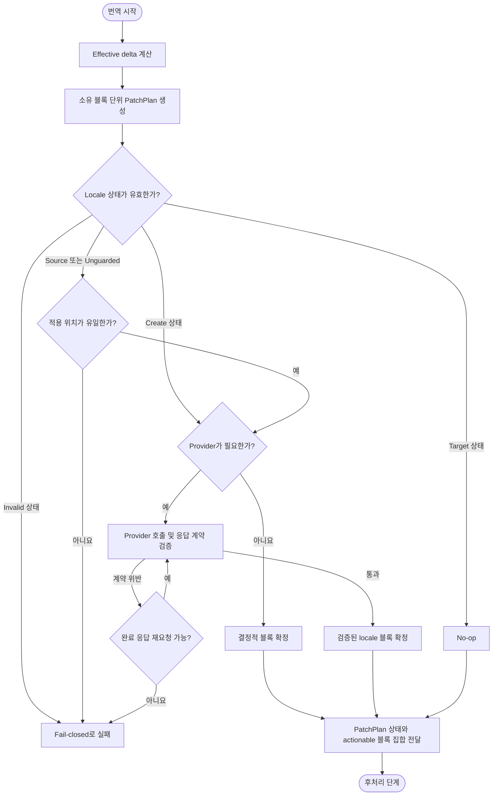

# 번역 단계 설계

## 요약

정규화된 이전·현재 원문의 effective delta를 완전한 번역 소유 블록으로 확장해 PatchPlan 생성.
create/source/unguarded 계획만 처리하고 target 계획은 no-op으로 유지.
live와 replay 응답 계약을 분리하되 구조 계약은 동일하게 유지.

## 흐름도



## 1. 목적

전처리가 완료된 영어 원문의 변경분을 한국어·일본어 locale 문서에 반영.
수정 문서는 effective delta가 선택한 완전한 번역 소유 블록 단위로 처리하고, 추가 문서는 전체 문서를 create 계획으로 처리.
계획 밖의 기존 locale 블록 수정 금지.

---

## 2. 범위

번역 단계가 소유하는 책임은 다음으로 한정.

| 책임 | 설명 |
|------|------|
| normalized delta | 정규화된 이전·현재 작업 사본 사이에서 effective hunk 계산 |
| PatchPlan | effective delta를 완전한 번역 소유 블록과 결합하여 적용 계획 생성 |
| 소유 단위 | 각 블록 유형별 원자적 번역·적용 범위 정의 |
| provider 계약 | provider adapter의 입력·출력 seam 및 호출 조건 정의 |
| response contract | provider 응답의 구조 보존·언어·annotation 규칙 검증 |
| provider fixture | live adapter와 locale prompt의 최소 계약을 실제 번역 전에 검사 |
| retry | transient 오류에 대한 재시도 정책과 상한 정의 |

문서 형식 정제, placeholder 복원, 최종 문서 정규화는 [후처리 단계](./03-postprocessing.md)의 책임.
입력 정규화와 placeholder 치환은 [전처리 단계](./01-preprocessing.md)의 책임.

---

## 3. 입력

| 입력 | 설명 |
|------|------|
| 정규화된 현재 원문 작업 사본 | 전처리 출력. provider에 전달하는 `new_source`의 기준 |
| 정규화된 이전 원문 작업 사본 | effective delta 계산의 비교 대상 |
| 현재 restore map | 전처리에서 생성한 현재 원문 placeholder 복원 정보 (번역 중 변경하지 않음) |
| 기존 locale 문서 | 수정 문서의 위치 매칭·용어·문체 참고. 추가 문서에는 존재하지 않아야 함 |
| 파일 상태 | 총괄 단계에서 확정한 `A` 또는 `M`. `D`는 provider 없이 총괄 단계에서 처리 |
| 설정 확인 완료 상태 | 선행 설정 검증에서 provider 설정 유효성이 확인된 상태 |
| request budget | adapter가 확정한 `context_window_tokens`, `reserved_output_tokens`, `request_timeout_seconds`, 번역 단계의 `run_timeout_seconds`와 남은 전체 workflow deadline |
| contract version | 현재 `response_contract_version=1`, `fixture_version=1`, `provider_budget_profile_version=1` |

---

## 4. 출력

| 출력 | 설명 |
|------|------|
| PatchPlan | 상태, 소유 블록, 적용 위치, source/target 서명과 구조 주소를 포함한 변경 계획 |
| 검증된 locale 블록 집합 | PatchPlan에서 provider가 필요한 각 소유 블록에 대응하며 response contract를 통과한 번역 결과 |
| 결정적 블록 집합 | provider 없이 원문 구조로 확정한 변경 결과. 블록 전체 삭제는 명시적 delete tombstone으로 표현 |
| 적용 mode | actionable plan이 하나 이상이면 `apply`, PatchPlan이 없거나 모두 target이면 `no-write` |

PatchPlan과 블록 집합은 [후처리 단계](./03-postprocessing.md)로 함께 전달.
기존 locale 문서에 대한 실제 적용과 전체 문서 정규화는 후처리 단계가 소유.

---

## 5. 불변 조건

### 5.1 구조 보존

1. 코드 블록 내부의 코드와 주석은 원문 영어 유지.
2. 인라인 코드는 원문과 동일하게 유지.
3. 링크 URL, 앵커, URL fragment 변경 금지.
4. Markdown heading 텍스트, 링크 label, front matter `title`은 번역하지 않고 현재 영어 원문과 byte 단위로 같은 텍스트 유지.
5. HTML/JSX tag·속성 이름, operator와 구조적으로 보호된 문자열은 원문 byte 유지, 일반 prose의 용어·제품명 선택은 locale prompt의 책임이며 자동 구조 검증의 보증 대상 아님.
6. source-authored HTML 주석의 순서·occurrence·구조적 위치 보존.
7. front matter 구조 값은 YAML scalar 형식 유지.
8. 표 열 수·정렬자는 원문과 동일하게 보존.
9. 명시적 hard break가 없는 prose 번역은 물리적 한 줄이어야 함.
10. 영어 원문 annotation 안의 literal `-->`는 `--&gt;`로 escape.

### 5.2 annotation 규칙

1. 일반 prose는 `<!-- {canonical current English source text} -->` 다음에 목표 언어 번역문 배치; 중괄호 부분은 literal이 아닌 해당 source text로 치환.
2. heading은 `<!-- # {current English heading text} -->` 다음에 현재 영어 원문과 같은 Markdown heading 배치; 중괄호 부분은 실제 heading text로 치환; heading 본문은 번역하지 않고 annotation은 source/target 상태 판정을 위한 서명으로 유지.
3. blockquote 본문에는 새 annotation 추가 금지; 기존 exact quoted-source annotation은 호환용으로 허용.
4. 순수 inline-code 식별자 목록 항목은 annotation 대상 아님.
5. 표로만 구성된 요청(행 수정·표 create)의 provider 응답 annotation은 선택 표현: 부착하면 response contract와 PatchPlan 적용 위치 판정에만 사용하고, 생략해도 계약 위반이 아님; 전체 문서 후처리가 현재 표 전체 원문을 담은 canonical annotation 하나로 항상 재생성; 최종 문서에서는 해당 annotation을 표 첫 행 바로 앞에 배치하고 표 행 사이의 HTML 주석 금지; 표 create 응답은 표 전체를 하나의 owner로 사용.
6. source에 없는 standalone 구조 주석을 provider가 추가하면 거부.

### 5.3 fail-closed 원칙과 재생성 강등

1. 위치가 유일하게 확정되지 않으면 provider 호출이나 문서 수정 없이 해당 부분 patch를 적용하지 않음.
2. annotation-backed 문서 상태가 source/target 어느 쪽과도 일치하지 않는 partial/mixed/제3 상태는 부분 patch 적용 대상이 아님.
3. 동일 계획을 이미 적용한 target 문서에 다시 적용하면 no-op이어야 함.
4. 위 1·2처럼 부분 patch로 안전하게 처리할 수 없는 수정 문서는 실행을 실패시키지 않고
   [§7.2 재생성 강등](#72-재생성-강등)으로 처리. 강등은 부분 적용의 모호성을 제거하는
   보수적 처리이며 기존 locale 내용을 신뢰하지 않고 현재 전체 원문에서 다시 생성.
   강등 후에도 response contract·후처리·문서 검증은 동일하게 적용.

### 5.4 PatchPlan 상태

| 상태 | 판정 조건 | 동작 |
|------|-----------|------|
| `create` | 영어 파일이 추가 상태이고 locale 파일이 없거나, 수정 문서가 §7.2로 강등됨 | 현재 영어 문서 전체를 소유 단위로 나누어 생성 |
| `source` | annotation 서명이 이전 원문과 일치 | 위치를 확정한 뒤 계획 적용 |
| `target` | annotation 서명이 현재 원문과 일치 | provider 호출과 결과 블록 없이 no-op |
| `unguarded` | annotatable prose가 없는 결정적 블록이며 이전 구조가 정확히 한 번 존재 | 구조 주소가 유일할 때만 계획 적용 |
| `invalid` | partial/mixed/제3 상태, 예상하지 않은 locale 부재 또는 모호한 unguarded 상태 | provider 호출 없이 §7.2 재생성 강등 |

`actionable plan`은 `create`, `source`, `unguarded` 상태의 합집합.
결과 블록 수는 전체 PatchPlan 수가 아니라 actionable plan 수와 일치해야 함.

한 locale 문서의 annotatable plan은 모두 source이거나 모두 target이어야 함.
source와 target이 함께 나타나는 문서는 partial/mixed 상태이므로 전체 locale target을 invalid로 판정.
unguarded plan은 exact old/new 구조가 같은 문서 상태와 일치할 때만 함께 존재 가능.

---

## 6. 처리 순서

```text
1. effective delta 계산
   - 정규화된 이전·현재 작업 사본을 비교하여 effective hunk 추출
   - style-only 변경은 정규화에 의해 자동 제거됨
   - 추가 문서는 빈 이전 원문과 현재 전체 원문을 비교하여 전체 문서 delta 생성
   - 수정 문서의 effective delta가 비면 PatchPlan을 만들지 않고 기존 locale byte를 유지한 채 후처리의 no-write 검증 기준 생성 경로를 거쳐 문서 검증 단계에 전달

2. PatchPlan 생성
   - 각 effective hunk를 소유 블록 경계에 맞춰 결합
   - old_source / new_source (완전한 블록)와 old_lines / new_lines (effective delta) 분리
   - 이전·다음 anchor 및 동일 블록 occurrence 기록
   - annotation source/target 서명 생성
   - create 문서는 현재 전체 원문을 문서 순서대로 동일한 atomic 소유 단위에 분해하고 provider 필요 단위마다 요청 하나를 생성
   - 여러 top-level prose 문단을 포함한 연속 블록 범위는 빈 줄로 구분된 문단 사이에서 별도 plan으로 나눔
   - fenced code, 단일 prose 문단, 표, admonition, 목록, source HTML comment 내부는 분할하지 않음
   - 분할이 끝난 provider 필요 단위가 preflight request budget을 초과하면 `UNSUPPORTED_OVERSIZE_BLOCK`으로 실패

3. locale 문서 상태 판정
   - annotatable 주석 순서를 old/new 서명과 비교
   - create/source/target/unguarded/invalid 중 하나로 판정
   - target 상태는 no-op, invalid 상태는 §7.2 재생성 강등

4. 블록별 위치 확정
   - source/unguarded 계획은 기존 원문 주석, anchor, occurrence로 기존 locale 문서의 대응 블록 탐색
   - create 계획에는 기존 위치를 요구하지 않음
   - 필요한 위치가 유일하게 확정되지 않으면 §7.2 재생성 강등

5. provider 호출 또는 결정적 처리
   - 소유 단위에 따라 provider 필요 여부 판정
   - provider 필요 블록: new_source 전체를 전달하고 응답 수신
   - provider 불필요 블록: 결정적으로 생성

6. response contract 검증
   - 구조 보존·annotation·언어 규칙 검증
   - 위반 시 feedback 포함 재요청 (완료 응답 최대 5회)

7. 후처리 인계
   - actionable plan마다 검증된 provider 결과 또는 결정적 블록이 있는지 확인
   - target plan에는 결과 블록이 없음을 확인
   - 출력 수와 actionable plan 수의 일치 확인
   - PatchPlan, 블록 집합, 현재 restore map과 적용 mode를 후처리 단계에 전달
```

---

## 7. 소유 단위 정의

| 소유 단위 | provider | 적용 범위 |
|-----------|----------|-----------|
| 일반 문단·목록 | 필요 | annotation이 대응하는 완전한 블록 또는 연속 블록 범위 |
| 추가 문서 | 혼합 | 현재 전체 문서를 아래 소유 단위로 분해하고 provider 필요 단위만 호출 |
| heading | 불필요 | 현재 영어 heading과 canonical annotation을 결정적으로 생성 |
| front matter | 불필요 | 지원되는 문자열 scalar만 현재 영어 원문에서 그대로 복사. 영어 원문에 머리말이 없는 문서의 locale 라우팅 `slug` 문자열 scalar 머리말은 저장소 소유로 보존 |
| 소유 블록 전체 삭제 | 불필요 | 유일하게 확인된 이전 블록 위치에 delete tombstone 적용 |
| 독립 fenced-code-only 변경 | 불필요 | 원문 전체 code block을 그대로 교체 |
| bare 내부 링크 목록 | 불필요 | 원문 구조 블록을 그대로 반영 |
| 사이드바 구조 목록 (링크 label·카테고리 heading 항목만) | 불필요 | 링크 label과 카테고리 label은 영어 유지 대상이므로 원문 구조 블록을 그대로 반영 |
| inline-code 식별자 목록 | 불필요 | 원문 구조 블록을 그대로 반영 |
| 표 (지원 조건 내) | 필요 | provider 응답 범위는 수정 시 변경 전후 각 한 행·동일 열 수인 기존 행, create 시 직사각형 전체 표. 최종 문서 owner는 두 경우 모두 현재 표 전체 |
| admonition 본문 | 필요 | marker는 구조 context로 유지, 연속 변경 본문 segment |
| admonition marker 유형 변경 | 필요 | marker + 연속 quote 본문 전체 |
| named `<a name="...">` 한 줄 추가·삭제·rename | 불필요 | source occurrence와 target count로 정확한 한 줄 선택 |
| raw HTML 블록 한 줄 (`<div>`, `</div>`, 단독 ``) | 불필요 | 원문 줄을 그대로 반영하고 annotation 대상 아님. 삭제와 prose가 같은 hunk에 섞인 변경은 이 소유 단위로 처리하지 않고 §7.2 재생성 강등 대상. 이전 규약으로 이런 줄 위에 annotation을 가진 기존 문서는 재생성 시 해당 annotation을 남기지 않음 |
| standalone source HTML comment | 불필요 | 현재 영어 원문의 comment byte를 구조 주소와 ordered occurrence가 유일할 때 추가·교체·삭제 |
| section 순서 변경 (내용 동일) | 불필요 | named anchor 기준 section 전체와 이를 가리키는 선행 TOC 링크 줄을 목표 순서로 이동 |

prose와 fence가 한 연속 변경 범위에 함께 있으면 전체를 provider 필요 블록으로 취급.

### 7.1 Section reorder 판정

section 순서 변경은 다음 조건을 모두 만족할 때만 결정적 reorder로 분류.

1. section 시작점은 code fence와 HTML 주석 밖의 standalone named anchor.
2. section 범위는 시작 anchor부터 다음 시작점 직전까지이며, 다음 시작점이 없으면 EOF까지.
3. 재정렬 대상 anchor의 서명은 문서 안에서 유일해야 함.
4. 이전·현재 문서의 재정렬 대상 anchor 집합과 각 anchor에 대응하는 section의 정규화 byte가 각각 동일해야 함.
5. 대상 anchor 순서만 달라지고 같은 effective delta에는 section 내용 수정·추가·삭제가 없어야 함.
6. 선행 prefix가 달라진 경우 비링크 줄은 위치별로 동일하고 TOC 링크 줄의 순열만 달라지며 그 순서가 새 section 순서와 일치해야 함.
7. anchor가 중복되거나 연결 heading·section 경계가 모호하면 reorder 분류 사용 금지, 각 effective hunk가 7절의 다른 소유 단위에 모두 유일하게 매핑되면 해당 일반 계획을 사용하고 하나라도 매핑되지 않으면 §7.2 재생성 강등을 적용.

### 7.2 재생성 강등

수정 문서에서 locale별로 다음 중 하나라도 발생하면 해당 문서를 부분 patch 대신
"추가 문서"와 동일한 전체 재생성(create) 소유 단위로 강등.

1. 변경을 7절의 소유 단위로 표현할 수 없음
   (예: 기존 표의 행 추가·삭제, 표 생성·제거, 지원 조건 밖 구조 변경으로 PatchPlan 생성 불가).
2. 기존 locale 문서 상태가 source/target 어느 쪽으로도 판정되지 않거나 적용 위치가 유일하게 확정되지 않음.
3. 기존 locale 문서가 검증 기준(영어 verification view 정렬·annotation 대응·front matter)과
   정렬되지 않아 부분 patch 결과의 문서 검증을 통과할 수 없음.

강등된 문서는 현재 전체 원문을 소유 단위로 분해해 재번역하고,
기존 locale 파일을 문서 검증을 통과한 재생성 결과로 교체.
단, 기존 locale 문서에서 canonical annotation이 정확히 일치하며 유일하게
대응하는 소유 블록은 기존 번역을 재사용하고 provider를 호출하지 않는다.
재사용 블록도 응답 계약을 그대로 통과해야 하며, 통과하지 못하면 재번역한다.
이 재사용은 영어 원문이 바뀌지 않은 블록의 승인된 번역 문장을 보존하기 위한
결정적 처리이며, 재사용 여부와 무관하게 후처리·문서 검증은 동일하게 적용.
기존 locale 파일이 이미 현재 원문 기준 문서 검증을 통과하는 재생성 결과이면
provider 호출 없이 no-op 처리해 강등을 멱등으로 유지.
강등은 문서·locale 단위로 1회만 적용하며, 강등 후에도 계획 생성·response contract·문서 검증이
실패하면 해당 오류 코드로 실행 실패 (재강등 금지).
기존 locale 문서에 대한 수동 수정 사항은 강등 시 보존 대상이 아니며 재생성 결과로 대체됨.

---

## 8. provider 계약

### 8.1 공통 인터페이스

provider adapter는 `TranslationRequest`를 받아 번역 Markdown 문자열만 반환하는 seam.
설명, 위치 지시, wrapper 문구 출력 금지.

Provider budget profile version 1은 `gpt-5.6`, `gpt-5.6-sol`, `gpt-5.6-terra`, `gpt-5.6-luna`를 `o200k_base`, context window `1,050,000`, 최대 output `128,000`에 결합한 version-controlled 승인 목록.
Azure의 `TRANSLATION_MODEL`이 deployment 이름이면 별도 `TRANSLATION_MODEL_PROFILE`로 이 목록의 항목을 선택.
목록 밖 model/profile, 다른 tokenizer, 목록보다 큰 context 또는 output 예약값은 provider 호출 전에 실패.

각 요청은 다음 보수적 계산을 통과해야 함.

```text
exact_input_tokens = count_o200k(instructions) + count_o200k(payload)
utf8_byte_token_upper_bound = len(UTF8(instructions + payload))
framing_token_allowance = 128000
conservative_input_tokens = max(exact_input_tokens, utf8_byte_token_upper_bound) + framing_token_allowance
conservative_input_tokens + reserved_output_tokens <= context_window_tokens
```

`utf8_byte_token_upper_bound`는 byte와 token을 같은 단위로 간주하는 측정값이 아니라 UTF-8 byte 수를 token 수의 보수적 수치 상한으로 사용하는 값.
`framing_token_allowance`도 실제 provider 내부 framing 측정을 의미하지 않고 API·CLI의 비가시 framing을 위해 version 1이 token 단위로 고정한 허용량.
tokenizer를 적재할 수 없거나 위 부등식을 증명할 수 없으면 provider 호출 금지.
승인 model·tokenizer 결합, 상수 또는 계산식을 바꾸면 provider budget profile version, request budget 테스트와 fixture evidence schema·계약 테스트를 함께 갱신해야 함.
Fixture source 또는 response 판정 규칙이 바뀌지 않았다면 이 변경만을 이유로 `fixture_version` 상향 금지.

### 8.2 adapter별 요구사항

| adapter | 요청 구조 | 완료 판정 |
|---------|-----------|-----------|
| OpenAI | `instructions` / `input` 분리, Responses API, `store=false` | `status=completed`일 때 `output_text` |
| Azure OpenAI | system / user 메시지 분리, Chat Completions | `finish_reason=stop`일 때 첫 assistant message content |
| CLI | 임시 디렉터리에서 실행, 사용자 설정·execpolicy·AGENTS.md 제외 | `--output-last-message` 파일 내용 |
| Identity | replay process에서 결정적 canonical annotation과 영어 본문 생성 | 구조 계약을 만족하는 단일 Markdown 결과 |

### 8.3 CLI adapter 보안 경계

- browser, computer, image generation, plugin, shell, app, subagent, web search, hook 비활성화.
- 인증은 `CODEX_ACCESS_TOKEN`, `CODEX_API_KEY`, 전용 절대 `CODEX_HOME` 중 정확히 하나만 선택, `OPENAI_API_KEY`를 기본 Codex exec의 직접 인증으로 전달 금지.
- child process에는 선택한 인증 하나와 runtime·proxy/CA allowlist 환경 변수만 전달.
- model이 실행하는 subprocess에는 환경 변수 상속 금지.

### 8.4 Live provider fixture 검사

identity replay가 성공한 뒤 실제 원문 동기화 전에 이번 실행에서 선택한 non-identity adapter와 각 locale prompt 조합을 고정 fixture로 한 번씩 검사.

Fixture 규칙:

- 실제 문서 내용이나 credential을 fixture에 포함 금지.
- `fixture_version=1`의 English Source는 아래 fence 내부 byte에 마지막 LF 하나를 붙인 값.

```markdown
<!-- fixture-source-comment -->

Install the `Widget` package from [Package Index](/docs/master/packages) and verify that the command completes successfully before continuing.

- Run `widget:init` once.
```

- 응답은 source-authored comment를 보존하고 prose·목록의 canonical pipeline annotation을 생성하며 inline code와 link label·target 쌍을 보존해야 함. 블록 내 링크 등장 순서는 목표 언어 어순에 따라 재배열 가능.
- `fixture_version=1`은 위 source와 `response_contract_version=1` 규칙을 사용하며, 배포 이후 fixture byte나 판정 규칙이 바뀌면 대응 version을 올려야 함.
- 실제 번역과 같은 adapter, model, system instructions와 locale prompt를 사용하고 adapter가 지원하면 `store=false` 적용.
- 완료 상태, wrapper 부재, annotation, 구조 보존, 목표 언어 충분성을 live response contract로 검사.
- transport와 response feedback 상한은 일반 블록과 같으며, 한 locale fixture라도 실패하면 실행 전체 중단.
- 응답 본문과 credential의 저장·로그 출력 금지; 성공 evidence에는 adapter, model, model profile 또는 `null`, reasoning effort 또는 `null`, locale, provider budget profile version, response contract version, fixture version, 실제 instructions byte의 SHA-256과 비밀값을 제외한 effective 설정의 SHA-256 기록 필수; 설정 hash만으로 앞의 명시적 식별 필드를 대체하는 것 금지.

Fixture 검사는 연결성과 최소 응답 계약만 보증.
실제 문서 번역의 의미 정확성·용어 선택·문체를 보증하는 품질 gate로 간주 금지.

### 8.5 요청 템플릿

```text
# Translation Sync Input

## English Diff
{정규화된 effective delta를 ```diff fence로 감싼 payload — 값이 있을 때만 포함.
fence 길이는 본문의 최장 backtick 연속보다 하나 길게 잡으며, 다른 section에는 fence를 붙이지 않음}

## English Source
{완전한 current new_source 블록}

## Existing Translation Context
{수정 계획이면 같은 소유 블록의 기존 locale 내용, create 계획이면 (none)}

## Previous Output Verification Failure
{이전 완료 응답의 검증 issue — 값이 있을 때만 포함}

## Output
Return only the translated Markdown block(s) for the English Source.
```

번역 규칙과 annotation 형식은 user payload가 아닌 locale prompt와 공통 system instructions로 전달.

---

## 9. response contract

provider 응답은 적용 전에 다음 항목을 모두 통과해야 함.
live profile은 모든 항목을 검사하고, replay profile은 목표 언어 충분성과 표 prose cell의 목표 언어 요구만 제외.
Identity도 annotation·Markdown 구조·보존 markup·wrapper 부재 검사를 통과해야 함.
live profile 응답은 계약 검증 전에 target이 고유한 Markdown 링크의 번역된 label을
요청 source의 원문 label로 결정적으로 복원한다.
같은 target이 서로 다른 원문 label로 등장하면 해당 target은 복원하지 않는다.
요청 source에 HTML 주석이 없으면, 응답 annotation 주석과 소유 본문 사이에 낀
빈 줄도 계약 검증 전에 제거한다.
inline code span 되돌림은 요청 source에 실제로 존재하는 내용에만 적용한다.
원문 빈도를 초과한 반복은 backtick을 제거해 prose로 되돌리고, 원문에 없는
내용의 span은 되돌리지 않고 그대로 두어 응답 계약이 거부하게 한다.
요청 source에 HTML 주석이 없으면, 여러 줄로 갈라진 annotation 주석도
계약 검증 전에 한 줄로 접는다. 접기 대상 탐색은 code fence를 넘지 않는다.
HTML 연속 라인 블록에 행별로 갈라진 annotation 주석은, 병합 결과가
요청 source 전체의 canonical 한 줄 형태와 정확히 같을 때만 첫 위치의 주석
하나로 병합한다.
요청 source에 HTML 주석이 없고 응답 annotation 주석 수가 요청 source의 블록 수와
같으며 각 자리 주석의 단어 내용이 대소문자·문장부호·공백을 무시하고 원문과 같으면,
주석 본문을 요청 source의 canonical byte로 계약 검증 전에 복원한다.
하나라도 어긋나면 복원하지 않는다.
응답에서 누락된 단독 `<a name>` 앵커 줄은 원문에서 앵커 다음의 비어 있지
않은 줄이 응답에 유일하게 존재할 때 그 앞에 결정적으로 복원한다.

| 검증 항목 | 규칙 |
|-----------|------|
| annotation 순서·occurrence | 요청 source와 정확히 대응. 표 수정 응답의 행 owner는 적용 전 임시 형식이며 최종 문서 형식이 아님 |
| Markdown block 수·순서 | source와 일치 |
| 목록 들여쓰기·checkbox 상태 | source와 일치 |
| 인용 깊이·canonical admonition 유형 | source 경고 수준 보존 |
| 표 열·정렬자 | source와 일치 |
| 표 행 중복 | source 표 행이 모두 서로 다르면 응답 표에도 중복 행이 없어야 함 |
| front matter 구조 값 | YAML 문자열 scalar, collection/bool/null/숫자/날짜 불허 |
| 보존 HTML/JSX 속성 | identifier·operator 구조 보존 |
| emphasis delimiter | 단일·이중 구분이 source 구분자의 부분 multiset. 목표 언어가 강조를 어휘로 흡수하는 누락은 허용, 원문에 없는 강조 추가는 거부 |
| inline-link label·target·pair·title | source와 일치 |
| reference definition | 정규화 label과 raw target·title의 ordered occurrence 일치 |
| prose 줄 수 | 명시적 hard break 없으면 물리 한 줄 |
| 문단 문장 수 | 응답 문단의 문장 수가 source 문장 수와 절 분할 허용치의 합을 넘지 않아야 함 |
| 목표 언어 충분성 | 9.1의 locale별 결정 규칙을 만족해야 함. heading(리스트 항목 안 `## ` 카테고리 label 포함)·link label·front matter title과 보호 span은 제외 |
| source 밖 주석 | 추가 시 거부 |
| 표 prose cell | 목표 언어 요구, data cell(코드·링크·식별자·타입·설정 값·버전·날짜)은 원문 허용 |

### 9.1 목표 언어 충분성 판정

목표 언어 판정은 fenced/inline code, Markdown link target·label, heading 전체, GFM admonition marker, front matter 전체와 HTML/JSX tag·속성을 제거한 나머지 prose에 적용.
일반 prose 안의 단어를 identifier나 고유명사라고 추정하여 제외 금지.

1. source translatable prose의 Unicode letter가 20자 이상이고 정규화한 응답 prose가 source와 완전히 같으면 live profile에서 실패.
   단, source prose의 letter 포함 token 전부가 소문자로 시작하는 기술 식별자이면 exact copy를 허용.
   source prose의 모든 letter가 큰따옴표 리터럴 안에 있고 리터럴 밖 나머지가 JSON 구조 문장부호(`{}`, `[]`, `:`, `,`, 공백·탭·개행)뿐이며
   그 나머지에 `:`, `{`, `}`, `[`, `]` 중 하나 이상이 있으면 데이터로 보아 exact copy를 허용.
2. source translatable prose의 Unicode letter가 40자 이상이면 응답에 다음 target-script 문자가 `max(8, ceil(source letter 수 × 0.10))`개 이상 있어야 함.
   - KO: Hangul syllable 또는 Hangul Jamo.
   - JA: Hiragana, Katakana 또는 Han ideograph.
3. 40자 미만 source에는 script 비율 하한을 적용하지 않지만 1번의 exact-copy 검사는 적용.
4. 표 prose cell에도 cell별로 같은 규칙을 적용하고 data cell은 제외.
   같은 취지로, 20자 미만 label과 쉼표·`and`로 구분된 보호 데이터 항목 두 개 이상만으로 구성된 prose 블록은
   data 열거로 보아 2번의 하한을 적용하지 않음. 항목 판정은 블록 형태로만 하며 일반 prose의 개별 단어 추정은 금지.
   한 줄로 접힌 목록 항목이 3개 이상인 블록은 대문자로 시작하거나 기술 식별자인 token을 data로 보아
   2번의 하한 계산 기준에서 제외하고, 남은 letter 수에 같은 규칙을 적용. 이 판정을 정의 목록 label 제외보다 먼저 적용.
   모든 항목이 20자 미만 `label:` 접두를 가진 정의 목록 블록은 label을 data key로 보아
   2번의 하한 계산 기준에서 제외하고, label을 제외한 본문 letter 수에 같은 규칙을 적용.
5. replay profile과 identity adapter에는 이 절 전체를 적용하지 않음.

문자 수는 prose를 NFC 정규화한 뒤 Unicode 15.1 General Category `L*`에 해당하는 code point를 집계.
exact-copy 비교는 pipeline annotation을 제거하고 CRLF를 LF로 바꾸고 바깥 공백을 제거한 뒤 NFC 정규화한 prose byte를 사용하며 내부 공백은 합치지 않음.
이 Unicode version, 정규화 방식과 상수 `20`, `40`, `8`, `0.10`은 `response_contract_version=1`에 포함.
아직 배포되지 않은 version은 상향 없이 개정하며, 배포된 version의 규칙을 바꿀 때만 response contract와 fixture version을 함께 올림.

### 9.2 verification feedback

주석만 남고 본문이 없거나 source 밖 prose·구조 주석이 추가된 경우, 또는 문단 문장 수 계약을 위반한 경우 모든 profile에서 feedback을 포함해 재요청.
9.1의 exact-copy 또는 target-script 하한을 위반한 경우는 live profile에서만 재요청.
목표 언어 위반 feedback에는 원문을 그대로 되돌려준 표 머리글 셀을 지목해 포함.
Markdown 링크 보존(label·target·pair·title), inline code 보존, inline markup 보존, 원문 주석 불일치, admonition 유형 불일치 위반도 live profile에서만 재요청.
완료 응답 평가는 블록당 최초 요청을 포함해 최대 5회이며, 계속 실패하면 해당 locale target을 candidate에 기록 금지.

자동 feedback 재요청은 이 단계만 소유.
[문서 검증 단계](./04-verification.md)는 전체 문서 issue를 provider 재요청으로 연결하지 않으며, 실패한 candidate를 기록하지 않고 실행 종료.

---

## 10. retry 정책

### 10.1 transient 재시도

| 대상 오류 | 처리 |
|-----------|------|
| 요청 timeout | 재시도 |
| 네트워크 연결 실패 | 재시도 |
| 응답 본문 미수신 | 재시도 |
| HTTP 429 / 5xx | 재시도 |
| CLI timeout | 재시도 |

| 비재시도 대상 | 처리 |
|---------------|------|
| CLI 실행 파일 누락·권한·option/model/auth 오류 | 즉시 실패 |
| HTTP 4xx (429 제외) | 즉시 실패 |
| 부분 응답 (OpenAI status ≠ completed, Azure finish_reason ≠ stop) | 저장하지 않고 실패 |

### 10.2 재시도 상한

- 한 논리 요청당 물리 provider 호출: 초기 요청 포함 최대 **5회**.
- 재시도 간 대기: **5분**.
- SDK 내부 재시도: 사용하지 않음.
- verification feedback 포함 재요청: 완료 응답 최대 **5회** (블록당).
- 최악 물리 호출 상한: 블록당 최대 **25회** (5회 × 5 논리 요청).

### 10.3 최종 실패

최대 재시도 후에도 유효 응답이 없으면 해당 locale target을 candidate에 기록하지 않고 기존 locale 파일과 active worktree 변경 금지.

### 10.4 실행 순서와 시간 상한

결과의 결정성을 위해 provider 요청은 병렬 실행하지 않고 다음 순서로 처리.

```text
live fixture locale ko, ja → versions.json 순서 → 문서 경로 UTF-8 byte 오름차순 → locale ko, ja → PatchPlan 구조 주소 순서
```

- `context_window_tokens`, `reserved_output_tokens`, `request_timeout_seconds`, `run_timeout_seconds`, `workflow_timeout_seconds`는 모두 양의 정수여야 하며, `reserved_output_tokens < context_window_tokens`와 `request_timeout_seconds <= run_timeout_seconds <= workflow_timeout_seconds`를 만족하지 않으면 설정 오류.
- `run_timeout_seconds`는 첫 live fixture 직전에 시작하여 마지막 문서 응답 검증까지 계속되는 단조 시계 wall-clock 상한이며, 중간의 원문 동기화·전처리·계획 생성 동안 재설정하거나 정지하는 것 금지.
- 번역 단계의 실제 deadline은 `run_timeout_seconds`와 남은 전체 workflow deadline 중 이른 값.
- 다음 물리 호출과 필요한 retry 대기를 수행하면 deadline을 넘는 경우 호출하지 않고 `RUN_DEADLINE_EXCEEDED`로 실패.
- 한 블록의 최대 provider wall-clock 상한은 `25 × request_timeout_seconds + 20 × 300초`이며, 각 논리 요청의 transport 5회 사이에 네 번씩 대기하고 두 완료 응답 평가 사이에는 별도 고정 대기 없음.
- deadline 실패 시 다른 target으로 진행하지 않고 candidate 전체 publication 금지.

---

## 11. 실패 정책

| 실패 유형 | 처리 |
|-----------|------|
| effective delta가 비어 있음 (정규화로 모든 raw delta 제거) | `NORMALIZED_NOOP`으로 기록하고 기존 locale byte를 유지한 채 영어 verification view와 expected annotation map을 생성하여 문서 검증 단계에 전달. 현재 raw 영어 원문 candidate는 유지 |
| 위치 확정 불가 (anchor 모호, 대상 없음) | 문서 미수정, locale target 실패 |
| PatchPlan 상태가 invalid | candidate 미적재, locale target 실패 |
| 수정 표 구조 조건 불충족 (열 수 불일치, 복수 행, separator) 또는 create 표가 직사각형이 아님 | 해당 블록 실패 |
| admonition marker가 old/new 외 제3 유형 | 해당 블록 실패 |
| 지원하지 않는 front matter 값 또는 source HTML comment 구조 주소 모호 | provider 호출 전 실패 |
| 분할할 수 없는 provider 필요 단위가 request budget 초과 | `UNSUPPORTED_OVERSIZE_BLOCK`으로 provider 호출 전 해당 문서 실패 |
| live provider fixture 계약 위반 | 원문 동기화 전에 실행 전체 실패 |
| response contract 위반 후 재요청도 실패 | locale target 미기록 |
| transient 오류 최대 재시도 초과 | locale target 미기록 |

모든 실패는 fail-closed로 처리.
기존 locale 문서를 부분적으로 수정한 상태로 유지 금지.

---

## 12. 수용 기준

번역 단계 출력이 다음 조건을 모두 만족해야 [후처리 단계](./03-postprocessing.md)로 전달 가능.

1. 모든 PatchPlan이 create/source/target/unguarded 중 하나이며 invalid 계획 없음.
2. 한 locale 문서 안에 source와 target annotatable plan이 섞여 있지 않음.
3. 모든 actionable plan에 provider 응답 또는 결정적 생성 결과 존재.
4. 모든 provider 응답이 현재 실행의 live 또는 replay response contract 통과.
5. 블록 출력 수와 actionable plan 수가 정확히 일치하고 target plan의 출력 없음.
6. source와 unguarded 계획의 적용 위치가 유일하게 확정되었으며 create 계획은 기존 위치를 요구하지 않음.
7. 현재 restore map이 번역 중 변경되지 않음.
8. 기존 locale 문서와 active worktree는 후처리 단계에 인계하기 전까지 변경되지 않음.
9. 모든 provider 요청이 request budget 안에 있고 정의된 단일 순서로 실행됨.
10. 번역 단계가 자체 run deadline과 남은 전체 workflow deadline 중 이른 값을 넘지 않음.
11. 모든 요청·응답과 fixture 결과가 같은 response contract·fixture version을 보고함.
