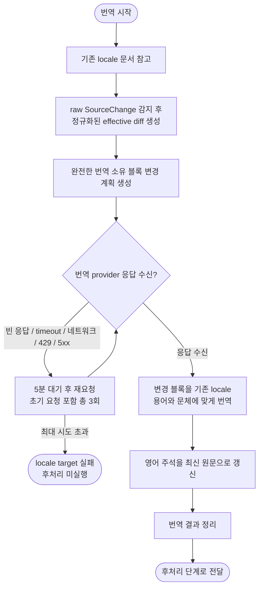

# 한국어·일본어 기술 문서 업데이트 번역 작업 계획

## 단계 흐름



---

## 1. 작업 목적

업데이트된 영어 기술 문서의 변경 사항을 기존 한국어와 일본어 문서에 반영한다. 이하 예시는 한국어를 사용하지만 같은 계획을 두 locale에 적용한다.

작업 원칙은 다음과 같다.

- 주변 문맥은 기존 locale 문서에서 참고한다.
- raw `SourceChange`는 최초 변경 범위를 식별한다. 실제 번역 계획은 이전·현재 원문을 같은 규칙으로 정규화한 뒤 다시 계산한 effective delta가 선택한 완전한 번역 소유 블록 단위로 수행한다.
- 변경 계획에 포함되지 않은 기존 locale 블록은 수정하지 않는다.
- 일반 prose와 heading은 `정확한 최신 영어 원문 주석 + 번역문` 형식을 유지한다. blockquote 본문에는 새 영어 주석을 만들지 않는다.

---

## 2. 입력 자료

### 2.1 기존 locale 문서

기존 한국어 문서는 다음 형식을 따른다.

```md
<!-- Original English sentence. -->
기존 한국어 번역문입니다.
```

이 문서는 다음 용도로 사용한다.

* 변경 위치 주변부 참고
* 기존 번역 용어 참고
* 문체와 어미 스타일 참고
* 앞뒤 문장과의 연결성 참고
* 기존 영어 원문 주석 참고

업데이트되지 않은 영어 주변부는 이미 이 문서의 주석 안에 있으므로, 별도의 업데이트된 영어 주변부는 제공하지 않는다.

---

### 2.2 영어 원문 변경 정보

raw Git diff는 최초 변경 범위를 식별하기 위한 자료다. 부분 번역 계획을 만들 때는 복원한 이전 원문과 현재 원문에 같은 전처리·후처리 정규화를 적용한 뒤 diff를 다시 계산한다.

가능하면 다음 형태로 제공한다.

```diff
- Previous English sentence.
+ Updated English sentence.
```

또는 추가/삭제가 명확히 보이는 unified diff 형식으로 제공한다.

```diff
@@ Section title @@

- The API returns a list of active users.
+ The API returns a paginated list of active users.
```

영어 diff는 다음 용도로 사용한다.

* 추가된 문장 식별
* 삭제된 문장 식별
* 수정된 문장 식별
* 최신 영어 문장 식별
* 기존 한국어 문서의 영어 주석 갱신

`SourceChange.hunks`는 raw Git delta를 보존한다. 반면 provider의 `English Diff`에 들어가는 `BlockChange.old_lines` / `new_lines`는 정규화 후 다시 계산한 effective delta다. 따라서 style-only 변경은 사라질 수 있고, 정규화 결과에 따라 raw delta와 줄 내용이 달라질 수도 있다. 다만 이 effective diff 자체를 문단이나 목록 전체로 부풀리지는 않으며, 완전한 교체 범위는 별도 `old_source` / `new_source`에 둔다.

### 2.3 변경 블록 계획

각 effective delta는 그 라인이 속한 완전한 번역 소유 블록과 결합한다.

- `old_lines` / `new_lines`: 정규화된 이전·현재 원문 사이에서 다시 계산한 effective delta
- `old_source` / `new_source`: 위치 탐색, 번역, 교체에 사용하는 완전한 블록 또는 연속 블록 범위
- 이전·다음 원문 anchor와 동일 블록 occurrence: 중복 블록 사이에서 정확한 대상을 찾는 근거
- `old_source_anchors` / `new_source_anchors`: 복원한 이전 원문과 현재 원문 전체에 `전처리 → 후처리(placeholders 복원)`를 적용한 뒤 만든 annotation sequence

이 정보를 원문 순서의 `PatchPlan`으로 만든다. raw `SourceChange`는 이전 원문 복원과 최초 범위 선택의 근거이며, 정규화된 전체 원문은 effective hunk와 블록 경계, 전체 annotation sequence를 만드는 기준이다. 전체 annotation sequence는 locale 문서가 계획의 source 상태인지 target 상태인지 판정하는 데 사용한다. 문단 분리·병합처럼 하나의 블록이 여러 블록으로 바뀌거나 여러 블록이 하나로 바뀌는 변경도 하나의 블록 범위 변경으로 취급한다. 대상이 없거나 여러 위치가 동일하게 일치하면 추정 적용하지 않고 실패한다.

raw 앵커 같은 비번역 구조물 근처에 블록을 삽입할 때는 source line metadata로 구조물 앞의 빈 줄 separator도 보존한다.

이 문서에서 번역 소유 블록은 provider와 적용기가 원자적으로 책임지는 단위다.

- 일반 문단·목록·heading: annotation이 대응하는 완전한 블록 또는 연속 블록 범위
- 순수한 독립 fenced-code-only 변경: provider 없이 원문 전체 code block. prose와 fence가 한 연속 변경 범위에 함께 있으면 그 소유 범위는 provider를 사용한다.
- bare 내부 링크 목록과 inline-code 식별자만으로 된 목록: provider 없이 원문 구조 블록
- 표: 변경 전후가 각각 한 행이고 열 수가 같으며 기존 행이 separator가 아닐 때 구조 주소를 만든다. source의 table ordinal·전체 table 수·행 ordinal·행 수와 old/new 행 식별을 함께 확인하며, locale-only 표·행 또는 순서 drift로 주소가 달라지면 실패한다.
- admonition: marker는 구조 context로 유지하고, effective diff의 연속된 변경 본문 segment를 blockquote 안의 소유 단위로 처리한다. GFM marker 유형만 바뀌어도 해당 marker부터 연속된 quote 본문까지 완전한 `new_source`로 provider에 보내며, marker ordinal과 전체 admonition 수로 선택한 locale block을 검증된 응답 전체로 교체한다. marker만 반환하거나 기존 marker가 old/new 외의 제3 유형이면 실패한다.

따라서 번역 소유 블록은 일반 prose에서는 완전한 Markdown 블록이지만, 표와 admonition에는 locale 구조를 보존하기 위한 명시적 원자 단위가 있다. 표 전체나 여러 행, admonition 컨테이너 전체를 일반적으로 재작성하는 계약은 아니며, 지원 조건 밖이거나 위치가 모호하면 실패한다.

---

## 3. 작업 범위

### 3.1 번역 대상

번역 대상은 정규화된 effective diff가 선택한 `new_source` 소유 단위로 제한한다. 일반 prose 블록 안의 일부 라인만 바뀌어도 자연스러운 문맥과 원자적 교체를 위해 정의된 소유 단위 전체를 provider에 전달한다.

다음 항목만 번역하거나 수정한다.

* 새로 추가되거나 수정된 문단 또는 연속 문단 범위
* 수정된 목록 블록, 표 행, admonition 본문 소유 블록
* 수정된 문서 제목과 heading
* 수정된 경고문, 안내문, 설명문
* 삭제된 영어 문장에 대응하는 기존 한국어 문장

---

### 3.2 주변부 참고 대상

변경 계획 밖의 주변부는 번역하지 않고 참고만 한다.

기존 한국어 문서에서 다음 범위를 참고한다.

* 변경 문장의 앞뒤 문장
* 같은 목록의 앞뒤 항목
* 식별된 기존 표 행
* 같은 섹션의 제목
* 코드 블록 전후 설명
* Note, Warning, Tip 등 안내 블록 전체

---

### 3.3 수정하지 않는 대상

다음은 원칙적으로 수정하지 않는다.

* `PatchPlan`에 포함되지 않은 기존 locale 번역과 영어 주석
* 기존 승인된 표현
* 단순 문체 개선 목적의 주변 문장
* 코드, 명령어, API 이름, 파라미터명, 파일명, 경로, URL

변경 블록과 직접 연결되어 의미가 어색해지는 경우에도 계획 밖의 주변 블록은 번역 단계에서 수정하지 않는다.

---

## 4. 기본 작업 원칙

### 4.1 diff는 변경 블록을 선택한다

effective diff가 선택한 완전한 `new_source` 소유 블록만 번역한다. diff는 변경 의도를 provider에 보여 주는 자료이며, 그 자체를 교체 단위로 확장하지 않는다.

단어 하나만 바뀌었더라도 해당 문단 또는 소유 블록 전체를 locale 문체에 맞게 갱신한다. 계획 밖의 블록은 그대로 둔다.

예:

```diff
- The API returns a list of active users.
+ The API returns a paginated list of active users.
```

수정 전:

```md
<!-- The API returns a list of active users. -->
API는 활성 사용자 목록을 반환합니다.
```

수정 후:

```md
<!-- The API returns a paginated list of active users. -->
API는 페이지가 매겨진 활성 사용자 목록을 반환합니다.
```

---

### 4.2 제목, label, 앵커는 번역하지 않는다

문서 제목, Markdown heading, Markdown 링크 label, 사이드바 label, 앵커는 번역하지 않는다.

보존 대상:

* front matter의 `title`
* Markdown heading(`#`, `##`, `###` 등)의 텍스트
* Markdown 링크의 표시 텍스트(label)
* `documentation.md`의 category label과 doc label
* HTML `<a name="..."></a>` 앵커와 Markdown 내부 링크 target
* URL fragment(`#anchor`)

처리 기준:

* 원문에서 제목이나 label이 변경되면 최신 영어 원문으로 교체한다.
* 영어 제목이나 label을 한국어로 번역하지 않는다.
* 앵커와 URL fragment는 원문과 동일하게 유지한다.
* 제목이나 label 주변의 본문 문장만 자연스럽게 번역한다.

예:

```md
# Agentic Development

- [Agentic Development](/docs/{{version}}/ai)
```

위 heading과 링크 label은 한국어로 바꾸지 않는다.

---

### 4.3 영어 주석은 최신 문장으로 갱신한다

일반 prose와 heading은 최신 영어 source를 공백 정규화한 한 줄 HTML 주석으로 본문 바로 위에 정확히 병기한다. heading 주석에는 `#` marker를 포함한 heading 전체를 넣고, 실제 heading 텍스트는 영어 원문 그대로 둔다.

수정된 영어 문장이 있는 경우, 기존 한국어 문서의 영어 주석을 최신 영어 문장으로 교체한다.

수정 전:

```md
<!-- The API returns a list of active users. -->
API는 활성 사용자 목록을 반환합니다.
```

수정 후:

```md
<!-- The API returns a paginated list of active users. -->
API는 페이지가 매겨진 활성 사용자 목록을 반환합니다.
```

blockquote prose에는 canonical 출력으로 새 주석을 추가하지 않고 quote marker를 유지한 번역문만 둔다. 과거 문서와의 호환을 위해 blockquote 안에 이미 있는 주석이 해당 영어 quote 본문과 정확히 같으면 verifier가 허용하지만, 임의 주석이나 source에 없는 주석을 새로 만드는 것은 허용하지 않는다.

source-authored HTML 주석은 번역 annotation과 별개 구조물이다. 원문에 있는 주석은 순서와 occurrence, 구조적 위치를 보존해야 하며, provider가 source에 대응하지 않는 standalone 구조 주석을 추가하면 거부한다. 기존 locale 문서의 annotation을 재생성할 때도 canonical source의 주석 순서에 대응하는 standalone 주석은 보존하고, 그 밖의 번역 annotation만 제거한 뒤 다시 넣는다. 순수 inline-code 식별자 목록 항목은 annotation 대상이 아니지만 prose를 함께 가진 목록 항목은 별도 annotation을 가진다.

---

### 4.4 기존 한국어 스타일을 유지한다

기존 한국어 문서의 표현 방식을 우선한다.

참고할 항목:

* 문장 종결 방식
  예: `합니다`, `할 수 있습니다`, `하세요`
* 용어 번역
  예: `workspace`를 `워크스페이스`로 쓰는지, `작업 공간`으로 쓰는지
* API 설명 방식
* 목록 항목의 병렬 구조
* 문서 제목, heading, 링크 label 보존 방식
* UI 문구 처리 방식

---

### 4.5 코드와 기술 식별자는 번역하지 않는다

다음은 번역하지 않는다.

* API 이름
* 함수명
* 클래스명
* 파라미터명
* 필드명
* 파일명
* 디렉터리 경로
* 명령어
* 코드 블록
* 환경 변수
* URL
* 제품 고유명사

예:

```md
`user_id`, `access_token`, `GET /users`, `config.yaml`은 번역하지 않는다.
```

---

### 4.6 긴 문서의 청크 분할과 보호 영역

긴 문서는 번역 provider 입력 한계 안에서 처리하기 위해 라인 수 기준으로 청크를 나눈다. 청크 경계는 다음 영역의 중간을 끊지 않는다. 이 규칙은 청크 크기 기준보다 우선한다.

* **fenced code block** (```` ``` ````, `~~~`): 시작부터 종료까지 한 청크에 유지한다.
* **마크다운 표** (`| ... |`): 헤더 행부터 표 끝까지 한 청크에 유지한다. 표가 중간에서 갈라져 절반씩 독립 번역되면 열 수나 정렬자가 깨질 수 있다.
* **anchor + heading 쌍**: `<a name="..."></a>`와 직후 heading을 떨어뜨리지 않는다. 둘 사이 빈 줄이 빈 줄 절단 후보에 걸려 서로 다른 청크로 갈라지면, anchor와 그 뒤 빈 줄을 heading이 있는 다음 청크 앞으로 옮겨 붙인다. 이때 원문의 anchor ↔ heading 사이 빈 줄 개수는 보존한다.

보호 영역이 길어 청크가 기준 크기를 초과해도, 보호 영역 안에서는 강제로 끊지 않는다.

---

## 5. 변경 유형별 처리 방식

| 변경 유형    | 처리 방식                                 |
|----------|---------------------------------------|
| 문장 추가    | 이웃 anchor로 위치를 확정하고 완전한 주석+번역 블록을 추가한다. |
| 문장 삭제    | 기존 영어 주석으로 정확한 블록을 찾은 경우에만 블록을 제거한다. |
| 문장/단어 수정 | 해당 문단 전체를 번역하고 기존 주석+번역 블록을 원자적으로 교체한다. |
| 제목 수정    | 제목을 최신 영어 원문으로 교체하되 번역하지 않는다.        |
| 목록 항목 수정 | 해당 항목이 속한 목록 블록을 완전한 단위로 처리한다.       |
| 표 내용 수정  | 지원되는 단일 행 변경만 기존 행을 참고해 교체하고, 그 밖의 구조는 실패한다. |
| admonition 본문 수정 | marker는 유지하고 연속된 변경 본문 segment를 blockquote 안에서 교체한다. |
| admonition marker 유형 수정 | old/new가 각각 하나의 GFM marker이면 marker와 연속 quote 본문 전체를 provider로 다시 번역하고, 기존 ordinal·전체 admonition 수·old/new 유형이 일치할 때만 해당 block 전체를 교체한다. |
| 코드 수정    | fenced code block 전체를 원문 그대로 교체하고 provider를 호출하지 않는다. |
| bare 내부 링크 목록 수정 | 완전한 링크 블록을 원문 그대로 반영하고 provider를 호출하지 않는다. |
| inline-code 식별자 목록 수정 | 완전한 목록을 원문 그대로 반영하고 provider를 호출하지 않는다. |

---

## 6. 작업 절차

### Step 1. 기존 한국어 문서 참고

기존 한국어 문서에서 변경 위치 주변의 용어, 문체, 어미, 문장 연결 방식을 확인한다.

참고 목적:

* 앞뒤 문장과 자연스럽게 이어지도록 문맥 참고
* 기존 용어와 일치하도록 용어 참고
* 목록이나 표의 병렬 구조 참고
* 동일 개념의 기존 번역 방식 참고

---

### Step 2. raw 변경과 effective 변경 블록 계획 생성

raw `SourceChange.hunks`로 이전 원문을 복원한 뒤 이전·현재 원문을 같은 규칙으로 정규화하고, 그 두 작업 사본 사이에서 effective hunk를 다시 계산한다. effective `old_lines` / `new_lines`와 완전한 블록 `old_source` / `new_source`는 별도 필드로 유지한다. 같은 정규화된 전체 원문에서 annotation source/target 서명도 만든다.

부분 패치가 YAML 경계나 source-authored HTML 주석을 번역 앵커로 오인하지 않도록 front matter 변경과 standalone source HTML comment line 자체의 추가·삭제·수정은 provider 호출 전에 명시적으로 실패한다. inline source HTML comment 변경도 부분 동기화의 지원 계약이 아니지만 이 standalone line guard가 식별하는 구조 변경은 아니므로, response 보존 검사에 의존해 부분 적용하지 말고 전체 문서 동기화 대상으로 다뤄야 한다. 변경되지 않은 inline source comment는 provider 응답과 최종 문서에서 그대로 보존한다.

분류 기준:

* 추가
* 삭제
* 수정
* 이동
* 용어 변경
* 구조 변경

---

### Step 3. 기존 locale 적용 위치 확정

annotation-backed 변경으로 전체 source/target 서명이 달라지는 경우, 기존 locale 문서의 annotatable 주석 순서가 old 서명과 정확히 같으면 source 상태, new 서명과 정확히 같으면 target 상태로 판정한다. source 상태에서만 계획을 적용하고 target 상태는 no-op으로 처리한다. 두 서명 어느 쪽과도 정확히 같지 않은 partial/mixed/제3 상태는 문서를 수정하기 전에 실패한다.

그 다음 기존 원문 주석, 이전·다음 anchor, 동일 anchor의 occurrence를 함께 사용해 기존 locale 문서의 대응 블록 또는 연속 블록 범위를 찾는다. source-authored HTML 주석은 같은 본문을 가진 번역 annotation이 있어도 전체 source anchor 사이의 구조적 위치로 별도 식별한다. 패치 중에는 전용 구조 표식으로 보존하고, 적용 후 새 source 순서와 byte-preserved 주석을 다시 확인한다. 여러 줄 source 주석도 주석 span 전체를 하나의 구조 요소로 취급한다.

old/new annotation 전환이 없는 bare link, 표 행, admonition 본문 같은 raw-context structural 계획은 전체 annotation 서명 대신 각 구조의 fail-closed context를 사용한다. 여기서 raw-context는 raw Git delta를 그대로 보존한다는 뜻이 아니라 annotation 대신 정규화된 Markdown 문맥으로 위치를 찾는다는 뜻이다. fenced-code 변경은 예외로, locale 문서 전체의 fenced-code block sequence를 계획의 완전한 old/new code state와 비교하는 전역 guard로 먼저 판정한다. block 수와 위치가 같고 각 block이 해당 expected block의 line permutation인 호환 상태는 source로 간주해 canonicalize하지만, 그 밖의 divergence는 특정 block의 로컬 context가 맞아 보여도 적용하지 않는다. named `<a name="...">` 한 줄의 추가·삭제·rename은 provider-free structural 변경으로 처리하고, source occurrence와 target count로 중복 앵커 중 정확한 한 줄만 선택한다.

raw prose+code hunk로 인해 annotation 상태가 `UNGUARDED`인 경우에는, code block 전체 old/new 상태도 달라지고 locale 문서 전체가 최신 canonical source의 최종 verifier를 이미 통과할 때만 해당 문서를 no-op으로 끝낸다. 이는 동일한 Git source delta가 남아 있는 더티 재실행·중단 후 재시작에서 이미 기록된 prose+code 소유 블록을 옛 source 상태로 다시 찾거나 provider에 재전송하지 않게 하는 제한된 target guard다. code 상태가 같거나 verifier가 하나라도 issue를 반환하면 이 shortcut을 쓰지 않고 아래의 fail-closed 부분 적용을 수행한다.

named anchor에서 다음 named anchor 직전까지의 section core 집합이 이전·현재 원문에서 완전히 같고 순서만 달라진 경우도 provider 없이 처리한다. 고유 anchor는 raw anchor로, 중복 anchor는 section의 영어 annotation 서명을 함께 사용해 식별한 뒤 번역문과 fenced code를 포함한 locale section 전체를 목표 순서로 이동한다. section 순열과 정확히 대응하는 문서 prefix의 TOC bare-link 목록도 같은 순열로 이동한다. 내용 수정, TOC label/target 변경, section 서명 모호성이 섞이면 move로 추정하지 않고 기존 부분 패치 규칙으로 돌아가 안전하게 실패한다.

하나의 위치로 확정되지 않으면 provider를 호출하거나 문서를 수정하지 않고 실패한다.

예:

```md
<!-- The API returns a list of active users. -->
API는 활성 사용자 목록을 반환합니다.
```

---

### Step 4. provider 필요 여부와 응답 확인

번역 요청은 전처리에서 provider 설정 확인이 끝났다는 전제하에 `new_source` 전체를 보낸다. 삭제, 순수한 독립 fenced-code-only 변경, bare 내부 링크만 있는 블록과 inline-code 식별자만 있는 목록은 provider 없이 결정적으로 처리한다. GFM admonition marker 유형 변경은 번역된 본문의 의미 대응을 구조만으로 증명할 수 없으므로 marker와 연속 quote 본문 전체를 provider에 보낸다. 같은 diff에서 admonition이 추가·삭제되어도 marker 교체 주소는 변경 전 source의 admonition 집합을 기준으로 잡고, 다른 삽입보다 먼저 적용한다. prose와 fence가 한 연속 변경 범위에 함께 있으면 fenced code만 별도 provider-free 변경으로 간주하지 않는다. inline-code 식별자 목록은 주석 anchor에서 제외하며, 과거 형식의 목록 주석이 남아 있으면 새 무주석 목록으로 원자 교체한다. 이후 동일 plan을 다시 적용할 때는 주석 밖의 정확히 한 raw 목록만 target으로 인정하고, 누락·중복·본문 없는 옛 주석은 fail-closed로 처리한다. 표는 지원되는 단일 행이어도 새 행 번역에는 provider가 필요하며, source와 locale의 table 수·ordinal·행 수·ordinal 및 old/new identity 중 하나라도 유일하지 않으면 호출이나 적용 전에 실패한다.

하나의 번역 요청에서 빈 응답이나 timeout, 네트워크 오류, HTTP 429/5xx가 발생하면 동일 입력과 동일 provider 설정으로 초기 요청을 포함해 물리 provider 호출을 최대 3회 시도한다. 두 번째와 세 번째 시도 전에는 5분 대기하며, SDK 내부 재시도는 사용하지 않는다.

provider adapter는 공통 `TranslationRequest`를 받아 번역 Markdown 문자열만 반환하는 seam이다.

- OpenAI: `instructions`와 `input`을 분리한 Responses API 요청을 `store=false`로 보내고, `status=completed`일 때만 `output_text`를 반환한다.
- Azure OpenAI: 배포 API 호환성을 위해 system/user 메시지를 분리한 Chat Completions 요청을 사용하고, `finish_reason=stop`일 때만 첫 assistant message content를 반환한다.
- CLI: `TRANSLATION_CLI_COMMAND`의 Codex 진입점에 model과 reasoning을 명시한다. 저장소 밖 임시 디렉터리에서 사용자 설정, execpolicy rules와 `AGENTS.md`를 제외한 prompt mode를 실행한다. browser·computer·image generation·plugin·shell·app·subagent·web search와 hook을 끈다. Codex child에는 인증·runtime·proxy/CA allowlist 환경 변수만 전달하고, model이 실행하는 subprocess에는 환경 변수를 상속하지 않는다. stdout 진행 출력이 아닌 `--output-last-message` 파일만 반환한다. 현재 플래그 호환 기준은 `codex-cli 0.145.0`다.

model과 reasoning effort는 API/CLI 비교 시 같아야 한다. 기본 운영 기준은 `gpt-5.6-luna`, `medium`이며, Azure에서는 같은 모델을 배포한 deployment 이름을 사용한다. 긴 문서의 provider 응답이 trailing newline을 생략해도 원문 청크의 끝 개행을 복원해 인접 청크가 붙지 않도록 한다.

adapter가 반환한 새 응답은 적용 전에 별도 response contract를 통과해야 한다. 원문 annotation·source HTML 주석의 순서와 occurrence, Markdown block 수·순서, 목록 들여쓰기와 checkbox 상태, 인용 깊이와 canonical admonition 유형, 표 열·정렬자, front matter 구조 값, 보존 HTML/JSX 속성, 단일·이중 emphasis delimiter를 source와 비교한다. 영어와 지원 locale의 legacy admonition label도 GFM 유형으로 정규화하므로 target이 source 경고 수준을 다른 유형으로 바꾸면 실패한다. 일반 prose·heading annotation은 정확한 source와 소유 본문이 대응해야 하고, blockquote에는 새 annotation을 요구하지 않는다. 다만 해당 quote source와 정확히 같은 과거 주석은 호환용으로 허용하며, source에 없는 일반·구조 주석은 거부한다. front matter `description`은 원문과 같은 plain/quoted/block style의 YAML 문자열 scalar여야 하며, collection·bool·null·숫자·날짜로 해석되거나 quote/indentation이 잘못된 값은 쓰기 전에 거부한다. 표시용 HTML/JSX 속성은 정적 문자열 또는 지원하는 최상위 `+` 연결식의 완전한 문자열 literal만 번역할 수 있고, expression의 identifier·operator 구조와 그 밖의 복합 expression은 보존해야 한다. 현재 inline-link parser는 괄호가 중첩된 Markdown link target과 optional single-quoted, double-quoted, 괄호형 title을 파싱하며 label·target·pair·title을 source와 비교한다. Reference definition은 정규화한 label과 raw target·title의 ordered occurrence를 비교하고, full/collapsed/shortcut reference 사용은 first-definition-wins로 해석한 link/image 종류·target·title occurrence를 비교한다. Reference 사용 구문의 표시 text, raw label과 세 표기 형식 자체는 이 구조 비교 범위가 아니다. 명시적 hard break가 없는 prose 번역은 물리적 한 줄이어야 한다. 단순 source 문장보다 target 문장이 많으면 원문의 쉼표·접속사 등 실제 절 분할 지점으로 설명되는 범위 안에서만 허용해 같은 줄의 임의 추가 문장을 거부한다. 영어 원문 HTML annotation 안의 literal `-->`는 `--&gt;`로 escape해야 한다. 새 provider 응답의 leading-pipe와 no-leading-pipe 표는 escaped/code/link 내부 `|`를 열 경계로 세지 않고 header와 prose cell에 목표 언어를 요구하되, 코드·링크·제품/식별자·타입·설정 값·버전·날짜 모양의 data cell은 원문 그대로 보존할 수 있다. 최종 `verify()`는 locale을 받지 않으므로 기존 no-leading-pipe 표에서는 충분히 긴 원문 data prose의 잔존만 검사하며 header의 원문 동일성·목표 언어와 leading-pipe 표의 본문 언어는 소급 검사하지 않는다.

주석만 남고 본문이 없거나 source 밖 prose·구조 주석이 추가되거나 충분히 긴 영어 본문을 그대로 반환하거나 KO/JA 목표 문자 범위가 부족한 prose를 반환하면 verification feedback을 포함해 완료 응답을 블록당 최대 2회 요청한다(자동 재요청은 1회). 각 요청의 transient retry가 물리 호출 최대 3회이므로 최악의 경우 블록 하나에 물리 provider 호출은 최대 6회지만, response contract가 판정하는 완료 응답은 최대 2개다. `license.md`의 법적 영어 본문은 prompt 규칙에 따라 echo 및 목표 문자 판정에서 제외한다. 계속 실패하면 locale target을 기록하지 않는다. replay 전용 `identity`는 실제 번역 응답이 아니므로 이 경계 검사에서 제외하고 최종 문서 검증을 수행한다.

---

### Step 5. 변경 블록을 기존 locale 용어와 문체에 맞게 번역

완전한 `new_source`를 기준으로 locale 번역을 갱신한다.

원칙:

* 계획에 포함된 블록 전체를 하나의 교체 단위로 처리한다.
* 계획 밖의 주변 블록은 그대로 둔다.
* 불필요한 문체 개선은 하지 않는다.
* 기존 문서의 어미와 표현을 따른다.

---

### Step 6. 영어 주석을 최신 원문으로 갱신

일반 prose와 heading은 수정된 영어 주석을 최신 영어 source와 정확히 일치하도록 교체한다. heading 주석은 Markdown marker까지 포함하고, 여러 줄 prose source는 공백을 정규화해 한 줄 주석으로 만든다.

추가된 문장은 새 영어 주석과 한국어 번역을 함께 추가한다.

삭제된 문장은 기존 주석과 번역 블록을 함께 제거한다.

blockquote prose에는 새 annotation을 추가하지 않는다. 이미 존재하는 exact quoted-source annotation은 호환 입력으로 유지할 수 있지만, source 밖 주석을 만들거나 source-authored 구조 주석을 annotation처럼 대체하지 않는다.

---

### Step 7. 계획 적용 및 전체 문서 검증

provider 응답 또는 provider 없이 결정적으로 생성한 블록 출력 수와 `PatchPlan`의 번역 대상 수가 정확히 일치하는지 확인한 뒤, 기존 대상 위치를 먼저 확정하고 문서 아래쪽 변경부터 역순으로 적용한다. annotation-backed 상태 전환은 적용 결과의 annotatable 주석 순서와 source-authored HTML 주석 위치가 new 전체 문서 서명과 정확히 같은지 확인한다. 그 뒤 최신 전체 원문을 기준으로 문서를 검증한다.

정리 대상:

* 새 source 블록이 이미 정확한 위치에 있으면 no-op으로 처리한다.
* 기존 대상이 없거나 annotation-backed 문서 상태가 source/target 어느 쪽도 아니면 fail-closed로 종료한다.
* 최대 재시도 후에도 응답이 없으면 해당 locale target을 기록하지 않는다.

---

## 7. 출력 형식

provider는 요청의 `English Source`에 대응하는 번역 Markdown 블록만 반환한다. 설명, 위치 지시, `[교체 전]`, `[교체 후]` 같은 wrapper를 출력하지 않는다. 아래의 `교체 전`은 기존 문서 상태를 설명하는 표식이며 provider 출력이 아니다. `provider 응답`으로 표시한 블록은 실제 반환 가능한 블록이고, 정상 적용 뒤 문서에 놓이는 블록과 동일하다.

---

### 7.1 교체 결과 예시

기존 블록을 새 블록으로 교체해야 하는 경우 사용한다.

교체 전:

```md
<!-- The API returns a list of active users. -->
API는 활성 사용자 목록을 반환합니다.
```

provider 응답이자 교체 후 블록:

```md
<!-- The API returns a paginated list of active users. -->
API는 페이지가 매겨진 활성 사용자 목록을 반환합니다.
```

---

### 7.2 추가 결과 예시

새 문장이 추가된 경우 사용한다.

```md
<!-- You can use the `cursor` parameter to retrieve the next page. -->
`cursor` 매개변수를 사용하여 다음 페이지를 가져올 수 있습니다.
```

---

### 7.3 삭제 처리

영어 원문에서 삭제된 문장이 있는 경우 사용한다.

삭제는 provider를 호출하지 않는다. 계획에 기록된 기존 주석 블록을 정확히 찾은 경우에만 주석과 번역문을 함께 제거한다.

---

## 8. 작업 요청 템플릿

실제 user 입력은 `TranslationRequest.render()`가 아래 순서로 만든다. `English Diff`와 `Previous Output Verification Failure`는 값이 있을 때만 포함되고, `English Diff` payload는 내용 속 backtick run보다 긴 동적 backtick fence와 `diff` info string으로 감싼다. `Existing Translation Context`가 없으면 `(none)`을 넣는다.

````text
# Translation Sync Input

## English Diff

```diff
{정규화된 effective -/+ delta}
```

## English Source

{완전한 최신 source 블록}

## Existing Translation Context

{기존 locale 문맥 또는 (none)}

## Previous Output Verification Failure

{이전 완료 응답의 검증 issue}

## Output

Return only the translated Markdown block(s) for the English Source.
````

위 템플릿의 optional section이 없으면 해당 heading과 본문 전체를 생략한다. 번역 규칙과 annotation 형식은 이 user payload에 다시 적지 않고 locale prompt와 `effective_prompt()`가 붙이는 공통 system instructions로 전달한다.

## 9. 예외 케이스

번역 단계에서는 전처리에서 provider 설정 확인이 끝났다는 전제하에 번역 요청을 보낸다. 재시도 여부는 provider 응답과 오류 종류로 결정한다.

### API / provider 무응답

재시도 대상은 다음과 같다.

- 요청 timeout
- 네트워크 연결 실패
- 연결은 되었지만 응답 본문을 받지 못한 경우
- HTTP 429 또는 5xx 응답
- CLI provider가 `TRANSLATION_CLI_TIMEOUT` 안에 출력을 반환하지 않는 경우

CLI 실행 파일 누락·권한·option/model/auth 오류, HTTP 4xx처럼 일시적이지 않은 오류는 재시도하지 않는다. CLI stderr를 `IncompleteTranslation` 진단에 포함하고 즉시 해당 target을 실패 처리한다. OpenAI `status`가 `completed`가 아니거나 Azure `finish_reason`이 `stop`이 아닌 부분 응답도 저장하지 않고 실패 처리한다.

재시도 기준:

1. 첫 실패 뒤 5분 대기한다.
2. 동일 입력과 동일 provider 설정으로 한 번의 논리 요청당 물리 provider 호출을 초기 요청 포함 최대 3회 시도한다.
3. 재시도 중에는 원문 chunk, 전처리 플레이스홀더, 기존 한국어 문서 상태를 변경하지 않는다.
4. 세 번 모두 transient/빈 응답이면 해당 locale target을 실패 처리하고 문서를 기록하지 않는다.

완료된 응답이 response contract를 위반한 경우에는 feedback을 붙인 논리 요청을 한 번 더 보낼 수 있다. 따라서 완료 응답은 블록당 최대 2개, 각 논리 요청의 transient retry까지 모두 사용한 물리 호출 상한은 최대 6회다.

---

## 10. 최종 운영 기준

이 작업 방식의 핵심 기준은 다음과 같다.

> 기존 locale 문서는 문맥 참고와 위치 매칭에 사용한다.
> raw `SourceChange`는 최초 변경 사항을 식별하고, 정규화된 effective `BlockChange` delta는 완전한 블록 source와 분리해 유지한다.
> 번역과 적용은 effective delta가 선택한 완전한 번역 소유 블록 단위로 수행한다.
> 계획 밖의 주변 locale 블록은 유지한다.

따라서 최종 입력 구성은 다음 세 가지다.

1. 완전한 최신 영어 source 블록
2. 기존 locale 문맥
3. 정규화된 effective 영어 diff

annotation-backed 적용은 normalized 전체 문서 source/target 서명으로 상태를 먼저 확정하고, 이전·다음 anchor와 occurrence로 한 위치를 확정한 뒤 수행한다. partial/mixed 상태이거나 위치가 모호하면 실패한다. 동일 계획을 이미 적용한 target 문서에 다시 적용하면 no-op이어야 한다.
