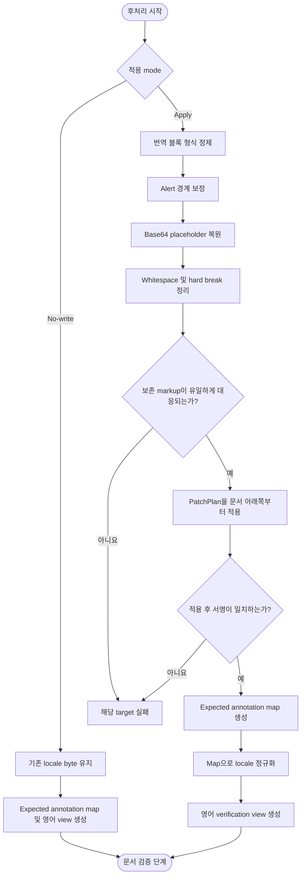

# 후처리 단계 설계

## 요약

`apply` mode에서는 actionable plan의 번역·결정적 블록을 정제·복원해 PatchPlan 적용.
`no-write` mode에서는 locale byte 유지.
두 mode 모두 영어 verification view와 expected annotation map을 생성해 문서 검증에 전달.

## 흐름도



## 1. 목적

번역이 완료된 locale 문서의 Markdown 형식을 정제하고 전처리 placeholder와 보존 markup을 복구하거나 no-write 입력 byte를 그대로 유지.
두 경로에서 현재 영어 원문 기반 검증 기준 생성.

---

## 2. 범위

후처리 단계가 소유하는 책임은 다음 다섯 가지로 한정.

| 책임 | 설명 |
|------|------|
| 블록 형식 정제 | `` self-closing 변환, 버전 placeholder 치환, alert 표준화, 제목 스타일 클래스 잔존 제거, trailing whitespace 정리 |
| placeholder 복원 | 예약 placeholder를 전처리에서 보관한 원본 값으로 복원 |
| 보존 markup 복구 | 번역 블록의 quote/list marker, heading, link, inline code, anchor, annotation을 유일하게 대응할 수 있을 때 복구 |
| 계획 적용·전체 정규화 | 정제된 블록을 PatchPlan에 따라 기존 locale 문서에 적용하고 전체 문서를 canonical form으로 정규화 |
| 검증 기준 | 현재 정규화 영어 원문에서 영어 verification view와 expected annotation map을 결정적으로 생성 |

번역 provider 호출, effective delta 계산, PatchPlan 생성과 response contract는 [번역 단계](./02-translation.md)의 책임.
입력 정규화와 placeholder 치환은 [전처리 단계](./01-preprocessing.md)의 책임.

---

## 3. 입력

| 입력 | 설명 |
|------|------|
| 기존 locale 문서 | source/target/unguarded 계획의 적용 전 문서. create 계획은 빈 문서 |
| PatchPlan | 소유 블록, 적용 위치와 source/target 서명을 포함한 변경 계획 |
| 번역·결정적 블록 집합 | response contract를 통과했거나 원문 구조로 확정된 블록. 전체 삭제는 명시적 delete tombstone |
| 현재 restore map | 전처리에서 생성한 현재 원문 placeholder와 원본 값의 대응표 |
| 버전 문자열 | 문서에 적용할 대상 버전 |
| 현재 정규화 영어 작업 사본 | 전처리가 생성한 new side. expected annotation map과 verification view 생성 기준 |
| stale-link registry snapshot | 승인 기준본의 `translation-sync/stale-links.json` byte와 SHA-256 digest |
| 적용 mode | actionable plan을 처리하는 `apply` 또는 PatchPlan이 없거나 모두 target인 `no-write` |

---

## 4. 출력

| 출력 | 설명 |
|------|------|
| candidate locale 문서 | `apply` mode의 정제·계획 적용 결과 또는 `no-write` mode의 기존 locale byte. 아직 candidate snapshot에는 적재되지 않음 |
| 영어 verification view | 현재 정규화 영어 작업 사본에 source-side 후처리와 현재 restore map 복원을 적용한 검증 기준 |
| expected annotation map | 구조 주소·ordered occurrence·canonical annotation byte의 순서 있는 목록 |
| 검증 입력 | candidate locale 문서, 영어 verification view, expected annotation map, version과 stale-link registry digest |

---

## 5. 불변 조건

1. 번역문을 임의로 다시 쓰는 것 금지.
2. 코드 블록 내부의 코드와 주석은 원문 영어 유지.
3. 이미 보존된 인라인 코드와 링크를 원문 등장 순서에 맞추기 위한 재배치 금지; 누락된 markup은 내용과 주변 문맥으로 유일하게 대응할 수 있을 때만 복구해야 함.
4. 링크 URL과 앵커는 원문대로 유지; 현재 영어 원문에서 깨진 것으로 확인된 내부 링크만 canonical 값으로 보정; 다른 본문 항목을 가리키도록 바뀐 단독 목차 링크의 label은 대상 heading과 일치; 그 밖의 label·title·구분자는 원본 span 보존.
5. fenced code 밖의 파이프라인용 placeholder는 최종 문서에 남지 않아야 함.
6. fenced code 내부 텍스트는 version/image/alert/title/HTML-comment 정제에서 제외.
7. 한 줄·여러 줄 inline code span 내부는 `` self-closing 변환에서 제외.
8. fenced code의 `{{version}}`은 예시 코드의 literal placeholder로 보고 치환 금지.
9. 본문의 명시적 Markdown hard break (trailing 공백 2개) 보존.
10. `{#stable-id}`는 보존하고 `{.class #id}` 형태에서는 class만 제거한 뒤 `{#id}` 유지.
11. `no-write` mode의 candidate locale 문서는 기존 locale 문서와 byte 단위로 같아야 함.
12. provider가 반환한 pipeline annotation을 형식 복구의 기준으로 사용하는 것 금지; `apply` mode의 최종 annotation은 expected annotation map byte로 교체해야 함.

---

## 6. 처리 순서

후처리는 반드시 아래 순서로 수행.

`apply` mode는 1~11을 모두 수행.
`no-write` mode는 locale 변환·계획 적용 단계 1~7과 9를 건너뛰고 기존 locale byte를 그대로 사용하며, 8의 expected annotation map 생성, 10의 영어 verification view 생성과 11의 검증 입력 결합만 수행.
`no-write` 결과가 검증에 실패해도 locale 문서 자동 정규화 금지.

```text
1. 각 번역 블록 형식 정제
   a. fenced code 밖의 버전 placeholder 치환
   b.  self-closing 변환
   c. 지원 legacy note marker의 canonical alert 변환
   d. 제목 스타일 클래스 잔존 제거
   e. 확인된 stale 내부 링크 target 보정과 필요한 목차 label 교체
   - pipeline annotation span은 rendered content 형식 정제에서 제외하고 9단계에서 canonical byte로 교체
2. alert 내부 fenced code의 blockquote 경계 보정
3. 각 블록의 Base64 이미지 placeholder를 현재 restore map으로 복원
4. trailing whitespace 정리와 명시적 hard break 보존
5. 보존 markup 복구
   - 이미 보존된 inline code와 link는 재배치하지 않음
   - 누락된 markup은 내용과 주변 문맥으로 유일하게 대응될 때만 복구
   - 복수 후보 또는 대응 불가 상태는 실패
6. 정제된 블록 수와 actionable plan 수 일치 확인
   - target plan에는 결과 블록이 없어야 함
7. actionable plan 적용
   - source/unguarded 계획은 기존 문서 아래쪽부터 역순 적용
   - create 계획은 빈 locale 문서에 전체 계획 순서대로 적용
   - delete tombstone은 대응하는 기존 소유 블록을 제거하며 빈 번역 응답으로 해석하지 않음
   - target 상태는 no-op
   - 계획 밖의 locale 블록은 변경하지 않음
   - 적용 후 annotation-backed 서명이 목표 서명과 일치해야 함
8. expected annotation map 생성
   - 현재 정규화 영어 작업 사본을 delta와 무관한 최종 문서 소유 단위로 나누고 annotatable 단위의 구조 주소·ordered occurrence 확정
   - 표는 수정·create 여부와 무관하게 현재 표 전체를 단일 owner로 사용하고, 표 첫 행 바로 앞의 canonical annotation 하나만 허용
   - source text에 version 치환, 현재 restore map 복원과 literal `-->` escape를 적용하여 canonical annotation byte 생성
   - stale-link 보정은 HTML 주석 내부를 바꾸지 않으므로 annotation source text에는 적용하지 않음
9. 적용 완료 locale 문서 전체 정규화
   - expected annotation map으로 annotation 추가·교체·정렬
   - 표 수정 응답의 임시 행 annotation을 제거하고 표 전체 annotation 하나로 수렴하며 표 행 사이 주석을 허용하지 않음
   - 지원 legacy alert와 대응 annotation을 canonical form으로 정규화
   - registry가 지정한 폐기 목록 label의 inline-code wrapper를 일반 label로 수렴
10. 영어 verification view 생성
   - 현재 정규화 영어 작업 사본에 version, img, alert, heading class, stale-link 정규화를 같은 순서로 적용
   - 현재 restore map으로 placeholder 복원
   - pipeline annotation과 locale 번역문은 추가하지 않음
11. candidate locale 문서, 영어 verification view와 expected annotation map을 같은 검증 입력 hash로 묶어 문서 검증 단계에 전달
```

Base64 복원은 블록 형식 정제가 끝난 뒤 수행하여 복원된 data URI가 다른 정제 규칙에 의해 변경되지 않게 해야 함.
전체 문서 정규화는 PatchPlan 적용 뒤 한 번 수행해야 함.

---

## 7. 형식 정제 세부

### 7.1 `` self-closing 변환

- 닫는 태그가 없는 HTML `` 태그를 self-closing 형식으로 변환.
- tag end 탐색 시 따옴표 속성과 balanced JSX `{...}` 안의 `>`를 건너뜀.
- 마지막 속성 값이 따옴표 없는 형식이면 값과 closing slash 사이에 공백 삽입.
- 이미 self-closing인 태그는 변경 금지.
- HTML 주석 내부의 ``는 변환 금지.
- malformed 또는 닫히지 않은 expression/tag는 복구 금지.

### 7.2 GitHub Markdown alert 표준화

지원하는 legacy marker를 canonical form으로 변환.

| 원문 표현 | canonical form |
|-----------|----------------|
| `{note}`, `Note`, `Note:`, `**Note**`, `**Note:**`, `참고`, `注意`, `注` | `[!NOTE]` |
| `{tip}`, `Tip`, `Tip:`, `**Tip**`, `**Tip:**` | `[!TIP]` |
| `{warning}`, `Warning`, `Warning:`, `**Warning**`, `**Warning:**` | `[!WARNING]` |
| `{caution}`, `Caution`, `Caution:`, `**Caution**`, `**Caution:**` | `[!CAUTION]` |
| `{important}`, `Important`, `Important:`, `**Important**`, `**Important:**` | `[!IMPORTANT]` |

- 후처리는 marker만 바꾸고 본문 번역 금지.
- 지원 범위 밖의 임의 표현을 `[!NOTE]`로 추정 변환 금지.
- 1~3칸 들여쓴 blockquote marker는 변환 대상 아님.

### 7.3 `{{version}}` 치환

- fenced code 밖의 모든 `{{version}}`을 대상 버전 문자열로 치환.
- 영어 주석, 링크 URL 안의 `{{version}}`도 치환.
- fenced code 안의 `{{version}}`은 literal placeholder로 보고 유지.

### 7.4 제목 스타일 클래스 제거

- Markdown heading 줄의 `{.class-name}` 패턴 제거.
- `{#stable-id}` 보존.
- 본문 내 의미 있는 중괄호 표현 유지.

### 7.5 stale 내부 링크 보정

- 현재 지원 버전의 영어 원문에서 실제로 깨진 내부 링크만 등록하고 canonical 대상으로 보정.
- 비슷한 target 패턴을 다른 버전으로 추정 확장하는 것 금지, 현재 원문에서 정상적으로 연결되는 링크도 등록 금지.
- fenced code, inline code, HTML 주석 안은 변경 금지.
- 단독 목차 링크가 다른 본문 항목으로 대체된 경우 target을 옮기고 label을 대상 heading과 일치시킴.
- `to=null` 규칙은 `retire_mode`가 지정한 실제 원문 문맥에만 적용, `standalone-list-label`은 목록 label의 일반 텍스트로 남기고 `bare-inline-code`는 표시 label의 inline code로 유지.

### 7.6 Stale-link registry

stale link 정규화 규칙의 유일한 소스는 version-controlled `translation-sync/stale-links.json`.
후처리 단계가 schema 검증과 적용을 소유하고, 문서 검증 단계는 이 단계가 만든 영어 verification view, expected annotation map과 registry digest만 소비.

```json
{
  "schema_version": 1,
  "links": [
    {
      "version": "master",
      "from": "/docs/master/old#fragment",
      "to": "/docs/master/new#fragment",
      "retire_mode": null
    }
  ]
}
```

- `version`과 `from` 조합은 유일해야 하며 `links`는 두 값의 UTF-8 byte 순으로 정렬해야 함.
- top-level은 `schema_version`, `links`만, 각 entry는 `version`, `from`, `to`, `retire_mode`만 가져야 하며 누락 필드와 추가 필드 허용 금지.
- `to`는 canonical target 문자열 또는 `null`.
- `to=null`이면 `retire_mode`는 `standalone-list-label` 또는 `bare-inline-code`여야 하고 그 밖에는 `retire_mode=null`이어야 함.
- 각 규칙은 현재 지원 버전의 영어 원문에 존재하는 깨진 내부 링크와 대응해야 하며, `to`가 있는 규칙은 보정 후 대상 파일이 존재하고 fragment가 있으면 명시적 앵커도 존재해야 함.
- 영어 원문 갱신으로 기존 target이 유효해지거나 링크가 사라지면 registry 검사가 실패해야 하며 새 원문 근거에 맞춰 규칙을 제거하거나 수정해야 함.
- 파일이 없거나 schema·정렬·중복 규칙을 위반하면 설정 오류; 규칙이 없을 때도 빈 `links` 배열을 가진 파일 사용.
- 파일은 UTF-8, LF, 마지막 newline 1개와 예시의 key 순서를 사용하는 canonical JSON으로 직렬화.
- 실행 중 registry 변경 금지, 입력 byte의 SHA-256 digest를 verified locale artifact에 포함.

### 7.7 Expected annotation map

```json
{
  "schema_version": 1,
  "entries": [
    {
      "structural_address": "section:introduction/paragraph:1",
      "occurrence": 1,
      "annotation": "<!-- Current English source. -->"
    }
  ]
}
```

- `entries`는 영어 문서 순서이며 structural address가 같은 항목은 1부터 시작하는 `occurrence`로 구별.
- annotatable 여부와 source text 경계는 [번역 단계](./02-translation.md)의 최종 문서 소유 단위·annotation 규칙을 사용하고 provider 요청의 delta별 임시 경계는 map에 포함하지 않으며, 표는 항상 현재 표 전체가 단일 entry.
- `annotation`은 여는 `<!--`, 공백, 정규화된 source text, 공백, 닫는 `-->`까지 포함한 완전한 canonical comment byte.
- top-level과 entry는 예시의 필드만 가져야 하며, map은 임시 검증 산출물로서 candidate 또는 publication tree에 기록 금지.
- map은 2-space indent, UTF-8, LF, 마지막 newline 1개와 예시의 key 순서로 직렬화.
- 이 canonical JSON byte의 SHA-256 digest를 검증 입력 hash에 포함.

### 7.8 검증 입력 hash

다음 envelope의 object key를 UTF-8 byte 순으로 정렬하고 불필요한 공백 없는 UTF-8 JSON 뒤에 LF 하나를 붙인 byte를 SHA-256으로 계산.

```json
{
  "annotation_map_sha256": "<lowercase hex>",
  "english_view_sha256": "<lowercase hex>",
  "locale_sha256": "<lowercase hex>",
  "registry_sha256": "<lowercase hex>",
  "schema_version": 1,
  "version": "master"
}
```

각 digest는 대응하는 정확한 UTF-8 artifact byte의 SHA-256.
검증기는 시작 snapshot과 artifact 생성 직전에 호출할 독립 final snapshot loader를 함께 수신.
Loader는 candidate locale, 영어 verification view, expected annotation map, version과 stale-link registry를 각 소유 source에서 새로 읽어 envelope와 hash를 다시 만들어야 함.
시작 때 전달받은 객체나 registry를 그대로 다시 hash하는 것은 종료 재계산으로 인정하지 않음.
두 snapshot의 canonical envelope가 다르면 verified locale artifact 생성 금지.

---

## 8. placeholder 복원 세부

- 전처리에서 생성한 현재 restore map을 사용하여 `__BASE64_IMAGE_<N>__`을 현재 원문의 data URI로 치환.
- 매핑이 없으면 임의 데이터 생성 금지.
- fenced code 밖에 미복원 placeholder가 남은 결과는 이 단계에서 `POSTPROCESS_RESIDUE`로 차단하고 검증 입력으로 전달 금지; [문서 검증 단계](./04-verification.md)의 잔존 검사는 이 경계를 우회한 결함을 막는 방어적 검사이며 어느 경우에도 locale 파일로 기록 금지.

---

## 9. 보존 markup 복구 세부

부분 번역 블록에 대해 일반 후처리 뒤 검증 전에 다음 항목 복구.

| 복구 대상 | 조건 |
|-----------|------|
| blockquote `>` marker | 원문 블록 전체가 blockquote일 때 |
| 목록 marker (`-`, `*`, `+`) | 원문 블록 전체가 순수 순서 없는 목록이고 항목 일대일 대응 가능할 때 |
| heading | 원문 기준으로 복구 |
| link label / target / title | URL, separator, 따옴표 형태(작은따옴표·큰따옴표·괄호) 포함 보존 |
| inline code | 원문 기준으로 복구 |
| named anchor | 원문 기준으로 복구 |
| annotation | expected annotation map의 canonical byte로 추가·교체·정렬 |

- 이미 올바르게 보존된 inline code, link와 anchor의 순서를 원문 순서에 맞추기 위한 변경 금지.
- 누락된 markup은 내용과 주변 문맥으로 source 항목 하나에 유일하게 대응할 때만 복구해야 함.
- 동일한 후보가 여러 개이거나 locale 어순 변경 때문에 대응을 증명할 수 없으면 임의 복구하지 않고 실패해야 함.
- 복구 뒤에도 남은 구조 불일치는 문서 검증 단계에서 실패 처리해야 함.

---

## 10. 실패 정책

후처리는 **fail-closed** 원칙을 준수.

| 실패 유형 | 처리 |
|-----------|------|
| 번역 단계에서 실패한 블록 | 후처리 입력으로 전달하지 않음 |
| 현재 restore map 부재 또는 복원 불가 | 해당 target 실패, 계획 적용 금지 |
| stale-link registry 부재·schema 위반·실행 중 digest 변경 | 실행 전체 실패, 계획 적용 금지 |
| 보존 markup 대응이 모호하거나 복구 불가 | 해당 target 실패, 계획 적용 금지 |
| actionable plan 수와 정제 블록 수 불일치 또는 target plan 출력 존재 | 해당 target 실패, 계획 적용 금지 |
| 적용 뒤 목표 서명 불일치 | 최종 문서 폐기, 기존 locale 문서 보존 |
| 영어 verification view 또는 expected annotation map을 결정적으로 생성할 수 없음 | 해당 target 실패, candidate 적재 금지 |
| `no-write` mode에서 locale byte가 달라짐 | 해당 target 실패, 변경 결과 폐기 |

후처리는 provider 호출 실패를 복구하지 않음.
후처리 결과는 active worktree나 candidate snapshot에 직접 기록하지 않고 [문서 검증 단계](./04-verification.md)에 전달해야 함.

---

## 11. 수용 기준

후처리 출력이 다음 조건을 모두 만족해야 [문서 검증 단계](./04-verification.md)로 전달 가능.

1. fenced code 밖에 `__BASE64_IMAGE_<N>__` placeholder가 남아 있지 않음.
2. fenced code 밖에 `{{version}}` placeholder가 남아 있지 않음.
3. 지원 legacy note marker가 canonical GitHub Markdown alert form으로 변환됨.
4. heading 줄에 `{.class-name}` 패턴이 남아 있지 않음 (`{#id}`는 허용).
5. 모든 `` 태그가 self-closing 형식임 (fenced code·inline code 내부 제외).
6. candidate locale의 annotation byte·순서·구조 주소가 expected annotation map과 일치.
7. 계획 밖의 locale 블록과 source-authored 구조가 변경되지 않음.
8. 영어 verification view와 expected annotation map이 현재 정규화 영어 작업 사본, current restore map, version과 stale-link registry digest에서 결정적으로 생성됨.
9. `no-write` mode에서는 candidate locale 문서와 기존 locale 문서의 byte가 같음.
