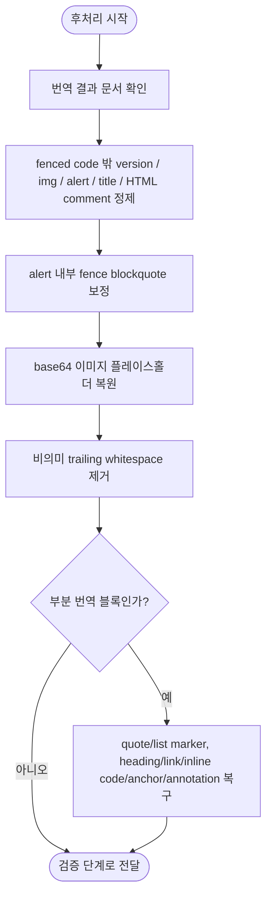

# 번역 후 후처리 계획

## 단계 흐름



---

## 1. 작업 목적

번역이 완료된 locale 문서의 Markdown 구조, HTML 태그, 노트 형식, 버전 플레이스홀더, base64 이미지 플레이스홀더를 최종 문서 형식에 맞게 정제한다.

후처리의 목표는 다음과 같다.

- `` 태그를 self-closing 형식으로 표준화한다.
- 지원하는 영어 `Note`, `Tip`, `Warning`, `Caution`, `Important` legacy marker를 GitHub Markdown alert 형식으로 표준화한다(구현 내부 명칭은 admonition이다).
- `{{version}}` 플레이스홀더를 최종 문서용 버전 문자열로 치환한다.
- 제목 옆 원문 스타일 클래스가 남아 있으면 제거한다.
- 전처리에서 치환한 base64 이미지 플레이스홀더를 원본으로 복원한다.
- Markdown/HTML 형식을 후처리 규칙에 맞게 정제한다.

---

## 2. 입력 자료

### 2.1 번역 완료 문서

provider가 정상 반환한 한국어 또는 일본어 Markdown이다.

기본 구조는 다음과 같다.

```md
<!-- Original English sentence. -->
한국어 번역문입니다.
```

### 2.2 플레이스홀더 매핑

전처리에서 base64 이미지를 치환했다면, 원본 값과 플레이스홀더 매핑이 필요하다.

```md
| Placeholder | Original |
|---|---|
| `__BASE64_IMAGE_001__` | `data:image/png;base64,...` |
```

### 2.3 버전 문자열

문서 내 `{{version}}` 플레이스홀더를 치환할 대상 버전이다.

예:

```text
master
13.x
12.x
11.x
10.x
9.x
8.x
```

작업 시작 전에 이번 문서에 적용할 버전 문자열을 확정한다.

---

## 3. 후처리 원칙

1. 번역문을 임의로 다시 쓰지 않는다.
2. 정제 대상은 문서 형식, Markdown 구조, 코드/링크/이미지/노트 처리로 제한한다.
3. 코드 블록 내부의 코드는 번역하지 않는다.
4. 코드 블록 내부의 주석도 원문 영어를 유지한다.
5. 인라인 코드는 원문과 동일하게 유지하는 것이 계약이다. 공통 parser와 verifier는 임의 너비의 backtick delimiter와 여러 줄 code span을 비교하며, 백슬래시로 escape된 여는 backtick은 code span으로 세지 않는다.
6. 링크 URL과 앵커는 원문대로 유지한다. 단, 실제 대상과 어긋난 알려진 upstream stale 내부 링크는 코드·인라인 코드·HTML 주석 밖에서만 canonical 대상으로 보정한다. 대응 대상이 폐기된 fragment 링크는 standalone 목록 항목이면 목록 label의 일반 텍스트로, 그 밖의 bare link이면 표시 label의 inline code로 남긴다.
7. 전처리에서 치환한 base64 이미지는 원본 그대로 복원한다.
8. fenced code 밖의 파이프라인용 플레이스홀더가 최종 문서에 남지 않게 한다.

---

## 4. 후처리 순서

후처리는 다음 순서로 진행한다.

```text
1. 번역 결과 문서 수령
2. fenced code 밖의 {{version}} 치환,  self-closing, GitHub Markdown alert 표준화, 제목 스타일 클래스 제거, 알려진 stale 내부 링크 대상 보정
3. alert 안의 fenced code를 blockquote 형식으로 보정
4. base64 이미지 플레이스홀더 복원
5. 일반 trailing whitespace 제거(본문의 명시적 Markdown hard break인 공백 2개는 보존)
6. 부분 번역 블록이면 보존 Markdown 복구 후 블록 검증
7. PatchPlan 적용 뒤 최신 전체 원문 기준으로 locale 문서의 annotation과 지원 legacy alert를 다시 정규화
```

권장 순서:

- base64 이미지 복원은 모든 텍스트 정제가 끝난 뒤 수행한다.
- fenced code 내부 텍스트는 version/image/alert/title/HTML-comment 정제에서 제외한다. `` self-closing 변환은 한 줄·여러 줄 inline code span도 제외한다. 단, 최종 trailing whitespace 제거는 fenced code의 각 줄에도 적용한다.
- 전처리 누락분은 후처리에서 보완하되, 의미 있는 본문은 변경하지 않는다.

### 4.1 부분 블록의 보존 Markdown 복구

부분 번역 블록은 일반 후처리 뒤, 검증 전에 다음과 같이 제한적으로 복구한다.

- 원문 블록 전체가 blockquote이면 누락된 `>`를 복원한다.
- 원문 블록 전체가 순수한 순서 없는 목록이고 항목을 일대일로 대응할 수 있으면 `-`, `*`, `+` marker를 복원한다.
- 제목, Markdown 링크 label/target/title, 단순 인라인 코드와 named anchor를 원문 기준으로 복구한다.
- 필요한 원문 병기 annotation을 정렬하거나 추가한다.

구조를 안전하게 일대일 대응할 수 없으면 임의로 고치지 않는다. 복구 후보 중 verifier 위반이 가장 적은 결과를 사용하고, 남은 구조 불일치는 블록 검증과 최종 문서 검증에서 실패한다. Markdown 링크를 복구할 때 URL과 함께 title 앞 separator 및 작은따옴표·큰따옴표·괄호 형태의 title도 보존한다.

### 4.2 PatchPlan 적용 뒤 전체 문서 정규화

부분 patch는 변경 블록 밖의 기존 locale 문맥을 그대로 보존한다. 따라서 적용 뒤에는 최신 전체 영어 기준본으로 annotation을 다시 정렬하고, 지원 legacy alert와 그에 대응하는 원문 annotation을 함께 canonical form으로 정규화한 뒤 최종 verifier를 실행한다. 이 단계는 번역 prose를 임의로 다시 쓰지 않으며, 구조·주석·지원 alert 형식과 알려진 stale 내부 링크 대상만 정제한다. 이전 실행이 남긴 폐기 목록 label의 inline-code wrapper도 일반 목록 label로 수렴시킨다. 링크 보정은 fenced code, inline code, HTML 주석 안을 건드리지 않는다.

---

## 5. `` 태그를 self-closing 형식으로 변환

닫는 태그가 없는 HTML 이미지 태그를 self-closing 형식으로 변환한다.

tag end는 따옴표 속성과 balanced JSX `{...}` 안의 `>`를 건너뛴 뒤 찾는다. JSX expression 안의 작은따옴표·큰따옴표와 template literal, 그 안의 escape 문자도 처리한다. 이미 self-closing인 JSX 이미지도 원문 그대로 유지한다.

이 scanner는 공통 backtick parser로 한 줄·여러 줄 inline code span 안의 ``를 보존한다. 마지막 속성 값이 따옴표 없는 형식이면 값과 closing slash 사이에 공백을 넣어 slash가 속성 값 일부가 되지 않게 한다. 완전한 HTML/JSX parser는 아니므로 malformed 또는 닫히지 않은 expression/tag는 복구하지 않는다.

### 5.1 변환 예시

변환 전:

```html

```

변환 후:

```html

```

### 5.2 처리 대상

```html

```

### 5.3 처리 제외

이미 self-closing 형식인 경우 변경하지 않는다.

```html

```

### 5.4 유지해야 하는 속성

다음 속성은 유지한다.

- `src`
- `alt`
- `width`
- `height`
- `class`
- `id`
- `loading`
- `data-*`

최종 verifier는 원문과 번역문의 HTML `` 값과 순서를 정확히 비교한다. `alt` 같은 표시용 속성은 번역할 수 있지만 `src` 변경·누락이나 `data-src`로의 대체는 쓰기 전에 실패한다.

예:

```html

```

변환 후:

```html

```

---

## 6. 지원하는 legacy note marker를 GitHub Markdown alert 형식으로 표준화

문서 내 영어 `Note`, `Tip`, `Warning`, `Caution`, `Important`의 `{type}`, bold, `Type:` 형식을 GitHub Markdown alert 형식으로 표준화한다. 한국어 `참고`와 일본어 `注意`·`注` marker도 `[!NOTE]`로 표준화한다. `Tooltip`, `Advisory`와 1~3칸 들여쓴 blockquote marker는 현재 자동 변환 범위가 아니다.

후처리는 marker만 바꾸고 본문을 번역하지 않는다. 아래 변환 전 본문은 provider가 이미 번역한 결과다.

기본 형식:

```md
> [!NOTE]
> 메시지입니다.
```

### 6.1 `{note}` 형식 변환

변환 전:

```md
> {note}
> 이 기능은 최신 버전에서만 사용할 수 있습니다.
```

변환 후:

```md
> [!NOTE]
> 이 기능은 최신 버전에서만 사용할 수 있습니다.
```

### 6.2 `> **Note**` 형식 변환

변환 전:

```md
> **Note**
> 이 설정은 새 프로젝트에만 적용됩니다.
```

변환 후:

```md
> [!NOTE]
> 이 설정은 새 프로젝트에만 적용됩니다.
```

### 6.3 `> Note:` 형식 변환

변환 전:

```md
> Note: 이 작업은 실행 취소할 수 없습니다.
```

변환 후:

```md
> [!NOTE]
> 이 작업은 실행 취소할 수 없습니다.
```

### 6.4 한 줄 노트 변환

변환 전:

```md
> **Note:** 서버를 다시 시작해야 합니다.
```

변환 후:

```md
> [!NOTE]
> 서버를 다시 시작해야 합니다.
```

### 6.5 여러 줄 노트 변환

변환 전:

```md
> **Note**
> 이 기능에는 관리자 권한이 필요합니다.
> 액세스할 수 없는 경우 관리자에게 문의하세요.
```

변환 후:

```md
> [!NOTE]
> 이 기능에는 관리자 권한이 필요합니다.
> 액세스할 수 없는 경우 관리자에게 문의하세요.
```

### 6.6 노트 유형별 표준화

가능하면 원문 의미에 따라 다음 형식으로 표준화한다.

| 원문 표현                      | 표준 형식          |
|----------------------------|----------------|
| `Note`, `{note}`           | `[!NOTE]`      |
| `Tip`, `{tip}`             | `[!TIP]`       |
| `Warning`, `{warning}`     | `[!WARNING]`   |
| `Caution`, `{caution}`     | `[!CAUTION]`   |
| `Important`, `{important}` | `[!IMPORTANT]` |
| `참고`, `注意`, `注`       | `[!NOTE]`      |

지원하는 영어 원문 유형은 표의 타입을 그대로 유지한다. 그 밖의 임의 tooltip/advisory 표현을 `[!NOTE]`로 추정 변환하지 않는다.

---

## 7. `{{version}}` 플레이스홀더 치환

문서 내 `{{version}}` 플레이스홀더를 최종 문서에 적용할 버전 문자열로 치환한다.

### 7.1 입력

```md
Install version {{version}} of the package.
```

### 7.2 버전 문자열

```text
12.x
```

### 7.3 출력

```md
Install version 12.x of the package.
```

또는 한국어 번역문:

```md
패키지의 12.x 버전을 설치합니다.
```

### 7.4 처리 원칙

- fenced code block 밖의 `{{version}}`을 동일한 값으로 치환한다.
- 영어 주석 안의 `{{version}}`도 필요한 경우 치환한다.
- 링크 URL 안의 `{{version}}`도 치환한다.
- fenced code block 안의 `{{version}}`은 예시 코드의 literal placeholder로 보고 원문 그대로 유지한다.

### 7.5 치환 제외

fenced code block에서 `{{version}}` 자체를 보여주는 경우에는 원문을 유지한다.

```text
{{version}}
```

---

## 8. 제목 옆 원문 스타일 클래스 잔존 보완

후처리에서는 사전 정제에서 누락된 제목 옆 스타일 클래스를 제거한다.

### 8.1 제거되어야 하는 예

```md
### `after()` {.collection-method}

## Overview {.section}

# API Reference {.page-title}
```

### 8.2 제거 후

```md
### `after()`

## Overview

# API Reference
```

### 8.3 처리 규칙

- Markdown 제목 줄에서만 처리한다.
- 제목 텍스트는 변경하지 않는다.
- 인라인 코드, 링크, 앵커는 유지한다.
- `{.class-name}` 형식의 스타일 클래스만 제거한다.
- `{#stable-id}`는 보존하고 mixed `{.old #stable-id}`에서는 class만 제거한다.
- 본문 내 의미 있는 중괄호 표현은 유지한다.

유지해야 하는 예:

```md
Use `{ key: value }` to configure the object.
```

---

## 9. base64 이미지 플레이스홀더 복원

전처리에서 치환한 base64 이미지 플레이스홀더를 원본 값으로 복원한다.

### 9.1 복원 예시

복원 전:

```html

```

복원 후:

```html

```

### 9.2 복원 실패 처리

- 매핑이 없어 복원하지 못한 플레이스홀더는 미복원 상태로 둔다.
- 원본 플레이스홀더 매핑을 기준으로 복원하며, 매핑이 없으면 임의로 데이터를 생성하지 않는다.
- fenced code 밖에 미복원 플레이스홀더가 남으면 verifier가 `unrestored base64 placeholder`로 실패시키므로 locale 파일은 기록하지 않는다.

---

## 10. 예외 케이스

후처리는 provider가 정상 반환한 번역 결과에만 형식 정제를 수행한다. OpenAI / Azure API 장애나 CLI timeout을 이 단계에서 해결하지 않는다.

### 미완료 번역

다음 상태는 번역 단계에서 target 실패로 처리하고 후처리 입력으로 전달하지 않는다.

- 번역 단계에서 초기 요청을 포함한 OpenAI / Azure API 총 3회 시도 실패(재시도는 2회)
- CLI provider timeout 재시도 실패
- provider 응답이 비어 있거나 공백뿐임

처리 기준:

1. 최대 재시도 후 `IncompleteTranslation`으로 해당 locale target을 실패시킨다.
2. 미완료 블록을 임의로 번역하거나 보완하지 않는다.
3. 기존 locale 파일을 기록하지 않는다.

### 플레이스홀더 복원 실패

base64 이미지 플레이스홀더 복원에 실패하면 임의로 데이터를 재생성하지 않는다.

처리 기준:

- 원본 플레이스홀더 매핑을 참고한다.
- 매핑이 없으면 플레이스홀더를 임의로 복원하지 않는다.
- 매핑 누락 위치는 미복원 상태로 두고 verifier 실패로 쓰기를 차단한다.
