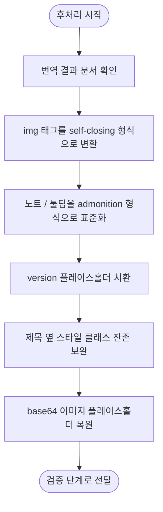

# 번역 후 후처리 계획

## 단계 흐름



---

## 1. 작업 목적

번역이 완료된 한국어 문서의 Markdown 구조, HTML 태그, 노트 형식, 버전 플레이스홀더, base64 이미지 플레이스홀더를 최종 문서 형식에 맞게 정제한다.

후처리의 목표는 다음과 같다.

- `` 태그를 self-closing 형식으로 표준화한다.
- 다양한 노트/툴팁 표현을 Markdown admonition 형식으로 표준화한다.
- `{{version}}` 플레이스홀더를 최종 문서용 버전 문자열로 치환한다.
- 제목 옆 원문 스타일 클래스가 남아 있으면 제거한다.
- 전처리에서 치환한 base64 이미지 플레이스홀더를 원본으로 복원한다.
- Markdown/HTML 형식을 후처리 규칙에 맞게 정제한다.

---

## 2. 입력 자료

### 2.1 번역 완료 문서

기존 작업 방식에 따라 번역된 한국어 문서다.

기본 구조는 다음과 같다.

```md
<!-- Original English sentence. -->
한국어 번역문입니다.
```

### 2.2 플레이스홀더 매핑

전처리에서 base64 이미지를 치환했다면, 원본 값과 플레이스홀더 매핑이 필요하다.

```md
| Placeholder | Original |
|---|---|
| `__BASE64_IMAGE_001__` | `data:image/png;base64,...` |
```

### 2.3 버전 문자열

문서 내 `{{version}}` 플레이스홀더를 치환할 대상 버전이다.

예:

```text
master
12.x
11.x
stable
latest
```

작업 시작 전에 이번 문서에 적용할 버전 문자열을 확정한다.

---

## 3. 후처리 원칙

1. 번역문을 임의로 다시 쓰지 않는다.
2. 정제 대상은 문서 형식, Markdown 구조, 코드/링크/이미지/노트 처리로 제한한다.
3. 코드 블록 내부의 코드는 번역하지 않는다.
4. 코드 블록 내부의 주석도 원문 영어를 유지한다.
5. 인라인 코드는 원문과 동일하게 유지한다.
6. 링크 URL과 앵커는 변경하지 않는다.
7. 전처리에서 치환한 base64 이미지는 원본 그대로 복원한다.
8. 최종 문서에 불필요한 플레이스홀더가 남지 않게 한다.

---

## 4. 후처리 순서

후처리는 다음 순서로 진행한다.

```text
1. 번역 결과 문서 수령
2.  태그 self-closing 변환
3. 노트/툴팁 admonition 형식 표준화
4. {{version}} 플레이스홀더 치환
5. 제목 옆 스타일 클래스 제거
6. base64 이미지 플레이스홀더 복원
```

권장 순서:

- base64 이미지 복원은 모든 텍스트 정제가 끝난 뒤 수행한다.
- 코드 블록 내부 텍스트는 이후 정제 대상에서 제외한다.
- 전처리 누락분은 후처리에서 보완하되, 의미 있는 본문은 변경하지 않는다.

---

## 5. `` 태그를 self-closing 형식으로 변환

닫는 태그가 없는 HTML 이미지 태그를 self-closing 형식으로 변환한다.

### 5.1 변환 예시

변환 전:

```html

```

변환 후:

```html

```

### 5.2 처리 대상

```html

```

### 5.3 처리 제외

이미 self-closing 형식인 경우 변경하지 않는다.

```html

```

### 5.4 유지해야 하는 속성

다음 속성은 유지한다.

- `src`
- `alt`
- `width`
- `height`
- `class`
- `id`
- `loading`
- `data-*`

예:

```html

```

변환 후:

```html

```

---

## 6. 노트/툴팁 admonition 형식 표준화

문서 내 다양한 형태의 노트, 팁, 경고 표현을 Markdown admonition 형식으로 표준화한다.

기본 형식:

```md
> [!NOTE]
> 메시지입니다.
```

### 6.1 `{note}` 형식 변환

변환 전:

```md
> {note}
> This feature is available only in the latest version.
```

변환 후:

```md
> [!NOTE]
> 이 기능은 최신 버전에서만 사용할 수 있습니다.
```

### 6.2 `> **Note**` 형식 변환

변환 전:

```md
> **Note**
> This setting applies only to new projects.
```

변환 후:

```md
> [!NOTE]
> 이 설정은 새 프로젝트에만 적용됩니다.
```

### 6.3 `> Note:` 형식 변환

변환 전:

```md
> Note: This operation cannot be undone.
```

변환 후:

```md
> [!NOTE]
> 이 작업은 실행 취소할 수 없습니다.
```

### 6.4 한 줄 노트 변환

변환 전:

```md
> **Note:** You must restart the server.
```

변환 후:

```md
> [!NOTE]
> 서버를 다시 시작해야 합니다.
```

### 6.5 여러 줄 노트 변환

변환 전:

```md
> **Note**
> This feature requires administrator permissions.
> Contact your administrator if you cannot access it.
```

변환 후:

```md
> [!NOTE]
> 이 기능에는 관리자 권한이 필요합니다.
> 액세스할 수 없는 경우 관리자에게 문의하세요.
```

### 6.6 노트 유형별 표준화

가능하면 원문 의미에 따라 다음 형식으로 표준화한다.

| 원문 표현                      | 표준 형식          |
|----------------------------|----------------|
| `Note`, `{note}`           | `[!NOTE]`      |
| `Tip`, `{tip}`             | `[!TIP]`       |
| `Warning`, `{warning}`     | `[!WARNING]`   |
| `Caution`, `{caution}`     | `[!CAUTION]`   |
| `Important`, `{important}` | `[!IMPORTANT]` |

원문 유형이 명확하면 의미에 맞는 타입을 유지한다. 유형이 명확하지 않은 일반 노트와 툴팁은 `[!NOTE]`로 변환한다.

---

## 7. `{{version}}` 플레이스홀더 치환

문서 내 `{{version}}` 플레이스홀더를 최종 문서에 적용할 버전 문자열로 치환한다.

### 7.1 입력

```md
Install version {{version}} of the package.
```

### 7.2 버전 문자열

```text
12.x
```

### 7.3 출력

```md
Install version 12.x of the package.
```

또는 한국어 번역문:

```md
패키지의 12.x 버전을 설치합니다.
```

### 7.4 처리 원칙

- 문서 전체의 `{{version}}`을 동일한 값으로 치환한다.
- 영어 주석 안의 `{{version}}`도 필요한 경우 치환한다.
- 링크 URL 안의 `{{version}}`도 치환한다.
- 코드 블록 안의 `{{version}}`도 실제 문서에서 필요한 값이면 치환한다.
- 단, 예시 코드에서 의도적으로 플레이스홀더 자체를 보여주는 경우는 치환하지 않는다.

### 7.5 치환 제외

예시 코드에서 의도적으로 `{{version}}` 자체를 보여주는 경우에는 원문을 유지한다.

```text
{{version}}
```

---

## 8. 제목 옆 원문 스타일 클래스 잔존 보완

후처리에서는 사전 정제에서 누락된 제목 옆 스타일 클래스를 제거한다.

### 8.1 제거되어야 하는 예

```md
### `after()` {.collection-method}

## Overview {.section}

# API Reference {.page-title}
```

### 8.2 제거 후

```md
### `after()`

## Overview

# API Reference
```

### 8.3 처리 규칙

- Markdown 제목 줄에서만 처리한다.
- 제목 텍스트는 변경하지 않는다.
- 인라인 코드, 링크, 앵커는 유지한다.
- `{.class-name}` 형식의 스타일 클래스만 제거한다.
- 본문 내 의미 있는 중괄호 표현은 유지한다.

유지해야 하는 예:

```md
Use `{ key: value }` to configure the object.
```

---

## 9. base64 이미지 플레이스홀더 복원

전처리에서 치환한 base64 이미지 플레이스홀더를 원본 값으로 복원한다.

### 9.1 복원 예시

복원 전:

```html

```

복원 후:

```html

```

### 9.2 복원 실패 처리

- 매핑이 없어 복원하지 못한 플레이스홀더는 미복원 상태로 둔다.
- 원본 플레이스홀더 매핑을 기준으로 복원하며, 매핑이 없으면 임의로 데이터를 생성하지 않는다.

---

## 10. 예외 케이스

후처리는 번역 결과 문서에 대해 가능한 형식 정제만 수행한다. OpenAI / Azure API 장애나 CLI timeout이 있더라도 후처리 단계에서 provider 문제를 해결하지 않는다.

### 미완료 번역 포함

다음 상태가 있어도 후처리 단계에서는 provider 문제를 직접 해결하지 않는다.

- 번역 단계에서 OpenAI / Azure API 재시도 3회 실패
- CLI provider timeout 재시도 실패
- provider 응답이 중간에 끊김

처리 기준:

1. 미완료 chunk와 provider 오류를 수정하지 않는다.
2. 미완료 블록의 본문을 임의로 번역하거나 보완하지 않는다.
3. 후처리 가능한 형식 정제만 수행한다.
4. 후처리 결과를 검증 단계로 전달한다.

### 후처리 중 API 장애 발견

후처리 도중 API 장애 상태를 발견해도 후처리 단계에서 직접 처리하지 않는다.

처리 기준:

- 실패한 chunk와 provider 오류를 삭제하지 않는다.
- 실패 chunk 주변의 플레이스홀더는 매핑이 있으면 복원한다.
- 후처리 단계는 provider 문제를 직접 처리하지 않는다.

### 플레이스홀더 복원 실패

base64 이미지 플레이스홀더 복원에 실패하면 임의로 데이터를 재생성하지 않는다.

처리 기준:

- 원본 플레이스홀더 매핑을 참고한다.
- 매핑이 없으면 플레이스홀더를 임의로 복원하지 않는다.
- 매핑 누락 위치는 미복원 상태로 둔다.
