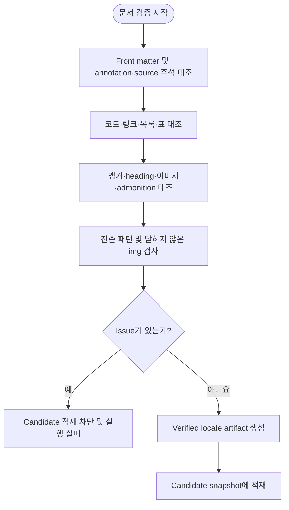

# 문서 검증 단계 설계

## 요약

후처리된 locale 문서를 영어 verification view와 대조해 front matter, source-authored 주석, 코드, 링크, 목록, 표, 앵커, heading, 이미지, admonition과 placeholder의 구조 보존을 판정한다. 빈 issue 목록인 문서만 verified locale artifact로 만들어 candidate snapshot에 적재할 수 있다.

## 흐름도



## 목적

번역 provider 응답 계약(response contract)을 통과한 locale 문서가 영어 verification view의 구조를 정확히 보존하는지 최종 확인한다. 이 단계는 번역 의미·문체 평가가 아닌 자동 판정 가능한 구조 정합성만을 소유한다.

## 범위

- response contract 이후, candidate snapshot 적재 직전의 전체 구조 검증을 수행한다.
- front matter, source-authored HTML 주석, 코드, 링크, 목록, 표, 앵커, 이미지, heading, admonition, placeholder 보존을 확인한다.
- 번역 의미 정확성, 용어 선택, 문체, 일반 HTML 렌더링은 이 단계의 자동 판정 범위가 아니다.

## 입력

| 항목 | 설명 |
|---|---|
| 최종 locale 문서 | 전처리·번역·후처리를 거친 검증 대상 |
| 영어 verification view | [후처리 단계](./03-postprocessing.md)가 현재 정규화 영어 작업 사본, version, current restore map과 stale-link registry에서 생성한 전체 문서. pipeline annotation은 포함하지 않음 |
| expected annotation map | 후처리 단계가 같은 영어 입력에서 생성한 구조 주소·ordered occurrence·canonical annotation byte 목록 |
| 문서 version | 상대 링크와 절대 URL의 버전 동등 비교에 사용 |
| 검증 입력 hash | [후처리 단계 §7.8](./03-postprocessing.md#78-검증-입력-hash)의 canonical envelope와 SHA-256 hash |
| final snapshot loader | artifact 생성 직전에 candidate locale, 영어 verification view, expected annotation map, version과 stale-link registry를 각 소유 source에서 새로 읽어 검증 입력을 재구성하는 단일 호출 seam |

## 출력

| 항목 | 설명 |
|---|---|
| stable issue code 목록 | [오류 처리 설계](./08-error-cases.md)의 검증 오류 code와 구조 주소 집합 |
| 빈 목록 | 검증 통과를 의미 |
| verified locale artifact | 빈 issue 목록과 검증 입력 hash가 결합된 candidate 적재 가능 문서 |

## 불변조건

1. **구조 검증과 번역 의미 평가의 경계**: 자동 판정은 원문 대비 구조 보존만을 대상으로 한다. 목표 언어 충분성은 번역 response contract가 검사하지만, 의미 정확성·용어 선택·문체는 자동 workflow가 보증하지 않는 명시적 잔여 위험이다.
2. **Fail-closed**: 판정 불가 상태는 통과가 아닌 실패로 처리한다. issue가 하나라도 존재하면 해당 locale target을 candidate에 적재하지 않는다.
3. **저장소 오염 방지**: 검증 실패 시 candidate snapshot과 active worktree의 locale 파일을 덮어쓰지 않는다.
4. **기준본 단일성**: 비교 기준은 항상 같은 검증 입력 hash에 포함된 영어 verification view와 expected annotation map이며, 과거 locale 문서의 형식 차이를 소급하지 않는다.
5. **재요청 경계**: 이 단계는 provider를 호출하거나 response feedback 재요청을 수행하지 않는다.
6. **입력 결합성**: 검증 시작과 artifact 생성 시점의 검증 입력 hash가 같아야 한다. Artifact 직전에는 final snapshot loader를 정확히 한 번 호출해 새 입력을 구성해야 하며, 시작 snapshot 객체를 다시 hash하는 것으로 대신해서는 안 된다. 다르면 판정 결과를 폐기하고 실패한다.

## 검증 순서

```text
1. front matter key 순서·문자열 scalar 형식과 title 값을 영어 verification view와 대조
2. pipeline annotation의 canonical byte·순서·occurrence·소유 블록을 expected annotation map과 대조. 표는 전체 표 annotation 하나가 첫 행 바로 앞에 있어야 하며 행 사이 annotation은 소유 관계 불일치로 판정
3. pipeline annotation을 제외한 source-authored HTML 주석의 값·순서·구조 주소를 대조
4. fenced code block 목록과 본문을 영어 verification view와 대조
5. inline 코드 multiset을 영어 verification view와 대조
6. Markdown inline link target·label pair를 정규화 후 영어 verification view와 대조
7. reference definition label·target·title·occurrence 순서를 영어 verification view와 대조
8. reference-style link·image의 해석 결과(image 여부·target·title) 순서를 대조
9. 순서 있는 목록과 순서 없는 목록의 marker 유형·깊이·checkbox 상태 ordered occurrence를 정확히 대조
10. 표의 행 수·행 종류·행별 열 수와 separator 정렬자를 순서대로 대조
11. 명시적 <a name> 앵커 multiset을 영어 verification view와 대조
12. ATX heading 텍스트와 레벨 순서를 영어 verification view와 대조
13. HTML  src 순서를 영어 verification view와 대조
14. admonition marker 유형 순서를 영어 verification view와 대조
15. 잔존 패턴 검사: base64 placeholder, {{version}}, legacy note marker, heading 스타일 클래스
16. 닫히지 않은  태그 검사
17. stable issue code·구조 주소 목록과 검증 입력 hash 반환
```

## 실패 정책

| 상태 | 처리 |
|---|---|
| stable issue code가 하나 이상 | 해당 locale target 실패, candidate 적재 차단 |
| 영어 verification view 또는 expected annotation map 부재 | 구조 대조가 불가능하므로 검증 실패 처리 |
| final snapshot 재구성 실패 또는 시작·종료 검증 입력 불일치 | `VERIFICATION_INPUT_CHANGED`로 판정하고 artifact 생성 차단. stale-link registry digest 변경이 원인이면 `STALE_LINK_REGISTRY_CHANGED`로 판정 |
| API 장애로 번역 미완료 | 검증 미진입, provider 단계에서 target 실패 처리 |

검증 issue를 provider 응답에 자동 feedback하지 않는다. provider 재처리가 필요하면 원인을 수정한 뒤 새 워크플로우 실행에서 [번역 단계](./02-translation.md)부터 다시 산출하되, 전체 실행은 승인 기준본 고정부터 시작해야 한다.

## 수용 기준

검증을 통과한 산출물은 다음을 모두 만족한다.

1. front matter의 key·문자열 scalar 구조와 title이 영어 verification view와 일치한다.
2. pipeline annotation의 canonical byte·순서·occurrence·소유 블록이 expected annotation map과 일치한다.
3. source-authored HTML 주석의 값·순서·구조 주소가 일치한다.
4. fenced code block 목록과 본문 및 inline code multiset이 일치한다.
5. 정규화된 inline link, reference definition과 reference-style link·image 해석 결과가 일치한다.
6. 목록 marker 유형·깊이·checkbox와 표의 행·열·정렬자 구조가 정확히 일치한다.
7. 명시적 `<a name>` 앵커와 ATX heading 텍스트·레벨 순서가 일치한다.
8. HTML `` 태그가 self-closing이며 `src` 순서가 일치한다.
9. admonition marker 유형 순서가 일치하고 중복·이탈이 없다.
10. fenced code 밖에 base64 placeholder, `{{version}}`, legacy note marker, heading 스타일 클래스가 잔존하지 않는다.
11. 닫히지 않은 `` 태그가 없다.
12. 빈 issue 목록, 시작·종료가 같은 검증 입력 hash와 final snapshot에서 재확인한 byte가 결합된 verified locale artifact만 candidate snapshot에 적재된다.

## 오류 분류 경계

이 단계는 구조 issue를 반환할 뿐 진입점 종료 코드를 직접 결정하지 않는다. 구조 검증 실패의 오류 분류와 실행 중단·복구 정책은 [오류 처리 및 복구 설계](./08-error-cases.md)를 따른다.

## 부록: 링크 정규화 규칙

- 현재 검증 문서 버전과 같은 절대 docs URL prefix는 상대 경로와 동등하게 본다.
- 알려진 upstream stale 링크는 양쪽에 동일한 정규화를 적용하여 기존 보정본과의 위양성을 방지한다.
- `{{version}}` placeholder는 후처리에서 대상 버전으로 치환된 상태를 비교한다.

## 부록: 자동 판정 범위 밖 항목

Fail-closed 원칙은 이 문서가 요구하는 모든 구조 기준에 적용된다. 아래 항목은 구조 기준 밖이므로 issue 부재만으로 품질이 입증되지는 않으며, 각각 번역 응답 계약 또는 사이트 검증의 별도 기준을 따라야 한다. 범위 밖 항목 때문에 필수 구조 기준을 판정할 수 없다면 제외하지 않고 구조 issue로 처리해야 한다.

- 번역 의미의 정확성, 용어 선택과 문체
- admonition 유형의 문맥상 적합성
- 일반 HTML 태그의 렌더링 가능성
