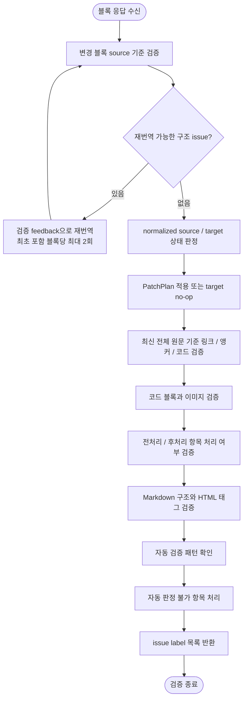

# 번역 결과 검증 계획

## 단계 흐름



---

## 1. 작업 목적

전처리, 번역, 후처리와 plan 적용이 끝난 한국어·일본어 기술 문서가 자동 판정 가능한 원문 구조를 유지하는지 검증한다.

검증의 목표는 다음과 같다.

- 계획된 블록이 최신 원문 주석과 함께 적용되었는지 검증한다.
- 지원하는 문법 범위에서 원문 링크, 앵커, 인라인 코드, 코드 블록, 이미지가 보존되었는지 검증한다.
- 전처리 및 후처리 항목이 정상 처리되었는지 검증한다.
- heading, 목록 marker, admonition 등 구현된 Markdown 구조 검사를 수행한다.
- 의미 정확성, 용어 선택, 문체와 일반 HTML 렌더링 가능성은 이 Python verifier가 자동 확정하지 않는다.
- 검증 함수는 issue label 목록을 반환하고 CLI가 이를 종료 코드로 변환한다.

---

## 2. 입력 자료

### 2.1 최종 locale 문서

전처리, 번역, 후처리를 거친 검증 대상 문서다.

### 2.2 최신 영어 기준본

upstream raw source에 같은 전처리·후처리를 적용한 전체 문서 기준본이다. 링크, 앵커, 코드, heading, 원문 주석을 최종 locale 문서와 대조한다.

### 2.3 PatchPlan과 블록 source

Git의 raw literal diff에서 이전 source를 복원한 뒤, 이전/현재 source를 같은 전처리·후처리로 정규화하고 그 사이의 effective diff로 다시 만든 계획이다. 따라서 `BlockChange.old_lines` / `new_lines`는 raw Git 줄이 아니라 정규화된 effective delta이고, 완전한 변경 블록은 `old_source` / `new_source`로 별도 보관한다. provider 응답은 먼저 해당 블록 source만 기준으로 검증하고, plan 적용 후 전체 기준본으로 다시 검증한다.

annotation-backed 상태 전환 계획은 복원한 이전/현재 raw 원문 전체에 `전처리 → 후처리(placeholders 복원)`를 적용해 만든 `old_source_anchors` / `new_source_anchors`도 가진다. 이 서명은 line mapping이 아니라 적용 전후의 정규화된 전체 annotatable 주석 순서 계약이다. 코드가 달라진 계획은 문서 전체 fenced code 목록의 `old_code_blocks` / `new_code_blocks` 상태도 별도로 가진다.

### 2.4 기존 locale 문서

부분 변경을 적용할 대상이며 provider에 전달할 주변 번역 문맥을 찾는 데 사용한다. Python verifier가 기존 문서와 결과의 용어·문체를 자동 비교하지는 않는다.

비교 기준:

- 기존 용어
- 문체
- 노트/경고문 형식
- 코드 블록 처리 방식
- 링크 처리 방식
- 이미지 처리 방식
- 제목 구조

### 2.5 파이프라인 상태

`verify()`의 직접 입력은 결과 문서, 선택적인 영어 기준본, 현재 문서 `version`이다. `version`은 상대 링크와 같은 버전의 `/docs/{version}`·Laravel 절대 URL만 동등하게 비교하는 데 사용한다. 다음 상태는 호출자가 기록하거나 앞 단계에서 실패 처리하며 verifier의 별도 입력 객체는 아니다.

- base64 이미지 플레이스홀더 치환/복원
- 들여쓰기 기반 코드 블록 변환
- 페이지 디자인 전용 `<style>` 태그 및 코드 제거
- 제목 옆 스타일 클래스 제거
- OpenAI / Azure OpenAI / CLI provider 재시도 및 실패 상태
- 미완료 chunk 목록
- 자동 판정 실패 항목
- 미복원 플레이스홀더 목록
- `` 태그 self-closing 변환
- 지원하는 영어 legacy note marker의 admonition 형식 표준화
- `{{version}}` 플레이스홀더 치환

---

## 3. 검증 순서

검증은 다음 순서로 진행한다.

```text
1. 새 provider 응답의 주석 occurrence와 Markdown block 계약을 변경 블록 source 기준으로 검증
2. retryable 구조 issue면 feedback을 포함해 최초 요청을 포함한 블록당 최대 2회 번역(재번역은 1회)
3. annotation-backed 계획이면 locale 전체 주석 순서를 source/target 서명과 대조
4. source 상태면 PatchPlan 적용, target 상태면 no-op, partial/mixed 상태면 fail-closed
5. 적용 문서의 annotation과 지원 legacy alert를 최신 전체 영어 기준본으로 정규화
6. 정규화된 문서를 최신 전체 영어 기준본과 대조
7. 링크 / 앵커 / 인라인 코드 / fenced code / heading 검증
8. 원문 주석, 목록 marker, admonition, 후처리 잔존 패턴 검증
9. issue label 목록 반환, 빈 목록이면 문서 기록
```

---

## 4. 변경 블록 적용 계약

블록 계획이 정확한 위치에 원자적으로 적용되어야 한다. anchor 해석, 대상 선택, 계획 밖 블록 보존은 PatchPlan 적용기가 책임진다.

### 4.1 검증 기준

- 추가·수정된 source 블록의 최신 영어 주석이 locale 문서에 있어야 한다.
- 삭제 계획은 정확한 기존 블록을 찾은 경우에만 적용해야 한다.
- 계획 밖의 주변 블록은 수정하지 않아야 한다.
- 기존·신규 대상이나 이웃 anchor가 모호하면 적용하지 않고 실패해야 한다.
- annotation-backed source/target 서명이 달라지는 계획은 현재 locale 서명이 old와 같을 때만 적용하고, new와 같으면 no-op이어야 한다. 어느 쪽도 아닌 partial/mixed/제3 상태는 변경 전에 실패해야 한다.
- 적용 후 locale 서명은 new 전체 문서 서명과 정확히 같아야 한다.
- source-authored HTML 주석은 번역 annotation과 본문이 같아도 source anchor 사이의 위치로 구분하며, 여러 줄 span의 위치와 occurrence를 보존해야 한다. 비교 기준은 raw byte가 아니라 원문에도 같은 전처리·후처리를 적용한 canonical form이다. source 밖의 빈 주석, 중첩·미종결 delimiter와 stray closer는 거부한다. annotation 안의 backtick code span에 들어 있는 literal `<!--`는 중첩 주석 opener로 세지 않고 literal `-->`는 `--&gt;`로 escape한다. source의 standalone 구조 줄을 병기한 legacy structural HTML 주석은 바로 다음 물리 구조를 소유해야 하며, quote와 leading-pipe 표는 source와 target의 전역 구조 순번도 같아야 한다. 위치를 옮기거나 대응 구조 없이 추가하면 거부한다. 주석 자체가 변경되는 부분 패치와 front matter 변경은 전체 문서 동기화가 필요하므로 provider 호출 전에 실패한다.
- live provider가 새로 만든 응답은 source와 원문 주석 및 기존 source HTML 주석의 순서·occurrence, Markdown block 수·순서, 목록 marker·들여쓰기·task checkbox 상태, 인용 깊이·admonition 유형, 표 열·정렬자가 같아야 한다. 영어와 지원 locale의 legacy admonition label도 canonical GFM 유형으로 정규화해 source와 target의 유형 순서를 비교한다. 인용문은 annotation을 생략할 수 있지만, 넣는다면 source 인용 본문 전체의 정규화 값과 occurrence에 정확히 대응해야 하며 임의 주석은 실패한다. front matter는 표시용 `description` 값 외의 구조 값을 유지하고, `description`도 원문과 같은 style의 유효한 YAML 문자열 scalar여야 한다. 주석만 있고 대응 본문이 없거나 source에 없는 별도 prose block이 있으면 실패한다.
- 새 응답의 navigation용 HTML/JSX 속성은 원문과 같아야 한다. 표시 설명용 `alt`, `placeholder`, `aria-label`, `aria-description`의 정적 문자열과 지원하는 최상위 `+` 연결식의 완전한 문자열 literal만 번역 차이를 허용한다. identifier·operator 등 실행 구조와 그 밖의 복합 expression은 원문과 같아야 한다.
- raw block HTML/JSX 본문은 원문의 물리적 줄 수를 유지하고, `<code>...</code>` 내부 값과 fenced code block 전체는 원문과 일치해야 한다.
- 명시적 Markdown hard break가 없는 새 prose 응답은 물리적 한 줄이어야 한다. source의 soft wrap은 한 줄로 합칠 수 있지만 원문에 없는 두 번째 본문 줄은 실패한다. 같은 물리 줄에서도 target 문장 수가 source 문장과 쉼표·접속사 등 실제 절 분할 지점으로 설명되는 상한을 넘으면 `sentence cardinality mismatch`로 실패한다. 의미를 보존한 복문 분할과 여러 source 문장의 병합은 허용한다.
- 단일·이중 emphasis delimiter와 괄호가 중첩된 Markdown link target은 source 구조를 보존해야 한다.
- 번역 대상 text block이 영어 원문 전체를 정규화 후 그대로 포함하거나, 영문 비중에 비해 KO/JA 목표 문자 범위가 부족하면 실패한다. 새 provider 응답의 leading-pipe와 no-leading-pipe 표도 escaped/code/link 내부 pipe를 제외한 cell 단위로 검사하되, 원문 보존 대상인 코드·링크·제품/식별자·타입·설정 값·버전·날짜 data cell은 제외한다. 번역 대상 cell은 짧더라도 원문과 완전히 같거나 두 단어 이상의 원문 구절을 그대로 포함하면 실패하며, 자연어 header에는 목표 언어가 필요하다. 최종 `verify()`는 locale을 받지 않으므로 기존 no-leading-pipe 표에서는 header 번역 여부와 목표 언어를 소급 검사하지 않지만 번역 대상 data cell의 같은 원문 잔존은 검사한다. leading-pipe 표 본문 언어도 소급 검사하지 않는다. heading, fenced code, provider-free TOC 링크 목록과 원문 보존이 필요한 `license.md` 법적 본문은 이 영어 echo 판정에서 제외한다. replay 전용 identity 호출자는 구조 검사를 그대로 유지하면서 이 판정만 명시적으로 비활성화한다.
- old/new annotation 전환이 없는 raw-context structural 계획은 전체 annotation source/target 서명 guard의 대상이 아니다. 여기서 raw-context는 정규화 전 Git diff라는 뜻이 아니라 annotation 대신 Markdown 원문 문맥으로 위치를 찾는다는 뜻이다. 단일 표 행은 source의 전체 표 개수, 표 ordinal, 해당 표의 행 개수와 행 ordinal을 함께 고정하고 old/new 행을 독립적으로 식별한다. locale에만 앞선 표가 있거나 행이 재배열되어 구조 주소가 달라지면 적용하지 않는다. admonition marker 변경도 old 또는 new 전체 occurrence 수와 해당 인용 본문이 source 문맥과 대응하는지 확인한다. 이미 new 전체 marker set이면 대상 marker를 no-op으로 재적용하며, 본문 재배열·다른 일반 인용문과의 교환·모호한 대상은 fail-closed로 거부한다. named anchor 한 줄 변경은 source occurrence와 target count로 duplicate를 구분해 provider 없이 적용한다. 내용이 동일한 named-section 순수 순열은 고유 raw anchor 또는 중복 anchor의 annotation 서명으로 source/target 순서를 판정하고 section 전체를 이동한다. 지원 조건 밖이거나 모호하면 실패한다.
- fenced code 상태는 annotation guard와 별개로 문서 전체 code block 목록을 `old_code_blocks` / `new_code_blocks`와 대조한다. old이면 계획을 적용하고 new이면 no-op으로 수렴하며, 어느 쪽도 아니고 구현이 명시적으로 허용하는 동일 블록 내 줄 순열도 아니면 변경 전에 실패한다.
- annotation-backed PatchPlan을 target 문서에 다시 적용한 결과가 no-op인지는 단위 테스트가 확인한다. raw-context structural 계획은 각 지원 형식의 별도 회귀 테스트를 따르며 모든 형식에 같은 상태 계약을 일반화하지 않는다. replay의 두 번째 실행은 같은 plan 재적용이 아니라 pinned source 기준 새 process가 변경 없음으로 수렴하는지 확인한다.
- 번역 의미와 문체는 live provider 품질 영역이며 구조 verifier 또는 identity replay의 자동 판정 범위가 아니다.

`response_contract.verify()`는 새 provider 응답에만 위의 엄격한 순서·개수 계약을 적용한다. `verify()`는 기존 문서를 포함한 적용 결과의 구조와 필수 원문 주석 집합을 검사한다. 과거 문서 형식 차이 때문에 전체 legacy 문서에 새 응답 계약을 소급하지 않는다. 대상 선택과 annotation-backed state guard·동일 plan 멱등성은 PatchPlan 테스트가, 전체 process 수렴성은 local replay가 검증한다.

---

## 5. 원문 앵커와 링크 유지 검증

### 5.1 검증 대상

- inline Markdown 링크와 이미지 target
- 일반 Markdown 링크의 label과 label-target pair
- 지원 범위 안의 reference definition 및 full/collapsed/shortcut reference link·image 해석
- `http`/`https` autolink
- HTML `<a name="...">` 명시적 앵커

현재 inline parser는 `[label](target)`과 ``의 괄호가 중첩된 balanced destination을 지원한다. target 뒤의 선택적 title은 double-quoted, single-quoted, 괄호형을 모두 파싱하며 delimiter와 공백을 포함한 title 표현이 원문과 정확히 같은지도 비교한다. backslash로 escape된 `[`는 link opener로 보지 않는다.

별도 parser는 최대 3칸 들여쓰기와 blockquote·목록 container 안의 `[label]: target "title"` definition을 읽으며, destination 또는 title이 다음 물리 줄로 이어지는 형식과 여러 줄 title도 지원한다. label은 unescaped `[` 중첩과 999자를 넘는 값을 거부하고, ASCII space·tab·줄바꿈만 하나의 공백으로 합친 뒤 Unicode casefold한다. 따라서 NBSP 같은 다른 Unicode 공백은 ASCII 공백과 동일하게 보지 않는다. angle-bracket destination과 double-quoted·single-quoted·괄호형 title을 지원한다. Definition 비교는 정규화한 label과 parser가 얻은 raw target·title의 중복 occurrence 순서를 사용하며, inline link에 적용하는 version prefix·known stale target 정규화는 적용하지 않는다. Angle-bracket destination의 바깥 `<...>`만 문법으로 제거하므로 `<path>`와 `path`는 같은 reference target으로 본다.

Full `[text][label]`, collapsed `[text][]`, shortcut `[label]` reference link와 image는 definition을 실제로 해석한다. 중복 label에는 CommonMark의 first-definition-wins 규칙을 적용하고, 해석된 image 여부·raw target·title의 순서가 원문과 같은지 비교한다. 표시 text, raw label과 full/collapsed/shortcut 표기 형식 자체는 이 signature에 포함하지 않는다.

Reference definition은 fenced code, HTML comment 및 raw HTML block 밖에서만 비교한다. raw HTML type 1~5는 종료 토큰 또는 EOF까지, type 6/7은 다음 빈 줄 또는 EOF까지 제외한다. blockquote와 단순 list container 안에서 시작한 raw HTML은 해당 container를 빠져나가면 끝난 것으로 처리하므로 뒤 root definition을 다시 비교한다. 다만 동일 marker의 새 list item처럼 전체 CommonMark container identity가 필요한 중첩·lazy continuation 문맥은 완전한 block parser 범위가 아니며, 모호한 definition을 자동 지원하는 것으로 보지 않는다.

Inline angle-bracket destination은 CommonMark의 별도 문법으로 해석하지 않으므로, 공백 없는 `[label](<path>)`는 `<path>` 전체가 일반 target 문자열로 비교될 수 있지만 `<...>`의 공백·escape 의미까지 지원하는 것으로 보지 않는다. 제목에서 생성되는 slug anchor와 일반 HTML `<a href="...">`도 자동 비교 범위가 아니다.

### 5.2 검증 기준

- Inline 링크 target은 절대 docs URL, version prefix와 알려진 stale target을 정규화한 뒤 원문과 일치해야 한다.
- Markdown target 내부 앵커와 명시적 `<a name>`이 변경되지 않아야 한다.
- Inline 링크 label과 정규화된 target pair는 원문 기준으로 보존되어야 한다.
- 지원하는 title이 있으면 title 표현도 원문 기준으로 보존되어야 한다.
- 지원하는 reference definition은 정규화한 label과 raw target의 pair, title, 중복 occurrence 순서가 원문 기준으로 보존되어야 한다.
- reference-style link와 image는 first-definition-wins로 해석한 image 여부, raw target, title 순서가 원문과 일치해야 한다. 표시 text, raw label과 표기 형식은 이 비교 범위가 아니다.
- `{{version}}` 치환 후 링크가 정상 형식이어야 한다.
- 지원하는 inline Markdown link 문법으로 파싱된 label-target pair가 일치해야 한다.

### 5.3 예시

원문:

```md
See [Create a project](./projects#create-a-project).
```

번역 후 정상:

```md
[Create a project](./projects#create-a-project)를 참조하세요.
```

번역 후 문제:

```md
[프로젝트 생성](./projects#프로젝트-생성)을 참조하세요.
```

위 예시는 링크 label과 원문 앵커가 번역되어 손상된 경우다.

---

## 6. 인라인 코드 유지 검증

### 6.1 검증 대상

백틱으로 감싸진 인라인 코드:

```md
`user_id`
`access_token`
`GET /users`
`config.yaml`
`npm install`
```

### 6.2 검증 기준

- 인라인 코드는 번역되지 않아야 한다.
- 백틱은 누락되지 않아야 한다.
- 코드 내부의 대소문자는 유지되어야 한다.
- 코드 내부의 언더스코어, 하이픈, 슬래시는 유지되어야 한다.
- 인라인 코드는 일반 텍스트로 풀리지 않아야 한다.
- 일반 텍스트는 불필요하게 인라인 코드로 바뀌지 않아야 한다.

현재 자동 비교는 같은 폭의 backtick run으로 닫히는 code span을 찾아 delimiter 폭과 관계없이 content multiset을 비교한다. 따라서 내부에 backtick이 있는 multi-backtick span과 여러 줄 span도 검사한다. 일반 텍스트에서 backslash로 escape된 backtick run은 delimiter로 세지 않는다. delimiter 자체의 폭은 비교 값에 포함하지 않으므로 content가 같은 single-backtick 표기와 multi-backtick 표기의 차이까지 실패시키지는 않는다.

HTML comment delimiter 균형 검사도 fenced code와 inline code span의 literal delimiter를 제외한다. 번역 annotation 안에서 원문 code span이 `<!--` 하나만 포함해도 중첩 HTML comment로 오인하지 않는다.

### 6.3 정상 예시

원문:

```md
Set `user_id` to the ID of the user.
```

번역:

```md
`user_id`를 사용자의 ID로 설정합니다.
```

### 6.4 문제 예시

```md
사용자 ID를 사용자의 ID로 설정합니다.
```

위 예시는 `user_id` 인라인 코드가 번역되어 손상된 경우다.

---

## 7. 코드 블록 유지 검증

### 7.1 검증 대상

- fenced code block
- 들여쓰기 기반에서 변환된 code block
- 명령어 예시
- JSON/YAML 설정
- API 요청/응답 예시
- HTML/XML 예시
- 코드 블록 내부 주석

### 7.2 검증 기준

- fenced code block 목록과 각 블록의 fence, 언어 태그, 본문은 영어 기준본과 일치해야 한다.
- 비교할 때 각 줄의 trailing space와 문서 끝 newline 차이는 무시한다.
- 코드 주석, URL, 경로, 파라미터도 블록 본문 비교에 포함한다.
- 닫는 fence가 없는 tail도 하나의 fenced code block으로 수집해 끝까지 비교한다. 따라서 번역본에만 열린 fence가 생겨 문서 나머지를 삼키면 `code block mismatch`가 된다. 양쪽 모두 같은 열린 tail인지를 별도로 문법 오류로 판정하는 검사는 아니다.
- JSON, YAML, HTML 문법을 언어별 parser로 별도 검증하지는 않는다.

### 7.3 코드 주석 유지 예시

원문:

````md
```js
// Create a new client
const client = new Client();
```
````

번역 후 정상:

````md
```js
// Create a new client
const client = new Client();
```
````

번역 후 문제:

````md
```js
// 새 클라이언트를 생성합니다
const client = new Client();
```
````

코드 블록 내부 주석은 번역하지 않는다.

---

## 8. 이미지 검증

### 8.1 검증 기준

- Markdown 이미지 target은 일반 Markdown link target 비교에 포함한다.
- 닫히지 않은 HTML ``와 복원되지 않은 base64 placeholder는 자동 issue로 처리한다.
- HTML ``의 순서와 각 `src` 값은 영어 기준본과 정확히 비교하며, `src`의 누락도 실패한다. 정적인 `alt` 문자열은 번역할 수 있으므로 최종 `src` 대조 값에는 포함하지 않는다. 다만 `alt={...}` 같은 표시 expression은 지원하는 최상위 `+` 연결식의 완전한 문자열 literal만 번역 차이로 가리고 identifier·operator 구조와 그 밖의 복합 expression을 별도 비교한다.
- 속성 추출은 독립된 attribute token만 인정하므로 `data-src`를 `src`로, `data-name`을 named anchor의 `name`으로 오인하지 않는다. 일반 이미지 렌더링과 `src`/`alt` 이외 임의 속성 값의 의미는 Python verifier의 자동 판정 범위가 아니다.

### 8.2 예시

원문의 ``이 locale 문서에서 ``로 바뀌면 Markdown image target mismatch로 탐지한다. ``의 `alt`는 번역할 수 있지만 `src`가 바뀌거나 `data-src`만 남으면 HTML image source mismatch로 탐지한다.

---

## 9. 전처리 / 후처리 항목 처리 검증

정제 단계의 산출 계약과 Python verifier가 직접 확인하는 범위를 구분한다.

### 9.1 검증 기준

- 들여쓰기 기반 코드 블록 변환과 목록 보존은 전처리 계약이며, 변환된 fenced block과 목록 marker의 구조 차이는 원문 대조에서 탐지한다.
- base64 이미지 플레이스홀더 잔존은 자동 issue로 처리한다.
- 최종 문서에 불필요한 페이지 디자인 전용 `<style>` 태그와 CSS가 남아 있지 않아야 한다. 이 항목은 전처리 결과 계약이며 verifier가 일반 style 태그를 자동 탐지하지는 않는다.
- fenced code 예시는 전체 block 비교로 보존 여부를 확인한다.
- 닫히지 않은 ``와 제목 옆 `{.class}`는 자동 issue로 처리하고, 영어 기준본이 있으면 HTML ``와 동적 표시 expression 구조도 정확히 대조한다. 그 밖의 임의 HTML 이미지 속성 값은 최종 verifier에서 별도 비교하지 않는다.
- 본문의 일반적인 의미 있는 `{}` 보존과 admonition 유형 선택의 문맥상 적합성은 자동 판정 범위가 아니다. 다만 source에 명시된 admonition 유형을 target이 다른 유형으로 바꾸는 것은 자동으로 거부한다.
- fenced code 밖의 `{{version}}`과 legacy note marker 잔존은 자동 issue로 처리한다.

---

## 10. Markdown 구조 검증

### 10.1 검증 기준

- 원문과 번역본의 ATX heading 텍스트와 레벨 순서가 일치해야 한다.
- fenced code block 목록과 내용이 원문 기준본과 일치해야 한다.
- 원문의 순서 없는 목록 marker 수보다 locale 문서의 marker 수가 적으면 실패한다.
- admonition marker 중복, marker 다음 본문의 blockquote 이탈과 영어 기준본 대비 marker 유형 순서를 검사한다. 유형 비교는 canonical marker-only 행과 upstream에 남은 `> [!TYPE] 본문` 한 줄형의 접두사를 같은 유형으로 센다.
- 최종 전체 문서 `verify()`는 중첩 목록의 의미, 표 열 정합성, 일반 Markdown 렌더링과 빈 줄 배치를 포괄적으로 비교하지 않는다. 다만 새 provider 응답 경계에서는 목록 들여쓰기·인용 깊이·표 열 형태를 source와 대조한다.
- 부분 적용 단계의 단일 표 행과 admonition marker 변경은 4.1의 source 구조 주소·본문 대응 guard가 실패하면 쓰지 않는다. 이는 최종 `verify()`의 포괄적 표 의미 검사를 대신하는 것이 아니라 지원하는 raw-context 변경을 fail-closed로 제한하는 계약이다.

---

## 11. HTML 태그 검증

### 11.1 검증 기준

- `` 태그는 self-closing 형식이어야 한다.
- named `<a name="...">` anchor 집합은 원문과 일치해야 한다.
- HTML ``의 `src` 목록은 원문과 정확히 같아야 하며 `alt` 번역은 허용한다. named anchor와 image source attribute는 token 경계를 확인해 `data-name` / `data-src`를 대신 인정하지 않는다.
- 최종 전체 문서 `verify()`는 일반 HTML 태그 균형, `<style>` 잔존, 그 밖의 임의 속성명과 `<a href>`를 포괄적으로 검사하지 않는다. 새 provider 응답 경계에서는 tag/attribute 구조를 비교하고 표시 설명용 속성 값만 번역을 허용한다.

---

## 12. 스타일 클래스 제거 검증

### 12.1 제거되어야 하는 예

```md
### `after()` {.collection-method}

## Overview {.section}

# API Reference {.page-title}
```

### 12.2 제거 후

```md
### `after()`

## Overview

# API Reference
```

### 12.3 유지해야 하는 예

```md
Use `{ key: value }` to configure the object.
```

본문의 의미 있는 중괄호 표현은 유지한다.

---

## 13. 노트 형식 검증

### 13.1 표준 형식

```md
> [!NOTE]
> 메시지입니다.
```

### 13.2 검증 기준

- `> {note}` 형식이 남아 있지 않아야 한다.
- `> **Note**` 형식이 남아 있지 않아야 한다.
- `> Note:` 형식이 남아 있지 않아야 한다.
- 동일 admonition marker가 연속 중복되면 안 된다.
- marker 바로 다음의 비어 있지 않은 본문 줄은 `>`로 시작해야 한다.
- marker 유형만 바뀐 부분 동기화도 marker 한 줄만 결정적으로 덮어쓰지 않는다. 선택한 ordinal의 marker와 연속 quote 본문 전체를 provider 응답으로 교체하며, body 없는 응답과 old/new 외의 제3 marker 유형은 적용 전에 실패한다.
- 여러 줄 전체의 blockquote 연속성과 source가 선택한 admonition 유형 자체의 문맥상 적합성은 verifier가 포괄적으로 판정하지 않는다. source와 target의 canonical marker 유형 순서는 비교하며, fenced code와 지원되는 링크는 각 원문 대조 규칙으로 별도 확인한다.

---

## 14. 자동 검증 항목

다음 항목은 현재 Python verifier가 자동 검증한다.

### 14.1 남아 있으면 안 되는 문자열

```text
{{version}}
__BASE64_IMAGE_
{.collection-method}
{.section-title}
> {note}
> **Note**
> Note:
```

코드 블록 안에 예시로 들어간 문자열은 잔존 패턴 검사에서 제외한다. 일반 `<style>`/HTML 균형과 렌더링 가능성은 이 verifier가 확정하지 않는다.

### 14.2 확인할 패턴

닫히지 않은 이미지 태그는 단일 regex가 아니라 후처리와 같은 quote/JSX-brace-aware scanner로 self-closing canonical form을 만든 뒤 원문과 달라지는지 검사한다. 따라서 quoted attribute나 balanced JSX expression 안의 `>`를 tag 끝으로 오인하지 않는다.

제목 옆 스타일 클래스:

heading 끝의 attribute list가 `.class`와 `#id` token으로만 구성되어 있고 class token을 포함하면 잔존으로 판정한다. pure `{#stable-id}`는 허용하며 mixed `{.old #stable-id}`는 class만 제거한 `{#stable-id}`가 되어야 한다.

base64 이미지 플레이스홀더 잔존:

```regex
__BASE64_IMAGE_\d+__
```

버전 플레이스홀더 잔존:

```regex
\{\{version\}\}
```

기존 note 형식 잔존:

```regex
^>\s*(\{(?:note|tip|warning|caution|important)\}|\*\*(?:Note|Tip|Warning|Caution|Important)(?::\*\*|\*\*:?)|(?:Note|Tip|Warning|Caution|Important):)
```

### 14.3 구조 정합성 자동 검증 (원문 대조)

위 14.1·14.2가 잔존 패턴을 검사한다면, 다음은 원문과 번역본을 대조해 구조가 보존되었는지 자동 검증한다. Python 검증에 포함한다.

- **앵커**: `<a name="...">` 명시적 앵커 multiset(발생 횟수 포함)이 원문과 번역본에서 일치해야 한다(누락/추가 검사).
- **heading 개수/레벨**: ATX heading 개수가 같고, 순서대로 레벨이 일치해야 한다.
- **내부 링크 대상**: 마크다운 내부 링크 대상의 multiset이 원문과 번역본에서 일치해야 한다.
- **heading / inline link label**: 문서 제목, heading, inline Markdown 링크 label은 원문 영어 텍스트와 일치해야 한다. 번역되었거나 임의로 병기되면 실패로 본다. Reference-style 사용 구문의 표시 text·raw label·표기 형식은 resolved target/title 구조 비교에 포함하지 않는다.
- **별도 sidebar generator 검증**: `documentation.md`의 category/doc label과 순서가 `versioned_sidebars/*.json`에 반영되어야 하며, locale별 sidebar JSON은 존재하지 않아야 한다. 이 항목은 `verify()`가 아니라 sidebar 단계가 검사한다.

#### upstream stale 앵커/링크 보정

upstream(공식 Laravel 문서) 원문에는 실제 앵커와 어긋난 내부 링크가 존재한다(목차 링크가 본문 앵커와 철자가 다른 경우 등). 새 번역과 maintenance 정규화는 알려진 stale 대상을 실제 대상으로 물리적으로 보정한 뒤 기록한다. 비교기는 아직 보정되지 않은 영어 원문·기존 locale 산출물도 호환할 수 있도록 내부 링크 대상을 비교하기 전에 양쪽에 동일한 정규화를 추가로 적용한다.

입력 및 링크 정규화 규칙:

- 영어 기준본과 locale 결과는 후처리 단계에서 `{{version}}` placeholder를 대상 버전으로 치환한다.
- 현재 검증 중인 문서 버전과 같은 `https://laravel.com/docs/{version}` 또는 `/docs/{version}` prefix만 상대 내부 경로와 동등하게 본다. 다른 버전으로 바뀐 링크는 정규화하지 않고 실패시킨다.
- 아래 알려진 stale 링크는 Markdown 본문 링크에서 물리적으로 보정한다. fenced code, inline code, HTML 주석은 대상이 아니다. 새 stale 링크가 확인되면 매핑과 회귀 검증을 함께 추가한다.

| upstream(stale) | 보정 후 |
|---|---|
| `#agents-integration` | `#agent-integration` |
| `…#actions-handled-by-resource-controller` | `…#actions-handled-by-resource-controllers` |
| `/migrations#writing-migrations` | `/migrations#creating-tables` |
| `#method-array-sort-recursive-desc` | `#method-array-sort-recursive` |
| `/errors#logging` | `/logging` |
| `/helpers#fluent-strings` | `/strings#fluent-strings` |
| `##date-casting` | `#date-casting` |
| `/database-testing#writing-factories` | `/database-testing#defining-model-factories` |

`controllers#actions-handled-by-resource-controller`와 `helpers#fluent-strings` 항목은 v10 이상에만 적용한다. v8/v9는 각각 singular controller anchor와 `helpers#fluent-strings`가 실제 대상이므로 유지하며, 이전 실행이 남긴 plural controller 또는 `strings#fluent-strings`는 maintenance에서 해당 legacy 대상으로 되돌린다. `#agents-integration`은 v12와 `master`에서만 `#agent-integration`으로 보정하고, v13은 plural anchor를 유지한다.

다음 링크는 대응 앵커가 없으므로 maintenance와 새 번역에서 inline link를 제거한다. standalone 목록 항목은 label의 일반 텍스트로, 그 밖의 bare link는 label의 inline code로 보존한다. 비교기는 오래된 산출물과의 호환을 위해 이 target을 계속 제외한다.

- `#assert-similar-json`
- `#formatting-shortcode-notifications`

이 호환 규칙은 기존 JS 검증 코드에 정의되어 있던 것으로, 번역 구조 검증을 Python으로 옮긴 뒤에도 유지한다. 특히 기존 번역이 이미 보정해 둔 링크가 위양성으로 잡히지 않도록 적용한다.

---

## 15. 자동 판정 불가 항목

Python 코드가 자동으로 확정하기 어려운 다음 항목은 issue label만으로 판정하지 않는다. live provider 결과 검토나 별도 Docusaurus 검증이 필요하며, identity replay는 이 항목의 품질을 보장하지 않는다.

별도 확인 대상:

- 목록 들여쓰기와 코드 블록의 구분이 불명확한 위치
- 코드 블록으로 변환된 영역이 실제 코드 또는 명령어인지 불명확한 위치
- 노트 메시지의 admonition 유형을 문맥으로만 판단할 수 있는 위치
- `{{version}}`이 예시 플레이스홀더로 유지되어야 하는지 불명확한 위치
- 문서 제목 또는 label 불일치가 upstream 원문 변경인지 로컬 예외인지 판단이 필요한 위치
- 제목에서 제거한 `{.class}`가 실제 스타일 클래스인지 불명확한 위치
- `<style>` 태그가 코드 예제인지 페이지 디자인 코드인지 불명확한 위치

### live provider 계약 검사

`make translation-provider-check`는 문서를 수정하지 않고 고정된 heading, anchor, link, inline code와 fenced code fixture를 설정된 live provider에 KO/JA로 각각 보낸다. 결과에 대해 다음을 확인한다.

- 응답이 anchor로 시작하고 원문 주석·번역 블록·코드가 정해진 순서로 끝나며, 앞뒤 CLI 진행 로그, 안내문, 추가 문단 또는 외곽 wrapper가 없다.
- 번역 본문은 정확히 한 줄이고 paragraph가 목록·인용·표·HTML block으로 바뀌지 않으며, 영어 fixture 문장을 그대로 포함하지 않는다.
- 번역 본문에 locale별 목표 문자 범위가 최소 3자 이상 포함된다.
- 새 응답 계약과 기존 `verify()`의 heading, anchor, link, inline code, 영어 원문 주석 검증을 모두 통과한다.
- 로그에 provider, model, reasoning effort, locale, 런타임 출력 규칙을 포함한 effective prompt SHA-256을 남긴다.

완료 응답이 위 구조 계약을 위반하면, 실제 동기화와 같은 verification feedback을 포함해 같은 locale fixture를 한 번만 더 요청한다. 최초 요청을 포함해 완료 응답은 locale당 최대 2개이며, 두 번째도 실패하면 이 검사는 실패한다. transport 오류의 물리 호출 재시도는 provider adapter의 별도 최대 3회 계약을 따른다.

API와 CLI를 비교할 때는 `TRANSLATION_MODEL=gpt-5.6-luna`와 같은 `TRANSLATION_REASONING_EFFORT`를 사용해 이 명령을 각각 실행한다. 두 번역문의 문구가 동일할 필요는 없지만 구조 계약은 둘 다 통과해야 한다. 이 smoke check는 대표 fixture의 응답 계약만 증명하며 전체 문서의 의미·문체 평가를 대신하지 않는다.

---

## 16. 검증 결과

`verify()`는 발견한 issue label 목록을 반환한다.

- 빈 목록: 해당 검증 통과
- 하나 이상의 label: 해당 locale target 실패

`verify()` 자체는 종료 코드를 만들지 않는다. 진입점별 의미는 다음과 같다.

- `main.py`: `0`은 전체 대상과 sidebar 성공 또는 변경 없음, `1`은 upstream·번역·검증·sidebar·maintenance 대상 실패, `2`는 잘못된 CLI 옵션·필수 filter 누락·설정 또는 prompt 로딩 같은 실행 전 오류다.
- `provider_check.py`: `0`은 KO/JA fixture 계약 통과, `1`은 provider 호출 또는 fixture 검증 실패, `2`는 설정·prompt 로딩 같은 실행 전 오류다.
- `replay.py`: `0`은 격리된 두 번의 sync가 같은 결과로 수렴하고 active worktree가 그대로인 경우, `1`은 내부 sync 실패나 두 번째 실행의 결과 변경, `2`는 replay sandbox 준비·실행·정리 오류, `3`은 replay 중 active worktree fingerprint가 바뀐 경우다. 내부 `main.py`의 non-zero 값은 replay에서 sync 실패 `1`로 분류한다.

---

## 17. 예외 케이스

검증 함수는 API 장애를 직접 복구하지 않는다. provider 호출 단계가 timeout, 네트워크·서버 오류, 빈 응답을 재시도하고 최대 시도 초과 시 `IncompleteTranslation`으로 target을 실패시킨다. 실패 응답은 최종 문서에 기록하지 않는다.

### API 실패 상태 발견

다음 상태가 있으면 최종 검증을 진행하지 않는다.

- OpenAI / Azure API가 초기 요청을 포함한 총 3회 시도 후에도 실패(재시도는 2회)
- HTTP `429` 또는 모든 `5xx` 응답 반복(예: `500`, `502`, `503`, `504`)
- timeout 또는 네트워크 오류 반복
- CLI provider timeout 재시도 실패

처리 기준:

1. provider 호출을 중단한다.
2. 해당 locale target을 실패 처리한다.
3. 기존 locale 파일은 기록하지 않는다.

### 미완료 번역 품질 확인

다음 상태는 미완료 번역이다. 새 provider 응답 경계는 본문 누락, block 밖 추가 prose, 충분히 긴 원문의 exact English echo, 목표 locale 문자 부재처럼 결정적으로 판정 가능한 경우를 거부한다. 기술 고유명사가 많은 짧은 표현이나 의미를 바꾼 의역처럼 자동 확정할 수 없는 경우는 별도 품질 검토가 필요하다.

- 영어 주석만 있고 locale 번역이 없는 블록
- locale 번역 대신 오류 메시지가 들어간 블록
- provider 안내 문구, 요약, 사과문이 문서에 포함된 경우
- 코드 블록 또는 링크가 손상된 상태로 남은 경우

처리 기준:

- 변경 블록에서 retryable로 분류된 구조 issue는 feedback 재시도 대상으로 처리한다. 그 밖의 issue, 신규 전체 문서와 최종 전체 문서 issue는 기록 없이 target을 실패시킨다.
- block 계약을 벗어난 provider 안내문과 오류 prose는 자동 실패한다. 구조를 유지한 의미 누락·오역·문체 품질은 live 결과 품질 검토 범위다.
- identity replay는 구조 보존만 검증하며 번역 완성도를 보장하지 않는다.

### 자동 검증 패턴 실패

자동 검증 패턴이 실패하면 실패 원인을 구분한다.

- 원문 diff 반영 누락
- 링크, 앵커, 인라인 코드 손상
- 코드 블록, 이미지, 플레이스홀더 손상
- 구현된 Markdown 구조 또는 HTML ``/`<a name>` 오류

API 장애로 인한 미완료 번역이 원인이면 검증 단계에서 수정하지 않고 번역 단계로 되돌린다.

---

## 18. 최종 산출물

검증 완료 후 산출물은 검증을 통과한 locale 문서 또는 구체적인 issue label 목록이다. 전체 `main.py`는 모든 대상과 sidebar 검증이 통과하면 `0`, 대상 처리 실패면 `1`, 실행 전 CLI·설정·prompt 오류면 `2`를 반환한다.

---

## 19. 최종 운영 기준

검증 단계의 핵심 기준은 다음과 같다.

> 코드, 링크, 앵커, 이미지, 플레이스홀더는 원문 기준으로 보존한다.
> 문서 렌더링과 유지보수에 필요한 Markdown 형식만 정제한다.
> 자동 판정 가능한 구조는 Python으로 검증하고 의미·문체와 실제 렌더링은 별도 범위로 둔다.

자동 검증을 통과한 산출물은 다음 조건을 만족한다.

1. 최신 전체 영어 기준본에 필요한 원문 주석이 locale 문서에 있다.
2. 코드 블록, 인라인 코드, 지원되는 링크·앵커·heading 구조가 기준본과 일치한다.
3. base64와 버전 placeholder, legacy note marker, 제목 스타일 클래스가 fenced code 밖에 남아 있지 않다.
4. `` 태그는 self-closing 형식이며 `src`와 동적 표시 expression 구조가 기준본과 일치하고, admonition marker 유형 순서와 구현된 구조 규칙을 만족한다.
5. 별도 sidebar 검증을 통과해 `documentation.md` 기준 산출물이 갱신되고 locale sidebar JSON이 남아 있지 않다.

변경 블록의 정확한 위치와 annotation-backed source/target 상태·동일 plan 멱등성, fenced code의 전역 old/new 상태는 PatchPlan 테스트가, pinned source에서의 전체 process 수렴성은 local replay가 담당한다. raw-context structural 형식은 지원 조건별 fail-closed 회귀 테스트를 따른다. 번역 의미·문체와 실제 렌더링은 live 결과 검토 및 Docusaurus 검증이 담당한다.
