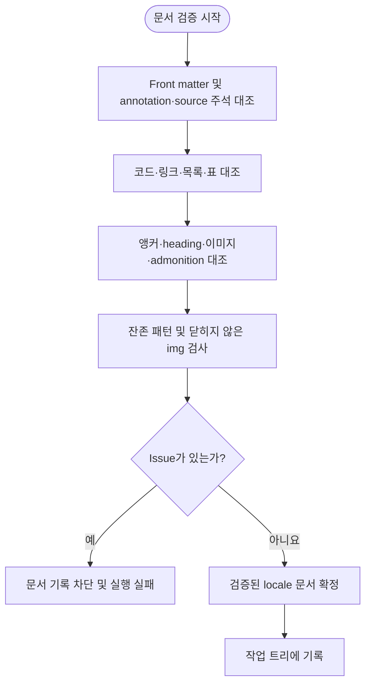

# 문서 검증 단계 설계

## 요약

후처리된 locale 문서를 영어 verification view와 대조해 front matter, source-authored 주석, 코드, 링크, 목록, 표, 인용, Markdown block, HTML tag, 앵커, heading, 이미지, admonition과 placeholder의 구조 보존 판정.
빈 issue 목록인 locale 문서만 작업 트리에 기록 허용.

## 흐름도



## 목적

번역 provider 응답 계약(response contract)을 통과한 locale 문서가 영어 verification view의 구조를 정확히 보존하는지 최종 확인.
이 단계는 번역 의미·문체 평가가 아닌 자동 판정 가능한 구조 정합성만 소유.

## 범위

- response contract 이후, 작업 트리 기록 직전의 전체 구조 검증 수행
- front matter, source-authored HTML 주석, 코드, 링크, 목록, 표, 인용, Markdown block, HTML tag, 앵커, 이미지, heading, admonition, placeholder 보존 확인
- 번역 의미 정확성, 용어 선택, 문체, 일반 HTML 렌더링은 이 단계의 자동 판정 범위에서 제외

## 입력

| 항목 | 설명 |
|---|---|
| 최종 locale 문서 | 전처리·번역·후처리를 거친 검증 대상 |
| 영어 verification view | [후처리 단계](./03-postprocessing.md)가 현재 정규화 영어 작업 사본, version, current restore map과 stale-link registry에서 생성한 전체 문서. pipeline annotation은 포함하지 않음 |
| expected annotation map | 후처리 단계가 같은 영어 입력에서 생성한 구조 주소·ordered occurrence·canonical annotation byte 목록 |
| 문서 version | 상대 링크와 절대 URL의 버전 동등 비교에 사용 |
| 검증 입력 hash | [후처리 단계 §7.8](./03-postprocessing.md#78-검증-입력-hash)의 canonical envelope와 SHA-256 hash |
| final snapshot loader | 검증 산출물 생성 전에 stale-link registry를 다시 읽고, 캡처한 locale 초안·정규화 영어 원문·restore map·version으로 검증 입력을 재구성하는 단일 호출 seam |

## 출력

| 항목 | 설명 |
|---|---|
| stable issue code 목록 | [오류 처리 설계](./08-error-cases.md)의 검증 오류 code와 구조 주소 집합 |
| 빈 목록 | 검증 통과 |
| 검증된 locale 문서 | 빈 issue 목록과 검증 입력 hash가 결합된 기록 가능 문서 |

## 불변 조건

1. **구조 검증과 번역 의미 평가의 경계**: 자동 판정은 원문 대비 구조 보존만 대상. 목표 언어 충분성은 번역 response contract의 검사 대상이나, 의미 정확성·용어 선택·문체는 자동 workflow가 보증하지 않는 명시적 잔여 위험.
2. **Fail-closed**: 판정 불가 상태는 통과가 아닌 실패로 처리. issue가 하나라도 존재하면 해당 locale 문서 기록 금지.
3. **저장소 오염 방지**: 검증 실패 시 작업 트리의 locale 파일 덮어쓰기 금지.
4. **기준본 단일성**: 비교 기준은 항상 같은 검증 입력 hash에 포함된 영어 verification view와 expected annotation map. 과거 locale 문서의 형식 차이 소급 금지.
5. **재요청 경계**: 이 단계에서 provider 호출 및 response feedback 재요청 수행 금지.
6. **입력 결합성**: 검증 시작과 산출물 생성 시점의 검증 입력 hash 동일성 필수. 산출물 생성 전에는 final snapshot loader를 정확히 한 번 호출해 stale-link registry와 그 파생 입력을 재구성해야 함. 시작 snapshot 객체만 다시 hash하는 방식으로 대체 금지. 불일치 시 판정 결과 폐기 및 실패 처리.

## 검증 항목

```text
- front matter key 순서·문자열 scalar 형식과 title 값을 영어 verification view와 대조
- pipeline annotation의 canonical byte·순서·occurrence·소유 블록을 expected annotation map과 대조. 표는 전체 표 annotation 하나가 첫 행 바로 앞에 있어야 하며 행 사이 annotation은 소유 관계 불일치로 판정
- pipeline annotation을 제외한 source-authored HTML 주석의 값·순서·구조 주소를 대조
- fenced code block 목록과 본문을 영어 verification view와 대조
- inline 코드 multiset을 영어 verification view와 대조
- Markdown inline link target·label pair를 정규화 후 정렬된 multiset으로 영어 verification view와 대조 (목표 언어 어순에 따른 등장 순서 재배열 허용)
- reference definition label·target·title·occurrence 순서를 영어 verification view와 대조
- reference-style link·image의 해석 결과(image 여부·target·title) 순서를 대조
- 순서 있는 목록과 순서 없는 목록의 marker 유형·깊이·checkbox 상태 ordered occurrence를 정확히 대조
- 표의 행 수·행 종류·행별 열 수와 separator 정렬자를 순서대로 대조
- 인용 줄의 깊이·occurrence와 명시적 hard break ordered signature를 영어 verification view와 대조
- Markdown block 종류·순서·구조 배치를 영어 verification view와 대조
- 명시적 <a name> 앵커 multiset을 영어 verification view와 대조
- ATX heading 텍스트와 레벨 순서를 영어 verification view와 대조
- HTML tag 종류·순서 서명, 동적 표시 속성 표현식과 HTML code 요소 내용을 영어 verification view와 대조
- HTML  src 순서를 영어 verification view와 대조
- admonition marker 유형 순서를 영어 verification view와 대조
- 잔존 패턴 검사: Base64 placeholder, {{version}}, legacy note marker, heading 스타일 클래스
- 닫히지 않은  태그 검사
- stable issue code·구조 주소 목록과 검증 입력 hash 반환
```

마지막 반환을 제외한 항목 사이 실행 순서는 계약 아님. pipeline annotation 대조만 Markdown block 구조 대조 결과를 입력으로 사용.
반환 issue 목록은 (code, 구조 주소)로 중복 제거 후 UTF-8 byte 순으로 정렬되며 검사 순서를 반영하지 않음.

## 실패 정책

| 상태 | 처리 |
|---|---|
| stable issue code가 하나 이상 | 해당 locale target 실패, 문서 기록 차단 |
| 영어 verification view 또는 expected annotation map 부재 | 구조 대조가 불가능하므로 검증 실패 처리 |
| final snapshot 재구성 실패 또는 시작·종료 검증 입력 불일치 | `VERIFICATION_INPUT_CHANGED` 판정 및 문서 기록 차단. stale-link registry digest 변경이 원인이면 `STALE_LINK_REGISTRY_CHANGED` 판정 |
| provider 장애로 번역 미완료 | 검증 미진입, provider 단계에서 target 실패 처리 |

검증 issue의 provider 응답 자동 feedback 금지.
provider 재처리가 필요하면 원인 수정 후 `main.py`를 다시 실행해 upstream 원문 동기화부터 재산출해야 한다.

## 수용 기준

검증을 통과한 산출물은 다음 조건 모두 충족 필요.

1. front matter의 key·문자열 scalar 구조와 title이 영어 verification view와 일치.
2. pipeline annotation의 canonical byte·순서·occurrence·소유 블록이 expected annotation map과 일치.
3. source-authored HTML 주석의 값·순서·구조 주소가 일치.
4. fenced code block 목록과 본문 및 inline code multiset이 일치.
5. 정규화된 inline link, reference definition과 reference-style link·image 해석 결과가 일치.
6. 목록 marker 유형·깊이·checkbox와 표의 행·열·정렬자 구조가 정확히 일치.
7. 인용 줄의 깊이·occurrence와 명시적 hard break 구조가 일치.
8. Markdown block 종류·순서·구조 배치가 일치. expected annotation map에 항목이 있으면 블록 구조 불일치는 pipeline annotation 소유 불일치로도 판정.
9. 명시적 `<a name>` 앵커와 ATX heading 텍스트·레벨 순서가 일치.
10. HTML tag 종류·순서 서명, 동적 표시 속성 표현식, `<code>` 요소 내용과 `` 태그의 self-closing 형식·`src` 순서가 일치.
11. admonition marker 유형 순서가 일치하고 중복·이탈 없음.
12. fenced code 밖에 Base64 placeholder, `{{version}}`, legacy note marker, heading 스타일 클래스 잔존 금지.
13. 닫히지 않은 `` 태그 없음.
14. 빈 issue 목록과 시작·종료가 같은 검증 입력 hash가 결합된 locale 문서만 작업 트리에 기록 허용.

## 오류 분류 경계

이 단계는 구조 issue 반환만 담당하며 진입점 종료 코드 직접 결정은 범위 밖.
구조 검증 실패의 오류 분류와 실행 중단·복구에는 [오류 처리 및 복구 설계](./08-error-cases.md)의 정책 적용.

## 부록: 링크 정규화 규칙

- 현재 검증 문서 버전과 같은 절대 docs URL prefix는 상대 경로와 동등하게 처리
- 알려진 upstream stale 링크는 양쪽에 동일한 정규화를 적용하여 기존 보정본과의 위양성 방지
- `{{version}}` placeholder는 후처리에서 대상 버전으로 치환된 상태를 비교

## 부록: 자동 판정 범위 밖 항목

Fail-closed 원칙은 이 문서가 요구하는 모든 구조 기준에 적용.
아래 항목은 구조 기준 밖이므로 issue 부재만으로 품질 입증 불가.
각 항목은 필요하면 번역 실행 밖의 별도 검토 기준을 적용.
범위 밖 항목으로 필수 구조 기준 판정이 불가능한 경우에도 제외 금지 및 구조 issue 처리 필수.

- 번역 의미의 정확성, 용어 선택과 문체
- admonition 유형의 문맥상 적합성
- 일반 HTML 태그의 렌더링 가능성
