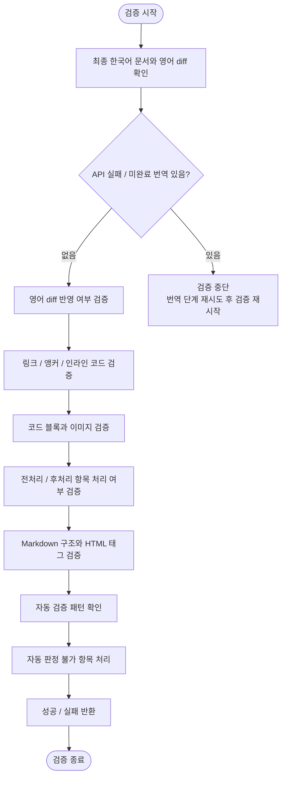

# 번역 결과 검증 계획

## 단계 흐름



---

## 1. 작업 목적

전처리, 번역, 후처리가 끝난 한국어 기술 문서가 원문 구조와 의미를 유지하는지 검증한다.

검증의 목표는 다음과 같다.

- 영어 diff의 추가/수정/삭제 사항이 누락 없이 반영되었는지 검증한다.
- 원문 링크, 앵커, 인라인 코드, 코드 블록, 이미지가 보존되었는지 검증한다.
- 전처리 및 후처리 항목이 정상 처리되었는지 검증한다.
- Markdown 구조가 렌더링 가능한 상태인지 검증한다.
- 검증 단계의 마지막 결과는 성공 또는 실패 상태만 반환한다.

---

## 2. 입력 자료

### 2.1 최종 한국어 문서

전처리, 번역, 후처리를 거친 검증 대상 문서다.

### 2.2 영어 diff

변경된 영어 원문을 확인하기 위한 자료다.

검증 단계에서 다음을 확인하는 데 사용한다.

- 변경된 문장이 모두 반영되었는지
- 삭제된 문장이 남아 있지 않은지
- 추가된 문장이 빠지지 않았는지
- 기존 영어 주석이 최신 영어 문장으로 갱신되었는지

### 2.3 기존 한국어 문서

기존 문서의 형식, 용어, 문체를 비교하는 기준으로 사용한다.

비교 기준:

- 기존 용어
- 문체
- 노트/경고문 형식
- 코드 블록 처리 방식
- 링크 처리 방식
- 이미지 처리 방식
- 제목 구조

### 2.4 실행 로그 및 상태 데이터

전처리, 번역, 후처리 실행 중 남은 로그와 상태 데이터를 검증 입력으로 사용한다.

- base64 이미지 플레이스홀더 치환/복원
- 들여쓰기 기반 코드 블록 변환
- 페이지 디자인 전용 `<style>` 태그 및 코드 제거
- 제목 옆 스타일 클래스 제거
- OpenAI / Azure OpenAI / CLI provider 재시도 및 실패 상태
- 미완료 chunk 목록
- 자동 판정 실패 항목
- 미복원 플레이스홀더 목록
- `` 태그 self-closing 변환
- 노트/툴팁 admonition 형식 표준화
- `{{version}}` 플레이스홀더 치환

---

## 3. 검증 순서

검증은 다음 순서로 진행한다.

```text
1. 최종 한국어 문서와 영어 diff 확인
2. API 실패 / 미완료 번역 여부 확인
3. 영어 diff 반영 검증
4. 링크 / 앵커 / 인라인 코드 검증
5. 코드 블록과 이미지 검증
6. 전처리 / 후처리 항목 처리 여부 검증
7. Markdown 구조와 HTML 태그 검증
8. 자동 검증 패턴 확인
9. 자동 판정 불가 항목 처리
10. 성공 / 실패 반환
```

---

## 4. 영어 diff 반영 검증

번역 작업 자체가 누락 없이 반영되었는지 검증한다.

### 4.1 검증 기준

- diff의 추가 문장이 한국어 문서에 추가되어야 한다.
- diff의 수정 문장이 최신 영어 주석으로 교체되어야 한다.
- 수정된 영어 문장 아래 한국어 번역이 갱신되어야 한다.
- diff의 삭제 문장이 한국어 문서에서 제거되었거나 삭제 대상으로 표시되어야 한다.
- 변경되지 않은 주변 한국어 문장은 불필요하게 수정되지 않아야 한다.
- 기존 용어와 문체가 유지되어야 한다.

---

## 5. 원문 앵커와 링크 유지 검증

### 5.1 검증 대상

- Markdown 링크
- HTML `<a>` 태그
- 제목 기반 앵커
- 내부 문서 링크
- 외부 URL
- 이미지 링크
- 참조형 링크

### 5.2 검증 기준

- 원문 링크 URL이 유지되어야 한다.
- 내부 앵커가 변경되지 않아야 한다.
- 링크 텍스트만 번역되고 URL은 보존되어야 한다.
- `#anchor-name` 형식의 앵커가 손상되지 않아야 한다.
- `{{version}}` 치환 후 링크가 정상 형식이어야 한다.
- 링크 괄호가 깨지지 않아야 한다.

### 5.3 예시

원문:

```md
See [Create a project](./projects#create-a-project).
```

번역 후 정상:

```md
[프로젝트 생성](./projects#create-a-project)을 참조하세요.
```

번역 후 문제:

```md
[프로젝트 생성](./projects#프로젝트-생성)을 참조하세요.
```

위 예시는 원문 앵커가 번역되어 손상된 경우다.

---

## 6. 인라인 코드 유지 검증

### 6.1 검증 대상

백틱으로 감싸진 인라인 코드:

```md
`user_id`
`access_token`
`GET /users`
`config.yaml`
`npm install`
```

### 6.2 검증 기준

- 인라인 코드는 번역되지 않아야 한다.
- 백틱은 누락되지 않아야 한다.
- 코드 내부의 대소문자는 유지되어야 한다.
- 코드 내부의 언더스코어, 하이픈, 슬래시는 유지되어야 한다.
- 인라인 코드는 일반 텍스트로 풀리지 않아야 한다.
- 일반 텍스트는 불필요하게 인라인 코드로 바뀌지 않아야 한다.

### 6.3 정상 예시

원문:

```md
Set `user_id` to the ID of the user.
```

번역:

```md
`user_id`를 사용자의 ID로 설정합니다.
```

### 6.4 문제 예시

```md
사용자 ID를 사용자의 ID로 설정합니다.
```

위 예시는 `user_id` 인라인 코드가 번역되어 손상된 경우다.

---

## 7. 코드 블록 유지 검증

### 7.1 검증 대상

- fenced code block
- 들여쓰기 기반에서 변환된 code block
- 명령어 예시
- JSON/YAML 설정
- API 요청/응답 예시
- HTML/XML 예시
- 코드 블록 내부 주석

### 7.2 검증 기준

- 코드 블록 내부 코드는 번역되지 않아야 한다.
- 코드 블록 내부 주석은 영어 원문으로 유지되어야 한다.
- 코드 블록의 시작/종료 백틱 수가 맞아야 한다.
- 코드 블록 언어 태그가 적절해야 한다.
- 들여쓰기와 줄바꿈이 유지되어야 한다.
- JSON, YAML, HTML 등의 문법이 깨지지 않아야 한다.
- 코드 안의 URL, 경로, 파라미터명은 보존되어야 한다.

### 7.3 코드 주석 유지 예시

원문:

````md
```js
// Create a new client
const client = new Client();
```
````

번역 후 정상:

````md
```js
// Create a new client
const client = new Client();
```
````

번역 후 문제:

````md
```js
// 새 클라이언트를 생성합니다
const client = new Client();
```
````

코드 블록 내부 주석은 번역하지 않는다.

---

## 8. 이미지 검증

### 8.1 검증 기준

- Markdown 이미지 문법이 유지되어야 한다.
- HTML `` 태그가 정상 형식이어야 한다.
- `src` 속성이 유지되어야 한다.
- `alt` 속성은 유지되거나 필요한 경우에만 번역되어야 한다.
- base64 이미지가 원본 그대로 복원되어야 한다.
- 이미지 경로는 번역되거나 변경되지 않아야 한다.

### 8.2 예시

정상:

```html

```

문제:

```html

```

이미지 경로는 번역하지 않는다.

---

## 9. 전처리 / 후처리 항목 처리 검증

정제 단계에서 처리한 항목들이 정상 반영되었는지 검증한다.

### 9.1 검증 기준

- 들여쓰기 기반 코드 블록은 백틱 코드 블록으로 변환되어야 한다.
- 목록의 들여쓰기는 코드 블록으로 잘못 변환되지 않아야 한다.
- base64 이미지 플레이스홀더는 최종 문서에서 모두 복원되어야 한다.
- 최종 문서에 불필요한 페이지 디자인 전용 `<style>` 태그와 CSS가 남아 있지 않아야 한다.
- 코드 예제 안의 `<style>`은 유지되어야 한다.
- `` 태그는 `` 형식으로 변환되어야 한다.
- 이미지 태그의 속성은 손상되지 않아야 한다.
- 제목 옆 `{.class}` 스타일 클래스는 제거되어야 한다.
- 본문 내 의미 있는 `{}` 표현은 유지되어야 한다.
- 다양한 노트/툴팁은 의미에 맞는 admonition 형식으로 표준화되어야 한다.
- `{{version}}` 플레이스홀더는 대상 버전 문자열로 치환되어야 한다.
- 최종 문서에 `{{version}}`이 남아 있지 않아야 한다.

---

## 10. Markdown 구조 검증

### 10.1 검증 기준

- 제목 계층이 깨지지 않아야 한다.
- 원문과 번역본의 heading(ATX `#`) 개수가 같아야 하고, 순서대로 각 heading의 레벨이 일치해야 한다. 개수나 레벨이 어긋나면 구조 손상으로 본다.
- 목록 번호가 정상이어야 한다.
- 중첩 목록이 정상이어야 한다.
- 표 구조가 깨지지 않아야 한다.
- 코드 블록이 닫히지 않은 상태로 남아 있지 않아야 한다.
- 인용문이 의도치 않게 이어지지 않아야 한다.
- HTML 태그가 열린 상태로 남아 있지 않아야 한다.
- 빈 줄과 줄바꿈이 렌더링 문제를 일으키지 않아야 한다.

---

## 11. HTML 태그 검증

### 11.1 검증 기준

- `` 태그는 ``로 변환되어야 한다.
- 최종 문서에 불필요한 페이지 디자인 전용 `<style>` 태그가 남아 있지 않아야 한다.
- `<a href="">`의 `href` 값은 유지되어야 한다.
- HTML 속성명은 번역되지 않아야 한다.
- HTML 태그 구조는 깨지지 않아야 한다.

---

## 12. 스타일 클래스 제거 검증

### 12.1 제거되어야 하는 예

```md
### `after()` {.collection-method}

## Overview {.section}

# API Reference {.page-title}
```

### 12.2 제거 후

```md
### `after()`

## Overview

# API Reference
```

### 12.3 유지해야 하는 예

```md
Use `{ key: value }` to configure the object.
```

본문의 의미 있는 중괄호 표현은 유지한다.

---

## 13. 노트 형식 검증

### 13.1 표준 형식

```md
> [!NOTE]
> 메시지입니다.
```

### 13.2 검증 기준

- `> {note}` 형식이 남아 있지 않아야 한다.
- `> **Note**` 형식이 남아 있지 않아야 한다.
- `> Note:` 형식이 남아 있지 않아야 한다.
- 노트 메시지는 인용문 안에 유지되어야 한다.
- 여러 줄 노트의 모든 줄에 `>`가 유지되어야 한다.
- 노트 내부 코드나 링크는 손상되지 않아야 한다.

---

## 14. 자동 검증 권장 항목

가능하면 다음 항목은 스크립트 또는 정규식으로 자동 검증한다.

### 14.1 남아 있으면 안 되는 문자열

```text
{{version}}
__BASE64_IMAGE_
<style
</style>
{.collection-method}
{.section-title}
> {note}
> **Note**
> Note:
```

단, 코드 블록 안에 예시로 들어간 문자열은 예외 처리한다. `<style`과 `</style>`은 코드 블록 밖의 페이지 디자인 전용 태그만 제거 대상으로 본다.

### 14.2 확인할 패턴

닫히지 않은 이미지 태그:

```regex
]*\/>)
```

제목 옆 스타일 클래스:

```regex
^(#{1,6}\s+.+?)\s+\{[^}]*\}\s*$
```

base64 이미지 플레이스홀더 잔존:

```regex
__BASE64_IMAGE_\d+__
```

버전 플레이스홀더 잔존:

```regex
\{\{version\}\}
```

기존 note 형식 잔존:

```regex
^>\s*(\{note\}|\*\*Note\*\*|Note:)
```

### 14.3 구조 정합성 자동 검증 (원문 대조)

위 14.1·14.2가 잔존 패턴을 검사한다면, 다음은 원문과 번역본을 대조해 구조가 보존되었는지 자동 검증한다. Python 검증에 포함한다.

- **앵커**: `<a name="...">` 명시적 앵커 집합이 원문과 번역본에서 일치해야 한다(누락/추가 검사).
- **heading 개수/레벨**: ATX heading 개수가 같고, 순서대로 레벨이 일치해야 한다.
- **내부 링크 대상**: 마크다운 내부 링크 대상의 multiset이 원문과 번역본에서 일치해야 한다.

#### upstream stale 앵커/링크 보정

upstream(공식 Laravel 문서) 원문에는 실제 앵커와 어긋난 내부 링크가 존재한다(목차 링크가 본문 앵커와 철자가 다른 경우 등). 번역본 또는 마이그레이션 대상 기존 번역이 이런 stale 링크를 보정해 둔 경우, 원문 ↔ 번역본 링크를 그대로 비교하면 위양성이 발생한다. 따라서 내부 링크 대상을 비교하기 전에 양쪽에 동일한 정규화를 적용한다.

정규화 규칙:

- `{{version}}` placeholder를 대상 버전으로 치환한다.
- `https://laravel.com/docs/{version}` 절대 URL을 `/docs/{version}` 내부 경로로 바꾼다.
- 아래 알려진 stale 링크를 보정한다. 새 stale 링크가 확인되면 매핑에 추가한다.

| upstream(stale) | 보정 후 |
|---|---|
| `#agents-integration` | `#agent-integration` |
| `…#actions-handled-by-resource-controller` | `…#actions-handled-by-resource-controllers` |
| `/migrations#writing-migrations` | `/migrations#creating-tables` |
| `#method-array-sort-recursive-desc` | `#method-array-sort-recursive` |
| `/errors#logging` | `/logging` |
| `/helpers#fluent-strings` | `/strings#fluent-strings` |
| `##date-casting` | `#date-casting` |
| `/database-testing#writing-factories` | `/database-testing#defining-model-factories` |

다음 링크는 대응 앵커가 없으므로 비교 대상에서 제외한다.

- `#assert-similar-json`
- `#formatting-shortcode-notifications`

이 보정은 기존 JS 검증(`validate-translation-structure.mjs`)이 수행하던 것으로, 번역 구조 검증을 Python으로 옮길 때(05 T5) 동일하게 유지한다. 특히 기존 문서 주석 병기 마이그레이션(05 T2)에서, 기존 번역이 이미 보정해 둔 링크가 위양성으로 잡히지 않도록 반드시 적용한다.

---

## 15. 자동 판정 불가 항목

Python 코드가 자동으로 확정하기 어려운 항목은 검증 실패로 처리한다. 세부 위치와 원인은 실행 로그에 남기고, 검증 단계의 반환값에는 포함하지 않는다.

실패 처리 대상:

- 목록 들여쓰기와 코드 블록의 구분이 불명확한 위치
- 코드 블록으로 변환된 영역이 실제 코드 또는 명령어인지 불명확한 위치
- 노트 메시지의 admonition 유형을 문맥으로만 판단할 수 있는 위치
- `{{version}}`이 예시 플레이스홀더로 유지되어야 하는지 불명확한 위치
- 링크 텍스트 번역의 자연스러움처럼 자동 판정이 어려운 항목
- 제목에서 제거한 `{.class}`가 실제 스타일 클래스인지 불명확한 위치
- `<style>` 태그가 코드 예제인지 페이지 디자인 코드인지 불명확한 위치

---

## 16. 검증 결과

검증 완료 후 Python 코드는 성공 또는 실패 상태만 반환한다.

반환값:

- `success`
- `failure`

---

## 17. 예외 케이스

검증 단계에서는 API 장애를 직접 복구하지 않는다. 대신 번역 단계에서 발생한 OpenAI / Azure API 실패, CLI timeout, 미완료 chunk가 최종 문서에 섞였는지 확인하고, 발견되면 검증을
중단한 뒤 번역 단계로 되돌린다.

### API 실패 상태 발견

다음 상태가 있으면 최종 검증을 진행하지 않는다.

- OpenAI / Azure API 재시도 3회 실패
- HTTP `429`, `500`, `502`, `503`, `504` 반복
- timeout 또는 네트워크 오류 반복
- CLI provider timeout 재시도 실패

처리 기준:

1. 검증을 중단한다.
2. 검증 결과는 `failure`를 반환한다.
3. 번역 단계에서 해당 chunk를 다시 요청한다.
4. 해당 chunk가 정상 번역된 뒤 검증을 처음부터 다시 실행한다.

### 미완료 번역 감지

다음 상태는 미완료 번역으로 본다.

- 영어 주석만 있고 한국어 번역이 없는 블록
- 한국어 번역 대신 오류 메시지가 들어간 블록
- provider 안내 문구, 요약, 사과문이 문서에 포함된 경우
- 코드 블록 또는 링크가 손상된 상태로 남은 경우

처리 기준:

- 최종 문서로 제출하지 않는다.
- 번역 단계로 되돌려 해당 chunk를 재처리한다.
- 재처리 후 후처리와 검증을 다시 실행한다.

### 자동 검증 패턴 실패

자동 검증 패턴이 실패하면 실패 원인을 구분한다.

- 원문 diff 반영 누락
- 링크, 앵커, 인라인 코드 손상
- 코드 블록, 이미지, 플레이스홀더 손상
- Markdown 또는 HTML 구조 오류

API 장애로 인한 미완료 번역이 원인이면 검증 단계에서 수정하지 않고 번역 단계로 되돌린다.

---

## 18. 최종 산출물

검증 완료 후 제출해야 하는 최종 산출물은 다음과 같다.

- `success`
- `failure`

최종 산출 기준을 만족하지 못하면 `failure`를 반환한다. 모든 검증 기준을 만족하면 `success`를 반환한다.

---

## 19. 최종 운영 기준

검증 단계의 핵심 기준은 다음과 같다.

> 번역문은 의미 변경 없이 유지한다.
> 코드, 링크, 앵커, 이미지, 플레이스홀더는 원문 기준으로 보존한다.
> 문서 렌더링과 유지보수에 필요한 Markdown 형식만 정제한다.
> 자동 검증으로 성공 또는 실패를 판정한다.

최종 산출물은 다음 조건을 만족해야 한다.

1. 영어 diff의 변경 사항이 한국어 문서에 반영되어 있다.
2. 기존 한국어 문서의 용어와 문체가 유지되어 있다.
3. 코드와 인라인 코드는 번역되지 않았다.
4. 원문 앵커와 링크는 유지되어 있다.
5. base64 이미지는 손상 없이 복원되어 있다.
6. 최종 문서에 불필요한 페이지 디자인 전용 `<style>` 태그와 코드는 제거되어 있다.
7. `` 태그는 `` 형식이다.
8. 제목 옆 스타일 클래스는 제거되어 있다.
9. 노트/툴팁은 의미에 맞는 표준 admonition 형식으로 표준화되어 있다.
10. `{{version}}` 플레이스홀더는 지정된 버전 문자열로 치환되어 있다.
