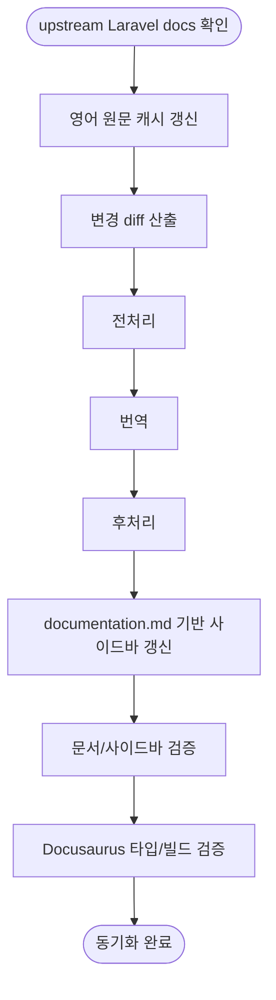

# 번역 동기화 전체 운영 기준

이 문서는 `translation-sync` 문서 묶음이 전제로 하는 전체 운영 구조를 정리한다. 여기의 내용은 임시 실행 체크리스트가 아니라, 번역 동기화 시스템이 항상 만족해야 하는 기준이다.

세부 단계는 다음 문서가 담당한다.

| 단계 | 기준 문서 | 책임 |
|---|---|---|
| 전처리 | [01-preprocessing.md](01-preprocessing.md) | 코드, base64 이미지, 스타일 클래스, Markdown 구조를 번역 전에 안정화한다. |
| 번역 | [02-translation.md](02-translation.md) | 영어 diff의 변경분을 대상 locale 문서 본문에 반영한다. |
| 후처리 | [03-postprocessing.md](03-postprocessing.md) | 번역 후 placeholder, 링크, Markdown/HTML 형식을 최종 문서 형태로 복원한다. |
| 사이드바 갱신 | [06-sidebar-sync.md](06-sidebar-sync.md) | `documentation.md`를 기준으로 `versioned_sidebars`를 갱신하고 문서 sidebar override를 제거한다. |
| 검증 | [04-verification.md](04-verification.md) | 문서 구조, 번역 반영, 링크, 앵커, 사이드바 정합성, 빌드 검증을 확인한다. |

---

## 1. 전체 흐름



운영 순서는 고정이다.

```text
영어 원문 갱신 -> diff 산출 -> 전처리 -> 번역 -> 후처리 -> 사이드바 갱신 -> 검증 -> 빌드 확인
```

실패가 발생하면 실패 원인을 담당하는 단계로만 되돌아간 뒤, 그 이후 단계를 다시 순서대로 실행한다. 실패와 무관한 산출물을 임의로 다시 생성하지 않는다.

---

## 2. 데이터 기준

| 구분 | 경로 | 기준 |
|---|---|---|
| 버전 목록 | `versions.json` | 처리 대상 버전과 최신 안정 버전을 결정한다. |
| 영어 원문 캐시 | `i18n/en/docusaurus-plugin-content-docs/version-*/` | 공식 upstream Markdown 파일의 byte-for-byte 복사본이다. 번역과 diff의 단일 원문 기준이며 사이트 locale로 노출하지 않는다. |
| 한국어 문서 | `versioned_docs/version-*/*.md` | 기본 locale의 문서 산출물이다. 본문만 번역 대상이다. |
| 일본어 문서 | `i18n/ja/docusaurus-plugin-content-docs/version-*/*.md` | 일본어 locale의 문서 산출물이다. 본문만 번역 대상이다. |
| 사이드바 | `versioned_sidebars/version-*-sidebars.json` | `documentation.md`에서 재생성되는 문서 navigation 산출물이다. |
| 문서 sidebar override | `i18n/{ko,ja}/docusaurus-plugin-content-docs/version-*.json` | 생성하지 않는다. 존재하면 stale label 위험으로 삭제한다. |
| 사이트 UI 번역 | `i18n/{ko,ja}/code.json` | 사이트 chrome, 검색, 홈, 테마 문구 번역이다. 문서 sidebar 정책과 별개로 유지한다. |
| 운영 프롬프트 | `translation-sync/prompt.md`, `translation-sync/prompt_jp.md` | locale별 번역 지침의 단일 기준이다. |

`i18n/en`은 번역 파이프라인의 입력 데이터다. 영어 문서 사이트를 이 저장소에서 별도 locale로 노출하지 않는다.

영어 원문 캐시는 변경 감지의 기준이므로 적재 단계에서 trailing whitespace, EOF newline, Markdown 구조를 정규화하지 않는다. 필요한 구조 보정은 diff 산출 이후 전처리 또는 번역 산출물 처리 단계에서만 수행한다.

---

## 3. 번역 정책

번역 대상과 비번역 대상은 명확히 분리한다.

번역 대상:

- 본문 설명 문장
- 문맥상 자연스러운 한국어/일본어 표현이 필요한 안내 문장
- 원문의 의미가 바뀌지 않는 범위의 문장 단위 보정

비번역 대상:

- 문서 제목
- heading
- 링크 label
- 사이드바 label
- 앵커
- 코드 블록, 인라인 코드, 명령어, 파일 경로, URL
- Laravel, Eloquent, mutator 같은 기술 용어와 고유명사

기술 용어나 고유명사는 한국어식 음역으로 바꾸지 않는다. 예를 들어 `Laravel Pennant`, `Laravel Pulse`, `Eloquent`, `mutator`는 영어 원문을 유지한다.

문서 제목과 heading은 본문보다 변경 감지와 navigation 정합성에 더 직접적으로 관여하므로 영어 원문을 우선한다. 본문에서만 필요한 경우 자연스러운 번역을 덧붙인다.

---

## 4. 사이드바 정책

사이드바 구조의 단일 기준은 각 버전의 영어 원문 `documentation.md`다.

```text
i18n/en/docusaurus-plugin-content-docs/version-<version>/documentation.md
```

사이드바 갱신 기준:

- 문서 순서는 `documentation.md` 순서를 그대로 따른다.
- category와 doc label은 `documentation.md`의 영어 label을 그대로 사용한다.
- 신규 문서가 추가되면 해당 버전의 `versioned_sidebars`에 자동 반영한다.
- 제목 또는 label이 바뀌면 해당 버전의 `versioned_sidebars`도 자동 갱신한다.
- 변경이 잦은 `master`는 매 동기화 실행마다 갱신 또는 검증 대상에 포함한다.
- 기존 sidebar JSON의 `collapsed` 같은 표시 속성은 가능한 한 보존한다.
- `i18n/ko/.../version-*.json`, `i18n/ja/.../version-*.json` 문서 sidebar override는 생성하지 않는다.

사이트 UI 번역 파일인 `code.json`은 이 정책의 삭제 대상이 아니다. 문서 sidebar label을 영어로 유지하는 것과, 사이트 chrome 문구를 locale별로 번역하는 것은 서로 다른 영역이다.

---

## 5. 실행 환경

번역 자동화는 Python 3.14와 `uv`를 기준으로 실행한다.

```text
uv sync --frozen
uv run python main.py
```

사이트 검증은 Docusaurus 프로젝트의 Node 도구를 사용한다.

```text
npm run typecheck
npm run build
```

Docker 환경은 목적별로 분리한다.

| 환경 | 역할 |
|---|---|
| Node | Docusaurus 타입 검사, 빌드, 로컬 서버 실행 |
| Python | 영어 원문 동기화, diff 산출, 번역, 후처리, 사이드바 갱신, 문서 검증 |

---

## 6. 검증 기준

문서와 사이트 빌드 검증은 역할을 나눈다.

Python 검증:

- 영어 diff의 추가, 수정, 삭제가 대상 locale 문서에 반영되었는지 확인한다.
- 코드 블록, 인라인 코드, 링크, 앵커, 이미지 경로, placeholder가 원문 기준으로 보존되었는지 확인한다.
- 문서 제목, heading, 링크 label, 사이드바 label, 앵커가 영어 원문 기준으로 유지되는지 확인한다.
- `documentation.md`와 `versioned_sidebars/*.json`의 순서와 label이 일치하는지 확인한다.
- `i18n/{ko,ja}/docusaurus-plugin-content-docs/version-*.json`이 남아 있지 않은지 확인한다.

JavaScript/Docusaurus 검증:

- 타입 검사를 통과하는지 확인한다.
- Docusaurus 빌드를 통과하는지 확인한다.
- 빌드 산출물에서 렌더링된 앵커와 내부 링크가 깨지지 않았는지 확인한다.

---

## 7. 산출 기준

동기화가 끝난 상태는 다음을 만족한다.

- 영어 원문 캐시가 최신 upstream 기준으로 갱신되어 있다.
- 한국어와 일본어 문서 본문에는 변경 diff가 반영되어 있다.
- 문서 제목, heading, 링크 label, 사이드바 label, 앵커는 영어로 유지되어 있다.
- `versioned_sidebars`는 각 버전의 `documentation.md` 순서와 label을 따른다.
- 문서 sidebar override JSON은 존재하지 않는다.
- `code.json`은 사이트 UI 번역 파일로 유지된다.
- 문서 검증, 타입 검사, 빌드 검증을 통과한다.
