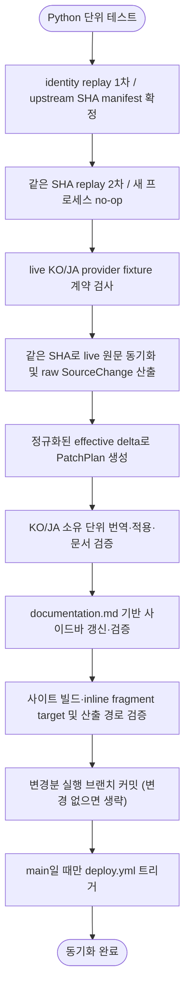

# 번역 동기화 전체 운영 기준

이 문서는 `translation-sync` 문서 묶음이 전제로 하는 전체 운영 구조를 정리한다. 여기의 내용은 임시 실행 체크리스트가 아니라, 번역 동기화 시스템이 항상 만족해야 하는 기준이다.

세부 단계는 다음 문서가 담당한다.

| 단계 | 기준 문서 | 책임 |
|---|---|---|
| 전처리 | [01-preprocessing.md](01-preprocessing.md) | 코드, base64 이미지, 스타일 클래스, Markdown 구조를 번역 전에 안정화한다. |
| 번역 | [02-translation.md](02-translation.md) | 영어 diff의 변경분을 대상 locale 문서 본문에 반영한다. |
| 후처리 | [03-postprocessing.md](03-postprocessing.md) | 번역 후 placeholder, 링크, Markdown/HTML 형식을 최종 문서 형태로 복원한다. |
| 문서 검증 | [04-verification.md](04-verification.md) | 문서 구조, 번역 반영, 링크와 앵커를 확인하고 locale 문서를 기록한다. |
| 사이드바 갱신·검증 | [06-sidebar-sync.md](06-sidebar-sync.md) | `documentation.md`를 기준으로 `versioned_sidebars`를 갱신하고 문서 sidebar override를 제거한다. |
| 사이트 검증 | 이 문서 | 공통 `site-check`로 링크 유틸리티, 타입 검사, 빌드와 KO/JA inline Markdown fragment target을 확인한다. |
| 산출 경로 검증 | 이 문서 | 동기화 실행이 영어 캐시, KO/JA 문서와 사이드바 산출 경로만 변경했는지 확인한다. |

---

## 1. 전체 흐름



운영 순서는 고정이다.

```text
Python 단위 테스트 -> identity replay 1차/upstream SHA 고정 -> 같은 SHA replay 2차 새 프로세스 no-op -> live KO/JA provider fixture 계약 검사 -> 같은 manifest live 원문 동기화 -> raw SourceChange/정규화된 PatchPlan -> KO·JA 소유 단위 번역·후처리·문서 검증 -> 사이드바 갱신·검증 -> 사이트·산출 경로 검증 -> 실행 브랜치 반영 -> main만 배포
```

`SourceChange`는 영어 캐시의 byte 기준 git status와 raw hunk를 보존한다. `PatchPlan` 생성기는 그 hunk로 이전 원문을 복원한 뒤 이전·현재 원문에 같은 전처리와 후처리를 적용하고, 정규화된 두 문서에서 hunk를 다시 계산한다. 따라서 `BlockChange.old_lines`와 `new_lines`는 raw git 줄이 아니라 locale 문서에 적용할 effective delta다.

실패가 발생하면 원인을 수정한 뒤 담당 단계부터 workflow를 다시 실행하고, 그 이후 단계를 순서대로 진행한다. 이는 workflow 내부의 자동 회귀 루프를 뜻하지 않는다. 같은 segment의 provider 응답을 받아 계약 검증까지 완료하는 논리 평가는 최초 요청 포함 최대 2회다. 수정 segment의 retry 가능한 문서 검증 실패도 이 상한 안에서 재평가한다. 각 논리 평가는 일시적인 transport 오류나 빈 응답에 대해 물리 호출을 최대 3회 수행할 수 있으므로, 두 평가가 모두 실행되면 물리 호출 상한은 segment당 6회다. 실패와 무관한 산출물을 임의로 다시 생성하지 않는다.

`make translate`, `make translation-run`과 sync workflow의 live 실행은 `--fail-fast`를 사용한다. 첫 locale target 실패에서 이후 target과 sidebar 처리를 중단하며, 직접 로컬 실행에는 앞서 기록한 파일을 되돌리는 전체 실행 단위 transaction이나 rollback이 없다. 따라서 실패 전에 성공한 파일은 작업 트리에 남을 수 있다. workflow는 이후 gate와 commit을 실행하지 않아 실패한 산출물을 원격 branch에 반영하지 않는다.

---

## 2. 데이터 기준

| 구분 | 경로 | 기준 |
|---|---|---|
| 버전 목록 | `versions.json` | 처리 대상 버전과 최신 안정 버전을 결정한다. `master`가 첫 항목, 최신 안정 버전이 첫 non-`master`, 나머지가 내림차순이어야 한다. |
| 영어 원문 캐시 | `i18n/en/docusaurus-plugin-content-docs/version-*/` | 필터 없이 동기화한 버전은 실행 manifest의 upstream commit과 일치하고, `DOC` 실행은 선택 basename만 그 commit으로 교체한다. 번역과 diff의 원문 기준이며 사이트 locale로 노출하지 않는다. |
| upstream manifest | `TRANSLATION_UPSTREAM_MANIFEST`가 가리키는 임시 JSON | 버전별 40자리 commit SHA를 기록한다. workflow가 replay와 live 실행에 같은 경로를 전달하며, 로컬에서는 두 명령에 같은 경로를 명시해야 공유된다. 저장소 산출물로 커밋하지 않는다. |
| 한국어 문서 | `versioned_docs/version-*/*.md` | 기본 locale의 문서 산출물이다. 본문만 번역 대상이다. |
| 일본어 문서 | `i18n/ja/docusaurus-plugin-content-docs/version-*/*.md` | 일본어 locale의 문서 산출물이다. 본문만 번역 대상이다. |
| 사이드바 | `versioned_sidebars/version-*-sidebars.json` | `documentation.md`에서 재생성되는 문서 navigation 산출물이다. |
| 문서 sidebar override | `i18n/{ko,ja}/docusaurus-plugin-content-docs/version-*.json` | 생성하지 않는다. 존재하면 stale label 위험으로 삭제한다. |
| 사이트 UI 번역 | `i18n/{ko,ja}/code.json` | 사이트 chrome, 검색, 홈, 테마 문구 번역이다. 문서 sidebar 정책과 별개로 유지한다. |
| 운영 프롬프트 | `translation-sync/prompt.md`, `translation-sync/prompt_jp.md` | locale별 번역 지침의 단일 기준이다. |

`i18n/en`은 번역 파이프라인의 입력 데이터다. 영어 문서 사이트를 이 저장소에서 별도 locale로 노출하지 않는다.

Python upstream 동기화, sidebar generator와 산출 경로 검증기는 공통 version loader를 사용해 배열 형식, 비어 있지 않은 목록, 허용된 version token, 단 하나의 선두 `master`, stable version의 중복 없는 내림차순을 clone·sidebar 처리·산출 검사 전에 엄격히 검증한다. Docusaurus 설정과 관련 TS/JS script는 이 Python loader를 공유하지 않고 `versions.json`의 첫 non-`master` 항목을 최신 안정 버전으로 사용하므로, 새 version 변경은 사이트 검증까지 통과해야 한다.

영어 원문 캐시는 변경 감지의 기준이므로 적재 단계에서 trailing whitespace, EOF newline, Markdown 구조를 정규화하지 않는다. 각 원문 파일은 같은 디렉터리의 임시 파일을 flush·`fsync`한 뒤 `os.replace`로 공개하고 부모 디렉터리도 `fsync`하므로 단일 교체 실패 시 기존 파일을 보존하지만, stale 파일 삭제와 여러 파일을 묶는 run-level transaction은 아니다. 필터 없는 버전 동기화는 새 원문 파일을 모두 공개한 뒤에만 stale 파일을 삭제하므로 첫 교체 실패 전에 기존 캐시를 선삭제하지 않는다. 다만 뒤쪽 파일의 교체가 실패하면 앞쪽 파일은 이미 갱신되었을 수 있다. `DOC` 실행은 같은 basename만 교체하므로 그 버전 디렉터리의 다른 파일은 이전 실행 SHA와 섞일 수 있다. 이때 sidebar sync는 선택된 버전의 기존 cached `documentation.md` 전체를 읽으므로, `DOC=documentation.md`가 아닌 한 같은 upstream SHA의 sidebar 정보까지 새로 가져오는 것은 아니다. 한 번의 workflow에서는 replay와 live 실행이 같은 manifest SHA를 사용한다. 별도의 로컬 `make translation-replay`와 `make translation-run`은 manifest를 자동 공유하지 않으므로 같은 `MANIFEST` 절대 경로를 두 명령에 전달해야 동일 SHA를 재사용한다. 필요한 구조 보정은 PatchPlan 생성 시 이전·현재 원문에 동일하게 적용한다.

영어 캐시와 locale 산출 경로의 symlink·저장소 경계 검사는 기록 흐름에서 수행하지만 검증과 `os.replace`·`unlink`는 하나의 root-anchored directory descriptor 연산이 아니다. 따라서 실행 중 같은 경로의 부모를 바꿀 수 있는 신뢰하지 않는 로컬 동시 writer를 보안 경계로 방어하지 않으며, workflow와 로컬 명령은 저장소 mutation을 단독으로 수행해야 한다.

---

## 3. 번역 정책

번역 대상과 비번역 대상은 명확히 분리한다.

번역 대상:

- 본문 설명 문장
- 문맥상 자연스러운 한국어/일본어 표현이 필요한 안내 문장
- 원문의 의미가 바뀌지 않는 범위의 문장 단위 보정

비번역 대상:

- 문서 제목
- heading
- 링크 label
- 사이드바 label
- 앵커
- 코드 블록, 인라인 코드, 명령어, 파일 경로, URL
- Laravel, Eloquent, mutator 같은 기술 용어와 고유명사

기술 용어나 고유명사는 한국어식 음역으로 바꾸지 않는다. 예를 들어 `Laravel Pennant`, `Laravel Pulse`, `Eloquent`, `mutator`는 영어 원문을 유지한다.

문서 제목과 heading은 본문보다 변경 감지와 navigation 정합성에 더 직접적으로 관여하므로 영어 원문을 우선한다. 본문에서만 필요한 경우 자연스러운 번역을 덧붙인다.

---

## 4. 사이드바 정책

사이드바 구조의 단일 기준은 각 버전의 영어 원문 `documentation.md`다.

```text
i18n/en/docusaurus-plugin-content-docs/version-<version>/documentation.md
```

사이드바 갱신 기준:

- 문서 순서는 `documentation.md` 순서를 그대로 따른다.
- category와 doc label은 `documentation.md`의 영어 label을 그대로 사용한다.
- 신규 문서가 추가되면 해당 버전의 `versioned_sidebars`에 자동 반영한다.
- `documentation.md`의 category 또는 doc label이 바뀌면 해당 버전의 `versioned_sidebars`도 자동 갱신한다.
- version filter가 없는 동기화 실행에서는 변경이 잦은 `master`도 항상 갱신 또는 검증 대상에 포함한다.
- 기존 sidebar JSON의 `collapsed` 같은 표시 속성은 가능한 한 보존한다.
- `i18n/ko/.../version-*.json`, `i18n/ja/.../version-*.json` 문서 sidebar override는 생성하지 않는다.

사이트 UI 번역 파일인 `code.json`은 이 정책의 삭제 대상이 아니다. 문서 sidebar label을 영어로 유지하는 것과, 사이트 chrome 문구를 locale별로 번역하는 것은 서로 다른 영역이다.

---

## 5. 실행 환경

번역 자동화는 Python 3.14와 `uv`를 기준으로 실행한다. Actions와 번역 Docker image는 `uv` 0.11.32를 고정하며, workflow·Docker·Make target은 `uv sync --locked` 또는 `uv run --locked`로 lockfile과 불일치하는 환경을 허용하지 않는다.

```text
make translation-check
make translation-run
```

`translation-check`는 Action과 같은 Python/lock 조건으로 단위 테스트와 API 키 없는 구조 통합 검증을 실행한다. replay만 분리해 점검할 때는 하위 target을 사용한다.

```text
make translation-check
make translation-check VERSION=13.x DOC=collections.md
make translation-replay
make translation-replay VERSION=13.x DOC=collections.md
```

`VERSION`과 `DOC`은 독립적인 selector다. `VERSION`만 지정하면 해당 버전의 모든 문서를, `DOC`만 지정하면 모든 지원 버전의 같은 basename을, 둘 다 지정하면 그 한 쌍을 처리한다. `DOC`는 upstream 파일 존재 assertion이 아니다. upstream에 없지만 cache에 있던 파일은 삭제 변경이 되고 cache에도 없던 오타는 no-op으로 끝날 수 있으므로 로그와 실제 변경 목록을 확인해야 한다. 문서 selector와 sidebar 범위는 다르다. 명시한 `VERSION`은 변경 유무와 관계없이 sidebar 전체를 sync하고, `VERSION`이 없으면 변경이 감지된 버전과 `master`의 sidebar 전체를 cached `documentation.md`에서 sync하며 해당 locale override를 제거한다.

identity replay는 번역 품질이 아니라 소유 단위 선택·적용, 보존 markup, KO/JA 전체 검증과 pinned source의 새 프로세스 수렴을 확인한다. 세부 계약은 [07-local-replay.md](07-local-replay.md)를 따른다.

사이트 검증도 배포 workflow와 같은 Make target을 사용한다. 로컬에서 번역과 배포 검증을 모두 실행하려면 `preflight`를 사용한다.

```text
make site-check
make preflight
```

실제 provider의 고정 KO/JA 응답 계약과 깨끗한 동기화 checkout의 산출 경로를 각각 확인할 수 있다. `translation-provider-check`는 live 호출이므로 `preflight`에는 포함하지 않는다.

```text
make translation-provider-check
make translation-artifact-check
```

이 명령과 통과 조건은 실행 계약이며, 특정 시점의 replay나 live provider 실행이 완료되었다는 결과 기록은 아니다.

기존 locale 문서의 annotation 보강은 `python main.py --annotate-existing --apply`로만 수행한다. 이 maintenance 경로는 지원 legacy alert를 먼저 canonical form으로 정규화하고, source-comment 또는 필수 annotation 문제는 원문 주석을 보존한 채 재생성한다. source와 동일한 순서의 Markdown link에서 비어 있는 visible label은 source label만 복원한다. 결과 verifier issue 집합이 실제로 줄어드는 경우에만 기록하며, 번역이 빠진 source block(delete drift)은 추정해 쓰지 않고 실패한다.

Docker 환경은 목적별로 분리한다.

| 환경 | 역할 |
|---|---|
| Node | Docusaurus 타입 검사, 빌드, 로컬 서버 실행 |
| Python | 영어 원문 동기화, diff 산출, 번역, 후처리, 사이드바 갱신, 문서 검증 |

---

## 6. 검증 기준

문서와 사이트 빌드 검증은 역할을 나눈다.

Python 동기화 검증:

- 본 번역 전에 고정 KO/JA fixture가 wrapper 없는 Markdown, 목표 언어 문자와 구조 verifier 계약을 만족하는지 확인한다.
- PatchPlan 단위 테스트로 정규화된 effective delta가 선택한 번역 소유 단위의 위치와 annotation-backed 동일 plan 멱등성을 확인하고, local replay로 pinned source의 새 프로세스 수렴성을 확인한다.
- verifier로 코드 블록, 인라인 코드, 지원되는 링크·앵커, Markdown 이미지 target, HTML ``의 순서와 값, placeholder가 원문 기준으로 보존되었는지 확인한다.
- 문서 제목, heading, 링크 label, 사이드바 label, 앵커가 영어 원문 기준으로 유지되는지 확인한다.
- `documentation.md`와 `versioned_sidebars/*.json`의 순서와 label이 일치하는지 확인한다.
- `i18n/{ko,ja}/docusaurus-plugin-content-docs/version-*.json`이 남아 있지 않은지 확인한다.
- 커밋할 변경이 영어 원문 캐시, KO/JA 문서, 공통 versioned sidebar와 삭제 대상 locale sidebar JSON 경로로 제한되는지 확인한다. 문서 변경에는 영어 원문 변경이 반드시 있어야 한다. 추가·삭제(`A`/`D`)는 EN·KO·JA 세 파일이 모두 같은 단일 status여야 하고, 수정(`M`)은 변경 목록에 나타난 locale status가 모두 `M`이어야 한다. 수정 시 이미 target 상태여서 byte 변경이 없는 locale 파일은 목록에서 빠질 수 있지만, artifact checker가 그 현재 파일을 변경된 EN 원문으로 최종 검증해 issue가 없음을 직접 증명해야 한다. 증명되지 않은 EN-only `M`은 거부한다. locale sidebar JSON 경로는 최종 파일이 존재하지 않는 삭제 상태만 허용한다.

JavaScript/Docusaurus 검증:

- Markdown 링크 유틸리티 단위 테스트를 통과하는지 확인한다.
- 타입 검사를 통과하는지 확인한다.
- Docusaurus 빌드를 통과하는지 확인한다.
- KO/JA 문서의 inline Markdown fragment link가 가리키는 빌드 산출물 HTML과 `id`가 존재하는지 확인한다. fragment 없는 route, reference-style link, 일반 HTML `href`는 이 스크립트의 자동 검사 범위가 아니다.

---

## 7. 산출 기준

동기화가 끝난 상태는 다음을 만족한다.

- 필터 없는 버전의 영어 원문 캐시 전체 또는 `DOC`로 선택한 basename이 해당 실행에서 고정한 upstream SHA 기준으로 갱신되어 있다.
- 한국어와 일본어 문서 본문에는 변경 diff가 반영되어 있다.
- 문서 제목, heading, 링크 label, 사이드바 label, 앵커는 영어로 유지되어 있다.
- `versioned_sidebars`는 각 버전의 `documentation.md` 순서와 label을 따른다.
- 문서 sidebar override JSON은 존재하지 않는다.
- `code.json`은 사이트 UI 번역 파일로 유지된다.
- 동기화 단계의 문서 검증과 sidebar 검증을 통과한다.
- 사이트와 산출 경로 검증까지 통과한 변경분이 workflow 실행 브랜치에 커밋되어 있다(변경이 없으면 커밋하지 않는다). `main` 결과만 커밋 이후 배포 단계(`deploy.yml`)를 실행한다. 세부 기준은 8절을 따른다.

---

## 8. 산출물 git 반영 기준

동기화 산출물은 사람 개입 없이 workflow를 실행한 브랜치에 반영한다. schedule은 기본 브랜치에서 실행되며, 수동 dispatch는 선택한 branch ref에 반영한다. tag 등 branch가 아닌 ref는 실행 초기에 거부한다.

반영 기준:

- 문서·sidebar·사이트·산출 경로 검증을 통과한 변경분만 workflow 실행 브랜치에 커밋한다. 검증이 실패하면 어떤 변경도 커밋하지 않는다.
- 반영할 변경분(diff)이 없으면 커밋을 만들지 않고 종료한다. 빈 커밋을 만들지 않는다.
- 변경분은 `github.ref_name`에 해당하는 실행 브랜치에 직접 push하며 Pull Request를 자동 생성하지 않는다.
- `main`이 아닌 브랜치에서 수동 실행하면 그 브랜치에만 반영하고 배포하지 않는다.
- sync workflow는 `make site-check`와 `make translation-artifact-check`를 커밋 전에 실행한다. 사이트 검증은 링크 유틸리티·타입 검사·빌드와 KO/JA inline Markdown fragment target을 확인하고, 산출 경로 검증은 `git add -A`가 번역 동기화 범위 밖 파일을 포함하지 않도록 막는다.
- checkout은 write credential을 저장하지 않는다. 의존성 설치·번역·사이트 검증·commit hook에는 push credential을 노출하지 않고, 모든 검증과 커밋이 끝난 별도 push step에서만 GitHub CLI credential helper를 설정한다.
- 기본 토큰 push는 배포를 자동 발화하지 않으므로 동기화 workflow가 `main`일 때만 배포를 명시적으로 트리거한다. commit/push와 deploy dispatch를 분리하고 main에서는 변경이 없는 재실행도 dispatch하여, push 뒤 dispatch만 실패한 실행을 복구할 수 있다. 배포 workflow도 `make site-check`를 다시 실행한다.
- 커밋이 끝난 상태가 동기화 완료 상태이며, 사이트 반영 여부는 배포 단계의 재검증 통과에 달려 있다.
