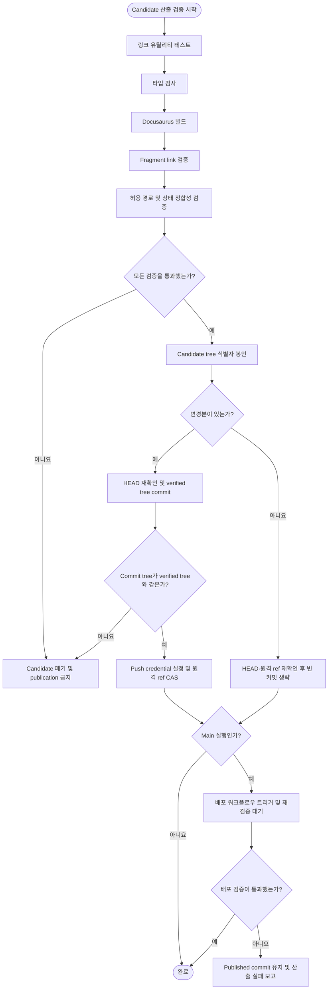

# 전체 운영 및 산출 검증 설계

## 요약

완성된 candidate snapshot에서 사이트 빌드와 허용 경로·상태 정합성을 검증하고 tree 식별자 봉인.
publication commit은 이 verified tree를 정확히 참조해야 함.
`main` 실행 결과만 별도 배포 단계로 전달.

## 흐름도

## 1. 목적

번역 동기화의 사이트 빌드 검증, 산출 경로 검증, git 반영 규칙을 규범적으로 정의.

## 2. 범위

이 문서는 다음 항목만 소유.

- 사이트 빌드 검증 기준
- 산출 경로 허용 범위 검증 기준
- git 반영 세부 규칙
- `main` publication 뒤 배포 trigger·재검증 결과 처리

이 문서의 원격 publication 규칙은 live 실행에 적용.
Replay는 [07-local-replay.md](07-local-replay.md)에 따라 verified tree를 sandbox 내부 commit으로만 연결.
push와 배포는 금지.

단계별 전처리·번역·후처리·문서 검증·사이드바 설계는 각 단계 문서가 소유.

| 단계 | 기준 문서 |
|------|----------|
| 전처리 | [01-preprocessing.md](01-preprocessing.md) |
| 번역 | [02-translation.md](02-translation.md) |
| 후처리 | [03-postprocessing.md](03-postprocessing.md) |
| 문서 검증 | [04-verification.md](04-verification.md) |
| 사이드바 갱신·검증 | [06-sidebar-sync.md](06-sidebar-sync.md) |
| 전체 순서·회귀 | [00-workflow-summary.md](00-workflow-summary.md) |
| 로컬 replay | [07-local-replay.md](07-local-replay.md) |
| 오류 분류·복구 | [08-error-cases.md](08-error-cases.md) |

## 3. 입력

| 항목 | 설명 |
|------|------|
| candidate snapshot | 문서 검증을 통과한 locale artifact와 검증된 sidebar candidate가 적재된 격리 파일 집합 |
| candidate 사이트 소스 | 승인 기준본의 Docusaurus 프로젝트 전체에 candidate 변경을 적용한 소스 |
| 승인 기준본 식별자 | 실행 시작 시 고정한 base `HEAD`, tree, clean checkout fingerprint와 원격 branch ref |
| 전체 workflow deadline | entrypoint 시작 시 확정한 단조 시계 deadline |

## 4. 출력

| 항목 | 설명 |
|------|------|
| 사이트 검증 통과 여부 | 빌드·링크·타입·fragment 검증 결과 |
| 산출 경로 검증 통과 여부 | 허용 범위 안의 변경만 존재하는지 여부 |
| verified tree 식별자 | 모든 검증이 끝난 candidate tree의 불변 식별자 |
| 실행 브랜치 커밋 | 변경분과 모든 사전 publication 검증이 있을 때만 생성되는 커밋. no-change 성공이면 없음 |
| 배포 결과 | `main`이면 trigger와 배포 측 재검증의 최종 성공·실패, 그 외 branch면 적용 불가 |

## 5. 불변 조건

1. 사이트 검증과 산출 경로 검증을 모두 통과하지 못한 경우 커밋 금지.
2. 번역 동기화 범위 밖 파일 변경 금지.
3. 문서 변경 시 영어 원문 캐시 변경 동반 필수.
4. locale sidebar override JSON은 삭제 상태만 허용. 생성·수정 금지.
5. 사이트 UI 번역 파일(`code.json`)은 이 검증의 삭제·수정 대상에서 제외.
6. 사이트·산출 경로 검증 중 active worktree, index와 실행 브랜치 `HEAD` 변경 금지.
7. publication commit tree와 verified tree 식별자의 정확한 일치 필수.
8. 테스트·빌드의 cache와 생성 산출물은 candidate source tree 밖에 기록하거나 tree 봉인 전에 폐기 필수. 검증 명령이 tracked candidate source를 변경하면 실패 처리.
9. 각 검증 subprocess와 배포 결과 대기의 남은 전체 workflow deadline 초과 금지.

## 6. 사이트 빌드 검증

사이트 검증은 active worktree가 아닌 candidate snapshot의 격리 checkout에서 다음 항목 순차 확인 필수.

1. Markdown 링크 유틸리티 단위 테스트 통과 필수.
2. 타입 검사 통과 필수.
3. Docusaurus 빌드 통과 필수.
4. 한국어·일본어 문서의 inline Markdown fragment link가 가리키는 빌드 산출물 HTML과 `id` 존재 필수.
5. 검증 전후 candidate source fingerprint 동일성 필수. 빌드 도구가 source를 변경한 경우 검증 실패 처리.

fragment 없는 route, reference-style link, 일반 HTML `href`는 이 자동 검사 범위에서 제외.

## 7. 산출 경로 검증

승인 기준본과 candidate snapshot의 diff를 비교하여 동기화 실행이 변경할 수 있는 경로를 다음 범위로 제한 필수.

### 7.1 허용 경로

| 경로 분류 | 허용 상태 |
|-----------|-----------|
| 영어 원문 캐시 | 추가·수정·삭제 |
| 한국어 문서 | 추가·수정·삭제 |
| 일본어 문서 | 추가·수정·삭제 |
| 공통 versioned sidebar JSON | 추가·수정 |
| locale sidebar override JSON | 삭제만 |

### 7.2 상태 정합성 규칙

- 추가(`A`) 또는 삭제(`D`)는 영어·한국어·일본어 세 파일 모두 동일한 단일 상태 필수
- rename은 삭제 경로의 세 파일 `D`와 추가 경로의 세 파일 `A`로 검증 필수
- 수정(`M`)은 변경 목록에 나타난 locale 파일의 상태가 모두 `M`이어야 함
- 수정 시 byte 변경이 없어 목록에서 빠진 locale 파일은 변경된 영어 원문 기준으로 검증하여 issue가 없음을 증명해야 함. 증명되지 않은 영어 단독 수정은 거부

### 7.3 금지 사항

- 허용 경로 이외의 파일 변경 금지
- locale sidebar override JSON 생성·수정 금지
- 문서 변경 없는 영어 원문 단독 변경 금지(증명 없는 경우)

## 8. git 반영 세부 규칙

1. 사이트 검증과 산출 경로 검증을 candidate snapshot에서 실행한 뒤 candidate tree 식별자 봉인 필수.
2. publication 직전에 checkout `HEAD`·index·소유 경로 fingerprint와 승인 기준본의 동일성 확인 필수.
3. verified tree를 정확히 참조하고 승인 기준본 `HEAD`를 parent로 사용하는, 아직 branch에 연결되지 않은 commit 구성 필수.
4. 생성된 commit의 tree 식별자와 verified tree의 재비교 필수. 불일치 시 원격 branch ref 갱신 및 push 금지.
5. tree 동일성 확인 후 검증된 commit 식별자를 원격 실행 branch로 직접 push 필수. 원격 ref가 승인 기준본 값일 때만 compare-and-swap 갱신 필수.
6. 검증 실패 또는 publication 전제 조건 변경 시 원격 실행 branch 갱신 금지.
7. 반영할 변경분이 없는 경우 빈 커밋 생성 금지.
8. 실행 브랜치에 직접 push 필수. Pull Request 자동 생성 금지.
9. checkout에 write credential 저장 금지. 의존성 설치·번역·검증·commit 구성에 push credential 노출 금지.
10. mutation 가능한 commit hook의 verified tree 봉인 후 실행 금지. 필요한 hook 검사는 봉인 전 candidate에서 실행 필수.
11. push credential 설정은 commit tree 동일성 확인이 끝난 별도 push 단계에서만 허용.
12. push는 원격 branch가 예상한 승인 기준본에서 전진하지 않은 경우에만 허용. non-fast-forward 또는 lease 실패는 publication 실패 처리. 로컬 active branch ref 갱신은 불필요.
13. `main` 브랜치 실행에만 배포 트리거 허용하며 해당 실행에서는 트리거 필수. commit/push와 배포 트리거 분리 필수.
14. `main`에서는 변경이 없는 재실행도 실행 branch와 원격 branch가 승인 기준본과 같음을 확인한 뒤 배포 트리거 필요. push 후 배포 트리거만 실패한 실행의 복구가 가능해야 함.
15. 배포 워크플로우도 사이트 검증 재실행 필수.
16. branch가 아닌 ref(tag 등)에서의 실행은 초기 거부 필수.
17. `main` 실행의 전체 성공에는 배포 workflow의 재검증 성공까지 필수. trigger·재검증 실패 또는 deadline 초과 시 published commit을 되돌리지 않고 산출 실패 보고 필수.

## 9. 실패 정책

- 사이트 또는 산출 경로 검증 실패 시: candidate publication 금지 및 워크플로우 실패 종료
- 승인 기준본의 checkout 상태나 원격 ref 변경 시: candidate 덮어쓰기 금지 및 publication 경쟁 실패 종료
- commit tree와 verified tree 불일치 시: push 금지 및 publication 실패 종료
- 배포 trigger 또는 배포 측 재검증 실패 시: 이미 공개된 commit 유지 및 실패 보고서 기록. 해당 commit을 새 승인 기준본으로 사용하는 no-change 실행으로 배포만 재시도 허용
- 사전 publication에 실패한 candidate는 디버깅 목적으로 격리 상태 보존 허용. active worktree와 실행 브랜치 반영은 금지

### 9.1 Publication 이후 콘텐츠 결함 복구

[문서 검증](04-verification.md)의 자동 판정 범위 밖인 번역 의미 오류·용어 오류·누락 등이 published tree에서 뒤늦게 확인되면 배포 실패와 구분되는 콘텐츠 사고로 처리.

1. 결함을 처음 도입한 publication commit과 영향받은 version·locale·문서 경로 확정 필수.
2. 원격 branch reset 및 force-push 금지. 현재 원격 branch `HEAD`를 parent로 하여 결함 publication 전체를 되돌리는 revert candidate 생성 필수.
3. 후속 publication과 충돌하여 전체 revert를 기계적으로 적용할 수 없는 경우 자동 일부 되돌리기 금지. 현재 tree에서 해당 publication의 변경을 완전히 제거하면서 7.2의 상태 정합성 규칙을 만족하는 복구 candidate를 별도 repository review 대상으로 작성 필수.
4. 복구 candidate도 일반 candidate와 동일하게 문서·sidebar·사이트·산출 경로 검증을 모두 통과하고 verified tree 식별자 봉인 필수.
5. 8절의 commit tree 동일성 확인과 원격 ref compare-and-swap을 거쳐 복구 commit publication 필수. `main`이면 복구 commit의 배포 재검증까지 완료 필수.
6. 즉시 복구 완료 후 원인 수정 및 복구 commit을 새 승인 기준본으로 한 전체 동기화 재실행 필수. 실패한 과거 candidate나 provider 응답 재사용 금지.

No-change 배포 재시도는 published tree의 내용이 여전히 승인 가능하고 trigger·배포 측 실행만 실패한 경우에만 허용.
콘텐츠 결함이 확인된 commit을 같은 내용으로 재배포하는 용도로 사용 금지.
성공했던 과거 실행의 종료 코드와 실패 보고서 소급 변경 금지.
콘텐츠 사고와 복구 commit 식별자는 별도 운영 기록으로 보존.

## 10. 수용 기준

- 사이트 빌드·타입 검사·링크 유틸리티·fragment 검증 모두 통과 필수
- 산출 경로가 허용 범위 안에 있고 상태 정합성 규칙을 만족해야 함
- verified tree 식별자와 publication commit tree 식별자 동일성 필수
- publication 직전 checkout과 원격 실행 branch가 승인 기준본에서 변경되지 않았음을 확인 가능해야 함
- push credential이 검증 및 커밋 단계에 노출되지 않았음을 확인 가능해야 함
- `main` 실행은 배포 trigger와 배포 측 재검증의 최종 결과까지 확인 가능해야 함
- 사이트 검증·publication·배포 결과 대기는 같은 전체 workflow deadline 안에서 수행되어야 함
- publication 후 콘텐츠 결함은 같은 commit의 배포 재시도와 구분되고, 검증된 revert 또는 복구 commit을 통해서만 되돌릴 수 있어야 함
