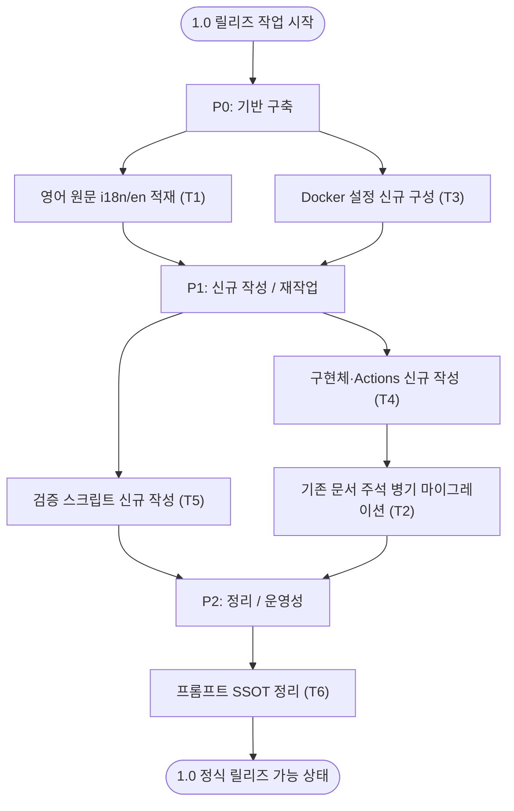

# 1.0 정식 릴리즈 작업 계획

`00`~`04` 문서는 번역 동기화 시스템의 신규 재설계 기획이다. 이 문서는 그 기획을 실제로 동작하는 1.0 시스템으로 **구현**하기 위해 필요한 추가 작업을 정리한다.

기획 자체는 확정되었으므로 이 문서에서 다시 설계하지 않는다. 대신 기획을 실행하는 데 필요한 영어 원문 적재, 기존 문서 재작업, Docker·구현체·검증 신규 구성을 다룬다.

---

## 1. 작업 목적

1.0 정식 릴리즈 작업의 목표는 다음과 같다.

- 번역 기준이 되는 영어 원문을 `i18n/en`에 적재하고 사이트에서 제외한다.
- 기존 한국어·일본어 문서를 영어 원문 주석 병기 형식으로 재작업한다.
- 사이트 빌드용 Node Docker와 번역용 Python Docker 설정을 신규 구성한다.
- 자동화 구현체와 GitHub Actions, 검증 스크립트를 신규 작성한다.
- 프롬프트의 단일 진실 원천을 정한다.

---

## 2. 릴리즈 작업 흐름

---

## 3. 작업 항목 요약

| 코드 | 작업 | 핵심 | 우선순위 |
|----|----|----|:---:|
| T1 | 영어 원문 캐시 구축 | `i18n/en`에 raw 적재 + `LOCALES`에서 `en` 제외 | P0 |
| T3 | Docker 설정 신규 구성 | Node(빌드) / Python(번역) 분리 | P0 |
| T4 | 구현체·Actions 신규 작성 | 동기화 스크립트 + 워크플로 | P1 |
| T5 | 검증 스크립트 신규 작성 | `04` 검증 항목 구현 + CI 연결 | P1 |
| T2 | 기존 문서 주석 병기 마이그레이션 | 기존 ko·ja 문서에 영어 원문 주석 병기 | P1 |
| T6 | 프롬프트 SSOT 정리 | 운영 프롬프트 단일화 | P2 |

---

## 4. 추가 작업 항목

### T1. 영어 원문 캐시 구축 (P0)

**목표**: 번역의 기준이 되는 영어 원문을 `i18n/en`에 보관하되, 사이트에는 노출하지 않는다.

영어 원문은 사이트에 표시하는 콘텐츠가 아니라 번역 파이프라인의 입력 데이터다. 영어 원본 사이트는 외부에 별도로 존재하므로 이 사이트에서는 노출하지 않는다.

**조치**:

- Laravel 공식 문서(`github.com/laravel/docs`, 버전 브랜치 `12.x`·`master` 등)에서 원문을 받아 `i18n/en/docusaurus-plugin-content-docs/version-*/`에 적재한다.
- 원문은 raw 그대로 둔다. `{{version}}`, 페이지 디자인 `<style>`, base64 등을 정제하지 않는다. 정제하면 다음 회차 `git diff`가 부정확해진다.
- `docusaurus.config.ts`의 `LOCALES`에서 `en`을 제외해 `/en/docs/`가 빌드·노출되지 않게 한다. 이것이 노출 차단의 핵심 안전장치다.
- 변경 감지는 `i18n/en`의 `git diff`로 수행한다(이전 커밋된 원문 ↔ 새 원문).

**영향 파일**: `i18n/en/docusaurus-plugin-content-docs/version-*/*.md`(신규 적재), `docusaurus.config.ts`(`LOCALES`)

---

### T2. 기존 문서 주석 병기 마이그레이션 (P1)

**문제**: 기존 `versioned_docs`(ko)와 `i18n/ja` 문서는 순수 번역만 있고, 신규 설계(`02-translation.md`)가 규정하는 영어 원문 주석 병기 형식이 적용되어 있지 않다. 이대로면 변경분 매칭과 갱신 기준이 없다.

**조치**:

- 영어 원문(`i18n/en`)과 대조해, 각 번역 문장에 대응하는 영어 원문을 `<!-- ... -->` 주석으로 병기한다.
- T4 구현체의 번역 출력 형식을 그대로 활용해 기존 문서를 일괄 재작업한다. 별도 마이그레이션 로직을 새로 만들지 않는다.
- 대상 규모가 7개 버전 × 약 100개 문서이므로 버전·문서 단위로 점진 적용하고, 회차마다 앵커·코드·링크 검증(`04`)을 통과시킨다.

**영향 파일**: `versioned_docs/version-*/*.md`, `i18n/ja/docusaurus-plugin-content-docs/version-*/*.md`

---

### T3. Docker 설정 신규 구성 (P0)

**목표**: 용도별로 Docker 설정을 분리해 신규 구성한다.

- **사이트 빌드용 Node Docker**: Docusaurus 빌드·서브 실행 환경.
- **문서 갱신·번역용 Python Docker**: Python 3.14 + `uv` 기반 번역 자동화 실행 환경.

**조치**:

- 사이트 빌드용 Node 기반 Docker 설정을 작성한다.
- 번역 자동화용 Python(3.14 + `uv`) 기반 Docker 설정을 작성한다. 마운트는 입력 `i18n/en`, 출력 `versioned_docs`·`i18n/ja`를 기준으로 한다.
- `docker-compose.yml`에서 빌드(Node)와 번역(Python) 서비스를 분리한다.
- `Makefile`이 신규 서비스 구성을 따르도록 관련 호출을 맞춘다.

**영향 파일**: `Dockerfile`(Node), `Dockerfile.translate`(Python), `docker-compose.yml`, `Makefile`

---

### T4. 구현체·Actions 신규 작성 (P1)

**목표**: 신규 설계대로 동작하는 자동화 구현체와 실행 트리거를 작성한다.

**조치**:

- 자동화 구현체(`main.py` 또는 동등 스크립트)의 위치를 확정하고 신규 작성한다. 후보: `translation-sync/` 하위 또는 `.github/` 하위.
- 실행 환경 기준(Python 3.14, `uv sync --frozen`, `uv run python main.py`)을 T3 Python Docker와 일치시킨다.
- 입출력 경로를 신규 설계에 맞춘다.
  - 원문 입력: `i18n/en/docusaurus-plugin-content-docs/version-*/`
  - 번역 출력: ko → `versioned_docs/version-*/`, ja → `i18n/ja/docusaurus-plugin-content-docs/version-*/`
- GitHub Actions 워크플로를 신설한다. 트리거 후보를 정한다.
  - 일정 기반(cron): 주기적으로 공식 원문을 확인한다.
  - 수동(`workflow_dispatch`): 운영자가 직접 실행한다.
  - 원문 변경 감지: 공식 저장소 변경 신호를 받는다.
- 원문 출처(공식 Laravel 저장소 경로/버전 브랜치 매핑)를 명시한다. `versions.json`은 `master, 13.x, 12.x, 11.x, 10.x, 9.x, 8.x`를 지원한다.

**영향 파일**: 신규 구현체, 신규 `.github/workflows/*.yml`

---

### T5. 검증 스크립트 신규 작성 (P1)

**목표**: `04-verification.md`가 규정한 검증을 실제로 수행하는 스크립트를 작성한다.

**조치**:

- `04`의 자동 검증 항목(`{{version}}`, `__BASE64_IMAGE_`, `<style>`, `{.class}`, note 형식 잔존)을 수행하는 검증 스크립트를 신규 작성한다. 원문 기준 경로는 `i18n/en`이다.
- 기존 `scripts/validate-anchors.mjs`는 유지하고 그대로 활용한다.
- 검증 스크립트를 `package.json` 스크립트와 CI에 연결해, 검증이 워크플로 안에서 실제로 실행되게 한다.

**영향 파일**: `scripts/`(신규 검증 스크립트), `scripts/validate-anchors.mjs`(유지), `package.json`

---

### T6. 프롬프트 SSOT 정리 (P2)

**목표**: 운영 프롬프트의 단일 진실 원천을 확정한다.

**조치**:

- 운영 프롬프트의 단일 진실 원천을 `translation-sync/prompt.md`로 확정한다.
- 구현체가 참조하는 프롬프트 경로를 SSOT 한 곳으로 고정한다.

**영향 파일**: `translation-sync/prompt.md`

---

## 5. 우선순위와 단계

| 단계 | 포함 작업 | 목표 |
|----|----|----|
| P0 | T1, T3 | 영어 원문 기반과 Docker 실행 환경을 확보한다. |
| P1 | T4, T5, T2 | 구현체·검증을 신규 작성하고, 그 구현체로 기존 문서를 재작업한다. |
| P2 | T6 | 프롬프트를 단일화해 운영성을 높인다. |

T2(기존 문서 재작업)는 T4 구현체의 출력 형식을 그대로 쓰므로, 구현체가 완성된 뒤 진행한다. 그래서 P1 안에서 T4 → T2 순서를 지킨다.

---

## 6. 완료 기준

1.0 정식 릴리즈 작업은 다음을 모두 만족하면 완료로 본다.

1. 영어 원문이 `i18n/en`에 적재되고, `LOCALES`에서 `en`이 제외되어 사이트에 노출되지 않는다.
2. 기존 `versioned_docs`(ko)·`i18n/ja` 문서가 영어 원문 주석 병기 형식으로 재작업된다.
3. 사이트 빌드용 Node Docker와 번역용 Python Docker가 분리 구성되고, 각각 정상 빌드된다.
4. 자동화 구현체·GitHub Actions 트리거가 존재하고, `i18n/en` 원문을 기준으로 변경 문서를 번역한다.
5. 검증 스크립트가 `i18n/en` 경로를 기준으로 동작하고, `package.json`/CI에 연결되어 실행된다.
6. 운영 프롬프트의 SSOT가 한 곳으로 확정된다.

---

## 7. 영향 받는 파일 요약

| 구분 | 파일 | 작업 |
|----|----|----|
| 원문 | `i18n/en/docusaurus-plugin-content-docs/version-*/*.md` | 영어 원문 적재 (T1) |
| 설정 | `docusaurus.config.ts` | `LOCALES`에서 `en` 제외 (T1) |
| 콘텐츠 | `versioned_docs/version-*/*.md`, `i18n/ja/.../version-*/*.md` | 주석 병기 재작업 (T2) |
| Docker | `Dockerfile`(Node), `Dockerfile.translate`(Python), `docker-compose.yml`, `Makefile` | 신규 구성 (T3) |
| 구현 | 신규 구현체, `.github/workflows/*.yml` | 신규 작성 (T4) |
| 검증 | `scripts/`(검증), `package.json` | 신규 작성·연결 (T5) |
| 프롬프트 | `translation-sync/prompt.md` | SSOT 확정 (T6) |
