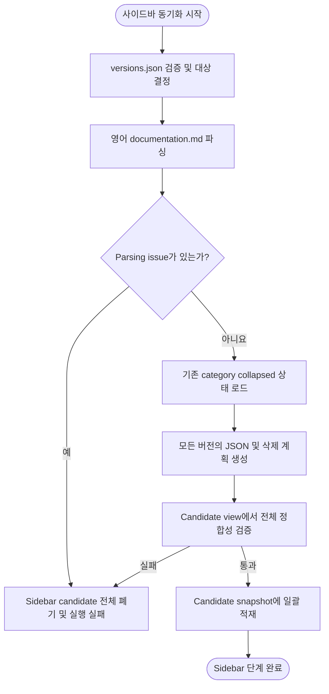

# 사이드바 갱신 및 검증 설계

## 요약

candidate의 영어 `documentation.md`를 단일 기준으로 모든 버전의 sidebar JSON과 locale override 삭제 계획을 결정적으로 생성.
전체 산출 검증 후에만 candidate snapshot에 일괄 적재하며, 하나라도 실패하면 sidebar candidate 전체 폐기.

## 흐름도



## 목적

영어 원문 `documentation.md`를 단일 기준으로 Docusaurus 사이드바 산출물을 결정적으로 생성하고 locale별 sidebar override JSON을 제거하여 모든 locale에서 동일한 영어 label 기반 사이드바 사용.

## 범위

- `documentation.md` 파싱에서 `versioned_sidebars/*.json` 갱신까지의 생성 흐름 담당.
- locale별 sidebar JSON(`i18n/{ko,ja}/…/version-*.json`) 제거 담당.
- 문서 본문 번역, heading, anchor, 문서 title은 이 단계의 관리 대상 아님.

## 입력

| 항목 | 설명 |
|---|---|
| candidate 영어 원문 `documentation.md` | 각 버전의 사이드바 구조를 선언하는 단일 기준 문서 |
| 승인 기준본의 `versioned_sidebars/*.json` | category collapsed 상태 등 표시 속성 보존 목적으로만 참조 |
| `versions.json` | 대상 버전 목록. `master` + 내림차순 안정 버전 배열 |

## 출력

| 항목 | 설명 |
|---|---|
| `versioned_sidebars/version-<version>-sidebars.json` | 영어 `documentation.md` 기준으로 재생성된 사이드바 |
| locale sidebar JSON 삭제 | `i18n/{ko,ja}/…/version-<version>.json` 존재 시 삭제 |
| sidebar candidate set | 전체 JSON byte와 삭제 경로, 검증 입력 hash를 포함한 일괄 적재 단위 |

## 불변 조건

1. **단일 기준**: sidebar 구조와 label의 유일한 기준은 영어 원문 `documentation.md`임.
   locale 번역본은 읽지 않음.
2. **Label 비번역**: category, doc, link label은 번역하지 않고 영어 값을 그대로 사용.
3. **저장소 오염 방지**: 출력 경로가 저장소 밖을 가리키면 거부.
   symlink를 따라 외부에 쓰는 행위 금지.
   기존 sidebar JSON이 symlink이면 읽기 및 덮어쓰기 금지.
   검증 전 active worktree 또는 candidate snapshot 변경 금지.
4. **Fail-closed**: 어느 버전에서든 parsing 또는 산출 issue 발생 시 sidebar 단계 실패 처리 및 전체 sidebar candidate set 폐기.
5. **원자적 공개**: 모든 버전의 sidebar JSON과 locale override 삭제 계획은 검증된 하나의 candidate tree 변경으로만 공개해야 함.
6. **Override 제거**: locale별 sidebar JSON은 stale override이므로 존재 시 삭제.

## 처리 순서

```text
1. versions.json 스키마 검증 (배열 형식, master 위치, 정렬, 중복)
2. 대상 버전 결정
3. 각 버전에 대해:
   a. 영어 documentation.md 파싱 → category / doc / link 항목 추출
   b. 파싱 issue 확인 (지원하지 않는 문법, 중복 key 등)
   c. issue 있으면 sidebar candidate 전체 폐기 및 단계 실패
   d. 기존 sidebar JSON에서 같은 category key의 boolean collapsed 상태 읽기. 새 category는 `true`
   e. sidebar JSON byte와 locale override 삭제 계획을 메모리 또는 격리 임시 경로에 생성
   f. candidate view에서 생성 JSON과 삭제 후 경로 상태 검증
4. 모든 버전이 통과하면 sidebar candidate set과 검증 입력 hash 확정
5. sidebar candidate set을 candidate snapshot에 한 번에 적재
```

검증 입력 hash는 다음 canonical JSON envelope byte의 SHA-256.

```json
{
  "override_deletions": [
    "i18n/ko/docusaurus-plugin-content-docs/version-master.json"
  ],
  "schema_version": 1,
  "versions": [
    {
      "baseline_sidebar_sha256": null,
      "documentation_sha256": "<lowercase hex>",
      "generated_sidebar_sha256": "<lowercase hex>",
      "version": "master"
    }
  ],
  "versions_sha256": "<lowercase hex>"
}
```

- `versions_sha256`는 정확한 `versions.json` byte의 SHA-256.
- `versions`는 `versions.json`의 처리 순서와 같고 version당 entry 하나만 가짐.
  `documentation_sha256`와 `generated_sidebar_sha256`는 각각 candidate `documentation.md`와 생성 JSON의 정확한 byte를 hash함.
- `baseline_sidebar_sha256`는 승인 기준본 sidebar가 있으면 해당 byte의 SHA-256, 없으면 명시적 `null`.
  빈 파일의 hash와 부재를 동일하게 취급하지 않음.
- `override_deletions`는 실제로 삭제할 locale override의 canonical 저장소 상대 경로를 UTF-8 byte 순으로 정렬한 배열이며 중복 불허.
- top-level과 version entry는 예시의 필드만 가져야 함.
  Object key는 UTF-8 byte 순으로 재귀 정렬하고, 불필요한 공백 없는 UTF-8 JSON 뒤에 LF 하나를 붙임.
- 생성 시작과 candidate 적재 직전에 모든 입력과 산출 byte를 각 소유 경로에서 다시 읽어 envelope와 hash를 재계산해야 함.
  시작 snapshot 객체를 다시 hash하는 것으로 대체 금지.

## 파싱 규칙

| 소스 패턴 | 산출 유형 |
|---|---|
| `- ## Label` | category (items를 하위에 수집) |
| 들여쓴 `- [Label](/docs/<version>/<id>)` | doc item (id는 path 마지막 segment) |
| `- [Label](외부 또는 deep URL)` | link item |

- `- [`로 시작하지만 지원 문법과 일치하지 않는 줄은 조용히 생략하지 않고 issue로 기록.
- 동일 category label 반복은 translation key 충돌이므로 issue로 기록.
- category key는 `category:<label>`.
- doc key: 문서 순서상 첫 항목은 `doc:<id>`, 같은 id의 두 번째부터는 1부터 센 전체 occurrence를 suffix로 붙인 `doc:<id>:<occurrence>`.
- link key: raw target byte의 SHA-256 lowercase hex를 사용한 `link:<digest>`.
  같은 target 반복 시 doc key와 같은 occurrence suffix 추가.
- 서로 다른 raw target이 같은 link digest를 만들면 key를 추정하여 재할당하지 않고 sidebar issue로 실패 처리.
- 동일 doc id의 여러 category 등장을 허용하며 위 occurrence 규칙으로 구별.
- 기존 category의 `collapsed`는 같은 category key의 boolean 값만 보존.
  key 부재 시 `true`, 값이 boolean이 아니면 schema issue.
- `master` sidebar의 루트 API Documentation link URL은 `versions.json` 최신 안정 버전으로 정규화.
- `versions.json`의 `master` 다음에는 안정 버전이 하나 이상 있어야 하며, 첫 항목을 최신 안정 버전으로 사용.
- 산출 JSON은 배열 순서를 유지하고 object key를 UTF-8 byte 순으로 재귀 정렬한 뒤 2-space indent, UTF-8, LF와 마지막 newline 1개로 직렬화.

## 실패 정책

| 상태 | 처리 |
|---|---|
| `versions.json` 스키마 위반 | 전체 sidebar 갱신 중단 |
| `documentation.md` 파싱 issue | sidebar candidate 전체 폐기, 단계 실패 |
| 출력 경로가 저장소 밖 또는 symlink | sidebar candidate 전체 폐기, 단계 실패 |
| 기존 sidebar JSON 스키마 위반 | sidebar candidate 전체 폐기, 단계 실패 |
| doc id에 대응하는 영어 원문 파일 부재 | sidebar candidate 전체 폐기, 단계 실패 |
| candidate 적재 전 입력 hash 변경 | sidebar candidate 전체 폐기, 단계 실패 |

## 수용 기준

사이드바 갱신 후 다음 조건을 모두 충족해야 함.

1. `documentation.md`에서 지원 문법을 만족하는 모든 doc link가 sidebar JSON에 같은 순서로 존재해야 함.
2. sidebar JSON에만 있고 `documentation.md`에 없는 doc item이 없어야 함.
3. sidebar doc label과 category label이 `documentation.md`의 값과 일치해야 함.
4. locale별 sidebar JSON(`i18n/{ko,ja}/…/version-*.json`)이 남아 있지 않아야 함.
5. `master`의 루트 API Documentation link가 최신 안정 버전 URL이어야 함.
6. doc id에 대응하는 영어 원문 파일이 존재해야 함.
7. category·doc·link의 translation key가 정의된 생성 규칙을 따르고 중복되지 않아야 함.
8. 지원하지 않는 문법이 조용히 생략되지 않아야 함.
9. 모든 산출 검증 완료 전 candidate snapshot 또는 active worktree의 sidebar 파일을 변경하지 않아야 함.
10. candidate snapshot에 적재된 sidebar 변경이 검증된 sidebar candidate set과 byte 단위로 일치해야 함.
11. 같은 입력에서 생성한 sidebar JSON byte가 process 재실행과 무관하게 같아야 함.

## 종료 상태 의미

sidebar 검증 실패는 번역 품질 문제가 아닌 sidebar sync 단계 자체의 실패로 분류.
provider 재시도 없이 현재 candidate를 폐기하고 전체 워크플로우를 새로 실행해야 함.

전체 동기화 진입점에서 sidebar 실패는 [공통 종료 코드 계약](./08-error-cases.md#8-진입점-종료-코드-계약)의 `1`(통제된 workflow 실패)로 반영.
