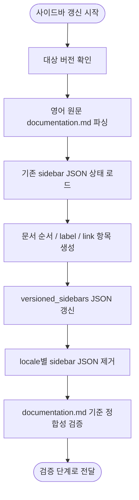

# 사이드바 갱신 흐름

## 단계 흐름



---

## 1. 작업 목적

문서 번역이 끝난 뒤, Laravel 공식 문서의 `documentation.md`를 기준으로 Docusaurus 사이드바 산출물을 갱신한다.

이 단계의 목표는 다음과 같다.

- 신규 문서가 `documentation.md`에 추가되면 해당 버전의 사이드바에도 자동 추가한다.
- 문서 제목 또는 label이 `documentation.md`에서 변경되면 사이드바 label도 자동 갱신한다.
- 문서 순서는 `documentation.md`에 선언된 순서를 그대로 따른다.
- 변경이 잦은 `master` 버전도 매 동기화 실행마다 stale sidebar가 남지 않게 한다.
- 문서 제목, heading, 링크 label, 사이드바 label, 앵커는 번역하지 않고 영어 원문 기준으로 유지한다.
- locale별 sidebar JSON을 제거해 ko/ja 화면도 source sidebar의 영어 label을 사용하게 한다.

---

## 2. 입력 자료

### 2.1 기준 문서

사이드바 구조의 단일 기준은 영어 원문 `documentation.md`다.

```text
i18n/en/docusaurus-plugin-content-docs/version-<version>/documentation.md
```

한국어와 일본어 `documentation.md`는 번역 산출물이므로 사이드바 label의 기준으로 사용하지 않는다. 단, 최종 검증에서 영어 원문과 구조가 어긋나지 않았는지 확인하는 보조 자료로 사용할 수 있다.

### 2.2 기존 사이드바 JSON

기존 사이드바 파일은 collapsed 상태처럼 사람이 조정한 표시 속성을 보존하기 위해 읽는다.

```text
versioned_sidebars/version-<version>-sidebars.json
```

기존 JSON은 stale label을 보존하는 기준이 아니다. 문서 항목과 label은 항상 `documentation.md`를 우선한다.

### 2.3 locale별 sidebar JSON

Docusaurus i18n label override가 stale 상태로 남지 않도록 locale별 sidebar JSON은 보존하지 않는다.

```text
versioned_docs/version-<version>/documentation.md
i18n/ja/docusaurus-plugin-content-docs/version-<version>/documentation.md
i18n/ko/docusaurus-plugin-content-docs/version-<version>.json
i18n/ja/docusaurus-plugin-content-docs/version-<version>.json
```

한국어 기본 locale은 문서 본문이 `versioned_docs`에 있지만, sidebar override는 `i18n/ko/docusaurus-plugin-content-docs/version-<version>.json`에 존재할 수 있다. 제목과 label을 모두 영어로 유지하므로 이 파일은 생성하지 않는다. 기존 파일이 있으면 삭제한다.

---

## 3. 파싱 규칙

Python 스크립트는 `documentation.md`의 Markdown 목록을 파싱한다.

### 3.1 category

다음 형식은 사이드바 category로 변환한다.

```md
- ## Getting Started
```

변환 결과:

```json
{
  "type": "category",
  "label": "Getting Started",
  "collapsed": false,
  "items": [],
  "key": "Getting Started"
}
```

`collapsed` 값은 기존 sidebar JSON에 같은 `key`가 있으면 기존 값을 보존한다. 새 category는 기본적으로 `true`로 둔다. 단, `Getting Started`는 현재 사이트 동작과 맞추기 위해 기본값을 `false`로 둔다.

### 3.2 doc item

다음 형식은 sidebar doc item으로 변환한다.

```md
    - [Installation](/docs/{{version}}/installation)
    - [Agentic Development](/docs/master/ai)
```

변환 결과:

```json
{
  "type": "doc",
  "id": "installation",
  "label": "Installation",
  "key": "installation"
}
```

규칙:

- `id`는 `/docs/<version>/<id>` 또는 `/docs/{{version}}/<id>`의 마지막 path segment를 사용한다.
- `label`은 Markdown 링크 label을 그대로 사용한다.
- `key`는 기본적으로 `id`와 동일하게 둔다.
- `Dusk`처럼 같은 문서가 여러 category에 나타나는 경우를 허용한다. 중복 doc id를 이유로 제거하거나 순서를 바꾸지 않는다.
- 같은 doc id가 두 번 이상 등장하면 Docusaurus sidebar translation key 충돌을 피하기 위해 두 번째 항목부터 category label을 붙인 고유 `key`를 사용한다.

### 3.3 link item

다음 형식은 sidebar link item으로 변환한다.

```md
- [API Documentation](https://api.laravel.com/docs/12.x)
```

변환 결과:

```json
{
  "type": "link",
  "label": "API Documentation",
  "href": "https://api.laravel.com/docs/<latest-stable>"
}
```

API 문서 링크는 `versions.json`의 최신 안정 버전으로 정규화한다. 이 처리를 사이드바 갱신 스크립트에 포함하면 기존 `sync-versioned-links.mjs`의 역할을 대체하거나 단순화할 수 있다.

---

## 4. 갱신 대상

### 4.1 `versioned_sidebars`

스크립트는 대상 버전마다 다음 파일을 갱신한다.

```text
versioned_sidebars/version-<version>-sidebars.json
```

갱신 기준:

- `tutorialSidebar` 최상위 배열을 `documentation.md` 순서대로 재생성한다.
- category label과 doc label은 영어 원문 label을 그대로 사용한다.
- 기존 JSON의 category collapsed 상태는 보존한다.
- 기존 JSON에만 남아 있고 `documentation.md`에 없는 doc item은 삭제한다.
- `documentation.md`에 새로 추가된 doc item은 같은 위치에 추가한다.

### 4.2 i18n sidebar JSON 제거

로케일별 `version-<version>.json`은 이 저장소에서 sidebar label override 용도로만 사용되어 왔다. 제목과 label을 모두 영어로 유지하려면 이 파일이 없어야 한다. 파일이 남아 있으면 `versioned_sidebars`를 영어로 갱신해도 ko/ja 화면에 예전 override label이 표시될 수 있다.

스크립트는 다음 파일이 존재하면 삭제한다.

```text
i18n/ko/docusaurus-plugin-content-docs/version-<version>.json
i18n/ja/docusaurus-plugin-content-docs/version-<version>.json
```

정리 기준:

- locale별 version JSON은 생성하지 않는다.
- 기존 locale별 version JSON은 삭제한다.
- 문서 본문 Markdown(`versioned_docs/version-*/*.md`, `i18n/ja/.../version-*/*.md`)은 삭제 대상이 아니다.
- `version.label`은 Docusaurus 버전 설정의 `versions` label을 따른다.

---

## 5. 실행 위치

사이드바 갱신은 문서 번역과 후처리가 끝난 뒤, 최종 검증 전에 실행한다.

실행 흐름:

```text
upstream sync
-> changed source detection
-> translation
-> postprocess
-> sidebar sync
-> verification
```

구현 위치:

```text
translation-sync/sync/sidebar.py
```

실행 명령:

```bash
uv run python -m sync.sidebar --version master --write
uv run python -m sync.sidebar --all --write
```

`translation-sync/main.py`에서는 번역 대상 문서 처리 후 변경된 버전 목록을 모아 sidebar sync를 한 번 실행한다. `documentation.md` 자체가 diff에 포함되지 않았더라도 `master`는 변경이 잦으므로 매 실행마다 갱신 또는 검증 대상에 포함한다.

---

## 6. 검증 기준

사이드바 갱신 후 다음을 검증한다.

1. `documentation.md`에 있는 모든 doc link가 sidebar JSON에 같은 순서로 존재한다.
2. sidebar JSON에만 있고 `documentation.md`에 없는 doc item이 없어야 한다.
3. sidebar doc label은 `documentation.md`의 링크 label과 일치해야 한다.
4. sidebar category label은 `documentation.md`의 category label과 일치해야 한다.
5. locale별 sidebar JSON(`i18n/*/docusaurus-plugin-content-docs/version-*.json`)이 남아 있지 않아야 한다.
6. API Documentation link는 최신 안정 버전 URL이어야 한다.
7. `documentation.md`에 존재하지 않는 version path나 깨진 doc id가 sidebar에 남아 있으면 실패한다.

검증 실패는 번역 품질 문제가 아니라 sidebar sync 단계의 실패로 분류하고, 번역 provider 재시도 없이 sidebar sync를 다시 실행한다.

---

## 7. 최종 운영 기준

사이드바는 수동 편집 산출물이 아니라 `documentation.md`에서 재생성되는 산출물로 취급한다.

운영 기준:

- `documentation.md`가 신규 문서와 제목 변경의 단일 기준이다.
- `versioned_sidebars/*.json`은 `documentation.md`에서 생성되는 빌드 입력이다.
- locale별 sidebar JSON은 stale override가 되므로 제거한다.
- 제목, label, 앵커는 번역하지 않는다.
- 본문 번역과 sidebar 갱신은 분리하되, 같은 동기화 실행 안에서 완료한다.
