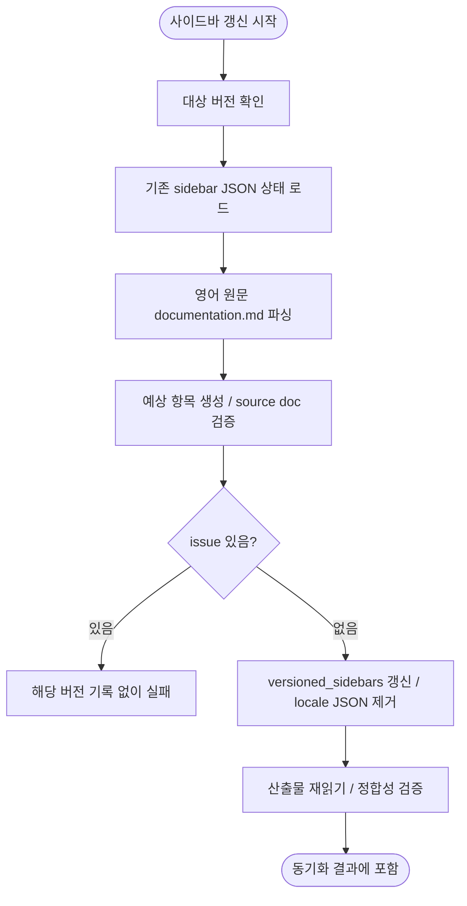

# 사이드바 갱신 흐름

## 단계 흐름



---

## 1. 작업 목적

문서 번역이 끝난 뒤, Laravel 공식 문서의 `documentation.md`를 기준으로 Docusaurus 사이드바 산출물을 갱신한다.

이 단계의 목표는 다음과 같다.

- 신규 문서가 `documentation.md`에 추가되면 해당 버전의 사이드바에도 자동 추가한다.
- 문서 링크 label이 `documentation.md`에서 변경되면 사이드바 label도 자동 갱신한다.
- 문서 순서는 `documentation.md`에 선언된 순서를 그대로 따른다.
- version filter가 없는 동기화 실행에서는 변경이 잦은 `master`도 항상 sidebar 대상에 포함한다.
- category, doc, link와 사이드바 label은 번역하지 않고 영어 `documentation.md` 기준으로 유지한다. 문서 title, heading, anchor는 이 단계의 관리 대상이 아니다.
- locale별 sidebar JSON을 제거해 ko/ja 화면도 source sidebar의 영어 label을 사용하게 한다.

---

## 2. 입력 자료

### 2.1 기준 문서

사이드바 구조의 단일 기준은 영어 원문 `documentation.md`다.

```text
i18n/en/docusaurus-plugin-content-docs/version-<version>/documentation.md
```

한국어와 일본어 `documentation.md`는 번역 산출물이므로 sidebar generator가 읽지 않는다.

### 2.2 기존 사이드바 JSON

기존 사이드바 파일은 collapsed 상태처럼 사람이 조정한 표시 속성을 보존하기 위해 읽는다.

```text
versioned_sidebars/version-<version>-sidebars.json
```

기존 JSON은 stale label을 보존하는 기준이 아니다. 문서 항목과 label은 항상 `documentation.md`를 우선한다.

### 2.3 locale별 sidebar JSON

Docusaurus i18n label override가 stale 상태로 남지 않도록 locale별 sidebar JSON은 보존하지 않는다.

```text
i18n/ko/docusaurus-plugin-content-docs/version-<version>.json
i18n/ja/docusaurus-plugin-content-docs/version-<version>.json
```

한국어 기본 locale은 문서 본문이 `versioned_docs`에 있지만, sidebar override는 `i18n/ko/docusaurus-plugin-content-docs/version-<version>.json`에 존재할 수 있다. sidebar label을 영어 source 기준으로 유지하므로 이 파일은 생성하지 않는다. 기존 파일이 있으면 삭제한다.

### 2.4 버전 목록

`versions.json`은 JSON 배열이어야 한다. 첫 항목은 중복 없는 `master`이고, 이후 항목은 `<숫자>.x` 형식의 안정 버전을 중복 없이 내림차순으로 나열해야 한다. 배열 스키마, 버전 토큰, `master` 위치, 정렬 또는 중복이 잘못되면 대상 버전을 계산하기 전에 실패한다.

---

## 3. 파싱 규칙

Python 스크립트는 `documentation.md`의 Markdown 목록을 파싱한다.

현재 지원 문법은 아래와 같은 한 줄 inline link이며 optional title이나 target 내부의 중첩 괄호는 지원하지 않는다. `- [`로 시작하지만 지원 문법과 일치하지 않는 줄은 조용히 생략하지 않고 issue로 기록해 쓰기를 중단한다.

### 3.1 category

다음 형식은 사이드바 category로 변환한다.

```md
- ## Getting Started
```

변환 결과:

```json
{
  "type": "category",
  "label": "Getting Started",
  "collapsed": false,
  "items": [],
  "key": "Getting Started"
}
```

`collapsed` 값은 기존 sidebar JSON에 같은 `key`가 있으면 기존 값을 보존한다. 새 category는 기본적으로 `true`로 둔다. 단, `Getting Started`는 현재 사이트 동작과 맞추기 위해 기본값을 `false`로 둔다. 같은 category label이 반복되면 Docusaurus translation key가 충돌하므로 issue로 기록하고 해당 버전의 쓰기를 중단한다. `- # ...`, `- ### ...` 같은 잘못된 category 문법도 issue로 기록하며, 직전 category를 닫아 이후 doc이 잘못 붙지 않게 한다.

### 3.2 doc item

다음 형식은 sidebar doc item으로 변환한다.

```md
    - [Installation](/docs/{{version}}/installation)
    - [Agentic Development](/docs/master/ai)
```

변환 결과:

```json
{
  "type": "doc",
  "id": "installation",
  "label": "Installation",
  "key": "installation"
}
```

규칙:

- doc item은 category 아래에 공백으로 들여쓴 링크여야 한다. 들여쓰지 않은 doc link는 issue다.
- URL path가 정확히 `/docs/<version>/<id>`의 세 segment일 때만 doc item으로 분류하며, `<version>`에는 `{{version}}`도 사용할 수 있다. 더 깊은 path와 그 밖의 상대·외부 URL은 link item으로 취급한다.
- `id`는 위 URL path의 마지막 segment를 사용한다. 링크의 version segment가 현재 대상 버전과 일치하는지는 별도로 검사하지 않는다.
- `label`은 Markdown 링크 label을 그대로 사용한다.
- `key`는 기본적으로 `id`와 동일하게 둔다.
- `Dusk`처럼 같은 문서가 여러 category에 나타나는 경우를 허용한다. 중복 doc id를 이유로 제거하거나 순서를 바꾸지 않는다.
- 같은 doc id가 두 번 이상 등장하면 Docusaurus sidebar translation key 충돌을 피하기 위해 두 번째 항목부터 category label을 붙인 고유 `key`를 사용한다.

### 3.3 link item

다음 형식은 sidebar link item으로 변환한다.

```md
- [API Documentation](https://api.laravel.com/docs/12.x)
```

변환 결과:

```json
{
  "type": "link",
  "label": "API Documentation",
  "href": "https://api.laravel.com/docs/<latest-stable>"
}
```

`master` 사이드바에 있는 API 문서의 루트 URL(`https://api.laravel.com/docs/master` 또는 `https://api.laravel.com/docs/<숫자>.x`, optional trailing slash)만 `versions.json`의 최신 안정 버전으로 정규화한다. deep path, query, fragment가 붙은 API URL은 그대로 보존한다. 최신 안정 버전은 검증된 배열의 첫 non-`master` 항목이며, 과거 버전 사이드바의 API 링크도 `documentation.md` 값을 유지한다.

일반 link item은 label을 translation key로 사용한다. 같은 link label이 반복되면 issue로 기록하고 해당 버전의 쓰기를 중단한다.

---

## 4. 갱신 대상

### 4.1 `versioned_sidebars`

스크립트는 대상 버전마다 다음 파일을 갱신한다.

```text
versioned_sidebars/version-<version>-sidebars.json
```

갱신 기준:

- `tutorialSidebar` 최상위 배열을 `documentation.md` 순서대로 재생성한다.
- category label과 doc label은 영어 원문 label을 그대로 사용한다.
- 기존 JSON의 category collapsed 상태는 보존한다.
- 기존 JSON에만 남아 있고 `documentation.md`에 없는 doc item은 삭제한다.
- `documentation.md`에 새로 추가된 doc item은 같은 위치에 추가한다.

### 4.2 i18n sidebar JSON 제거

로케일별 `version-<version>.json`은 이 저장소에서 sidebar label override 용도로만 사용되어 왔다. sidebar label을 영어 source 기준으로 유지하려면 이 파일이 없어야 한다. 파일이 남아 있으면 `versioned_sidebars`를 영어로 갱신해도 ko/ja 화면에 예전 override label이 표시될 수 있다.

스크립트는 다음 파일이 존재하면 삭제한다.

```text
i18n/ko/docusaurus-plugin-content-docs/version-<version>.json
i18n/ja/docusaurus-plugin-content-docs/version-<version>.json
```

정리 기준:

- locale별 version JSON은 생성하지 않는다.
- 기존 locale별 version JSON은 삭제한다.
- 문서 본문 Markdown(`versioned_docs/version-*/*.md`, `i18n/ja/.../version-*/*.md`)은 삭제 대상이 아니다.
- `version.label`은 sidebar generator의 관리 대상이 아니다. Docusaurus 설정이 별도로 `versions.json`에서 label을 생성한다.

### 4.3 경로 및 symlink 안전장치

- 버전 인자는 `master` 또는 `<숫자>.x` 형식이어야 하며 `versions.json`에 존재해야 한다.
- 관리 대상 출력 경로는 저장소 내부에 어휘적으로 포함되어야 하고, 부모 경로에 symlink가 있거나 resolve 결과가 저장소 밖이면 거부한다.
- `versioned_sidebars`의 최종 JSON 자체가 symlink이면 읽거나 덮어쓰지 않는다.
- locale JSON의 최종 경로가 symlink이면 외부 target을 따라가지 않고 symlink 자체만 unlink한다.
- sidebar JSON은 같은 디렉터리의 임시 파일에 기록하고 기존 mode를 보존한 뒤 flush·`fsync`·`os.replace`하고 부모 디렉터리도 `fsync`한다. 따라서 기존 hardlink의 다른 이름을 수정하지 않고 최종 경로만 새 inode로 교체한다.
- 이 검증과 publication·삭제는 별도의 pathname 연산이다. 실행 중 부모 디렉터리를 교체할 수 있는 신뢰하지 않는 로컬 동시 writer는 현재 방어 범위가 아니며, sidebar sync는 저장소 mutation을 단독으로 수행해야 한다.
- 기존 sidebar JSON은 루트가 object이고 `tutorialSidebar`가 list인지 확인한다. 스키마가 잘못되면 쓰기와 locale JSON 삭제를 모두 건너뛴다.

---

## 5. 실행 위치

사이드바 갱신은 각 locale 문서의 번역·후처리·전체 원문 대조 검증이 끝난 뒤 실행한다. sidebar generator가 별도로 순서, label, stale item과 locale override를 검증한다.

실행 흐름:

```text
upstream sync
-> changed source detection
-> translation
-> postprocess
-> locale document verification/write
-> sidebar sync/verification
```

구현 위치:

```text
translation-sync/sync/sidebar/generator.py
```

실행 명령:

```bash
cd translation-sync
uv run --locked --python 3.14 python -m sync.sidebar --version master --write
uv run --locked --python 3.14 python -m sync.sidebar --all --write
```

`--all`과 `--version`은 동시에 지정할 수 없다. 둘 다 생략하면 `master`만 처리한다.

`translation-sync/main.py`에서는 번역 대상 문서 처리 후 변경된 버전 목록을 모아 sidebar sync를 한 번 실행한다. version filter가 없으면 `documentation.md` 자체가 diff에 포함되지 않았더라도 `master`를 포함한다. `--version`을 지정하면 해당 버전만 처리한다.

Docker의 `translate` 서비스는 `./versioned_sidebars`를 `/app/versioned_sidebars`에 bind mount한다. 따라서 컨테이너에서 생성한 sidebar 산출물도 host 작업 트리에 남아 문서 변경과 함께 검증·커밋된다.

각 버전은 기존 JSON과 예상 결과를 먼저 검증하고, issue가 없을 때만 sidebar 쓰기와 locale JSON 삭제를 수행한 뒤 산출물을 다시 읽어 확인한다. 이는 버전별 사전·사후 검증 경계이지 파일 시스템 수준의 원자적 트랜잭션이나 rollback은 아니다. `--all`도 버전을 순서대로 처리할 뿐 전체 버전을 하나의 트랜잭션으로 묶지 않으므로, 뒤 버전이 실패해도 앞 버전에 이미 적용된 변경은 작업 트리에 남는다.

---

## 6. 검증 기준

사이드바 갱신 후 다음을 검증한다.

1. `documentation.md`에서 지원 문법과 category 들여쓰기를 만족하는 모든 doc link가 sidebar JSON에 같은 순서로 존재한다.
2. sidebar JSON에만 있고 `documentation.md`에 없는 doc item이 없어야 한다.
3. sidebar doc label은 `documentation.md`의 링크 label과 일치해야 한다.
4. sidebar category label은 `documentation.md`의 category label과 일치해야 한다.
5. locale별 sidebar JSON(`i18n/{ko,ja}/docusaurus-plugin-content-docs/version-*.json`)이 남아 있지 않아야 한다.
6. `master`의 루트 API Documentation link는 `versions.json`의 첫 non-`master`인 최신 안정 버전 URL이어야 한다. deep path, query, fragment와 과거 버전의 링크는 원문 URL을 유지해야 한다.
7. sidebar doc id에 대응하는 대상 버전의 영어 원문 파일이 없으면 실패한다.
8. category와 일반 link의 translation key가 중복되면 실패한다.
9. 지원하지 않는 category 또는 link 문법은 조용히 생략하지 않고 실패한다.

검증 실패는 번역 품질 문제가 아니라 sidebar sync 단계의 실패로 분류하고, 번역 provider 재시도 없이 sidebar sync를 다시 실행한다.

---

## 7. 최종 운영 기준

사이드바는 수동 편집 산출물이 아니라 `documentation.md`에서 재생성되는 산출물로 취급한다.

운영 기준:

- `documentation.md`가 신규 문서와 sidebar 링크 label 변경의 단일 기준이다.
- `versioned_sidebars/*.json`은 `documentation.md`에서 생성되는 빌드 입력이다.
- locale별 sidebar JSON은 stale override가 되므로 제거한다.
- sidebar label은 번역하지 않는다. 문서 title, heading, anchor는 이 단계에서 변경하지 않는다.
- 본문 번역과 sidebar 갱신은 분리하되, 같은 동기화 실행 안에서 완료한다.
