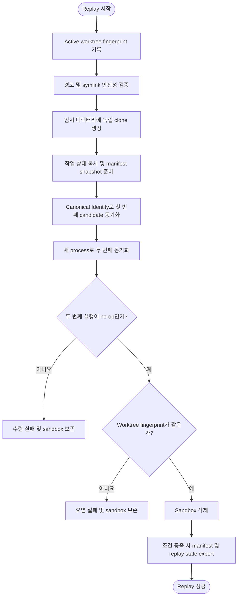

# 로컬 Replay 격리 검증 설계

## 요약

active worktree를 건드리지 않는 독립 sandbox에서 canonical identity provider로 candidate sync core를 두 번 실행.
Identity는 annotation과 구조를 결정적으로 생성하고 replay response contract를 통과해야 함.
같은 pinned source의 두 번째 실행이 no-op으로 수렴할 때만 성공으로 판정.

## 흐름도



## 목적

identity provider를 사용하여 격리된 환경에서 candidate sync core를 실행하고 pinned source 기준 2회 수렴을 확인함으로써 plan 선택·적용·검증·sidebar 동기화의 결정론적 정합성 보증.
Candidate sync core의 경계 정의는 [총괄 설계](./00-workflow-summary.md)가 담당.

## 범위

- identity 기반 격리 replay의 sandbox 생성·실행·정리 담당.
- upstream manifest lifecycle(생성·snapshot·공유·export) 담당.
- 2회 수렴 검증(두 번째 실행이 변경 없음으로 종료) 담당.
- replay runner의 외부 orchestration 단위 테스트·replay 재호출·live fixture·원격 publication·배포 trigger 실행 금지.
- 번역 의미·문체 품질은 이 단계의 검증 범위 아님.
- live provider 응답 계약 검증은 [번역 단계](./02-translation.md)의 fixture 검사가 담당.
- 공통 종료 코드 의미 정의는 [오류 처리 및 복구 설계](./08-error-cases.md)의 진입점 종료 코드 계약이 담당.
  이 문서는 replay 상태를 해당 코드에 매핑하는 역할만 담당.

## 입력

| 항목 | 설명 |
|---|---|
| active repository worktree | tracked 변경 및 untracked 파일 포함 |
| upstream manifest input (선택) | pinned upstream commit SHA를 기록한 기존 파일. 존재하면 snapshot, 부재하면 setup에서 생성 |
| manifest export path (선택) | 생성한 canonical manifest를 replay 성공 뒤 파일로 내보낼 active repository 밖 경로 |
| replay state output path (선택) | canonical replay state를 replay 성공 뒤 파일로 내보낼 active repository 밖 경로 |
| VERSION / DOC selector (선택) | 대상 버전·문서 필터 |
| 전체 workflow deadline | 외부 orchestration이 확정한 절대 deadline. standalone replay는 진입 시 `workflow_timeout_seconds`로 한 번만 계산 |
| runner artifact root | active repository 밖의 replay sandbox·실패 보고서 전용 경로 |

## 출력

| 항목 | 설명 |
|---|---|
| 종료 코드 | [공통 종료 코드 계약](./08-error-cases.md#8-진입점-종료-코드-계약)에 매핑한 replay 결과 |
| canonical manifest snapshot | 두 core 실행과 live 실행에 전달할 canonical byte와 SHA-256 digest. replay 성공 시 항상 반환 |
| normalized selector | 두 replay core와 후속 live core에 그대로 전달할 canonical VERSION / DOC selector |
| upstream manifest file (조건부) | export path가 있고 파일이 없으며 전체 replay가 성공한 경우에만 no-replace로 생성 |
| canonical replay state file (조건부) | state output path가 있고 전체 replay가 성공한 경우에만 no-replace로 생성. manifest snapshot과 normalized selector를 후속 core에 전달하는 수단 |

## 불변 조건

1. **Active worktree 오염 방지**: replay 전체 과정에서 active repository의 HEAD, 전체 Git ref, tracked 내용, staging 상태, Git이 무시하지 않는 untracked 내용이 변경되지 않아야 함.
   시작·종료 fingerprint를 비교하여 위반 시 종료 코드 3 반환.
2. **격리 실행**: sandbox는 runner artifact root 아래의 고유 임시 디렉터리에 생성한 독립 clone이어야 하며 active repository 안에는 생성 불가.
   실행 시 system/global Git config를 읽지 않고 prompt 비활성화.
3. **Identity provider 제한**: `TRANSLATION_PROVIDER=identity`는 replay runner가 격리 process에만 설정.
   일반 실행에서 `TRANSLATION_REPLAY=1` 없이 identity 사용 시 설정 검증에서 거부.
4. **Symlink 안전성**: untracked symlink와 변경된 tracked symlink 거부.
   변경되지 않은 tracked symlink는 저장소 내부를 가리킬 때만 허용.
5. **Manifest 무결성**: 기존 manifest는 setup 시점에 단일 file descriptor로 snapshot하며, 이후 외부 파일이 변경되어도 실행 중 입력에 영향 없음.
   새 manifest export는 replay 성공 및 sandbox 삭제 완료 후에만 수행.
6. **2회 수렴 계약**: 같은 plan 재적용이 아닌, 같은 pinned source에서 새 process로 수행한 두 번째 실행의 변경 없음(no-op) 수렴 여부 확인.
7. **Identity contract profile**: identity 응답은 목표 언어 충분성과 표 prose cell의 목표 언어 요구만 제외한 replay response contract를 통과해야 함.
   annotation, block 구조, code, link, anchor와 wrapper 부재 검사 생략 금지.
8. **Publication 격리**: replay의 push credential 수신 또는 원격 branch·배포 workflow 갱신 금지.
   첫 실행의 verified tree를 sandbox 내부 baseline commit으로만 연결하고, 이 commit을 두 번째 core 실행의 replay 승인 기준본으로 사용.
9. **Deadline 단일성**: sandbox 준비와 두 core 실행은 외부 workflow의 같은 절대 deadline 사용.
   각 실행에서 예산을 새로 시작하는 행위 금지.
10. **Selector 단일성**: 두 core 실행과 후속 live core는 같은 정규화된 VERSION / DOC selector를 사용해야 함.
    Selector로 manifest entry를 줄이는 행위 금지.

Active worktree fingerprint는 다음 정보를 명시적 구분자와 Git의 정규 출력으로 결합한 SHA-256.

- `HEAD` commit OID, ref 이름순 전체 ref·OID 및 `HEAD` tree OID
- Git이 무시하지 않는 untracked 항목을 포함한 NUL 구분 porcelain 상태
- `HEAD` 대비 tracked worktree의 binary diff 및 `HEAD` 대비 index의 binary diff
- 경로 byte 순으로 정렬한 untracked 일반 파일의 상대 경로·type marker·mode·content byte
- untracked symlink는 target을 따라가지 않고 상대 경로·type marker·link target byte 사용

시작·종료 fingerprint에는 같은 ignore 규칙과 Git 상태·diff 명령 집합 사용 필수.

## 처리 순서

```text
1. Active worktree fingerprint 기록 (HEAD, refs, tree hash, staging, untracked)
2. Sandbox 경로 안전성 검증 (active repo 밖, symlink 제한)
3. Runner artifact root의 고유 임시 디렉터리에 active repository를 독립 clone
4. Tracked 변경 및 untracked 파일을 clone에 복사, baseline commit 생성
5. Upstream manifest 처리:
   a. 기존 파일이면 → snapshot을 sandbox .git 아래에 읽기 전용 복사
   b. 부재하면 → runner가 대상 ref를 한 번 해석하여 첫 core 실행 전에 sandbox .git 아래에 canonical manifest 생성
6. 첫 번째 실행: 새 process에서 canonical identity provider로 candidate sync core 실행 → verified tree를 sandbox 내부 baseline commit으로만 확정
7. 두 번째 실행: 다시 새 process에서 첫 실행 commit을 replay 승인 기준본으로 같은 candidate sync core 실행 → 변경 없음 확인
8. Active worktree fingerprint 재비교 (불일치 시 종료 코드 3)
9. Sandbox 삭제
10. Manifest export (조건부: 지정 경로에 파일이 없었고 전체 성공 시)
11. Replay state export (조건부: 지정 경로가 있고 전체 성공 시)
```

## 실패 정책

| 상태 | 종료 코드 | 처리 |
|---|---|---|
| KO/JA replay + 두 번째 수렴 성공 | 0 | sandbox 삭제, 조건부 manifest export |
| sandbox 내 translation sync 실패 | 1 | sandbox 보존 (artifact root 기준 상대 식별자 출력) |
| sandbox 준비·실행·정리 오류 | 2 | 불완전 sandbox 정리 또는 보존 |
| active worktree fingerprint 불일치 | 3 | sandbox 보존 (artifact root 기준 상대 식별자 출력) |
| 두 번째 실행에서 변경 발생 | 1 | 수렴 실패로 분류, sandbox 보존 및 상대 식별자 출력 |
| sandbox·입력 경로 또는 symlink가 안전 규칙 위반 | 1 | clone 또는 외부 read/write 전에 즉시 거부 |
| manifest 대상이 active repo 안 | 1 | export 전 거부 |
| manifest 대상에 이미 파일 존재 | 1 | no-replace 원칙으로 덮어쓰기 방지 |
| replay state 대상이 active repo 안 또는 symlink | 1 | setup에서 clone 전 거부 |
| replay state 대상에 이미 파일 존재 | 1 | setup에서 clone 전 거부, no-replace 원칙으로 덮어쓰기 방지 |
| replay state 대상이 manifest 대상 또는 실패 보고서 경로와 동일 | 1 | setup에서 clone 전 거부 |
| replay 중 push·배포 또는 sandbox 밖 ref 변경 시도 | 2 | publication 격리 위반으로 즉시 거부 |
| 전체 workflow deadline 초과 | 2 | 새 core 실행·manifest export·replay state export를 시작하지 않고 sandbox 보존 또는 안전한 정리 |

## Selector normalization

VERSION / DOC selector는 replay 전에 한 번만 다음 JSON byte로 정규화.

```json
{"document":null,"version":null}
```

- 선택하지 않은 값은 `null`.
  `version=null`은 `versions.json` 전체를 의미.
- `version` 값은 `versions.json` entry와 byte 단위로 같아야 함.
- `document`는 Unicode NFC를 사용하고 `/` separator로 구분하며 leading slash가 없는 저장소 상대 Markdown 경로.
  빈 segment, `.`, `..`, backslash, NUL과 저장소 밖·symlink 경로 불허.
- `document`가 값이면 `version`도 값이어야 함.
  한 document selector를 여러 version에 추정 적용하는 행위 금지.
- Object key는 UTF-8 byte 순으로 정렬하며, JSON은 불필요한 공백 없이 LF 하나로 종료.
- 두 replay core와 live core는 이 canonical byte 자체를 입력으로 사용.
  각 core의 raw 환경 변수 재해석 금지.

## Manifest Lifecycle

```text
┌─ 기존 manifest 있음 ─┐        ┌─ 기존 manifest 없음 ─┐
│ setup에서 FD snapshot │        │ setup에서 ref를 1회   │
│ → sandbox .git에 복사 │        │ 해석해 sandbox .git에 │
│ → 두 core 실행이 사용 │        │ 생성 → 두 core 실행이 │
└───────────────────────┘        │ 사용 → 전체 성공 및   │
                                 │ 삭제 후 외부 export   │
                                 └───────────────────────┘
```

### Manifest JSON schema

```json
{
  "schema_version": 1,
  "entries": [
    {
      "version": "master",
      "repository": "https://github.com/laravel/docs.git",
      "object_format": "sha1",
      "commit": "0123456789abcdef0123456789abcdef01234567"
    }
  ]
}
```

- top-level과 entry는 위 필드 외 값 불허.
- `entries`는 `versions.json`의 대상 순서와 정확히 일치해야 하며 version 중복·누락·추가 불허.
- VERSION / DOC selector는 core 처리 범위만 축소하며 manifest entry는 유지.
- `repository`는 `https://<lowercase-host>/<path>.git` 형식이어야 함.
  userinfo, port, query, fragment, dot segment, 반복 slash와 trailing slash 불허.
- `object_format`은 `sha1` 또는 `sha256`이며 `commit`은 각각 40자 또는 64자의 lowercase full hex OID여야 함.
  symbolic ref와 축약 OID 불허.
- 각 OID는 해당 repository에서 commit object로 해석되어야 함.
- manifest는 UTF-8, LF, 마지막 newline 1개와 위 key 순서를 사용하는 canonical JSON으로 직렬화.
- setup에서 snapshot한 canonical byte의 SHA-256 digest를 replay 두 실행과 live 실행에 전달.
  어느 단계에서든 byte 또는 digest가 다르면 입력 오류로 실패 처리.

Export 조건:

- replay 전체 성공 (종료 코드 0)
- sandbox 삭제 성공
- manifest export path가 지정됨
- 외부 경로에 동명 파일 부재 (no-replace)
- 외부 경로가 active repository 밖

runner는 sandbox 삭제 전에 canonical manifest byte를 메모리에 보존하고, 삭제 성공 뒤 해당 byte만 no-replace export.
Live 실행은 manifest export 파일을 다시 읽지 않고 replay state가 전달한 snapshot byte와 digest를 직접 사용.

## Replay State

runner는 setup에서 canonical manifest snapshot과 정규화 selector를 replay state byte로 직렬화하고, replay 성공 뒤 지정 경로에 export.

### Replay state 필드

- `schema_version`은 `1`.
- `manifest_base64`는 canonical manifest byte의 base64, `manifest_digest`는 같은 byte의 SHA-256 hex digest.
- `selector_base64`는 정규화 selector byte의 base64, `selector_digest`는 같은 byte의 SHA-256 hex digest.
- 위 다섯 key 외 값 불허.
- replay state는 UTF-8, LF, 마지막 newline 1개와 위 key 순서를 사용하는 canonical JSON으로 직렬화.

Export 조건:

- replay 전체 성공 (종료 코드 0)
- sandbox 삭제 성공
- manifest export 단계 실패 없음
- replay state output path가 지정됨
- 외부 경로가 symlink 아님
- 외부 경로에 동명 파일 부재 (no-replace)
- 외부 경로가 active repository 밖
- 외부 경로가 manifest export path 및 실패 보고서 경로와 서로 다름

경로 조건은 setup에서 clone과 외부 read/write 전에 검증하며, export는 manifest export 뒤에 수행.

## 수용 기준

1. 첫 번째 실행에서 canonical identity provider와 replay response contract로 plan 선택·적용·검증·sidebar 동기화를 KO/JA 모두 성공적으로 완료해야 함.
2. 두 번째 실행은 같은 pinned source에서 새 process로 실행했을 때 변경 없음(no-op)으로 수렴해야 함.
3. 실행 전후 active worktree fingerprint가 동일해야 함.
4. sandbox는 성공 시 삭제하고 실패 시 보존하여 디버깅에 사용할 수 있어야 함.
5. manifest와 replay state는 조건 충족 시에만 export하며 기존 파일 덮어쓰기 금지.
6. replay 동안 원격 branch, 배포 workflow와 sandbox 밖 Git ref가 변경되지 않아야 함.
7. replay 두 실행과 live 실행이 같은 canonical manifest digest를 보고해야 함.
8. 두 core 실행이 같은 외부 workflow deadline을 사용하고 sandbox 경로는 artifact root 기준 상대 식별자로만 보고해야 함.
9. replay 두 core와 live core가 같은 정규화 selector를 보고해야 함.

## 부록: Identity Provider의 역할

identity provider는 source의 의미 payload를 영어로 유지하되, 일반 provider 출력과 같은 canonical annotation 및 Markdown block 구조를 결정적으로 생성.
replay profile은 목표 언어 관련 항목만 제외하고 나머지 response contract를 그대로 적용.

이를 통해 검증하는 것:

- 번역 소유 단위(chunk) 선택의 정확성
- patch 적용 위치의 정확성
- 보존 markup(코드, 링크, 앵커, annotation)의 무결성
- 최종 문서 검증 통과 여부
- sidebar 동기화의 정합성
- response wrapper 부재와 annotation·구조 계약

검증하지 않는 것:

- 번역 의미·문체 품질
- live provider의 목표 언어 문자 존재와 실제 API 응답 형식
- 실제 API/CLI 연결성
