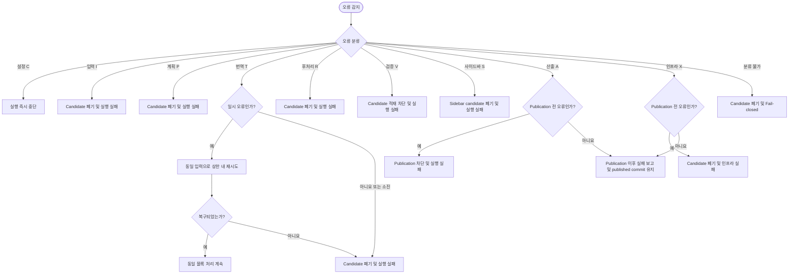

# 오류 처리 및 복구 설계

## 요약

워크플로우 오류를 설정·입력·계획·번역·후처리·검증·사이드바·산출·인프라 분류로 나눔.
provider의 제한된 재시도를 제외한 사전 publication 오류는 현재 단계를 실패시키고 candidate publication을 차단함.
publication 뒤 배포 단계 또는 deadline 실패는 이미 공개된 commit을 되돌리지 않고 별도 실패로 보고함.

## 흐름도

## 1. 목적

번역 동기화 워크플로우에서 발생할 수 있는 오류를 단계별로 분류하고, 각 분류에 대한 복구 정책을 규범적으로 정의함.

## 2. 범위

이 문서는 다음 오류 분류와 복구 정책만 소유함.

- 설정 오류
- 입력 오류
- 변경 계획 오류
- 번역 오류
- 후처리 오류
- 검증 오류
- 사이드바 오류
- 산출 오류
- 인프라 오류

단계별 세부 설계는 각 단계 문서가, 전체 순서와 회귀 규칙은 [00-workflow-summary.md](00-workflow-summary.md)가 소유함.

## 3. 입력

| 항목 | 설명 |
|------|------|
| 워크플로우 실행 상태 | 각 단계의 성공·실패 결과 |
| 오류 발생 context | 오류가 발생한 단계, locale, 문서, 블록 식별자 |
| runner artifact root | active repository와 candidate 밖에 있는 실행별 고유 실패 보고서·debug sandbox 전용 경로 |

## 4. 출력

| 항목 | 설명 |
|------|------|
| 오류 분류 결과 | 오류가 속한 분류(설정/입력/계획/번역/후처리/검증/sidebar/산출/인프라)와 stable issue code |
| 복구 동작 | 분류에 따른 중단, 재시도 또는 실패 처리 결과 |
| 실패 보고서 | 4.1의 redacted deterministic JSON 진단 산출물 |

### 4.1 실패 보고서 계약

모든 실패는 다음 필드를 가진 JSON 보고서를 남김.

| 필드 | 규칙 |
|------|------|
| `schema_version` | 정수 `1` |
| `run_id` | 실행 시작 시 생성하고 모든 단계에서 공유하는 opaque ID |
| `manifest_digest` / `base_head` | 확정 전 실패면 `null`, 확정 후에는 canonical 값 |
| `stage` / `classification` / `code` | 소유 단계, 오류 분류 문자, stable issue code |
| `exit_code` | 8절의 최종 정수 종료 코드 |
| `published_commit` | publication 뒤 실패면 공개된 full commit OID, 그 외 `null` |
| `version` / `locale` / `document` | 적용 불가하면 `null`; 경로는 저장소 상대 경로 |
| `plan_id` / `structural_address` | 블록 오류가 아니면 `null` |
| `attempts` | provider 오류면 `{ "response_evaluation": N, "transport": N }`, 그 외 `null` |
| `issues` | `{ "code": stable issue code, "structural_address": 주소 또는 null, "message": 짧은 redacted 설명 }` 객체의 배열 |
| `candidate_debug_path` | sandbox를 보존했을 때 runner artifact root 기준 상대 식별자, 그 외 `null` |

보고서는 cleanup과 active fingerprint 재확인이 끝난 뒤 runner가 지정한 active repository·candidate 밖의 artifact 영역에 있는 `translation-sync-failure.json`에 no-replace로 기록함.
Object key는 UTF-8 byte 순으로 재귀 정렬하고, 불필요한 공백 없는 UTF-8 JSON 뒤에 LF 하나를 붙임.
`issues`는 issue code·구조 주소 순으로 정렬함.
Top-level 오류는 가장 높은 종료 코드 우선순위에 속한 것 중 먼저 감지한 issue이며, 나머지는 `issues`에 남김.
credential, 환경 변수 값, provider 응답 본문, Base64 원문, 전체 문서 본문과 외부 절대 사용자 경로를 포함해서는 안 됨.
artifact 영역이 없거나 파일이 이미 있거나 쓸 수 없으면 6.9의 `REPORT_WRITE_FAILED` stderr fallback을 사용함.

## 5. 불변 조건

1. 검증을 통과하지 않은 candidate를 verified tree로 봉인하거나 실행 브랜치에 반영해서는 안 됨.
2. 실패한 블록을 추정 번역으로 채워서는 안 됨.
3. 재시도 중 원문 diff, 전처리 결과, 이전 map, 현재 restore map과 기존 locale 문서를 변경해서는 안 됨.
4. provider 호출이 완료되지 않은 상태에서 후처리를 실행해서는 안 됨.
5. 오류 분류가 결정되지 않으면 fail-closed로 처리해야 함.

## 6. 오류 분류 및 복구 정책

### 6.1 설정 오류 (C)

번역 실행 전에 환경 설정의 유효성을 확인하는 단계에서 발생하는 오류임.

| Stable issue code | 조건 | 복구 정책 |
|-------------------|------|-----------|
| `PROVIDER_SELECTION_INVALID` | provider 환경 변수 미설정 또는 허용값 외 | 즉시 중단해야 함. 번역 단계로 넘겨서는 안 됨. |
| `PROVIDER_CREDENTIAL_MISSING` | provider별 필수 환경 변수 누락 | 즉시 중단해야 함. |
| `REPLAY_PROVIDER_FORBIDDEN` | replay 전용 provider가 replay 밖에서 선택됨 | 즉시 중단해야 함. |
| `REQUIRED_CONFIG_MISSING` | 등록된 단위 테스트 명령 또는 locale prompt가 없음 | 즉시 중단해야 함. 보고서 경로 자체가 없으면 stderr fallback을 사용함. |
| `STALE_LINK_REGISTRY_INVALID` | stale-link registry 누락 또는 schema·정렬·canonical JSON 규칙 위반 | 즉시 중단해야 함. |
| `UNIT_TEST_SOURCE_MUTATION` | 등록된 단위 테스트 명령이 tracked source를 변경함 | 즉시 중단하고 변경된 격리 checkout을 폐기해야 함. |
| `TOKENIZER_METADATA_UNAVAILABLE` | 선택 model의 tokenizer 또는 context window를 확정할 수 없음 | provider를 호출하지 않고 즉시 중단해야 함. |
| `INVALID_REQUEST_BUDGET` | request budget 또는 `workflow_timeout_seconds`가 누락·비양수이거나 02 §10.4의 대소 관계를 위반함 | 즉시 중단해야 함. |
| `INVALID_RUNTIME_OPTION` | 숫자형 런타임 옵션의 형식 오류, 상호 배타적인 옵션의 동시 선택 또는 runner artifact root가 active repository 밖의 기존 디렉터리가 아님. CLI 인증을 둘 이상 선택한 경우를 포함 | 즉시 중단해야 함. |
| `NON_BRANCH_REF` | live 실행 ref가 branch가 아님 | 승인 기준본을 고정하기 전에 즉시 중단해야 함. |

설정 오류는 재시도 대상이 아님.
종료 코드와 짧은 진단 메시지를 반환해야 함.

### 6.2 입력 오류 (I)

동기화 대상 파일과 리소스의 전제 조건이 충족되지 않을 때 발생하는 오류임.

| Stable issue code | 조건 | 복구 정책 |
|-------------------|------|-----------|
| `DIRTY_PUBLICATION_BASE` | 동기화 소유 경로에 non-ignored untracked 파일이 존재 | 승인 기준본을 고정하지 않고 즉시 중단해야 함. tracked worktree·index의 미커밋 변경은 로컬 실행을 막지 않음. |
| `FILE_STATE_CONFLICT` | `A`·`M`·`D` 상태의 EN·KO·JA 존재 전제가 맞지 않음 | 실행 전체를 실패 처리하고 추정 생성·삭제해서는 안 됨. 단, `A` 상태의 locale 파일이 이미 현재 원문 기준 문서 검증을 통과하면 같은 계획을 다시 적용한 no-op으로 보아 충돌이 아님. |
| `RAW_DIFF_MISSING` | raw 수정으로 분류됐지만 raw diff hunk를 만들 수 없음 | 실행 전체를 실패 처리해야 함. |
| `NORMALIZED_NOOP` | raw diff는 있으나 정규화된 effective delta가 비어 있음 | 오류가 아님. locale byte를 유지하고 영어 verification view·expected annotation map 기준 검증을 계속해야 함. |
| `PREPROCESS_PLACEHOLDER_INVALID` | Base64 placeholder를 일대일로 할당·복원할 수 없거나 서로 다른 값의 digest가 충돌함 | 작업 사본을 후속 단계로 전달하지 않고 실패해야 함. |
| `PREPROCESS_BOUNDARY_AMBIGUOUS` | 보호 영역 경계를 확정할 수 없어 구조 보존을 증명할 수 없음 | 해당 문서를 실패 처리해야 함. |
| `INVALID_SELECTOR` | VERSION / DOC selector가 07의 값·조합·canonical 상대 경로 규칙을 위반 | replay sandbox나 live candidate를 만들기 전에 실행 전체를 실패 처리해야 함. |
| `REPLAY_PATH_UNSAFE` | replay 입력·sandbox·export 경로 또는 symlink가 07의 안전 규칙을 위반 | 외부 경로를 읽거나 쓰지 않고 replay를 실패 처리해야 함. |
| `INVALID_MANIFEST` | manifest JSON의 schema·정렬·OID·repository 규칙 위반 | 실행 전체를 실패 처리해야 함. |
| `MANIFEST_COMMIT_UNRESOLVED` | 승인 기준본 commit을 해석할 수 없거나 기대한 commit 객체가 아님 | 실행 전체를 실패 처리해야 함. |
| `MANIFEST_DIGEST_MISMATCH` | replay 두 실행 또는 live 실행에서 canonical manifest digest가 달라짐 | 실행 전체를 실패 처리해야 함. |
| `MANIFEST_EXPORT_CONFLICT` | export 대상이 active repository 안이거나 이미 존재함 | 외부 파일을 쓰지 않고 replay를 실패 처리해야 함. |
| `STALE_LINK_REGISTRY_CHANGED` | 실행 중 stale-link registry digest가 달라짐 | 실행 전체를 실패 처리해야 함. |

입력 전제가 모호하면 기록하지 않고 실패하는 fail-closed 동작을 유지해야 함.

### 6.3 변경 계획 오류 (P)

raw 변경을 정규화된 번역 소유 단위 변경 계획으로 변환하는 단계에서 발생하는 오류임.

| Stable issue code | 조건 | 복구 정책 |
|-------------------|------|-----------|
| `BLOCK_BOUNDARY_AMBIGUOUS` | 블록 경계를 결정할 수 없음 | 해당 문서를 실패 처리해야 함. |
| `PATCH_LOCATION_AMBIGUOUS` | 삽입·교체 위치의 context가 유일하지 않음 | 해당 문서를 실패 처리해야 함. |
| `ANNOTATION_STATE_INVALID` | 기존 문서의 pipeline annotation이 손상됐거나 source/target이 섞임 | 해당 locale 문서를 실패 처리해야 함. |
| `PATCH_RESULT_CARDINALITY_INVALID` | actionable plan 수와 결과 수가 불일치하거나 target plan 결과가 존재 | 실행 전체를 실패 처리해야 함. |
| `UNSUPPORTED_OVERSIZE_BLOCK` | 안전한 경계가 없는 atomic 소유 단위가 request budget을 초과 | 해당 문서를 실패 처리해야 함. |
| `UNSUPPORTED_CHANGE_UNIT` | 지원하지 않는 upstream 변경 단위 | 예약 code. 현재 preflight의 모든 예외가 고유 code를 붙이므로 방출되지 않으며, 지원 외 변경은 `UNSUPPORTED_OVERSIZE_BLOCK` 또는 `PATCH_LOCATION_AMBIGUOUS`로 보고. 모호한 section reorder는 실패시키지 않고 일반 계획 경로로 처리. |

변경 계획 오류의 진단 context를 해당 문서·블록으로 격리하되, 실행 단계는 즉시 실패해야 함.
모호한 매칭을 추정 적용하거나 다음 target을 처리해서는 안 됨.

### 6.4 번역 오류 (T)

provider에 번역을 요청하고 응답을 수신하는 단계에서 발생하는 오류임.

| Stable issue code | 조건 | 재시도 여부 | 최대 시도 | 복구 정책 |
|-------------------|------|:-----------:|:---------:|-----------|
| `PROVIDER_TRANSIENT_EXHAUSTED` | timeout·네트워크 오류·429·5xx 또는 빈 응답 | 예 | transport 5회 | 동일 입력과 설정으로 재요청하고, 소진 시 해당 locale target을 실패 처리해야 함. |
| `PROVIDER_REQUEST_REJECTED` | 인증 실패·비일시 4xx | 아니오 | 1회 | 즉시 해당 target을 실패 처리해야 함. |
| `CLI_PROVIDER_FAILED` | CLI 명령 비정상 종료 | 아니오 | 1회 | redacted stderr 진단과 함께 해당 target을 실패 처리해야 함. |
| `PROVIDER_PARTIAL_RESPONSE` | 완료 상태가 아닌 부분 응답 | 아니오 | 1회 | 부분 Markdown을 기록하지 않고 해당 target을 실패 처리해야 함. |
| `RESPONSE_CONTRACT_FAILED` | 구조·annotation·목표 언어 response contract 위반이 feedback 뒤에도 지속 | contract에 따라 최대 4회 feedback | 완료 응답 5회 | 해당 locale target을 기록하지 않고 실패 처리해야 함. |
| `FIXTURE_CONTRACT_FAILED` | live provider fixture 계약 위반 | contract에 따라 최대 4회 feedback | 완료 응답 5회 | 원문 동기화 전에 실행 전체를 실패 처리해야 함. |
| `RUN_DEADLINE_EXCEEDED` | 실행 deadline 안에 다음 호출과 대기를 완료할 수 없음 | 아니오 | 0회 | 호출하지 않고 실행 전체를 실패 처리해야 함. |

블록당 완료 응답 평가는 최초 평가를 포함해 최대 5회임.
각 평가의 transport는 최대 5회 시도할 수 있음.
따라서 물리 호출 상한은 블록당 25회임.

### 6.5 후처리 오류 (R)

번역 완료 블록의 Markdown·HTML 형식과 플레이스홀더를 최종화하는 단계에서 발생하는 오류임.

| Stable issue code | 조건 | 복구 정책 |
|-------------------|------|-----------|
| `RESTORE_MAP_INVALID` | 현재 restore map 부재 또는 복원 불가 | 해당 target을 즉시 실패 처리하고 계획을 적용해서는 안 됨. |
| `MARKUP_RESTORE_AMBIGUOUS` | 링크·heading 등 보존 markup 대응이 모호함 | 예약 code. 현재 후처리는 임의 복구를 하지 않고 판정을 문서 검증 단계에 위임하므로 방출하지 않음. |
| `POSTPROCESS_RESIDUE` | 형식 변환 뒤 잔존 패턴 발견 | 예약 code. 현재 잔존 패턴은 문서 검증 단계가 `RESIDUAL_PATTERN`으로 차단하므로 방출하지 않음. |
| `VERIFICATION_BASIS_GENERATION_FAILED` | 영어 verification view 또는 expected annotation map을 결정적으로 생성할 수 없음 | 해당 target을 실패 처리하고 candidate에 적재해서는 안 됨. |
| `NO_WRITE_MUTATION` | `no-write` mode에서 locale byte가 달라짐 | 변경 결과를 폐기하고 해당 target을 실패 처리해야 함. |

후처리가 입력을 안전하게 변환하거나 복원할 수 없으면 해당 target을 즉시 실패 처리해야 함.
안전한 변환을 완료한 결과에 잔존 위반이 있는지는 검증 단계가 최종 판정하며, 어느 경우에도 검증 가능한 결과로 가장해서는 안 됨.

### 6.6 검증 오류 (V)

문서 구조 보존 여부를 확인하는 단계에서 발생하는 오류임.

| Stable issue code | 조건 | 복구 정책 |
|-------------------|------|-----------|
| `RESIDUAL_PATTERN` | 치환되지 않은 placeholder, legacy marker 또는 닫히지 않은 `` tag 잔존 | 해당 문서를 candidate에 적재해서는 안 됨. |
| `SOURCE_STRUCTURE_MISMATCH` | 링크·인라인 코드·코드 블록·heading·앵커·`` src·admonition marker의 값 또는 순서 불일치 | 해당 문서를 candidate에 적재해서는 안 됨. |
| `LIST_TABLE_STRUCTURE_MISMATCH` | marker·깊이·checkbox 또는 표 행·열·정렬자 불일치 | 해당 문서를 candidate에 적재해서는 안 됨. |
| `PIPELINE_ANNOTATION_MISMATCH` | canonical annotation byte·순서·occurrence 또는 소유 블록 불일치 | 해당 문서를 candidate에 적재해서는 안 됨. |
| `SOURCE_COMMENT_MISMATCH` | source-authored 주석 누락, 순서 또는 구조 주소 불일치 | 해당 문서를 candidate에 적재해서는 안 됨. |
| `FRONT_MATTER_MISMATCH` | key·문자열 scalar 구조 또는 제목 불일치 | 해당 문서를 candidate에 적재해서는 안 됨. |
| `VERIFICATION_INPUT_CHANGED` | 영어 verification view·expected annotation map이 없거나 검증 입력 hash가 판정 중 달라짐 | 판정 결과를 폐기하고 실행을 실패 처리해야 함. |
| `UNIT_TEST_FAILED` | 등록된 명령이 비정상 종료 | 원문 동기화 전에 실행을 실패 처리해야 함. |
| `REPLAY_NON_CONVERGENT` | 동일 manifest의 두 번째 identity replay에서 tracked 변경 발생 | live fixture 전에 실행을 실패 처리해야 함. |

문서 구조 검증 issue가 하나라도 있으면 해당 locale 문서를 candidate에 기록해서는 안 됨.
이 분류의 어느 오류도 provider 재호출로 연결하지 않으며 실행을 실패로 표시해야 함.

### 6.7 사이드바 오류 (S)

`documentation.md` 기준으로 sidebar JSON을 생성·검증하는 단계에서 발생하는 오류임.

| Stable issue code | 조건 | 복구 정책 |
|-------------------|------|-----------|
| `SIDEBAR_INPUT_INVALID` | `versions.json`, `documentation.md` 또는 기존 sidebar schema·문법 위반 | sidebar candidate 전체를 폐기하고 실행을 실패 처리해야 함. |
| `SIDEBAR_DANGLING_DOC` | `documentation.md`가 존재하지 않는 영어 문서를 참조 | sidebar candidate 전체를 폐기하고 실행을 실패 처리해야 함. |
| `SIDEBAR_PATH_INVALID` | 지원하지 않는 버전, 저장소 밖 경로 또는 symlink | sidebar candidate 전체를 폐기하고 실행을 실패 처리해야 함. |
| `SIDEBAR_CONTENT_MISMATCH` | sidebar 항목 누락, 추가 또는 label 불일치 | candidate에 적재하지 않고 실행을 실패 처리해야 함. |
| `SIDEBAR_OVERRIDE_REMAINS` | candidate view에 locale sidebar override JSON 잔존 | candidate에 적재하지 않고 실행을 실패 처리해야 함. |
| `SIDEBAR_INPUT_CHANGED` | candidate 적재 전 검증 입력 hash 변경 | sidebar candidate 전체를 폐기하고 실행을 실패 처리해야 함. |

사이드바 오류는 발견된 버전을 진단 context로 기록하되 sidebar candidate 전체와 실행을 실패 처리해야 함.

### 6.8 산출 오류 (A)

최종 산출물의 git 반영 기준을 확인하는 단계에서 발생하는 오류임.

| Stable issue code | 조건 | 복구 정책 |
|-------------------|------|-----------|
| `SITE_VALIDATION_FAILED` | 링크 유틸리티·타입·빌드·fragment 검증 실패 | candidate tree를 봉인하거나 커밋해서는 안 됨. |
| `CANDIDATE_SOURCE_MUTATED` | 사이트 검증 명령이 tracked candidate source를 변경 | tree를 봉인하지 않고 실패해야 함. |
| `OUTPUT_PATH_FORBIDDEN` | 허용 경로 밖 파일 변경 | 커밋해서는 안 됨. |
| `OUTPUT_STATE_MISMATCH` | EN·KO·JA 상태 정합성 위반 | 커밋해서는 안 됨. |
| `UNVERIFIED_ENGLISH_ONLY_CHANGE` | 증명되지 않은 영어 단독 수정 | 커밋해서는 안 됨. |
| `SIDEBAR_OVERRIDE_FORBIDDEN` | locale sidebar override JSON 생성·수정 | 커밋해서는 안 됨. |
| `PUBLICATION_BASE_CHANGED` | publish 진입 시 준비 기준본이 원격 branch head가 아니거나, publication 직전 checkout fingerprint 또는 원격 ref 변경·lease 실패 | 승인 기준본 경쟁·불일치 오류로 push를 금지해야 함. |
| `VERIFIED_TREE_MISMATCH` | commit tree와 verified tree 불일치 | push를 금지해야 함. |
| `PUBLICATION_CREDENTIAL_UNAVAILABLE` | tree 동일성 확인 뒤 별도 publication 단계에서 write credential을 주입할 수 없음 | push하지 않고 산출 실패로 종료해야 함. |
| `DEPLOY_TRIGGER_FAILED` | `main` publication 뒤 배포 workflow trigger 실패 | published commit은 되돌리지 않고 산출 실패로 보고하며, 그 commit을 새 승인 기준본으로 하는 no-change 실행에서 trigger를 재시도할 수 있음. |
| `DEPLOY_VALIDATION_FAILED` | 배포 workflow의 사이트 재검증 실패 | published commit은 되돌리지 않고 산출 실패로 보고하며 배포하지 않아야 함. |

사전 publication 산출 오류 발생 시 원격 브랜치를 변경해서는 안 됨.
`DEPLOY_TRIGGER_FAILED`와 `DEPLOY_VALIDATION_FAILED`는 publication 뒤 오류이므로 이미 공개된 commit을 유지하고 재배포 경로만 사용함.

### 6.9 인프라 오류 (X)

입력 내용이나 지원 계약이 아니라 실행 환경 또는 runner 자체 때문에 단계를 수행할 수 없을 때 발생하는 오류임.

| Stable issue code | 조건 | 복구 정책 |
|-------------------|------|-----------|
| `SANDBOX_OPERATION_FAILED` | sandbox 생성·격리 checkout·정리 실패 | candidate를 publication하지 않고 실패해야 함. |
| `RUNNER_OPERATION_FAILED` | workflow 자체가 요구하는 실행 파일(provider adapter 제외)을 시작할 수 없거나 예기치 않은 filesystem I/O 실패 | candidate를 publication하지 않고 실패해야 함. |
| `WORKFLOW_DEADLINE_EXCEEDED` | 전체 workflow deadline 전에 다음 단계 또는 실행 중 subprocess를 완료할 수 없음 | 사전 publication이면 candidate를 차단하고, publication 뒤면 published commit을 유지한 채 실패 보고서를 남겨야 함. |
| `PUBLICATION_ISOLATION_VIOLATION` | replay가 push·배포 또는 sandbox 밖 ref 변경을 시도함 | 즉시 거부하고 영향을 받은 외부 상태를 진단해야 함. |
| `ACTIVE_WORKTREE_MUTATED` | 실행 종료 fingerprint가 시작 값과 다름 | candidate publication과 후속 작업을 중단하고 종료 코드 `3`을 사용해야 함. |
| `REPORT_WRITE_FAILED` | 실패 보고서를 지정된 artifact 영역에 쓸 수 없음 | 원래 오류를 유지하고 이 code를 보조 issue로 stderr에 기록해야 함. |
| `UNCLASSIFIED_INTERNAL` | 기존 분류에 속하지 않는 내부 예외 | candidate를 publication하지 않고 원래 예외의 종류만 비밀값 없이 보고해야 함. |

인프라 오류는 자동으로 같은 실행을 재개하지 않음.
임시 환경 문제를 해결한 뒤에도 승인 기준본과 manifest를 새로 확정하여 전체 워크플로우를 다시 실행해야 함.

## 7. 실패 정책 공통 원칙

1. 지원하는 변경 종류를 먼저 분류하고, 처리 경로가 하나로 결정되지 않으면 추정 적용해서는 안 됨.
2. 재시도 중 원문 diff, 전처리 결과, 이전 map, 현재 restore map과 기존 locale 문서를 변경해서는 안 됨.
3. 실패한 블록을 추정 번역으로 채워서는 안 됨.
4. 설정 오류는 번역 단계로 넘겨서는 안 됨.
5. provider 호출이 완료되지 않으면 후처리를 실행해서는 안 됨.
6. 검증에 실패한 문서를 candidate snapshot에 적재해서는 안 됨.
7. 첫 target 실패에서 현재 단계를 실패시키고 이후 target과 후속 단계를 실행해서는 안 됨.
8. 모든 운영 실행은 격리 candidate와 verified tree publication을 사용해야 함.
   active worktree에 부분 산출물을 남기는 비원자 publication 모드는 허용하지 않음.
9. provider transport와 response feedback 재시도를 제외한 사전 publication 오류는 candidate를 publication하지 않고 실행을 종료해야 함.
   `DEPLOY_TRIGGER_FAILED`, `DEPLOY_VALIDATION_FAILED`와 publication 뒤 `WORKFLOW_DEADLINE_EXCEEDED`는 이미 완료된 publication을 되돌리지 않고 05의 복구 경로를 사용함.

이 문서에서 candidate를 `폐기`함은 publication 입력에서 분리함을 의미함.
4.1의 안전한 artifact 영역에 sandbox를 보존할 수는 있지만, 해당 경로를 active worktree나 다음 실행의 입력으로 재사용해서는 안 됨.

### 7.1 지원 외 upstream 변경 수동 처리

정당한 upstream 변경이 `UNSUPPORTED_OVERSIZE_BLOCK` 또는 `UNSUPPORTED_CHANGE_UNIT` 계획 오류로 중단된 경우 다음 둘 중 하나만 선택함.

1. 반복 가능한 구조라면 소유 단위·PatchPlan·검증 계약과 fixture를 확장하고, 단위 테스트를 통과시킨 뒤 새 승인 기준본에서 전체 워크플로우를 재실행함.
2. 일회성 구조라면 자동화 밖의 별도 검토 변경으로 현재 raw 영어 원문 캐시와 KO·JA 전체 문서를 함께 수동 갱신함.
   이 변경은 pipeline annotation·source-authored 주석·링크·코드·목록·표 계약을 만족해야 하며, [04-verification.md](04-verification.md), [05-additional-work.md](05-additional-work.md), [06-sidebar-sync.md](06-sidebar-sync.md)의 검증을 모두 통과한 뒤 일반 repository review 절차로 반영함.

실패한 candidate를 직접 고치거나 동일 실행을 이어서 publication해서는 안 됨.
실패 보고서에는 unsupported code, upstream 구조 주소와 위 두 경로를 포함해야 함.
수동 변경이 기준 브랜치에 반영된 뒤의 자동 실행은 그 commit을 새 승인 기준본으로 사용함.

### 7.2 성공한 Publication 이후 발견된 콘텐츠 결함

성공으로 종료된 실행의 published tree에서 자동 판정 범위 밖 콘텐츠 결함이 뒤늦게 발견된 경우, 과거 실행의 오류 분류·종료 코드·실패 보고서를 소급 변경하지 않음.
이는 새 워크플로우 오류가 아니라 publication 후 운영 사고이며, [05-additional-work.md](05-additional-work.md)의 9.1절에 따라 검증된 revert 또는 복구 commit을 새로 publication해야 함.
콘텐츠 결함이 있는 같은 commit의 no-change 배포 재시도는 허용하지 않음.

## 8. 진입점 종료 코드 계약

전체 동기화와 replay 진입점은 같은 종료 코드 의미를 사용함.

| 종료 코드 | 의미 |
|:---------:|------|
| `0` | 모든 요구 단계를 통과함. 변경이 없는 성공도 포함함. |
| `1` | 설정·입력·계획·번역·후처리·검증·사이드바·산출 오류로 안전하게 중단함. |
| `2` | 인프라 오류로 실행을 완료하지 못함. |
| `3` | 실행 전후 active worktree·index·HEAD fingerprint가 달라져 오염 방지 불변 조건을 위반함. |

여러 실패가 함께 발견되면 종료 코드는 `3`, `2`, `1` 순으로 우선함.
실패 보고서에는 첫 fail-fast 오류와 종료 과정에서 추가로 확인된 더 높은 우선순위 오류를 모두 남김.
signal에 의한 종료는 운영체제·runner의 signal exit convention을 따르며 이 표의 값으로 다시 매핑하지 않음.

## 9. 수용 기준

- 모든 오류가 정의된 분류 중 하나에 속하고, 해당 복구 정책에 따라 처리되어야 함.
- 검증 실패 문서가 locale candidate 또는 실행 브랜치에 기록되어서는 안 됨.
- 재시도 상한을 초과한 블록이 실패 처리되어야 함.
- 설정 오류 발생 시 번역 단계에 진입하지 않아야 함.
- 사전 publication 산출 오류 발생 시 어떤 변경도 원격 브랜치에 반영되어서는 안 됨.
  publication 뒤 배포 단계 실패는 이미 공개된 commit을 유지해야 함.
- `NORMALIZED_NOOP`과 `RAW_DIFF_MISSING`이 서로 다른 상태로 판정되어야 함.
- 사전 publication에 실패한 실행이 active worktree, index 또는 실행 브랜치 `HEAD`를 변경해서는 안 됨.
  publication 뒤 배포 단계 또는 deadline 실패는 원격의 published commit만 예외임.
- manifest·fixture·replay 비수렴·번역 및 전체 deadline·publication 경쟁·배포 검증·내부 예외가 각각 정의된 분류와 stable issue code를 가져야 함.
- `REPORT_WRITE_FAILED` 자체를 제외한 모든 실패가 4.1의 redaction·정렬 규칙을 만족하는 보고서를 남겨야 함.
  보고서는 candidate 또는 publication tree에 포함되어서는 안 됨.
- 전체 동기화와 replay가 8절의 동일한 종료 코드 의미를 사용해야 함.
- 성공 종료 뒤 발견된 콘텐츠 결함이 과거 실행 오류와 구분되고 05의 검증된 publication 복구 경로를 따라야 함.
